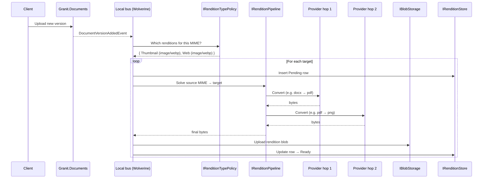

import { Aside } from "@astrojs/starlight/components";

`Granit.Documents.Renditions` turns `Granit.Documents` into a small DAM
(digital-asset-management) layer: every uploaded document version can ship a
set of derived files — a thumbnail for list views, a web-optimised preview,
a print-ready master, a poster frame — alongside the original bytes. Providers
are pluggable per MIME pair; the framework solves the shortest chain between
the source format and each target.

## Why renditions

Hosts already have two ways to serve a derived view of an uploaded file —
neither covers the DAM use case. A raw download forces clients to handle every
source format (including 50 MB Word documents) and stream the original bytes
even for a 200×200 list thumbnail. On-the-fly imaging via `Granit.Imaging`
re-encodes per request, which is fine for one user but unsustainable for a
gallery rendering thousands of tiles.

Renditions sit between the two: a small, named set of derivatives is generated
once when a version lands, stored as ordinary blobs keyed by
`(DocumentVersionId, Type, Format)`, and served through presigned URLs.
Generation is provider-driven, so docx, xlsx, pdf, and image uploads all reach
the same `image/webp` thumbnail through different pipelines.

## Architecture

`Granit.Documents.Renditions` ships contracts only — providers, persistence,
endpoints, and the background runner live in companion packages. The shape
mirrors [`Granit.Browsing`](/dotnet/infrastructure/browsing/): a contracts
package plus interchangeable provider implementations registered into a
shared pipeline.

The core abstractions:

- `IRenditionProvider` — single-step transformation from one MIME type to
  another. Implementations declare their `SourceMimeType` and
  `OutputMimeType`; the framework never asks a provider to do more than one
  hop.
- `IRenditionPipeline` — BFS solver that composes registered providers into a
  shortest path from the source MIME to the requested target, capped at
  `GranitRenditionsOptions.MaxChainLength` (default 3 hops). Ties break on
  provider registration order.
- `IRenditionStore` — persistence abstraction; the EF Core companion owns the
  `documents_renditions` table keyed on `(DocumentVersionId, Type, Format)`.
- `DocumentRendition` aggregate with lifecycle
  `Pending` → `Generating` → `Ready` / `Failed`, plus domain events
  `RenditionGeneratedEvent` and `RenditionFailedEvent`.



## Provider matrix

Each provider package contributes a single MIME-pair edge to the pipeline. The
solver chains them automatically when a direct edge does not exist.

| Source MIME | Output MIME | Provider package |
| --- | --- | --- |
| `image/*` | `image/*` (resize / re-encode, EXIF stripped) | `Granit.Documents.Renditions.Imaging` |
| `application/pdf` | `image/png` | `Granit.Documents.Renditions.Pdf` |
| `application/vnd.openxmlformats-officedocument.*` (docx, xlsx, pptx) + legacy `doc` / `xls` / `ppt` + ODF + RTF | `application/pdf` | `Granit.Documents.Renditions.Office` |

Two-hop and three-hop chains compose for free:

- `pdf → png → webp` (Pdf provider feeds Imaging).
- `docx → pdf → png → webp` (Office → Pdf → Imaging, exactly at the default
  `MaxChainLength = 3`).

A pipeline solve with no path raises `RenditionPipelineException` and the
background handler lands the row as `Failed` with the unreachable target as
the reason.

## Storage and quota

Renditions never count against the user-facing upload quota. The EF Core
companion adds a second counter `RenditionUsageBytes` to `TenantStorageQuota`
(additive column, defaults to `0`, no backfill needed) and increments it on
every successful generation. `LimitBytes` still gates `IDocumentService`
uploads only — renditions never reject for quota.

The operator-visible footprint is therefore
`UsageBytes + RenditionUsageBytes`. Bill on the sum; gate uploads on
`UsageBytes` alone. When a document is permanently deleted, the
`DocumentPermanentlyDeletedRenditionHandler` (companion to the
`Granit.Documents` F8 lifecycle) deletes every rendition blob through
`IBlobStorage` and decrements `RenditionUsageBytes` in lockstep.

## Generation strategy

Renditions have one synchronous fast path and one asynchronous default path.
On-demand generation at download time is deferred.

**Inline thumbnail (image uploads only).** `Granit.Documents.Renditions.Imaging`
subscribes to `DocumentVersionAddedEvent` with `InlineThumbnailHandler`, which
runs the Imaging provider in-band and persists a `Ready` thumbnail row before
the async handler even fires. The handler is bounded by
`GranitRenditionsOptions.InlineThumbnailMaxBytes` (default 100 KB): larger
encoded outputs are dropped and left to the background path so the upload
request stays predictable. The inline hook covers only `image/*` sources —
Office and PDF uploads always defer.

**Async generation (default).** `Granit.Documents.Renditions.BackgroundJobs`
hosts `DocumentVersionAddedRenditionsHandler`. It asks `IRenditionTypePolicy`
which renditions to build for the source MIME, then runs the pipeline per
target with concurrency capped at
`GranitRenditionsOptions.MaxConcurrentGenerations`. When the inline thumbnail
has already landed a `Ready` row, the async handler short-circuits that target.

The default policy:

| Source MIME family | Generated renditions |
| --- | --- |
| `image/*` | `Thumbnail` (configured format) + `Web` (`image/webp`) |
| `application/pdf` | `Thumbnail` |
| Office MIMEs (docx / xlsx / pptx + legacy doc / xls / ppt) | `Thumbnail` |
| anything else | (none — handler short-circuits) |

Hosts override the policy by registering their own `IRenditionTypePolicy`
before calling `AddGranitDocumentsRenditionsBackgroundJobs()`.

**On-demand fallback (deferred).** The download endpoint does not currently
run the pipeline synchronously for a missing rendition. Callers retry once the
background handler completes; the on-demand path is tracked under the
[F16 follow-up](https://github.com/granit-fx/granit-dotnet/issues/1781) and
will pivot on `GranitRenditionsOptions.OnDemandStaleness` when it lands.

## Configuration

`GranitRenditionsOptions` is bound under `Documents:Renditions`:

| Option | Default | Effect |
| --- | --- | --- |
| `MaxChainLength` | `3` | Hard cap on provider-chain depth used by the BFS solver. |
| `Thumbnail:Width` | `200` | Inline thumbnail width (px). |
| `Thumbnail:Height` | `200` | Inline thumbnail height (px). |
| `Thumbnail:Format` | `image/webp` | Output MIME for the inline thumbnail. |
| `Thumbnail:Quality` | `75` | Lossy quality knob (0–100). |
| `InlineThumbnailMaxBytes` | `102400` (100 KB) | Drop the inline thumbnail above this size. |
| `MaxConcurrentGenerations` | `4` | Pipeline-wide cap on simultaneous async generations. |
| `OnDemandStaleness` | `00:05:00` | Reserved for the deferred on-demand fallback (no effect today). |

`OfficeRenditionOptions` is bound under `Documents:Renditions:Office`:

| Option | Default | Effect |
| --- | --- | --- |
| `SofficeBinary` | `soffice` | Path to the `soffice` binary. Absolute path required if not on `PATH`. |
| `MaxConcurrentConversions` | `1` | Max concurrent `soffice` invocations. LibreOffice headless is not thread-safe against a shared user profile. |
| `ConversionTimeout` | `00:01:00` | Hard timeout per conversion. |
| `UserProfileDirectoryTemplate` | `null` | Override the per-invocation profile location. `{guid}` substitution is supported. |

Minimal host wiring for the full pipeline:

```csharp
builder.AddGranitDocuments();
builder.AddGranitDocumentsEntityFrameworkCore(opts => opts.UseNpgsql(connString));
builder.AddGranitDocumentsRenditions();
builder.AddGranitDocumentsRenditionsEntityFrameworkCore(opts => opts.UseNpgsql(connString));
builder.AddGranitDocumentsRenditionsBackgroundJobs();
builder.AddGranitImagingMagickNet();
builder.AddGranitDocumentsRenditionsImaging();
builder.AddGranitBrowsingPlaywright(o => o.Engine = BrowserEngine.Chromium);
builder.AddGranitDocumentsRenditionsPdf();
builder.AddGranitDocumentsRenditionsOffice();

app.MapGroup("/api")
   .MapGranitDocuments()
   .MapGranitDocumentsRenditions();
```

The endpoints package contributes two routes:

| Method | Path | Permission | Purpose |
| --- | --- | --- | --- |
| `GET` | `/documents/{id}/renditions` | `Documents.Documents.Read` | Lists every rendition row for the document's current version (any status). |
| `GET` | `/documents/{id}/renditions/{type}/download` | `Documents.Documents.Read` | Returns a presigned URL for a `Ready` rendition. Pass `?format=image/webp` to disambiguate when several MIMEs are ready. |

## Sandboxing for untrusted content

User uploads are untrusted by definition, and both the Office and PDF
providers shell out to large native engines. The framework treats both as
adversarial inputs.

**Office.** `OfficeRenditionProvider` runs `soffice --headless --convert-to pdf`
under a per-invocation working directory `{temp}/granit-soffice-{guid}` with
its own `-env:UserInstallation` profile path. Every conversion has a hard
`ConversionTimeout` (default 60 s) enforced by the process host; on timeout
the process is killed and the temp directory is removed regardless of outcome.
Invocations are serialised through a `SemaphoreSlim` sized by
`MaxConcurrentConversions` (default 1) because LibreOffice headless is not
thread-safe against a shared user profile. No LibreOffice code is linked into
the framework — only the LGPL binary is invoked at runtime, so the framework
itself stays Apache-2.0.

**PDF.** `PdfRenditionProvider` does not parse PDFs in-process. It hands the
PDF to a Chromium engine via
[`Granit.Browsing.IPdfViewerCapability`](/dotnet/infrastructure/browsing/),
which renders pages by loading the file in Chromium's native viewer and
screenshotting per page. The provider fails fast at boot when no
`IHeadlessBrowser` is registered, when the engine does not advertise
`BrowserCapabilities.PdfViewerNative`, or when `IPdfViewerCapability` is
missing from DI — so misconfiguration surfaces at startup, not on the first
PDF upload. Page-number arguments are validated against the document's bounds
and are server-trusted ints; no Magick.NET or other PDF library is linked
into the framework.

<Aside type="note">
Hosts that run on Linux containers should pre-install LibreOffice and the
Chromium dependencies in the image rather than relying on first-run downloads.
See [Browsing — first-run browser provisioning](/dotnet/infrastructure/browsing/#first-run-browser-provisioning)
for the Chromium side; for Office, `apt-get install -y --no-install-recommends libreoffice`
(or `apk add --no-cache libreoffice` on Alpine) is the supported path.
</Aside>

## Observability

- **Meter** `Granit.Documents.Renditions` (`RenditionsMetrics`) — counters for
  generation outcomes (`granit.documents.renditions.generated.count`,
  `granit.documents.renditions.failed.count`) and histograms for pipeline
  duration. Tags: `tenant_id`, `rendition_type`, `format`.
- **ActivitySource** `Granit.Documents.Renditions` (`RenditionsActivitySource`)
  — every pipeline solve, provider hop, and blob upload is a span, named
  `renditions.{operation}` with the same tag triplet.

Both are auto-registered through `GranitActivitySourceRegistry`, alongside the
`Granit.Browsing` source the PDF provider emits its own spans on.

## Related

- [Documents](/dotnet/business/documents/) — the parent aggregate, ACL,
  quota, and trash semantics.
- [Documents — Asset Metadata](/dotnet/business/documents-asset-metadata/) —
  the sibling descriptive-metadata pipeline. Renditions produce visual
  previews; Asset Metadata produces searchable EXIF / PDF info / Office /
  audio-video fields. Both consume `DocumentVersionAddedEvent` and run
  independently.
- [Browsing](/dotnet/infrastructure/browsing/) — the headless-browser
  abstraction `Granit.Documents.Renditions.Pdf` depends on.
- [ADR-052 — Granit.Documents module](/dotnet/architecture/adr/052-documents-module/).
