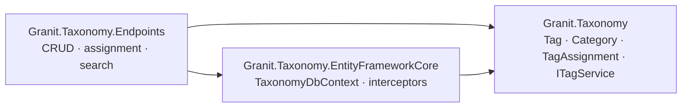

import { Aside } from "@astrojs/starlight/components";

`Granit.Taxonomy` is the framework's shared tagging and categorisation
primitive. Any aggregate root — `Document`, `Party`, `Activity`, `Invoice`,
host-defined types — registers as a *taggable entity* and gets CRUD,
autocomplete, assignment, cross-entity search, and an admin UI for free. One
infrastructure, one localisation set, one set of permissions.

The shape is locked by
[ADR-054](/dotnet/architecture/adr/054-taxonomy-module/), which replaces the
per-module `*Tag` join tables originally specced by ADR-052.

## Why a dedicated taxonomy module

Tagging is universal. Without a shared module, every aggregate that wants tags
ships its own `Tag` entity, its own `*Tag` join table, its own CRUD endpoints,
its own autocomplete, its own admin UI, its own archi tests, and its own
localisation. Six consumer modules means six near-identical reimplementations
and zero cross-entity search.

A market scan (Odoo, GitHub, Linear, Notion, Asana, Jira) shows that successful
products **scope** tags per domain rather than collapse them into one global
pot — "VIP" on a customer means something different from "VIP" on a project,
and a single dropdown loses that semantic context. But the per-domain approach
trades that UX clarity for missing cross-cutting search.

`Granit.Taxonomy` is the hybrid: **one shared module with one physical table,
each tag carries a scope discriminator**. Per-domain autocomplete stays scoped
by default; cross-entity search opts in via `scope=*`; hosts that prefer a
single global pot collapse everything to `scope = "global"`.

## Architecture

Three packages:



| Package | Role |
| ------- | ---- |
| `Granit.Taxonomy` | Abstractions: `Tag` and `Category` aggregates, `TagAssignment` / `CategoryAssignment` entities, `ITagService` / `ICategoryService`, options, DI registration, diagnostics. |
| `Granit.Taxonomy.EntityFrameworkCore` | Isolated `TaxonomyDbContext`, EF Core configurations, service implementations. |
| `Granit.Taxonomy.Endpoints` | Tag and category CRUD, assignment endpoints, per-scope autocomplete, cross-entity search. |

Architecture boundaries are pinned by `TaxonomyArchitectureTests`: no
`Microsoft.AspNetCore.*` in the base package, no EF Core in endpoints, no
Wolverine refs in either.

## Tag aggregate

```csharp
public sealed class Tag : AggregateRoot, IMultiTenant
{
    public Guid? TenantId { get; private set; }

    /// <summary>
    /// Scope discriminator — drives the per-domain autocomplete filter and the
    /// admin UI grouping. Examples: "documents", "parties", "activities",
    /// "global", or any host-defined string.
    /// </summary>
    public string Scope { get; private set; }

    public string Name { get; private set; }      // max 50 chars
    public string Color { get; private set; }     // hex (#RRGGBB)

    /// <summary>
    /// Operational tag — visible in admin UI and assignment forms (so it can
    /// be applied), but hidden on entity card / list / detail surfaces.
    /// </summary>
    public bool HideOnEntityCard { get; private set; }
}
```

Unique constraint: `(TenantId, Scope, Name)`. "VIP" can coexist in scope
`parties` and scope `global` without conflict.

Notably **dropped** versus a typical "fully-loaded" tag aggregate:

- No `Description` — the name is the entire UX, matching Odoo's `crm.tag`.
- No `Active` flag — soft-delete via Granit's `Trashed` semantic if needed
  later; the baseline keeps tags either present or hard-deleted.
- No `ParentId` — tags are flat by design. Hierarchy belongs to `Category`.

## TagAssignment — polymorphic target

```csharp
public sealed class TagAssignment : Entity, IMultiTenant
{
    public Guid? TenantId { get; private set; }
    public Guid TagId { get; private set; }

    /// <summary>
    /// Discriminator for the polymorphic target. By convention the
    /// assembly-qualified type name of the target aggregate
    /// (e.g. "Granit.Documents.Domain.Document").
    /// </summary>
    public string TargetType { get; private set; }
    public Guid TargetId { get; private set; }

    public DateTimeOffset AssignedAt { get; private set; }
    public Guid AssignedByUserId { get; private set; }
}
```

- Unique constraint: `(TenantId, TagId, TargetType, TargetId)`.
- Composite index `(TenantId, TargetType, TargetId)` — "tags of entity X".
- Composite index `(TenantId, TagId)` — "things tagged X".

<Aside type="caution" title="No DB-level FK on TargetId">
The polymorphism sacrifices database-level referential integrity on the
target. Cleanup is delegated to an integration-event handler (see
[Orphan cleanup](#orphan-cleanup-on-target-deletion) below) plus a nightly
sweep job. Hosts that opt their aggregate into `IEmitEntityLifecycleEvents`
get this for free.
</Aside>

## Category aggregate

Categories are hierarchical and single-assignment — same shape as `Tag` plus
a `ParentId?` and a materialised `Path` for fast subtree queries (mirrors the
folder pattern from ADR-052):

```csharp
public sealed class Category : AggregateRoot, IMultiTenant
{
    public Guid? TenantId { get; private set; }
    public string Scope { get; private set; }
    public Guid? ParentId { get; private set; }    // null = root in the scope
    public string Path { get; private set; }       // "/electronics/laptops"
    public int Depth { get; private set; }
    public string Name { get; private set; }
    public string? IconName { get; private set; }  // Lucide identifier
    public bool HideOnEntityCard { get; private set; }
}
```

`CategoryAssignment` follows the same polymorphic pattern as `TagAssignment`
but with a unique constraint on `(TenantId, TargetType, TargetId)` — one
category per target, not many.

## Endpoints

| Verb | Route | Purpose |
| ---- | ----- | ------- |
| `GET` | `/api/v1/taxonomy/tags?scope=documents&q=urg` | Per-scope autocomplete. Default scope mandatory; cross-scope opt-in via `?scope=*`. |
| `POST` | `/api/v1/taxonomy/tags` | Create tag. |
| `PATCH` | `/api/v1/taxonomy/tags/{id}` | Rename, recolour, toggle `HideOnEntityCard`. |
| `DELETE` | `/api/v1/taxonomy/tags/{id}` | Delete tag and cascade assignments. |
| `POST` | `/api/v1/taxonomy/tags/{id}/assign` | Body: `{ targetType, targetId }`. Idempotent. |
| `DELETE` | `/api/v1/taxonomy/tags/{id}/assign/{targetType}/{targetId}` | Remove assignment. |
| `GET` | `/api/v1/taxonomy/assignments?targetType=…&targetId=…` | Tags currently assigned to a target. |
| `GET` | `/api/v1/taxonomy/search?q=urgent&scope=*` | Cross-entity search — returns assignments grouped by `TargetType`. |

Categories mirror the same shape under `/api/v1/taxonomy/categories`.

## Permissions

| Permission | Grants |
| ---------- | ------ |
| `Taxonomy.Tags.Read` | Read tags and assignments in scopes the caller has access to. |
| `Taxonomy.Tags.Manage` | CRUD tags, assign and unassign. |
| `Taxonomy.Categories.Read` | Read categories and assignments. |
| `Taxonomy.Categories.Manage` | CRUD categories, assign and unassign. |
| `Taxonomy.Search.Read` | Cross-entity search across all `TargetType`s — separate because it surfaces data the user might not have per-entity read on. |

Per-entity tagging additionally requires the consumer module's own permission
— assigning a tag to a `Document` requires `Documents.Documents.Manage`. The
endpoint enforces this composite check by resolving `targetType` to the
expected permission via a registered `ITaggablePermissionResolver`.

## Consumer module integration

A consumer module wires up tagging in three steps:

1. Reference `Granit.Taxonomy` from the base project:

    ```xml
    <ProjectReference Include="..\Granit.Taxonomy\Granit.Taxonomy.csproj" />
    ```

2. Register the aggregate as a taggable entity with a stable scope:

    ```csharp
    services.AddTaggableEntity<Document>(scope: "documents");
    ```

3. (Optional) Expose convenience endpoints on the consumer's own surface
   (`GET /documents/{id}/tags` proxies to `/taxonomy/assignments?...`) —
   purely a UX shortcut. The canonical store remains Taxonomy.

The consumer never defines its own `*Tag` table.

## Orphan cleanup on target deletion

When a target aggregate is permanently deleted, its tag and category
assignments become orphans. Cleanup runs through a generic listener
subscribed to `EntityDeletedEto<T>` (emitted by aggregates that opt into
`IEmitEntityLifecycleEvents`):

```csharp
public class TaxonomyAssignmentCleanupHandler
{
    public static async Task HandleAsync(
        EntityDeletedEto evt,
        ITagAssignmentService tags,
        ICategoryAssignmentService categories,
        CancellationToken cancellationToken)
    {
        await tags.RemoveAllAssignmentsAsync(evt.EntityType, evt.EntityId, cancellationToken).ConfigureAwait(false);
        await categories.RemoveAllAssignmentsAsync(evt.EntityType, evt.EntityId, cancellationToken).ConfigureAwait(false);
    }
}
```

A nightly background job sweeps for orphan rows that escape the event path
(raw SQL deletes, crash-mid-transaction), guaranteeing eventual consistency
without DB-level FKs.

## Localisation

Tag and category **labels are tenant data** — never localised by the
framework. A tenant-defined "VIP" stays "VIP" in every language; the
administrator owns the wording. Only the **permission strings** and **error
messages** of `Granit.Taxonomy.Endpoints` get the standard 18-culture
treatment. This matches Odoo's behaviour and avoids a translation matrix
that would be unmanageable for tenant-facing administrators.

## Scoping cheat-sheet

| Goal | Scope strategy |
| ---- | -------------- |
| Per-domain UX clarity (default) | One scope per consumer module: `"documents"`, `"parties"`, `"activities"`. |
| Single global pot across all entities | Register every consumer with `scope: "global"`. |
| Mixed — some shared, some isolated | Use distinct scopes for isolated domains; `"global"` for tags that should appear everywhere. |
| Cross-entity search across all scopes | `GET /api/v1/taxonomy/search?scope=*` — requires `Taxonomy.Search.Read`. |

## Related

- [ADR-054 — Taxonomy module](/dotnet/architecture/adr/054-taxonomy-module/) — design decision and considered alternatives.
- [Documents](/dotnet/business/documents/) — the first consumer; its F5 stories were re-scoped onto Taxonomy.
- [Multi-tenancy](/dotnet/infrastructure/multi-tenancy/) — tenant filter applies to every Taxonomy query.
