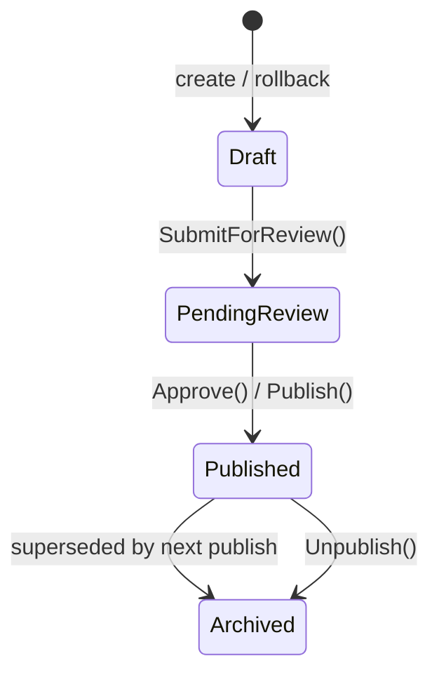

import { Aside } from "@astrojs/starlight/components";

`Granit.Blog` is an **editorial blog vertical** that runs on the Granit CMS. It adds a
`BlogPost` aggregate — copy-on-write versioned, workflow-published, scheduled, authored, and
illustrated — while deliberately staying *decoupled* from the CMS: the base package consumes
only [`Granit.Cms.Abstractions`](/dotnet/cms/sites-and-pages/) (the content seam) and never
references `Granit.Cms`. One package, `Granit.Blog.Cms`, opts the vertical into the full CMS
(content type, Releases, SEO, Puck blocks).

## Packages

- **`Granit.Blog`** — the base vertical. The `BlogPost` aggregate with **copy-on-write
  versioning** (`BlogPostVersion` + per-culture `BlogPostVersionContent` stored as `jsonb`),
  the publication workflow (`Draft → PendingReview → Published → Archived` on
  [`Granit.Workflow`](/dotnet/building-blocks/workflow/)), `PublicationSchedule`,
  `BlogAuthorProfile`, and attachments. It depends only on `Granit.Cms.Abstractions` — the
  content seam — and **never** references `Granit.Cms`.
- **`Granit.Blog.EntityFrameworkCore`** — the `BlogDbContext` (a `GranitDbContext`: multi-tenant,
  audited, soft-delete, copy-on-write), entity configurations, readers/writers, a sitemap
  source, and indexing. Wired by the host through `AddGranitBlogEntityFrameworkCore`.
  Provider-agnostic and ships **no migrations** — the consuming app owns them.
- **`Granit.Blog.Endpoints`** — the Minimal API. Admin post authoring (CRUD + media gallery +
  draft content), the publication lifecycle (publish / unpublish / schedule / cancel),
  author-profile CRUD, and the **anonymous public read surface** the Next.js front consumes
  (get-by-slug, a paginated chronological listing, an RSS 2.0 feed). Mapped by the host with
  `MapGranitBlog()`.
- **`Granit.Blog.Documents`** — an **optional** adapter. An `IBlogPostMediaResolver` that
  resolves a post's cover + gallery document references into render-ready Web renditions
  (stable public-link URLs + dimensions + MIME) via
  [`Granit.Documents`](/dotnet/business/documents/) resolution. Register it with
  `AddGranitBlogDocuments` — reference it only when the host wires `Granit.Documents`.
- **`Granit.Blog.Cms`** — the **only** Blog package that references the CMS. It registers
  `blog.post` as a content type and a **release publisher** (posts join CMS
  [Releases](/dotnet/cms/releases/)), a Puck-aware plain-text extractor (feeds the block body
  to the search index), a schema.org `BlogPosting` JSON-LD builder, a sitemap provider with
  hreflang alternates ([`Granit.Cms.Seo`](/dotnet/cms/seo/)), and an editor-agnostic
  data-bound **`blog-latest-posts`** [Puck block](/dotnet/cms/blocks/) + data source. Wired with
  `AddGranitBlogCms`.

## Copy-on-write versioning

A `BlogPost` is stable identity; its content and publication state live on immutable
`BlogPostVersion` rows. There is **one lineage per post** — `IVersioned.VersionId` equals the
`BlogPost.Id`, so every version belongs to exactly one post — and history is **append-only**.



- **At most one Published version at a time.** Publishing a new version **supersedes** the
  current published one and **archives** it.
- **Draft content is upserted** in place (`BlogPostVersionContent` per culture); publishing
  freezes it into the published snapshot.
- A **rollback** forks a fresh draft from any historical version — the prior history is never
  mutated.

```csharp
BlogPost post = BlogPost.Create(id, siteId, slug: "hello-world", tenantId);

post.UpsertDraftContent("en", contentJson, title: "Hello, world");  // draft only
post.SubmitForReview();
post.Publish(timeProvider);   // supersedes + archives the prior Published version
```

## Publication workflow & scheduling

Lifecycle transitions run on [`Granit.Workflow`](/dotnet/building-blocks/workflow/), so the
`Draft → PendingReview → Published → Archived` path is a declared state machine, not ad-hoc
flags. A `PublicationSchedule` arms a future publish at a wall-clock time; posts can also join a
CMS [Release](/dotnet/cms/releases/) (via `Granit.Blog.Cms`) to go live in a batch with pages.

<Aside type="tip" title="Least-privilege publish">
`Blog.Posts.Publish` is a **separate** permission from `Blog.Posts.Manage`: an author can write
and save drafts without being able to push a post live.
</Aside>

## Optimistic concurrency

`BlogPost` and `BlogPostVersionContent` are `IConcurrencyAware`. The update and draft-save
endpoints take a `ConcurrencyStamp` — `BlogPostUpdateRequest` implements
`IConcurrencyStampRequest` — and a **stale stamp yields HTTP `409`**, so two editors saving the
same post (or the same culture's draft) in parallel don't silently clobber each other.

## Editor-agnostic content

`BlogPostVersionContent.ContentJson` is an **opaque serialized block tree**. The backend never
parses it, never names the editor, and never couples to a block schema — it just stores and
serves the JSON. Only `Granit.Blog.Cms` adapts Puck JSON, and it does so behind the
editor-agnostic `IBlogPostContentTextExtractor` (which yields the plain text the search index
needs). Swap the editor and the base vertical is untouched.

## Multi-site & multi-tenant

Every Blog entity carries a `SiteId` **and** a `TenantId`. `SiteId` is the multi-site
discriminator — it sits *on top of* tenancy — while `TenantId` stays the **GDPR boundary**. One
tenant runs N sites; site-scoped query filters keep one site's posts invisible to another, and
tenant isolation remains the compliance edge. This mirrors the
[CMS core](/dotnet/cms/sites-and-pages/).

## Slugs

Post slugs are **lowercase-kebab**, validated by the framework's `.Slug()` rule
(`Validation:Format:Slug`). See [Validation](/dotnet/core/validation/) for the shared format
rules and their localized messages.

## Permissions

All under the `Blog` permission group:

| Permission | Grants |
|------------|--------|
| `Blog.Posts.Read` | Read posts (admin surface) |
| `Blog.Posts.Manage` | Author, edit, save drafts, manage the media gallery (own scope) |
| `Blog.Posts.ManageAny` | Lifts the own-vs-any ownership scope to **any** post |
| `Blog.Posts.Publish` | Publish / unpublish / schedule — a distinct least-privilege action |
| `Blog.Authors.Read` | Read author profiles |
| `Blog.Authors.Manage` | Create / edit author profiles |

## API

`MapGranitBlog()` mounts the whole surface. Admin routes are permission-gated; the public read
surface the Next.js front consumes is **anonymous** and site-scoped.

| Route group | Auth | Purpose |
|-------------|------|---------|
| Admin post authoring — CRUD, media gallery, draft content | `Blog.Posts.Read` / `Manage` | Author and edit posts |
| Publication lifecycle — publish / unpublish / schedule / cancel | `Blog.Posts.Publish` | Move a post through the workflow |
| Author-profile CRUD | `Blog.Authors.Read` / `Manage` | Manage bylines |
| Public — get-by-slug, paginated chronological listing, RSS 2.0 feed | anonymous, site-scoped | The read surface the front renders |

OpenAPI groups the routes under three tags — **`Blog - Posts`**, **`Blog - Authors`**, and
**`Blog - Feed`** — each overridable via `BlogEndpointsOptions.{TagName, AuthorsTagName,
FeedTagName}`.

## Configuration

`BlogEndpointsOptions` has **no `SectionName`** — it is configured through the `MapGranitBlog`
delegate:

```csharp
app.MapGranitBlog(options =>
{
    options.DefaultPageSize = 20;    // listing page size
    options.MaxPageSize = 100;       // listing clamp
    options.FeedItemCount = 20;      // items in the RSS feed
    options.FeedTitle = "Blog";      // feed <title>
    // options.TagName / AuthorsTagName / FeedTagName — override OpenAPI tags
});
```

`BlogCmsOptions` (the CMS glue) binds from configuration section **`Blog:Cms`**.

## Host wiring

```csharp
builder.AddGranitBlogEntityFrameworkCore(options => options.UseNpgsql(cs));
builder.AddGranitBlogDocuments();   // optional — only if Granit.Documents is wired
builder.AddGranitBlogCms();         // only when running inside a Granit CMS host
// ...
app.MapGranitBlog();
```

`AddGranitBlogEntityFrameworkCore` is the minimum. Add `AddGranitBlogDocuments()` when the host
wires [`Granit.Documents`](/dotnet/business/documents/) and you want cover/gallery renditions;
add `AddGranitBlogCms()` only inside a CMS host to register the content type, release publisher,
JSON-LD, sitemap, and the `blog-latest-posts` block.

<Aside type="note" title="No migrations shipped">
`Granit.Blog.EntityFrameworkCore` is provider-agnostic and ships **no** migrations. The
consuming app generates and owns them against its own provider — see
[Persistence](/dotnet/data/persistence/).
</Aside>

## Diagnostics

- **Metrics** — meter `Granit.Blog` emits `granit.blog.post.published`,
  `granit.blog.post.unpublished`, and `granit.blog.post.scheduled`. Tag keys are snake_case and
  include `tenant_id` (coalesced to `"global"`) and `site_id`.
- **Tracing** — `ActivitySource` `Granit.Blog`.
- **Localization** — every message is localized across all **18 cultures** (`BlogResource`).

## See also

- [Sites & Pages](/dotnet/cms/sites-and-pages/) — the CMS content core and the copy-on-write pattern this vertical mirrors
- [Releases](/dotnet/cms/releases/) — batch/scheduled publishing that posts join via `Granit.Blog.Cms`
- [SEO](/dotnet/cms/seo/) — sitemaps and JSON-LD the CMS glue plugs into
- [Blocks](/dotnet/cms/blocks/) — where the `blog-latest-posts` data-bound block registers
- [Media References](/dotnet/cms/documents/) — the document resolution `Granit.Blog.Documents` builds on
- [Workflow](/dotnet/building-blocks/workflow/) — the state machine behind the publication lifecycle
- [Validation](/dotnet/core/validation/) — the `.Slug()` rule and shared format validation
