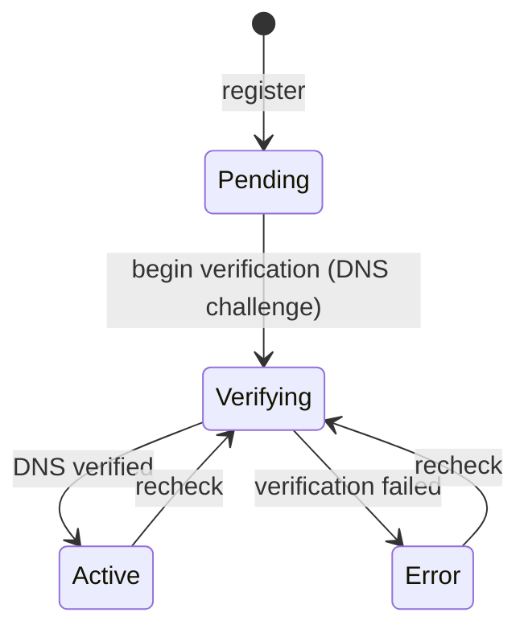

import { Aside } from "@astrojs/starlight/components";

`Granit.Cms.Hostnames` lets a site own real domains — `clinic.acme.com` instead of a path on
a shared host. It is a thin CMS layer over the framework's
[`Granit.Hostnames`](/dotnet/infrastructure/hostnames/) module: the hostname aggregate,
verification, and certificate lifecycle live in the framework; the CMS layer claims hostnames
for sites and resolves an incoming host back to a `SiteId`.

## Claiming a hostname

A site registers a hostname; the framework returns the DNS records the owner must publish and
moves the hostname through a verification workflow.



The `ManagedHostname` carries the workflow `Status` (`Pending`/`Verifying`/`Active`/`Error`),
the expected DNS records (challenge `TXT` + routing records), detected DNS conflicts, and a
separate `CertificateStatus` (`Unprovisioned`/`Provisioning`/`Secured`/`Error`) with expiry.
Failed checks back off on an exponential schedule (1m → 5m → 15m → 1h → 6h → 24h) and go
dormant after 20 consecutive failures.

<Aside type="note" title="One hostname, one owner">
Hostnames are globally unique. A site claims one with owner type `cms.site`; the CMS resolver
returns a `SiteId` only for hostnames owned by a CMS site, so a hostname owned by another
subsystem never routes CMS traffic.
</Aside>

## Host → site resolution

At request time, `ISiteHostnameResolver` turns the incoming `Host` header into a `SiteId` for
the [site-resolution middleware](/dotnet/cms/sites-and-pages/) — the rest of the CMS then
runs site-scoped. Resolution is cached when a `FusionCache` is available.

```csharp
public interface ISiteHostnameResolver
{
    Task<Guid?> ResolveSiteIdAsync(string host, CancellationToken cancellationToken = default);
}
```

## Persistence

There is **no CMS-specific EF Core package** here — persistence is owned by
`Granit.Hostnames.EntityFrameworkCore`. Wire both `Granit.Hostnames` and its EF Core module in
the host; the CMS hostnames module only adds the site glue and the lifecycle event handlers.

## API

`MapGranitCmsSiteHostnames()` maps under `/api/cms/sites/{siteId}/hostnames` — every operation
is site-scoped and gated by the site permissions (no dedicated hostname permission):

| Route | Permission | Purpose |
|-------|------------|---------|
| `GET /` | `Cms.Sites.Read` | List the site's hostnames (status, DNS records, cert state) |
| `GET /availability?host=…` | `Cms.Sites.Read` | Is a hostname free? (global uniqueness pre-check) |
| `POST /` | `Cms.Sites.Manage` | Claim a hostname (`409` if already taken) |
| `DELETE /{hostnameId}` | `Cms.Sites.Manage` | Release it (`404` if not owned by this site) |
| `POST /{hostnameId}/verify-now` | `Cms.Sites.Manage` | Trigger a manual DNS recheck (`202`) |

## See also

- [Granit.Hostnames](/dotnet/infrastructure/hostnames/) — the framework hostname + verification engine
- [Sites & Pages](/dotnet/cms/sites-and-pages/) — site resolution that consumes this
- [Redirects](/dotnet/cms/redirects/) — keeping paths stable under a domain
