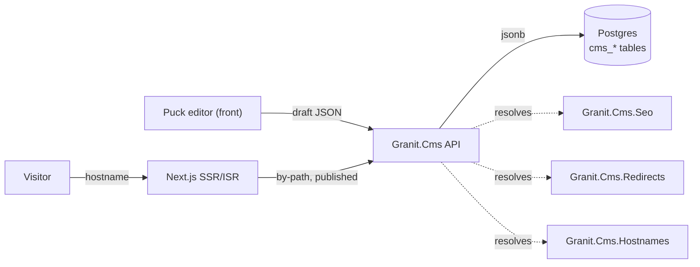

import { FileTree, Aside } from "@astrojs/starlight/components";

`Granit.Cms` is a **headless, multi-site CMS** built on the Granit framework. The backend
owns content, structure, versioning, and SEO; a Next.js App Router front renders pages
server-side with ISR. Editors compose pages from **blocks** in a Puck editor — the backend
stores the block tree as opaque JSON and never parses it, so the renderer and the editor
evolve without backend changes.

It is delivered as the `Granit.Cms.*` package family (shipped from the `granit-website`
repo, consumed via NuGet), each capability an opt-in module with the usual Granit layer
split (`.EntityFrameworkCore`, `.Endpoints`, `.BackgroundJobs`).

<Aside type="note" title="Backend + front">
This section documents the **.NET backend**. The public renderer is a separate Next.js app
(`granit-cms-renderer`) consuming `@granit/cms` + `@granit/react-cms`; blocks are React
components registered on the front and matched to backend catalog entries by name.
</Aside>

## What it does

| Capability | Module | What it gives you |
|------------|--------|-------------------|
| **Sites & pages** | [Granit.Cms](/dotnet/cms/sites-and-pages/) | Multi-site tree, copy-on-write page versions, draft→publish, i18n routing, preview, menus |
| **Blocks** | [Granit.Cms](/dotnet/cms/blocks/) | Self-describing block registry + catalog, server/client render, data-bound blocks |
| **Releases** | [Granit.Cms](/dotnet/cms/releases/) | Schedule a batch of publish/unpublish actions at a wall-clock time |
| **SEO** | [Granit.Cms.Seo](/dotnet/cms/seo/) | Cascading metadata, sitemap/robots/manifest, JSON-LD — plus AI-suggested titles & descriptions |
| **Redirects** | [Granit.Cms.Redirects](/dotnet/cms/redirects/) | Per-site 301/302/307/308 with prefix matching, loop-safe chains, auto-redirect on page move |
| **Custom domains** | [Granit.Cms.Hostnames](/dotnet/cms/hostnames/) | Map a verified hostname to a site (DNS challenge + certificate lifecycle) |
| **Media references** | [Granit.Cms.Documents](/dotnet/cms/documents/) | Resolve documents embedded in blocks into stable, renewable asset URLs |

## Architecture at a glance



Two design rules shape everything:

- **`SiteId` is the multi-site discriminator; `TenantId` is the GDPR boundary.** Every CMS
  entity carries both. A tenant can run N sites; site-scoped query filters keep one site's
  content invisible to another, while tenant isolation stays the compliance edge.
- **Copy-on-write versioning.** A `Page` is stable structure; its content and publication
  state live on immutable `PageVersion` rows (`Draft → Published → Archived`). No event
  sourcing — just a new draft forked from any prior version. See
  [Sites & Pages](/dotnet/cms/sites-and-pages/).

## Setup

Each capability is a module you depend on, an EF Core registration, and a `Map` call. The
core is the minimum; add satellites as needed.

```csharp
// Module graph (DependsOn on your app module)
[DependsOn(
    typeof(GranitCmsModule),
    typeof(GranitCmsEntityFrameworkCoreModule),
    typeof(GranitCmsEndpointsModule),
    typeof(GranitCmsBackgroundJobsModule))]
public class AppModule : GranitModule { }
```

```csharp
// Program.cs — persistence (isolated, tenant + site aware DbContext)
builder.AddGranitCmsEntityFrameworkCore(db => db.UseNpgsql(connectionString));
builder.AddCmsSeoEntityFrameworkCore(db => db.UseNpgsql(connectionString));        // optional
builder.AddCmsRedirectsEntityFrameworkCore(db => db.UseNpgsql(connectionString));  // optional
builder.AddGranitCmsDocumentsEntityFrameworkCore(db => db.UseNpgsql(connectionString)); // optional
```

```csharp
// Map the HTTP surface
app.MapGranitCms();              // sites, pages, blocks, menus, releases, routing, preview
app.MapGranitCmsSeo();           // sitemap/robots/manifest + metadata admin
app.MapGranitCmsSeoAI();         // AI suggestion inbox
app.MapGranitCmsRedirects();
app.MapGranitCmsSiteHostnames();
app.MapGranitCmsDocuments();     // anonymous asset redirect endpoint
```

<Aside type="caution" title="Preview needs Data Protection">
`Granit.Cms.Endpoints` mints signed preview tokens via `IPreviewTokenService` (backed by
ASP.NET Data Protection). The host must call `AddDataProtection()` with a persisted key
ring, or preview links break on restart / across instances.
</Aside>

## Locked architectural decisions

These are settled in the backend and reflected throughout the docs:

1. **Editor**: Puck (JSON block tree) + TipTap rich text inside blocks.
2. **Renderer**: Next.js App Router, SSR + ISR (tag-based cache invalidation).
3. **Multi-site**: N sites per tenant; `SiteId` on every entity.
4. **i18n**: sub-path routing (`/fr/`, `/en/`), per-culture URL slugs.
5. **Versioning**: copy-on-write per page + audit interceptor. No event sourcing.
6. **Preview**: signed HMAC token on a draft; never touches the ISR cache.
7. **Blocks**: server-rendered by default; client only when declared.
8. **Persistence**: Postgres-first, `jsonb` for serialized block content.

## See also

- [Sites & Pages](/dotnet/cms/sites-and-pages/) — the content core
- [Blocks](/dotnet/cms/blocks/) · [Releases](/dotnet/cms/releases/) · [SEO](/dotnet/cms/seo/)
- [Redirects](/dotnet/cms/redirects/) · [Custom Domains](/dotnet/cms/hostnames/) · [Media References](/dotnet/cms/documents/)
- [Persistence](/dotnet/data/persistence/) — the isolated DbContext pattern these modules use
