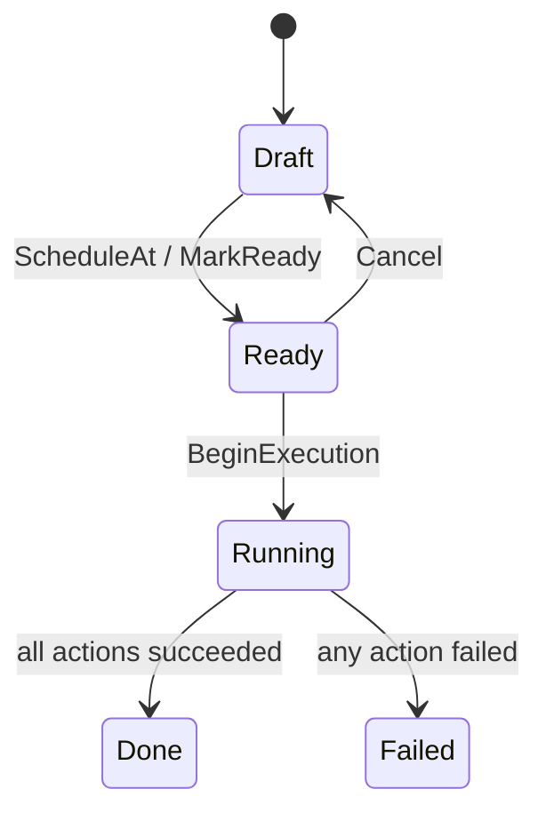

import { Aside } from "@astrojs/starlight/components";

Publishing one page at a time is fine for an edit. A **Release** bundles many publish /
unpublish actions and fires them **together**, optionally at a scheduled wall-clock time —
the campaign goes live at 09:00 Monday in the site's time zone, atomically, instead of an
editor racing the clock.

## The Release aggregate

A `Release` belongs to a site, names a batch, and collects `ReleaseAction`s. Each action
targets a `ContentKey` — a `(ContentType, ContentId, Culture?)` triple — so the engine is
**content-type agnostic**: today it publishes `cms.page`, tomorrow any registered content
type, with no change here.

```csharp
Release release = Release.Create(id, siteId, name: "Spring campaign");

release.AddAction(actionId, contentKey, ReleaseActionType.Publish);
release.ScheduleAt(
    localDateTime: new DateTime(2026, 3, 1, 9, 0, 0),
    timeZoneId: "Europe/Brussels",     // IANA zone — DST handled correctly
    nowUtc: now);                      // marks the release Ready
```

## Lifecycle



- `MarkReady()` arms a publish-now release; `ScheduleAt(...)` arms a future one (stored as
  wall-clock + IANA zone, resolved to a UTC instant).
- `BeginExecution()` claims the release `Ready → Running` — it is **raceable** across
  instances, so a second worker gets a `409` instead of double-publishing.
- `CompleteExecution()` records the outcome: `Done` if every action succeeded, else `Failed`
  (terminal). Per-action `ReleaseActionStatus` (`Pending`/`Succeeded`/`Failed` + `Error`)
  preserves a partial-failure audit.

<Aside type="note" title="Who actually publishes">
A release records *intent*. Execution resolves the right publisher per content type through
`IContentRegistry` / `IReleasePublisher`, so each action runs against the same publish path a
manual publish would — the release just orchestrates the batch.
</Aside>

## The scheduler

`Granit.Cms.BackgroundJobs` ships `PublishDueReleasesJob`, a recurring job
(`cms-releases-publish-due`, every 5 minutes). It scans due releases across tenants and runs
each in its own tenant scope, idempotently — a crash mid-run resumes cleanly on the next tick.

## API

`MapGranitCms()` (and `MapGranitCmsReleases()`) expose the release surface:

| Route | Permission | Purpose |
|-------|------------|---------|
| `GET /api/cms/releases` · `GET /releases/{id}` | `Cms.Releases.Read` | List / read |
| `POST /releases` · `PUT /releases/{id}` | `Cms.Releases.Manage` | Create / rename |
| `POST /releases/{id}/actions` · `DELETE /releases/{id}/actions/{actionId}` | `Cms.Releases.Manage` | Add / remove an action |
| `POST /releases/{id}/schedule` · `POST /releases/{id}/cancel` | `Cms.Releases.Manage` | Schedule (wall-clock + tz) / cancel |
| `POST /releases/{id}/publish` | `Cms.Releases.Publish` | Execute now |

As with pages, **executing** a release (`Cms.Releases.Publish`) is a separate permission from
**editing** one (`Cms.Releases.Manage`).

## See also

- [Sites & Pages](/dotnet/cms/sites-and-pages/) — the per-page publish lifecycle a release batches
- [Overview](/dotnet/cms/) — the module family and setup
