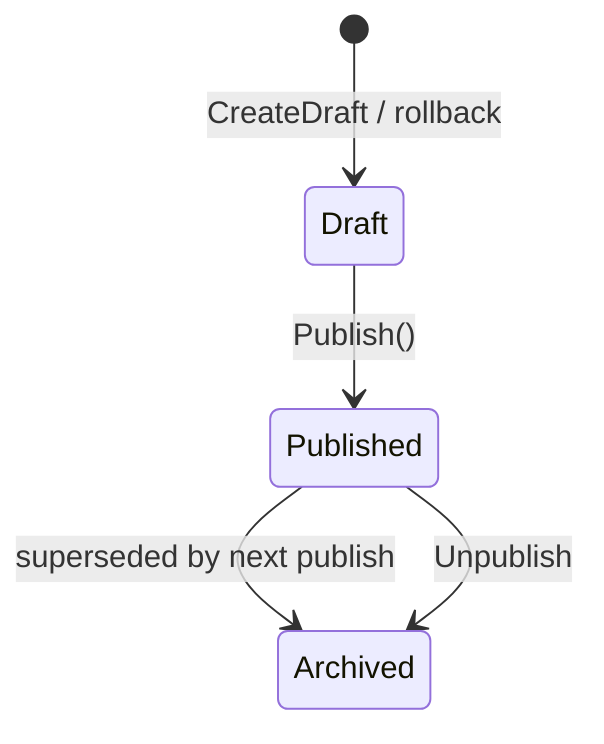

import { Aside } from "@astrojs/starlight/components";

`Granit.Cms` (core) owns the content model: **sites**, a **page tree**, **versioned**
page content, and **menus**. It persists through an isolated, tenant- *and* site-scoped
`CmsDbContext` (tables prefixed `cms_`) and exposes everything under `/api/cms` via
`MapGranitCms()`.

## Site

A `Site` is one website within a tenant. It pins the cultures the site serves, its default
theme, and which page answers `/`.

```csharp
Site site = Site.Create(
    id: siteId,
    slug: "acme-clinic",                 // kebab-case, unique per tenant
    defaultCulture: "en",
    allowedCultures: ["en", "fr"],       // default must be in the set
    tenantId: tenantId);

site.SetHomePage(homePageId);            // which page is served at "/"
site.Activate();                         // IActive flag, distinct from soft-delete
```

`Site` is `ITranslatable<SiteTranslation>` (per-culture display name) and `IActive`
(`Activate()`/`Deactivate()`). The legacy `Domains` list is superseded by managed
[custom domains](/dotnet/cms/hostnames/).

| Route | Permission | Purpose |
|-------|------------|---------|
| `GET /api/cms/sites` · `GET /sites/{id}` | `Cms.Sites.Read` | List / read |
| `POST /sites` · `PUT /sites/{id}` · `DELETE /sites/{id}` | `Cms.Sites.Manage` | Create / update / soft-delete |
| `PUT /sites/{id}/home-page` · `DELETE …/home-page` | `Cms.Sites.Manage` | Set / clear homepage |

## The page tree

Pages form a per-site tree stored on a **materialized path**. `Page` is *structure* — its
content lives on versions (next section). Each page has a culture-invariant `SlugSegment`;
the public URL slug is per-culture on `PageTranslation`.

```csharp
Page root  = Page.CreateSiteRoot(rootId, siteId, tenantId);   // the invisible "/" root
Page about = Page.Create(aboutId, parent: root, slugSegment: "about");

about.SetTranslation("en", urlSlug: "about-us", title: "About us");
about.SetTranslation("fr", urlSlug: "a-propos", title: "À propos");
about.MoveTo(newParent);          // reparent within the same site; cycles rejected
```

The framework maintains `StructurePath` (e.g. `/about/team`) and `Depth`; renaming or
moving a page rewrites its descendants' paths. Database invariants enforce the shape: one
`IsSiteRoot` per site (partial unique index), unique `SlugSegment` among siblings, and a
check constraint that every non-root page has a parent.

| Route | Permission | Purpose |
|-------|------------|---------|
| `GET /pages` · `GET /pages/tree` · `GET /pages/{id}` | `Cms.Pages.Read` | List / tree / read |
| `POST /pages` · `PUT /pages/{id}` · `POST /pages/{id}/move` | `Cms.Pages.Manage` | Create / rename / reparent |
| `PUT /pages/{id}/translations/{culture}` | `Cms.Pages.Manage` | Upsert per-culture slug + title |
| `DELETE /pages/{id}` | `Cms.Pages.Manage` | Soft-delete |

## Copy-on-write versioning

Content and publication state live on `PageVersion`, not `Page`. A version holds per-culture
content payloads (`PageVersionContent`, the opaque Puck JSON stored as `jsonb`) and moves
through a lifecycle: **Draft → Published → Archived**.



```csharp
PageVersion draft = PageVersion.CreateDraft(versionId, pageId, siteId, tenantId);
draft.UpsertContent("en", contentJson, title: "About us");   // only allowed in Draft
draft.Publish(timeProvider);                                  // stamps PublishedAt
```

Guarantees enforced in the database:

- **At most one Published version per page** (filtered unique index). Publishing a new
  version archives the prior published one.
- **One content payload per culture per version** (unique `(PageVersionId, Culture)`).
- **Optimistic concurrency** on content: two editors saving the same culture in parallel —
  the second gets a `409` via the `ConcurrencyStamp`.

A **rollback** forks a fresh draft from any historical version's snapshot — history is never
mutated.

| Route | Permission | Purpose |
|-------|------------|---------|
| `PUT /pages/{id}/draft/{culture}` | `Cms.Pages.Manage` | Save draft content (jsonb) |
| `GET /pages/{id}/versions` | `Cms.Pages.Read` | Version history |
| `POST /pages/{id}/publish` · `…/unpublish` | `Cms.Pages.Publish` | Publish / archive |
| `POST /pages/{id}/rollback/{versionId}` | `Cms.Pages.Publish` | Fork a draft from a snapshot |

<Aside type="tip" title="Least-privilege publish">
`Cms.Pages.Publish` is a separate permission from `Cms.Pages.Manage`: an editor can author
and save drafts without being able to push them live.
</Aside>

## Routing & preview

The renderer resolves pages anonymously, scoped to the current site (the
`SiteResolutionMiddleware` reads the site from the request — see
[custom domains](/dotnet/cms/hostnames/)). Drafts never resolve through the public path.

| Route | Auth | Purpose |
|-------|------|---------|
| `GET /pages/by-path?culture=…&path=…` | anonymous, site-scoped | Resolve the **published** page for a URL |
| `POST /pages/{id}/preview-token` | `Cms.Pages.Manage` | Mint a signed, short-lived preview token |
| `GET /preview/resolve?token=…` | anonymous, token-gated | Resolve a **draft** for the preview front |
| `GET /search` · `GET /pages/search` | anon / `Cms.Pages.Read` | Public / admin page search |

Preview is a signed HMAC token over a draft; the front enters Next.js draft mode and renders
the draft without ever reading or writing the ISR cache, so unpublished content can't leak
into the public cache.

### Editing presence

So two editors don't silently clobber each other, the core tracks who is editing a page
(heartbeat presence, scoped to tenant + site and gated by `Cms.Pages.Read`):
`POST /pages/{id}/editing/heartbeat`, `GET /pages/{id}/editing`, `DELETE /pages/{id}/editing`.

## Menus

A `Menu` is a named, ordered tree of links per site (`Key` unique per site). The whole
`MenuItem` tree is stored as a single `jsonb` column and replaced copy-on-write — one save
writes the whole tree (max depth 5).

```csharp
Menu menu = Menu.Create(id, siteId, key: "main-nav", title: "Main navigation");
menu.ReplaceItems(items);   // validates depth and target invariants
```

Each `MenuItem` carries a `Label`, a validated `Target`, optional `Children`, an
`IsVisible` flag (hidden items + subtrees are pruned at resolve time), and renderer hints
(`Icon`, `CssClass`).

| Route | Permission | Purpose |
|-------|------------|---------|
| `GET /menus` · `GET /menus/{id}` | `Cms.Menus.Read` | List / read |
| `POST /menus` · `PUT /menus/{id}` · `DELETE /menus/{id}` | `Cms.Menus.Manage` | Create / update / soft-delete |
| `GET /menus/resolve?siteId=…&key=…&culture=…` | anonymous | Render-ready, visibility-pruned tree |

## See also

- [Blocks](/dotnet/cms/blocks/) — what fills a page's content
- [Releases](/dotnet/cms/releases/) — publish many pages at a scheduled time
- [SEO](/dotnet/cms/seo/) — per-page metadata over this content
- [Redirects](/dotnet/cms/redirects/) — auto-created when a page moves
