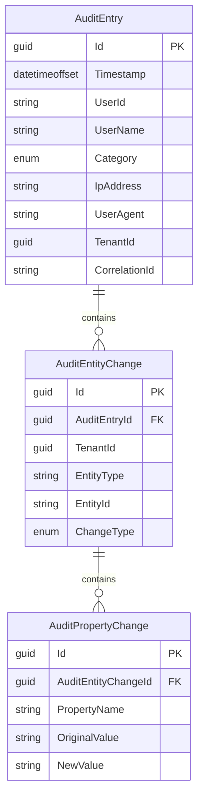

import { Tabs, TabItem, FileTree, Badge, Aside } from "@astrojs/starlight/components";

Granit.Auditing provides a turnkey audit trail solution for ISO 27001 A.12.4 compliance.
It automatically captures entity changes from EF Core's ChangeTracker and persists them
in a hierarchical model: **AuditEntry → AuditEntityChange → AuditPropertyChange**.

## Package structure

<FileTree>
- Granit.Auditing.Abstractions/ Domain model (AuditEntry, changes), contracts, messages, AuditEntryPersistedEto
- Granit.Auditing/ Runtime: options, metrics, query/export definitions
  - Granit.Auditing.BackgroundJobs/ Distributed retention cleanup recurring job
  - Granit.Auditing.ConfigurationChanges/ Setting & feature flag change audit handlers
  - Granit.Auditing.EntityFrameworkCore/ Isolated DbContext, interceptor, persistence pipeline, cleanup
  - Granit.Auditing.Endpoints/ Read-only Minimal API endpoints + GDPR pseudonymization
  - Granit.Auditing.Notifications/ SOC/admin notification bridge — pages humans on audit anomalies (ISO 27001 A.12.4)
  - Granit.Auditing.Privacy/ Wolverine handlers for GDPR Art. 15 export and Art. 17 erasure (drop-in `IPrivacyDataProvider`)
</FileTree>

| Package | Role | Depends on |
| ------- | ---- | ---------- |
| `Granit.Auditing.Abstractions` | Domain model (`AuditEntry`, `AuditEntityChange`, `AuditPropertyChange`), enums, `IAuditingReader`/`IAuditingWriter`/`IAuditingCleaner` contracts, `AuditEntryPersistedEto` — emit or read audit entries without the runtime (marker module `GranitAuditingAbstractionsModule`) | `Granit`, `Granit.QueryEngine.Abstractions` |
| `Granit.Auditing` | Runtime: options, metrics, declarative query/export definitions | `Granit.Auditing.Abstractions`, `Granit.DataExchange.Abstractions`, `Granit.Guids` |
| `Granit.Auditing.BackgroundJobs` | `auditing-retention-cleanup` distributed recurring job (cron `0 2 * * *`) — fires once cluster-wide | `Granit.Auditing.EntityFrameworkCore`, `Granit.BackgroundJobs` |
| `Granit.Auditing.ConfigurationChanges` | Audit handlers for `SettingChangedEvent` and `FeatureOverrideChangedEvent` | `Granit.Auditing`, `Granit.Settings`, `Granit.Features` |
| `Granit.Auditing.EntityFrameworkCore` | `AuditingDbContext`, interceptor, embedded/standalone persistence pipeline, cleanup | `Granit.Auditing`, `Granit.Persistence` |
| `Granit.Auditing.Endpoints` | `GET /auditing/audit-entries` endpoints (read-only, authorized) + GDPR pseudonymization | `Granit.Auditing`, `Granit.Http.ApiDocumentation` |
| `Granit.Auditing.Notifications` | Routes audit anomaly signals (repeated access-denied, role escalation, impersonation, privileged-config tampering) to admins / SOC via Email + InApp | `Granit.Auditing`, `Granit.Notifications`, `Granit.Templating` |
| `Granit.Auditing.Privacy` | `AuditingPrivacyDataProvider` (Art. 15 export ZIP) + erasure handler pseudonymizing direct identifiers (Art. 17) | `Granit.Auditing`, `Granit.Privacy` |

## Quick start

### 1. Install packages

```bash
dotnet add package Granit.Auditing.EntityFrameworkCore
dotnet add package Granit.Auditing.Endpoints   # optional — admin API
```

### 2. Register services

```csharp
// Program.cs
builder.AddGranitAuditingEntityFrameworkCore(options =>
    options.UseNpgsql(builder.Configuration.GetConnectionString("Auditing")));
```

### 3. Map endpoints (optional)

```csharp
app.MapGranitAuditing();
```

That's it. `AddGranitAuditingEntityFrameworkCore` registers the `AuditingChangeTrackingInterceptor`
as an `IGranitAutoInterceptor`. All DbContexts created via `AddGranitDbContext<T>` (or
multi-tenant factories) pick it up automatically through `UseGranitInterceptors` —
no additional wiring needed.

:::note[Manual wiring (advanced)]
If your DbContext does **not** use `AddGranitDbContext<T>` (e.g. a hand-wired
`AddDbContextFactory` call), add the interceptor explicitly:

```csharp
services.AddDbContextFactory<AppDbContext>((sp, options) =>
{
    options.UseNpgsql(connectionString);
    options.UseGranitInterceptors(sp);  // includes IGranitAutoInterceptor instances
}, ServiceLifetime.Scoped);
```

`UseGranitInterceptors` resolves both the 6 standard interceptors **and** any
module interceptors registered via `IGranitAutoInterceptor`.
:::

## Domain model

The hierarchical model captures **who** did **what**, **when**, on **which entities**,
down to **individual property changes**.



## Audit log categories

Inspired by Google Cloud Audit Logs, entries are classified into categories
with different retention defaults:

| Category | Description | Default retention | Always logged? |
| -------- | ----------- | ----------------- | -------------- |
| `DataMutation` | Entity Create / Update / Delete / SoftDelete | 3 years (ISO floor) | Yes |
| `ConfigurationChange` | Settings, feature flags | ~7 years | Yes |
| `DataAccess` | Read operations | 3 years (ISO floor) | Opt-in |
| `AccessDenied` | Authorization failures | ~7 years | Opt-in |
| `PrivilegedAccess` | Privileged/host operations (impersonation, cross-tenant) | ~7 years | Opt-in |

## Authentication audit — owned at its source

Authentication crosses several components — a BFF session, the OIDC token endpoint, an API
key handler — and each could plausibly write its own login audit. If they all did, a single
sign-in would produce duplicate rows, half of them with a machine's `User-Agent` instead of
the browser's. Granit applies one rule: **the component that performs the authentication owns
its audit, and no one else re-audits it.**

| Authentication path | Success audited? | Failure audited? | Owner & notes |
| ------------------- | ---------------- | ---------------- | ------------- |
| Interactive login fronted by the **BFF** | **Yes** | **Yes** | The BFF owns it: it carries the **real browser `User-Agent`** and sets `CreatedBy` to the authenticated user. |
| OIDC **token endpoint** — `authorization_code` / `refresh_token` | **No** | Yes | A grant exchange is not a fresh authentication — it redeems one already audited at its source (the BFF callback, or the interactive login for direct clients). Re-auditing would duplicate that row. **Failures** are still audited: a forged or replayed code/token is a security event seen only here. |
| **API key** authentication | **No** | **Yes** (`AccessDenied`) | A key authenticates on every call; auditing each one is noise. What the key _does_ is attributed via `CreatedBy` on the entities it touches. Only rejections (invalid, revoked, expired, IP not allow-listed) are audited. |

<Aside type="note">
The audited `UserName` for an interactive login is the **`preferred_username`** claim (falling
back to `email`), **not** the `name` display-name claim — so the audit trail records the stable
login identifier rather than a mutable display name.
</Aside>

## Persistence pipeline

Audit persistence has a single pipeline with two self-selecting modes — the mode is
decided by whether the audited `DbContext` **maps the audit entities into its own model**,
not by a configuration flag.

<Tabs>
  <TabItem label="Embedded (atomic)">
    Map the audit entities into the audited host context:

    ```csharp
    // AppDbContext.cs
    protected override void OnGranitModelCreating(ModelBuilder modelBuilder)
    {
        // ... your entities ...
        modelBuilder.ConfigureAuditingModule();
    }
    ```

    The interceptor then stages the `AuditEntry` graph **into the same `SaveChanges` and
    the same transaction** as the business mutation: a rollback removes the audit rows
    with it — the trail is a true invariant of the operation. The
    `AuditEntryPersistedEto` is dispatched through the pre-commit integration-event
    pipeline, so on a Wolverine-backed host the outbox envelope commits atomically with
    the audit row. Recommended for ISO 27001 strict compliance (banking, HDS).

    Note: `SaveChanges` return value includes the audit rows (+1 entry, +N children).
  </TabItem>
  <TabItem label="Standalone (fallback)">
    A host context that does **not** map the audit entities keeps the standalone path:
    entries are written synchronously **after** the business commit, through the isolated
    `AuditingDbContext`, in their own transaction. Durable, but not atomic with the
    audited operation — a one-shot warning per context type invites you to map the
    tables for atomic auditing. Explicit `IAuditingWriter` writes (authentication
    events, access-denied) always use this path and emit the `AuditEntryPersistedEto`
    after the save succeeds.
  </TabItem>
</Tabs>

<Aside type="danger" title="Exactly ONE DbContext owns the audit-table DDL">
If two contexts both emit `CREATE TABLE` for the audit tables, migration generation or
deployment **crashes** on duplicate tables. Every audited context beyond the DDL owner
must map with the exclusion overload:

```csharp
// Primary context — owns the audit DDL:
modelBuilder.ConfigureAuditingModule();

// Every other audited context — maps the tables, emits NO DDL:
modelBuilder.ConfigureAuditingModule(excludeFromMigrations: true);
```

The isolated `AuditingDbContext` owns the DDL by default when no host context maps the
entities.
</Aside>

## Controlling what gets audited

### Skip an entity or property

```csharp
[AuditIgnore]
public class CacheEntry : Entity { ... }

public class Patient : AuditedEntity
{
    public string Name { get; set; }

    [AuditIgnore]
    public byte[] ProfilePhoto { get; set; }  // Large binary, not audited
}
```

### Protect sensitive values

Use the cross-cutting `[SensitiveData]` attribute from `Granit.DataProtection`.
It is consumed by the auditing module, AI/MCP output sanitization, and logging.

```csharp
public class Patient : AuditedEntity
{
    [SensitiveData]                              // Default (Mask) → stored as "***"
    public string NationalId { get; set; }

    [SensitiveData(Mode = SensitiveDataMode.Omit)]   // Removed entirely from audit trail
    public string? PasswordHash { get; set; }

    [SensitiveData(Mode = SensitiveDataMode.Hash)]   // SHA-256 hash for correlation
    public string? ExternalUserId { get; set; }
}
```

| Mode | Audit trail value | Use case |
| ---- | ----------------- | -------- |
| `Mask` (default) | `***` | PII that must be recorded but not revealed |
| `Omit` | `null` | Secrets that must never appear in audit trail |
| `Hash` | `sha256:a1b2c3...` | Values needing cross-reference without exposure |

## Querying the audit trail

### Via `IAuditingReader` (code)

```csharp
public class MyService(IAuditingReader auditingReader)
{
    public async Task<PagedResult<AuditEntry>> GetPatientHistoryAsync(
        string patientId, CancellationToken ct) =>
        await auditingReader.GetByEntityAsync("Patient", patientId, cancellationToken: ct);
}
```

### Via admin endpoints

| Method | Route | Description |
| ------ | ----- | ----------- |
| `GET` | `/auditing/audit-entries` | Query-engine list with filters, saved views and `/meta` (category, date, user, entity) |
| `GET` | `/auditing/audit-entries/{id}` | Single entry with full entity + property change hierarchy |
| `GET` | `/auditing/audit-entries/entity/{entityType}/{entityId}` | Paginated audit trail for a specific entity (GDPR SAR) |
| `GET` | `/auditing/audit-entries/correlation/{correlationId}` | Paginated entries sharing a distributed-tracing correlation ID (`page`/`pageSize`, summary projection) |
| `POST` | `/auditing/audit-entries/pseudonymize/{userId}` | GDPR Art. 17 — pseudonymize a user's direct identifiers (requires `Auditing.AuditEntries.Manage` in addition to `Read`) |
| `GET` | `/auditing/audit-entity-changes` | Query-engine list over entity changes (cross-cutting analysis) |

Read endpoints require the `Auditing.AuditEntries.Read` permission (route prefix and tag
configurable via `Auditing:Endpoints`). `Category` and `ChangeType` are typed enums in the
OpenAPI schema; problem details are localized in the request culture.

## Retention and cleanup

The `auditing-retention-cleanup` recurring job (`Granit.Auditing.BackgroundJobs`,
cron `0 2 * * *`, fires **once cluster-wide** via the distributed scheduler) deletes
expired entries by category. Retention is a per-category dictionary — categories absent
from the dictionary fall back to their built-in default, so a partial override can never
create a retention gap:

```json
{
  "Auditing": {
    "Retention": {
      "ConfigurationChange": "2555.00:00:00",
      "DataMutation": "1095.00:00:00",
      "DataAccess": "1095.00:00:00",
      "AccessDenied": "2555.00:00:00",
      "PrivilegedAccess": "2555.00:00:00"
    },
    "CleanupBatchSize": 10000
  }
}
```

Every category's effective retention is validated at startup against the
`Auditing:MinimumRetention` floor (default **1095 days** — the ISO 27001 3-year minimum
before physical purge). Configuring a shorter retention requires explicitly lowering the
floor, which is a documented compliance deviation — keep the justification next to the
override.

Deletes use `ExecuteDeleteAsync` in batches to avoid long-running transactions, backed by
the `(Category, Timestamp)` index. Cascade deletes automatically remove child
`AuditEntityChange` and `AuditPropertyChange` rows.

## Observability

| Signal | Name | Description |
| ------ | ---- | ----------- |
| Tracing | `Granit.Auditing` | ActivitySource for capture, persist, cleanup and pseudonymize spans |
| Metric | `granit.auditing.entry.persisted` | Counter — entries successfully persisted |
| Metric | `granit.auditing.entry.purged` | Counter — entries purged by the retention job (by category) |
| Metric | `granit.auditing.entry.pseudonymized` | Counter — entries pseudonymized for GDPR erasure |
| Metric | `granit.auditing.entry.entity_changes` | Histogram — entity changes per persisted entry |
| Metric | `granit.auditing.persistence.duration` | Histogram (ms) — persistence duration, tagged `mode` = `embedded` / `standalone` |
| Metric | `granit.auditing.capture.errors` | Counter — errors during change tracking capture |

## Configuration reference

| Key | Type | Default | Description |
| --- | ---- | ------- | ----------- |
| `EnablePropertyTracking` | `bool` | `true` | Capture property-level old/new values |
| `Retention` | `Dictionary<AuditCategory, TimeSpan>` | see [Retention](#retention-and-cleanup) | Retention per category; absent categories use built-in defaults (env-overridable: `Auditing__Retention__DataAccess=…`) |
| `MinimumRetention` | `TimeSpan` | `1095d` | ISO 27001 floor validated at startup across all categories; lowering it is a documented compliance deviation |
| `PseudonymizeOnErasure` | `bool` | `true` | GDPR Art. 17 erasure pseudonymizes direct identifiers (events retained) |
| `PseudonymizationSalt` | `string?` | `null` | Salt for the pseudonymization hash — provide via env/Vault, never `appsettings.json`; unsalted hashing logs a warning |
| `CleanupBatchSize` | `int` | `10000` | Max entries deleted per batch |
| `CacheEntryTtl` | `TimeSpan` | `30m` | Cache duration for individual audit entries |
| `CacheEntityQueryTtl` | `TimeSpan` | `2m` | Cache duration for entity-scoped queries |

## Notifications

`Granit.Auditing.Notifications` surfaces high-signal events to platform admins / SOC
operators in **near real time** rather than relying on a silent log line. The point
isn't to drown the inbox — it's to satisfy **ISO 27001 A.12.4** logging-and-monitoring
by paging a human responder on the patterns that matter.

Anomaly heuristics detect: repeated access-denied bursts, role escalation,
impersonation activity, and privileged configuration tampering. Each match emits a
`auditing.anomaly_detected` notification:

| Notification | Trigger | Channels | Severity |
| ------------ | ------- | -------- | :------: |
| `auditing.anomaly_detected` | `AuditEntryPersistedEto` (filtered by anomaly heuristics) | Email, InApp | Warning |

Email templates ship embedded in **English and French**; additional cultures are
produced via the [translation script](/dotnet/building-blocks/templating/) and the
runtime admin override path.

## GDPR Article 15 — audit trail in the user's export

`Granit.Auditing.Privacy` plugs into the `Granit.Privacy` scatter-gather pipeline:
register the package, and `AuditingPrivacyDataProvider` automatically responds to
`PersonalDataRequestedEto` with the requester's audit history (filtered by
`UserId`). The fragment is uploaded through `PrivacyFragmentUploader` and bundled
into the export ZIP — no extra wiring per host.

## GDPR Article 17 — erasure pseudonymizes, events remain

The audit **events** always survive an erasure request: an immutable, append-only record
of security-relevant events is an ISO 27001 A.12.4 control, and GDPR Art. 17(3)(b)
exempts processing required by a legal obligation. By default the erasure handler
reconciles both duties by **pseudonymizing the subject's direct identifiers in place** —
the user id is replaced by a salted SHA-256 hash (correlation preserved, re-identification
prevented), the username is masked, IP and user-agent are cleared — and acknowledges the
deletion saga with `DeletionAction.Anonymized` and the real affected count.

- Opt out with `Auditing:PseudonymizeOnErasure = false` (the trail is retained untouched
  and acknowledged as `Retained`).
- Configure `Auditing:PseudonymizationSalt` via environment or Vault — unsalted hashing of
  low-entropy user ids (emails, usernames) is re-identifiable by dictionary attack and
  logs a warning. The salt must stay stable for the lifetime of the trail.
- The manual `POST /auditing/audit-entries/pseudonymize/{userId}` endpoint remains for
  ahead-of-request scrubbing by an administrator.

## Upgrading from the Channel pipeline

The former `Strict`/`Async` persistence modes, the in-memory `Channel<T>` and the
background persistence worker were removed. Hosts upgrading must:

1. **Clean configuration** — `Auditing:PersistenceMode` and `Auditing:ChannelCapacity`
   are gone (silently ignored by the binder); the five `Auditing:*Retention` keys become
   the `Auditing:Retention` dictionary (see [Retention](#retention-and-cleanup)).
2. **Add a migration** against the context that owns the audit tables:
   - new nullable `TenantId` column on `audit_log_entity_changes`, backfilled from the
     parent entry:

     ```sql
     UPDATE audit_log_entity_changes c
     SET "TenantId" = e."TenantId"
     FROM audit_log_log_entries e
     WHERE c."AuditLogEntryId" = e."Id";
     ```

   - new `(Category, Timestamp)` and `CorrelationId` indexes on `audit_log_log_entries`;
   - `OriginalValue`/`NewValue` lose their explicit legacy `text` column type
     (SQL Server hosts move to `nvarchar(max)`; PostgreSQL is unchanged).
3. **Optionally opt into atomic auditing** by calling
   `modelBuilder.ConfigureAuditingModule()` in the audited context — mind the
   [single-DDL-owner rule](#persistence-pipeline).
4. **API consumers**: the correlation endpoint is now paginated and returns the summary
   projection; `AuditingMetrics` dashboards should track the renamed
   `granit.auditing.entry.entity_changes` histogram and the `mode` tag.

## See also

- [Persistence](/dotnet/data/persistence/) — `AuditedEntityInterceptor` and entity base classes
- [Privacy](/dotnet/compliance/privacy/) — GDPR data subject access requests
- [Security](/dotnet/security/security-overview/) — `ICurrentUserService` and actor resolution
