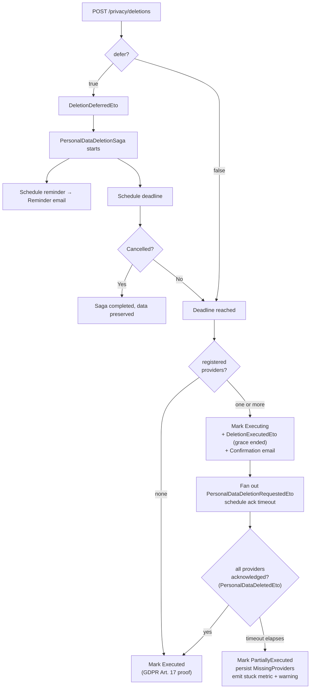

import { Aside, Badge } from "@astrojs/starlight/components";

## Deletion modes

Two modes are supported — **immediate** (default) and **deferred** with an opt-in
cooling-off period:



The user-facing `DeletionExecutedEto` still fires the moment the grace period ends — it
confirms the cooling-off window closed, **not** that every provider has finished. The
tracker only reaches the terminal `Executed` state once the provider acknowledgement
fan-in completes (see [Provider acknowledgement fan-in](#provider-acknowledgement-fan-in)).

## Cooling-off period

When the user sets `defer: true`, the deletion is postponed for a configurable
grace period (default from the regulation profile). During this period the user
can cancel via `POST /privacy/deletions/{requestId}/cancel`. A reminder email is
sent a few days before the deadline. A daily safety-net job
(`DeletionDeadlineEnforcerJob`) catches any requests that the saga might have
missed.

## Endpoints

| Method | Route | Operation | Permission |
| ------ | ----- | --------- | ---------- |
| <Badge text="POST" variant="success" /> | `/privacy/deletions` | RequestPrivacyDeletion | `Privacy.Deletions.Execute` |
| <Badge text="POST" variant="success" /> | `/privacy/deletions/{requestId}/cancel` | CancelPrivacyDeletion | `Privacy.Deletions.Execute` |
| <Badge text="GET" variant="note" /> | `/privacy/deletions/{requestId}` | GetPrivacyDeletionStatus | *(owner only)* |
| <Badge text="GET" variant="note" /> | `/privacy/deletions` | ListPrivacyDeletions | *(owner only)* |

`POST /privacy/deletions` returns `202 Accepted`. Filing a second deletion while a
deferred request is already pending returns `409 Conflict` — cancel the existing
one first.

## Configuration

Grace periods default from the regulation profile. Override globally or per-regulation:

```json
{
  "Privacy": {
    "DefaultGracePeriodDays": 30,
    "MaxGracePeriodDays": 90,
    "ReminderDaysBefore": 3,
    "DeletionAcknowledgementTimeoutMinutes": 720,
    "RegulationOverrides": {
      "BR_LGPD": { "DefaultGracePeriodDays": 15 },
      "US_CCPA": { "DefaultGracePeriodDays": 45, "MaxGracePeriodDays": 90 }
    }
  }
}
```

`DeletionAcknowledgementTimeoutMinutes` (default 720) bounds how long the saga waits for
provider acknowledgements after fan-out before marking the request `PartiallyExecuted` — see
[Provider acknowledgement fan-in](#provider-acknowledgement-fan-in). The grace-period keys are
independent of it.

Deferred deletion state needs a request tracker. The EF Core default registers
both the export **and** deletion trackers against `PrivacyDbContext` in one call:

```csharp
services.AddGranitPrivacy(privacy => privacy
    .UseEntityFrameworkCoreTrackers());      // export + deletion trackers
```

Apps that persist deletion state elsewhere supply their own implementation via the
generic hook `privacy.UseDeletionRequestTracker<TStore>()`.

## Notifications

`Granit.Privacy.Notifications` covers the full lifecycle of a deletion request.
Every notification renders against application-provided templates and can use
the `{{ privacy }}` global context to embed the controller / DPO contact.

| Notification name | Trigger | Channels | Severity | Purpose |
| ----------------- | ------- | -------- | -------- | ------- |
| `privacy.deletion_acknowledged` | `PersonalDataDeletionRequestedEto` | Email | `Info` | Receipt acknowledgement (GDPR Art. 12 §3 — paper trail of "without undue delay" response) |
| `privacy.deletion_deferred_confirmed` | `DeletionDeferredEto` | Email | `Info` | Confirms the new scheduled deletion date when the user opts to defer |
| `privacy.deletion_reminder` | `DeletionReminderDueEto` | Email + InApp | `Warning` | J-N reminder before the scheduled deadline so the user can still cancel |
| `privacy.deletion_cancelled` | `DeletionCancelledEto` | Email | `Info` | Confirms revocation of a deferred deletion (data is retained) |
| `privacy.deletion_confirmed` | `DeletionExecutedEto` | Email | `Info` | Final confirmation that the deletion was executed |

The `*_acknowledged`, `*_deferred_confirmed` and `*_cancelled` notifications carry
the `RequestId`, the relevant timestamp(s) and the `Regulation` code so templates
can quote the regulatory deadline directly from the active `PrivacyRegulationProfile`.

## Cascade cleanup for owned entities

Modules that hold user-keyed aggregates participate in the deletion fan-out
by subscribing to `PersonalDataDeletionRequestedEto` and processing every
aggregate where `OwnerId == request.UserId`. The pattern is generic — any
[`IOwnable`](/dotnet/data/ownable/) module can plug in.

Three choices the handler makes:

1. **Action.** What to do with each owned row — `SoftDelete` (trash, then
   the existing retention pipeline finishes the job), `Anonymized` (replace
   identifying fields and reassign ownership to an anonymised user),
   `Retained` (legal hold), or `CryptoShredding` (destroy the per-entity
   encryption key). Report the choice on the `DeletionAction` field of
   the `PersonalDataDeletedEto` audit fragment.
2. **Idempotency.** Re-delivery of the same `PersonalDataDeletionRequestedEto`
   must not double-process rows. Filter at the service layer (e.g. only list
   *active* rows) so already-handled rows naturally drop out.
3. **System anchors.** If the module has aggregates that must survive the
   deletion of any individual user (per-tenant root folders, system queues,
   shared catalog entries), they MUST be filtered at the **service contract**
   level — not by an `if` inside the handler. See the invariant note below.

### Example handler — `Granit.Documents.Privacy`

```csharp
public class DocumentsPersonalDataDeletionHandler
{
    public const string ProviderName = "documents";

    // Wolverine discovers the static HandleAsync and wires DI for the parameters.
    // Returning a PersonalDataDeletedEto lets Wolverine cascade the acknowledgement
    // back to the saga — [SagaIdentity] on RequestId routes it. Build the ack only
    // after the erasure succeeds: if a call throws, the return is never reached, no
    // ack is published, and Wolverine retries / dead-letters instead.
    public static async Task<PersonalDataDeletedEto> HandleAsync(
        PersonalDataDeletionRequestedEto request,
        IDocumentService documents,
        IFolderService folders,
        CancellationToken cancellationToken)
    {
        // 1. Enumerate by OwnerId at the service contract — system anchors (here:
        //    the tenant root folder) are excluded by the service itself, not by
        //    a guard inside this handler.
        IReadOnlyList<Guid> folderIds = await folders
            .ListActiveNonRootIdsByOwnerAsync(request.UserId, cancellationToken);

        IReadOnlyList<Guid> documentIds = await documents
            .ListActiveIdsByOwnerAsync(request.UserId, cancellationToken);

        // 2. Idempotency — re-delivery yields 0 active rows once the cascade ran.
        //    Still acknowledge (Retained / 0) so the saga's fan-in drains this provider.
        if (folderIds.Count == 0 && documentIds.Count == 0)
        {
            return new PersonalDataDeletedEto(
                request.RequestId,
                ProviderName,
                DeletionAction.Retained,
                AffectedRecords: 0,
                Details: "no active documents or folders owned by user");
        }

        // 3. Apply the policy — Documents picks SoftDelete (trash); the F9.2
        //    empty-trash job promotes to PermanentlyDeleted after the grace period.
        int trashedFolders = 0;
        foreach (Guid folderId in folderIds)
        {
            if (await folders.TrashAsync(folderId, cancellationToken) is not null)
            {
                trashedFolders++;
            }
        }

        int trashedDocuments = 0;
        foreach (Guid documentId in documentIds)
        {
            if (await documents.TrashAsync(documentId, cancellationToken) is not null)
            {
                trashedDocuments++;
            }
        }

        // 4. Acknowledge — this return is the fan-in signal that lets the saga count
        //    "documents" as done. DeletionAction.SoftDelete + the count also feed the
        //    per-provider audit ledger. Until it arrives, the request stays Executing.
        return new PersonalDataDeletedEto(
            request.RequestId,
            ProviderName,
            DeletionAction.SoftDelete,
            AffectedRecords: trashedFolders + trashedDocuments,
            Details: $"trashed {trashedFolders} folder(s) and {trashedDocuments} document(s); tenant root preserved");
    }
}
```

<Aside type="caution" title="Filter system anchors at the service, not in the handler">
The Documents tenant root folder is owned by the user who created the tenant.
If that user requests deletion, the cascade must skip the root — otherwise the
tenant is left without a navigable filesystem. The temptation is to add an
`if (folder.IsTenantRoot) continue;` inside the handler.

**Don't.** Place the filter on the service contract instead — the
`ListActiveNonRootIdsByOwnerAsync` query above never returns the root.
Two reasons:

- **Robustness.** Other entry points (admin scripts, future bulk-reassign
  flows, archi tests) reuse the same service method and inherit the
  exclusion automatically.
- **Testability.** A handler with a guard is correct only as long as the
  guard exists; a service that never returns the row is correct by
  construction. The unit test is a single assertion against the service,
  not a saga-level integration test.

The same principle applies to any other system-anchor concept — a tenant's
default queue, a "platform" billing account, a baseline taxonomy. Filter at
the boundary, not at the consumer.
</Aside>

### Wiring

Load the handler's module so Wolverine discovers it via the assembly scan:

```csharp
[DependsOn(typeof(GranitDocumentsPrivacyModule))]
public class MyAppModule : GranitModule { }
```

Multiple modules registering their own privacy handlers compose naturally — each
subscribes to `PersonalDataDeletionRequestedEto` independently.

## Provider acknowledgement fan-in

The saga proves completion the same way the [export saga](/dotnet/compliance/privacy/data-export/)
proves assembly — a scatter-gather fan-in over provider acknowledgements. This is what makes a
deletion **provable** for GDPR Art. 17, rather than optimistically "requested".

At the deadline (or immediately, for a non-deferred request) the saga:

1. Snapshots the registered providers from `IDataProviderRegistry`, marks the request
   `Executing`, and fans out `PersonalDataDeletionRequestedEto`.
2. Publishes the user-facing `DeletionExecutedEto` **immediately** — it only confirms the
   grace period ended, not that erasure finished — and schedules an acknowledgement timeout.
3. Waits for every expected provider to acknowledge by returning a `PersonalDataDeletedEto`.
   The eto carries `[SagaIdentity]` so Wolverine cascades it back to the saga, routed by
   `RequestId`. Only when the **last** expected provider acknowledges does the request reach
   the terminal `Executed` state.

The fan-in is idempotent: duplicate or unregistered acknowledgements are counted for
observability but never double-complete the saga. A request with **zero** registered
providers keeps the immediate-`Executed` fast path.

<Aside type="note" title="Build the ack after erasure, never before">
A provider handler must build its `PersonalDataDeletedEto` return value **after** the
erasure succeeds. If the eraser throws, the return is never reached, so no ack is published
and Wolverine retries or dead-letters the message — and the saga correctly leaves the request
pending, timing out to `PartiallyExecuted`. Acking eagerly (before the delete) would falsely
prove completion.
</Aside>

### When a provider never acknowledges

If the acknowledgement window (`DeletionAcknowledgementTimeoutMinutes`, default **720** = 12 h)
elapses before every provider confirms, the saga marks the request `PartiallyExecuted`,
persists the names of the providers that never acknowledged, and fires a per-provider
stuck-deletion metric plus a warning log so DLQ monitoring can alert. The request is **not**
provably complete — an operator reconciles the missing providers before the erasure can be
attested for Art. 17.

| State | Meaning |
| ----- | ------- |
| `Deferred` | Grace period active; user may still cancel. |
| `Cancelled` | User cancelled during the grace period; data retained. |
| `Executing` | Deadline reached, fan-out started, awaiting provider acknowledgements. |
| `Executed` | Every registered provider acknowledged erasure — the only state that proves Art. 17 completion. |
| `PartiallyExecuted` | Acknowledgement window elapsed with at least one provider missing (permanent failure, dead-letter, or unregistered handler). |

`GetPrivacyDeletionStatus` surfaces the current state and, for `PartiallyExecuted`, a
`MissingProviders` list. The `DeletionDeadlineEnforcerJob` safety-net remains a direct-`Executed`
fallback for the case where the saga timer never fires at all.

<Aside type="caution" title="Retained is a valid acknowledgement">
Not every provider erases. `Granit.Auditing` registers a provider (its trail backs Art. 15
export) but its erasure contract is **retention** — the audit trail is deliberately preserved
under Art. 17(3)(b) / ISO 27001 A.12.4. Its handler acknowledges with `DeletionAction.Retained`
and `0` rows: a truthful "nothing erased, on purpose" ack that drains the saga instead of
leaving it stuck forever on a provider that will never delete.
</Aside>

### Observability

| Metric | Description |
| ------ | ----------- |
| `granit.privacy.deletion.executed` | Deletions executed (immediate or after the grace period). |
| `granit.privacy.deletion.acknowledged` | Per-provider deletion acknowledgements received by the saga. |
| `granit.privacy.deletion.stuck` | Requests that timed out with a provider never acknowledging (`PartiallyExecuted`). Tagged by `provider_name` so DLQ monitoring can alert on the specific stuck provider. |

<Aside type="caution" title="Host migration for MissingProviders">
The fan-in adds a `MissingProviders` column to the `deletion_requests` table (populated only
for `PartiallyExecuted` requests). The column is part of the framework `PrivacyDbContext`
model, but the schema change is host-owned — run `dotnet ef migrations add AddMissingProviders`
against the registered `PrivacyDbContext` and apply it before deploying.
</Aside>

## See also

- [Privacy overview](/dotnet/compliance/privacy/) — module setup and data provider registry
- [Data Export](/dotnet/compliance/privacy/data-export/) — sibling scatter-gather saga
- [Regulations](/dotnet/compliance/privacy/regulations/) — `PrivacyRegulationProfile` driving deadlines
- [Legal Agreements](/dotnet/compliance/privacy/legal-agreements/) — consent records preserved alongside deletion
- [Crypto-shredding](/dotnet/compliance/crypto-shredding/) — GDPR erasure without deleting rows
- [IOwnable](/dotnet/data/ownable/) — marker the cascade keys off of
- [Notifications module](/dotnet/infrastructure/notifications/) — channel that delivers `*_acknowledged`/`*_cancelled`
