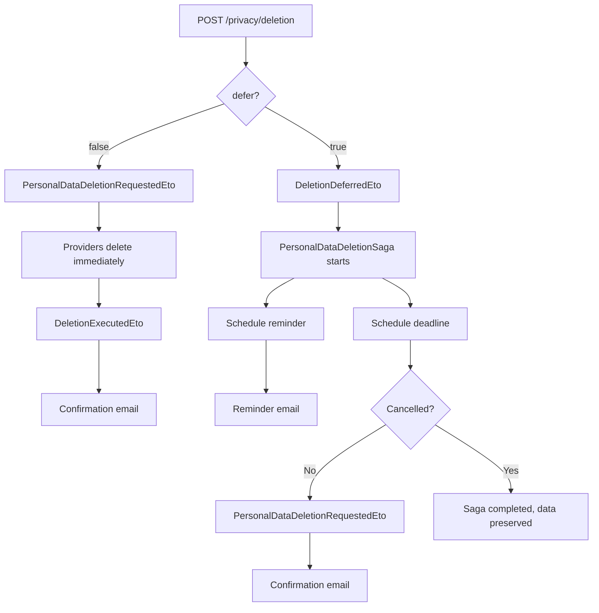

import { Aside, Badge } from "@astrojs/starlight/components";

## Deletion modes

Two modes are supported — **immediate** (default) and **deferred** with an opt-in
cooling-off period:



## Cooling-off period

When the user sets `defer: true`, the deletion is postponed for a configurable
grace period (default from the regulation profile). During this period the user
can cancel via `POST /privacy/deletion/{requestId}/cancel`. A reminder email is
sent a few days before the deadline. A daily safety-net job
(`DeletionDeadlineEnforcerJob`) catches any requests that the saga might have
missed.

## Endpoints

| Method | Route | Operation | Permission |
| ------ | ----- | --------- | ---------- |
| <Badge text="POST" variant="success" /> | `/deletion` | RequestPrivacyDeletion | `Privacy.Deletion.Execute` |
| <Badge text="POST" variant="success" /> | `/deletion/{requestId}/cancel` | CancelPrivacyDeletion | `Privacy.Deletion.Execute` |
| <Badge text="GET" variant="note" /> | `/deletion/{requestId}` | GetPrivacyDeletionStatus | *(owner only)* |
| <Badge text="GET" variant="note" /> | `/deletion` | ListPrivacyDeletions | *(owner only)* |

## Configuration

Grace periods default from the regulation profile. Override globally or per-regulation:

```json
{
  "Privacy": {
    "DefaultGracePeriodDays": 30,
    "MaxGracePeriodDays": 90,
    "ReminderDaysBefore": 3,
    "RegulationOverrides": {
      "BR_LGPD": { "DefaultGracePeriodDays": 15 },
      "US_CCPA": { "DefaultGracePeriodDays": 45, "MaxGracePeriodDays": 90 }
    }
  }
}
```

Applications must provide a tracker implementation for deferred deletion state:

```csharp
privacy.UseDeletionRequestTracker<EfCoreDeletionRequestTracker>();
```

## Notifications

`Granit.Privacy.Notifications` covers the full lifecycle of a deletion request.
Every notification renders against application-provided templates and can use
the `{{ privacy }}` global context to embed the controller / DPO contact.

| Notification name | Trigger | Channels | Severity | Purpose |
| ----------------- | ------- | -------- | -------- | ------- |
| `privacy.deletion_acknowledged` | `PersonalDataDeletionRequestedEto` | Email | `Info` | Receipt acknowledgement (GDPR Art. 12 §3 — paper trail of "without undue delay" response) |
| `privacy.deletion_deferred_confirmed` | `DeletionDeferredEto` | Email | `Info` | Confirms the new scheduled deletion date when the user opts to defer |
| `privacy.deletion_reminder` | `DeletionReminderDueEto` | Email + InApp | `Warning` | J-N reminder before the scheduled deadline so the user can still cancel |
| `privacy.deletion_cancelled` | `DeletionCancelledEto` | Email | `Info` | Confirms revocation of a deferred deletion (data is retained) |
| `privacy.deletion_confirmed` | `DeletionExecutedEto` | Email | `Info` | Final confirmation that the deletion was executed |

The `*_acknowledged`, `*_deferred_confirmed` and `*_cancelled` notifications carry
the `RequestId`, the relevant timestamp(s) and the `Regulation` code so templates
can quote the regulatory deadline directly from the active `PrivacyRegulationProfile`.

## Cascade cleanup for owned entities

Modules that hold user-keyed aggregates participate in the deletion fan-out
by subscribing to `PersonalDataDeletionRequestedEto` and processing every
aggregate where `OwnerId == request.UserId`. The pattern is generic — any
[`IOwnable`](/dotnet/data/ownable/) module can plug in.

Three choices the handler makes:

1. **Action.** What to do with each owned row — `SoftDelete` (trash, then
   the existing retention pipeline finishes the job), `Anonymized` (replace
   identifying fields and reassign ownership to an anonymised user),
   `Retained` (legal hold), or `CryptoShredding` (destroy the per-entity
   encryption key). Report the choice on the `DeletionAction` field of
   the `PersonalDataDeletedEto` audit fragment.
2. **Idempotency.** Re-delivery of the same `PersonalDataDeletionRequestedEto`
   must not double-process rows. Filter at the service layer (e.g. only list
   *active* rows) so already-handled rows naturally drop out.
3. **System anchors.** If the module has aggregates that must survive the
   deletion of any individual user (per-tenant root folders, system queues,
   shared catalog entries), they MUST be filtered at the **service contract**
   level — not by an `if` inside the handler. See the invariant note below.

### Example handler — `Granit.Documents.Privacy`

```csharp
public class DocumentsPersonalDataDeletionHandler
{
    public const string ProviderName = "documents";

    // Wolverine discovers the static HandleAsync and wires DI for the parameters.
    public static async Task HandleAsync(
        PersonalDataDeletionRequestedEto request,
        IDocumentService documents,
        IFolderService folders,
        IDistributedEventBus bus,
        CancellationToken cancellationToken)
    {
        // 1. Enumerate by OwnerId at the service contract — system anchors (here:
        //    the tenant root folder) are excluded by the service itself, not by
        //    a guard inside this handler.
        IReadOnlyList<Guid> folderIds = await folders
            .ListActiveNonRootIdsByOwnerAsync(request.UserId, cancellationToken);

        IReadOnlyList<Guid> documentIds = await documents
            .ListActiveIdsByOwnerAsync(request.UserId, cancellationToken);

        // 2. Idempotency — re-delivery yields 0 active rows once the cascade ran.
        if (folderIds.Count == 0 && documentIds.Count == 0)
        {
            await bus.PublishAsync(new PersonalDataDeletedEto(
                request.RequestId,
                ProviderName,
                DeletionAction.Retained,
                AffectedRecords: 0,
                Details: "no active documents or folders owned by user"), cancellationToken);
            return;
        }

        // 3. Apply the policy — Documents picks SoftDelete (trash); the F9.2
        //    empty-trash job promotes to PermanentlyDeleted after the grace period.
        int trashedFolders = 0;
        foreach (Guid folderId in folderIds)
        {
            if (await folders.TrashAsync(folderId, cancellationToken) is not null)
            {
                trashedFolders++;
            }
        }

        int trashedDocuments = 0;
        foreach (Guid documentId in documentIds)
        {
            if (await documents.TrashAsync(documentId, cancellationToken) is not null)
            {
                trashedDocuments++;
            }
        }

        // 4. Audit ack — DeletionAction.SoftDelete + the count keep the privacy
        //    saga's per-provider receipt ledger accurate.
        await bus.PublishAsync(new PersonalDataDeletedEto(
            request.RequestId,
            ProviderName,
            DeletionAction.SoftDelete,
            AffectedRecords: trashedFolders + trashedDocuments,
            Details: $"trashed {trashedFolders} folder(s) and {trashedDocuments} document(s); tenant root preserved"),
            cancellationToken);
    }
}
```

<Aside type="caution" title="Filter system anchors at the service, not in the handler">
The Documents tenant root folder is owned by the user who created the tenant.
If that user requests deletion, the cascade must skip the root — otherwise the
tenant is left without a navigable filesystem. The temptation is to add an
`if (folder.IsTenantRoot) continue;` inside the handler.

**Don't.** Place the filter on the service contract instead — the
`ListActiveNonRootIdsByOwnerAsync` query above never returns the root.
Two reasons:

- **Robustness.** Other entry points (admin scripts, future bulk-reassign
  flows, archi tests) reuse the same service method and inherit the
  exclusion automatically.
- **Testability.** A handler with a guard is correct only as long as the
  guard exists; a service that never returns the row is correct by
  construction. The unit test is a single assertion against the service,
  not a saga-level integration test.

The same principle applies to any other system-anchor concept — a tenant's
default queue, a "platform" billing account, a baseline taxonomy. Filter at
the boundary, not at the consumer.
</Aside>

### Wiring

Register the handler's module so Wolverine discovers it:

```csharp
builder.Services.AddGranitDocumentsPrivacy();
```

That call is idempotent — multiple modules registering their own privacy
handlers compose naturally; the privacy saga aggregates the
`PersonalDataDeletedEto` acks from all of them and publishes
`DeletionExecutedEto` when every registered provider has replied.

## See also

- [Privacy overview](/dotnet/compliance/privacy/) — module setup and data provider registry
- [Data Export](/dotnet/compliance/privacy/data-export/) — sibling scatter-gather saga
- [Regulations](/dotnet/compliance/privacy/regulations/) — `PrivacyRegulationProfile` driving deadlines
- [Legal Agreements](/dotnet/compliance/privacy/legal-agreements/) — consent records preserved alongside deletion
- [Crypto-shredding](/dotnet/compliance/crypto-shredding/) — GDPR erasure without deleting rows
- [IOwnable](/dotnet/data/ownable/) — marker the cascade keys off of
- [Notifications module](/dotnet/infrastructure/notifications/) — channel that delivers `*_acknowledged`/`*_cancelled`
