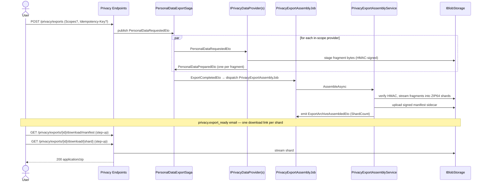
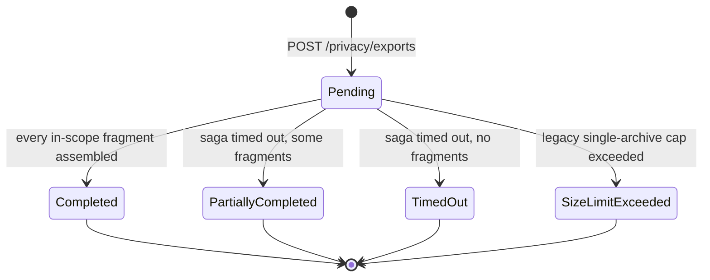

import { Aside, Badge } from "@astrojs/starlight/components";

The framework ships an end-to-end export pipeline. Wire the trackers, opt into
the built-in providers you need, add providers for app-specific data, and
`POST /privacy/exports` → `GET /privacy/exports/{id}/download/{shard}` works out
of the box. See [ADR-021](/dotnet/architecture/adr/021-privacy-data-export-defaults/)
for the original design rationale (note: the assembly stage was re-architected in
the P6 streaming/sharding epic — this page reflects the current shape).

## Pipeline at a glance

A request fans out to every in-scope provider, each of which **streams** one or
more signed fragments to a staging area. The scatter-gather saga collects the
fragment references, then hands assembly to a **background job** that streams the
fragments into one or more ZIP64 shards and uploads a signed manifest sidecar.



## Wiring

```csharp
services.AddGranitPrivacy(privacy => privacy
    .UseEntityFrameworkCoreTrackers()             // EF tracker defaults
    .AddGranitIdentityLocalPrivacyProvider()      // identity-local.json
    .AddGranitAuditingPrivacyProvider()           // auditing.json
    .AddGranitNotificationsPrivacyProvider());    // notifications.json

app.MapGranitPrivacy();                           // request + status + download routes
```

<Aside type="caution" title="Do not also call MapGranitPrivacyExportDownload()">
`MapGranitPrivacy()` now maps the download routes internally. The legacy
`MapGranitPrivacyExportDownload()` extension still exists but registers a
conflicting `GET /exports/{id}/download` — calling both is a duplicate-route
error. Use `MapGranitPrivacy()` alone.
</Aside>

Load modules:

```csharp
[DependsOn(
    typeof(GranitPrivacyEntityFrameworkCoreModule),
    typeof(GranitPrivacyBlobStorageModule),
    typeof(GranitPrivacyBackgroundJobsModule),          // PrivacyExportAssemblyJob
    typeof(GranitPrivacyBackgroundJobsWolverineModule), // assembly retry policy (Wolverine host)
    typeof(GranitIdentityLocalPrivacyModule),
    typeof(GranitAuditingPrivacyModule),
    typeof(GranitNotificationsPrivacyModule))]
public class MyAppModule : GranitModule { }
```

<Aside type="tip">
`UseEntityFrameworkCoreTrackers()` adds `privacy_export_requests`,
`privacy_deletion_requests`, and the `export_assembly_checkpoints` table
(crash-resume) to `PrivacyDbContext`. Run
`dotnet ef migrations add AddPrivacyTrackers` against the registered
`PrivacyDbContext` to generate the schema. Apps that keep privacy entities on
their own DbContext use `UseEntityFrameworkCoreTrackers<TContext>()` after
`modelBuilder.ConfigurePrivacyModule()`.
</Aside>

## Built-in providers

| Module | Provider name | Package | Fragment | Cap |
| ------ | ------------- | ------- | -------- | --- |
| `Identity.Local` | `identity-local` | `Granit.Identity.Local.Privacy` | Profile + roles | — |
| `Identity.Federated` | `identity-federated` | `Granit.Identity.Federated.Privacy` | Local cache entry (profile mirror + sync metadata) | — |
| `Auditing` | `auditing` | `Granit.Auditing.Privacy` | User-authored audit trail | 10 000 entries |
| `Notifications` | `notifications` | `Granit.Notifications.Privacy` | Inbox + preferences + subscriptions | 5 000 inbox items |
| `Notifications.MobilePush` | `notifications-mobile-push` | `Granit.Notifications.MobilePush.Privacy` | Device token registrations (tokens masked, e.g. `…1234`) | — |
| `Notifications.WebPush` | `notifications-web-push` | `Granit.Notifications.WebPush.Privacy` | Web Push subscriptions (endpoint origin only, keys never exported) | — |

Providers yield an empty enumerable when the subject has no data — the framework
records the provider in `manifest.emptyProviders` without writing a fragment.

<Aside type="note" title="Presence is not exported by design">
`Granit.Presence` ships **no** export provider. The module stores only the
current manual override (`ManualStatus`, `OverrideUntilUtc`) and a 90 s
auto-expiring cache heartbeat — no history, no behavioural log. The data is
trivial, user-declared, and carries no inference risk, so Art. 15 disclosure
adds no value. The right-to-erasure obligation is met by the Identity
integration which purges the row and cache entry on `UserDeletedEto`.
</Aside>

## The provider contract

A provider declares its identity statically and **streams** fragments. Two
fragment kinds exist:

- `StagedExportFragment` — transient content (JSON from Identity, Auditing,
  Notifications) uploaded to a staging container.
- `PassThroughExportFragment` — bytes that already live in another container
  (e.g. `Documents` binaries); the assembler streams them straight into the ZIP
  with no staging round-trip.

```csharp
public interface IPrivacyDataProvider
{
    static abstract string ProviderName { get; }   // saga + scope addressing
    static abstract string DisplayKey { get; }      // localised scope-selector label
    static abstract string? FeatureName { get; }    // null = always visible

    // Cheap presence probe for the scope selector (count-style, < 50 ms).
    ValueTask<bool> HasDataAsync(PrivacyExportContext context, CancellationToken ct);

    // Streamed fragments — each signed by the framework before assembly.
    IAsyncEnumerable<ExportFragment> ExportAsync(PrivacyExportContext context, CancellationToken ct);
}
```

`PrivacyExportContext` carries `RequestId`, `SubjectUserId`, `CallerUserId`
(equal to the subject for self-service; different for admin DSR), `TenantId`
(`Guid?`), and `Regulation`.

<Aside type="caution" title="Migration from the pre-P6 contract">
The previous shape `Task<ReadOnlyMemory<byte>> ExportAsync(Guid userId, CancellationToken)`
with static `ContentType` / `FileName(Guid)` members has been removed. Providers
now stream `ExportFragment` values and declare `DisplayKey` / `FeatureName`
instead. The single in-memory buffer it imposed could not support blob-backed
modules (Documents, attachments) — those now yield `PassThroughExportFragment`.
</Aside>

## Writing a custom provider

Lightweight providers use `IStagedFragmentBuilder.BuildJsonAsync` — it serialises
the DTO, uploads it to the staging container, and signs the integrity tag, so the
provider never touches HMAC or upload plumbing. Ship a one-line Wolverine handler
next to the provider so the uploader iterates its fragments.

```csharp
public sealed class MedicalRecordPrivacyDataProvider(
    IMedicalRecordReader reader,
    IStagedFragmentBuilder fragmentBuilder) : IPrivacyDataProvider
{
    public static string ProviderName => "playground-medical";
    public static string DisplayKey => "Privacy.Scopes.Medical";
    public static string? FeatureName => null;   // always visible in the scope selector

    public async ValueTask<bool> HasDataAsync(PrivacyExportContext context, CancellationToken ct) =>
        await reader.HasRecordsAsync(context.SubjectUserId, ct).ConfigureAwait(false);

    public async IAsyncEnumerable<ExportFragment> ExportAsync(
        PrivacyExportContext context,
        [EnumeratorCancellation] CancellationToken ct)
    {
        IReadOnlyList<MedicalRecord> records = await reader
            .GetByPatientAsync(context.SubjectUserId, ct).ConfigureAwait(false);
        if (records.Count == 0)
            yield break;   // recorded as an empty provider in the manifest

        yield return await fragmentBuilder
            .BuildJsonAsync(context, ProviderName, "medical-records.json", records, ct)
            .ConfigureAwait(false);
    }
}

public class MedicalRecordPersonalDataExportHandler
{
    public static Task HandleAsync(
        PersonalDataRequestedEto request,
        MedicalRecordPrivacyDataProvider provider,
        PrivacyFragmentUploader uploader,
        CancellationToken ct) =>
        uploader.UploadAsync(request, provider, ct);
}
```

Register with:

```csharp
services.AddGranitPrivacy(privacy => privacy
    .AddDataProvider<MedicalRecordPrivacyDataProvider>());
```

<Aside type="caution">
The framework's architecture test enforces that every non-abstract
`IPrivacyDataProvider` has a matching `*PersonalDataExportHandler` in the same
assembly, and that `DisplayKey` resolves in all 18 framework cultures. Without
the handler pairing the saga registers the provider but never receives a
fragment — the export times out silently at `ExportTimeoutMinutes`.
</Aside>

## Endpoints

| Method | Route | Operation | Permission |
| ------ | ----- | --------- | ---------- |
| <Badge text="GET" variant="note" /> | `/privacy/exports/scopes` | ListPrivacyExportScopes | `Privacy.Exports.Execute` |
| <Badge text="POST" variant="success" /> | `/privacy/exports` | RequestPrivacyExport | `Privacy.Exports.Execute` |
| <Badge text="POST" variant="success" /> | `/privacy/exports/on-behalf-of` | RequestPrivacyExportOnBehalfOf | `Privacy.Exports.ExecuteOnBehalfOf` |
| <Badge text="GET" variant="note" /> | `/privacy/exports/{id}` | GetPrivacyExportStatus | *(subject; or the operator who filed it)* |
| <Badge text="GET" variant="note" /> | `/privacy/exports` | ListPrivacyExports | *(subject only)* |
| <Badge text="GET" variant="note" /> | `/privacy/exports/{id}/download/manifest` | DownloadPrivacyExportManifest | `Privacy.Exports.Execute` + step-up |
| <Badge text="GET" variant="note" /> | `/privacy/exports/{id}/download/{shardIndex}` | DownloadPrivacyExportShard | `Privacy.Exports.Execute` + step-up |
| <Badge text="GET" variant="note" /> | `/privacy/exports/{id}/download` | DownloadPrivacyExport | `Privacy.Exports.Execute` + step-up |

- **`POST /privacy/exports`** returns `202 Accepted`. An optional `Scopes[]` body
  narrows the export to specific provider scopes (discover them via
  `GET /privacy/exports/scopes`); omitting it exports everything visible to the
  subject. The endpoint is rate-limited (policy `privacy-export-create`) and
  honours an optional `Idempotency-Key` header so a double-submit returns the
  original request instead of starting a second export.
- **`POST /privacy/exports/on-behalf-of`** is the admin DSR path — a DPO or
  support operator filing an export for another data subject. It carries its own
  permission (`Privacy.Exports.ExecuteOnBehalfOf`) and rate-limit policy
  (`privacy-export-create-on-behalf-of`) so it never shares the self-service
  quota. An unknown subject returns `404`.
- **Download** is a streamed response (not a `302` redirect). The compat
  `/download` route streams the single shard when there is one, or the manifest
  when sharded; for deterministic multi-shard downloads, read the manifest then
  fetch each `/download/{shardIndex}`. Step-up authentication is required by
  default (see below) — a long-lived session cookie alone must not release a
  full personal-data archive.

### Step-up authentication on download

The download endpoints require a recent re-authentication. When the OIDC
`auth_time` claim is older than `Privacy:Endpoints:DownloadStepUpMaxAge` (default
5 min), the endpoint returns `401` with `WWW-Authenticate: Bearer error="step_up"`
so an OIDC-aware BFF can refresh the session transparently and retry. Hosts
behind a hardware-token wall can disable it via
`Privacy:Endpoints:DownloadStepUpRequired = false`.

## Archive layout

The assembler produces **one or more ZIP64 shards** plus a **separate signed, encrypted
manifest sidecar** (the manifest is its own blob, not an entry inside the ZIP):

```text
personal-data-export/{requestId}-000.zip           ← shard 0
personal-data-export/{requestId}-001.zip           ← shard 1 (rollover at ExportShardMaxSizeMb)
personal-data-export-{requestId}-manifest.json.enc ← signed + AES-256-GCM-encrypted manifest sidecar
```

The sidecar carries the `.enc` extension and `application/octet-stream` content type because
it is stored as ciphertext (see [Signed manifest](#signed-manifest)), not as readable JSON.

Each shard rolls over at `ExportShardMaxSizeMb` (default 2 GB). A single entry
larger than the cap lands alone in its own shard (ZIP64 covers it) rather than
being split. Entry paths inside a shard are the sanitized relative paths the
providers chose (e.g. `Documents/2024/foo.pdf`), and compression mode is chosen
by content type (already-compressed types are stored, not re-deflated).

## Signed manifest

The manifest sidecar is a two-property envelope — `payload` (the canonical
manifest) and `integrityTag` (HMAC-SHA256 over the payload bytes):

```json
{
  "payload": {
    "schemaVersion": 1,
    "requestId": "…", "userId": "…", "regulation": "EU_GDPR",
    "requestedAt": "…", "completedAt": "…",
    "isPartial": false,
    "missingProviders": [],
    "emptyProviders": ["notifications"],
    "shards": [
      { "index": 0, "objectKey": "personal-data-export/…-000.zip",
        "compressedSizeBytes": 12345, "sha256": "<hex>" }
    ],
    "fragments": [
      { "providerName": "identity-local", "fileName": "identity-local.json",
        "contentType": "application/json", "blobReferenceId": "…" }
    ]
  },
  "integrityTag": "v1:<base64url-hmac>"
}
```

Every fragment is HMAC-signed when produced; the assembler verifies the tag
before opening the source blob and routes unsigned or tampered fragments to the
dead-letter queue rather than into the archive — a fragment that references a
blob the subject does not own cannot be assembled without a valid signature.
`sha256` is empty for shards that were resumed after a crash (recomputing the
digest would require re-streaming the committed shard).

### Encrypted at rest (GDPR Art. 32)

The completed manifest is a full copy of the subject's personal-data index, so the
signed envelope shown above is **not** stored as plaintext JSON. Before upload the
assembler wraps it with `IExportContentEncryptor` — AES-256-GCM in the framework default
— and stores the ciphertext as `…-manifest.json.enc` (`application/octet-stream`). The
ciphertext is self-describing: `[12-byte nonce][16-byte GCM tag][ciphertext]`, so no
external nonce store is needed.

GCM's authenticated tag makes the sidecar tamper-evident: a flipped byte fails on decrypt
*before* any plaintext is exposed, and the HMAC `integrityTag` stays sealed inside the
ciphertext for defence in depth. The download endpoint decrypts server-side behind the
existing subject-identity + [step-up gate](#step-up-authentication-on-download) and streams
plaintext to the subject over the authenticated BFF channel — the export key never reaches
the client.

`IExportContentEncryptor` is the confidentiality companion to the `IExportContentSigner`
integrity primitive and shares its key lifecycle: the in-memory default generates an
ephemeral per-process key and is fail-closed outside `Development`; production hosts
register a Vault-backed implementation.

<Aside type="caution" title="Production needs a durable signer AND encryptor">
Both the default `IExportContentSigner` and the default `IExportContentEncryptor`
generate a per-process key and are **development-only** — Staging and Production refuse
to boot with either, via two independent startup guards
(`EphemeralExportHmacSignerStartupGuard` and `EphemeralExportContentEncryptorStartupGuard`).
An ephemeral encryptor key would make a SAR package undecryptable after a restart or on
another replica.

`Granit.Privacy.Vault` supplies the Vault-backed **signer** (`VaultExportHmacSigner`) — see
[Export Signing](/dotnet/compliance/privacy/export-signing/). It does **not** yet ship a
Vault-backed **encryptor**: register your own `IExportContentEncryptor` whose key lives in
your vault (mirror the signer's key lifecycle) so both guards accept the boot.
</Aside>

## Configuration

```json
{
  "Privacy": {
    "ExportTimeoutMinutes": 5,
    "ExportMaxSizeMb": 100,
    "ExportShardMaxSizeMb": 2048,
    "ArchiveAssemblyDownloadUrlExpiryMinutes": 15,
    "RegulationOverrides": {
      "BR_LGPD": { "ExportTimeoutMinutes": 3 }
    }
  },
  "Privacy:Endpoints": {
    "DownloadStepUpRequired": true,
    "DownloadStepUpMaxAge": "00:05:00"
  }
}
```

| Option | Default | Purpose |
| ------ | ------- | ------- |
| `Privacy:ExportTimeoutMinutes` | 5 | Saga timeout — providers must emit their fragments within this window or the export is marked `PartiallyCompleted` / `TimedOut`. |
| `Privacy:ExportShardMaxSizeMb` | 2048 | Compressed bytes per shard before the assembler rolls over to a new ZIP. |
| `Privacy:ExportMaxSizeMb` | 100 | **Legacy** single-archive cap, honoured only by the staging-fragment flow; the sharded assembler is bounded per-shard instead. |
| `Privacy:ArchiveAssemblyDownloadUrlExpiryMinutes` | 15 | TTL of the presigned URLs the assembler uses to fetch each fragment. |
| `Privacy:Endpoints:DownloadStepUpRequired` | `true` | Require a recent `auth_time` on the download endpoints. |
| `Privacy:Endpoints:DownloadStepUpMaxAge` | `00:05:00` | Maximum age of the OIDC `auth_time` claim accepted by the download endpoints. |

Rate-limit policy **names** are framework-owned; wire their bodies under
`RateLimiting:Policies:{name}`: `privacy-export-create` (recommended: 1 export
per subject per 24 h) and `privacy-export-create-on-behalf-of` (sized for
support-desk throughput, partitioned by operator).

## Request lifecycle



`SizeLimitExceeded` belongs to the legacy single-archive path; the sharded
assembler rolls over shards instead of aborting, so it resolves to `Completed`
or `PartiallyCompleted`.

## Crash-resume and retries

Assembly runs as a Wolverine background job. `Granit.Privacy.BackgroundJobs.Wolverine`
wires a retry-with-cooldown policy: a transient `PrivacyExportAssemblyException`
retries at **1 min / 5 min / 15 min** before the message moves to the
dead-letter queue. Non-transient failures (a forged HMAC, a malformed event) are
not wrapped and go straight to the DLQ without burning retry budget. The EF
`export_assembly_checkpoints` table records the last committed shard so a retry
resumes past it rather than re-streaming every fragment from zero.

## Notifications

`Granit.Privacy.Notifications` ships two outcome notifications. They subscribe to
**different events** so the success email never fires before the shards exist in
storage.

| Notification name | Trigger | Channels | Severity | Carried payload |
| ----------------- | ------- | -------- | -------- | --------------- |
| `privacy.export_ready` | `ExportArchiveAssembledEto` (all shards + manifest persisted) | Email | `Success` | `RequestId`, `ShardCount`, `RequestedAt`, `Regulation` |
| `privacy.export_failed` | `ExportCompletedEto` with `IsPartial = true` | Email + InApp | `Warning` | `RequestId`, `ArchiveBlobReferenceId`, `MissingProviders`, `RequestedAt`, `Regulation` |

The "ready" template iterates `0..(ShardCount - 1)` to render **one download link
per shard** (`…/privacy/exports/{requestId}/download/{index}`); there is no single
presigned URL. The "failed" payload exposes `MissingProvidersDisplay` so templates
can tell the user which categories of data did not make the partial archive. Both
branches lean on the `{{ privacy }}` template global for the controller and DPO
contact.

## Export audit trail (ROPA)

`Granit.Privacy.Auditing` is an optional bridge that records the export lifecycle
to `Granit.Auditing` for GDPR Art. 30 (Records of Processing Activities) and
ISO 27001 A.5.34 evidence. Loading `GranitPrivacyAuditingModule` replaces the
default no-op `NullPrivacyExportAuditWriter` with a writer that persists each
lifecycle phase — requested, fragment-prepared, assembly-started, shard-completed,
completed, shard-downloaded, failed — as a `DataAccess` audit row. Payloads are
deliberately narrow (no entry paths, no blob references, IP pseudonymised) so the
audit trail proves *who exported what, when* without re-storing the personal data.

```csharp
[DependsOn(typeof(GranitPrivacyAuditingModule))]   // wires the export → audit writer
public class MyAppModule : GranitModule { }
```

## See also

- [Privacy overview](/dotnet/compliance/privacy/) — module setup and data provider registry
- [Export Signing](/dotnet/compliance/privacy/export-signing/) — vault-backed HMAC signer for fragments and the manifest
- [Data Deletion](/dotnet/compliance/privacy/data-deletion/) — sibling deletion saga
- [Regulations](/dotnet/compliance/privacy/regulations/) — `PrivacyRegulationProfile` driving deadlines and copy
- [Processing Purposes](/dotnet/compliance/privacy/processing-purposes/) — legal basis tied to exported data categories
- [Blob storage](/dotnet/data/blob-storage/) — where the export shards land
- [Audit log](/dotnet/compliance/audit-log/) — the ROPA sink behind `Granit.Privacy.Auditing`
- [Notifications module](/dotnet/infrastructure/notifications/) — channel that delivers the download links
