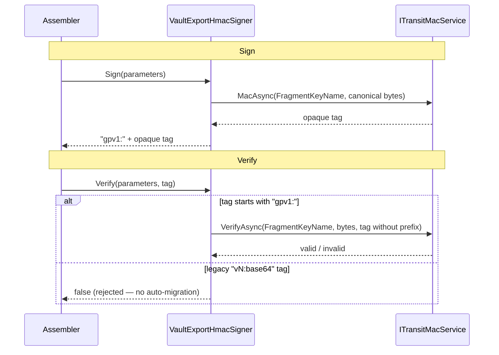

import { Aside, CardGrid, LinkCard, Steps } from "@astrojs/starlight/components";

Every fragment and manifest in the [data-export pipeline](/dotnet/compliance/privacy/data-export/)
carries an HMAC integrity tag. The assembler verifies that tag **before** it opens
the source blob, so a buggy provider — or an attacker — cannot make the archive
reference a blob the subject does not own, and a downloaded manifest can be proven
untampered. This page covers the signer behind those tags and how to take it to
production.

## Two signing surfaces

The pipeline signs two different things, so there are two interfaces — both
backed by the same key material but kept separate to prevent a fragment tag from
ever validating against manifest bytes (or vice versa).

| Interface | Signs | Used by |
| --------- | ----- | ------- |
| `IExportHmacSigner` | Fragment **identity tuples** (request id, subject, provider, kind, source blob, entry path, expiry) | Every provider, when a fragment is produced |
| `IExportContentSigner` | Arbitrary **byte payloads** — the manifest sidecar | The assembly job, when sealing the manifest |

```csharp
public interface IExportHmacSigner
{
    string Sign(in ExportHmacParameters parameters);
    bool   Verify(in ExportHmacParameters parameters, string tag);
}

public interface IExportContentSigner
{
    string SignBytes(ReadOnlySpan<byte> payload);
    bool   VerifyBytes(ReadOnlySpan<byte> payload, string tag);
}
```

`ExportHmacParameters` is canonicalized in declaration order before signing, and
fragment tags bind an `ExpiresAt` so a captured tag cannot be replayed after the
export window closes.

## The default is development-only

`Granit.Privacy.BlobStorage` registers `EphemeralExportHmacSigner` as the default
implementation of both interfaces. It generates a fresh 256-bit key **on every
process start** (logged as a warning). That is fine for a single local process
and useless for anything else: a shard signed by one replica fails verification
in the next, and a restart invalidates every in-flight export.

To stop that reaching production, `Granit.Privacy.BlobStorage` ships a fail-fast
**startup guard**:

<Aside type="danger" title="Boot refused outside Development">
`EphemeralExportHmacSignerStartupGuard` aborts host startup in any non-`Development`
environment while the resolved `IExportHmacSigner` is still the ephemeral default.
You cannot accidentally ship the per-process key — Staging and Production refuse
to boot until a shared-state signer is registered.
</Aside>

## `Granit.Privacy.Vault` — the production signer

`Granit.Privacy.Vault` provides `VaultExportHmacSigner`, which implements both
interfaces by delegating to whichever
[`ITransitMacService`](/dotnet/data/vault/transit-mac/) the host registered. The
key lives in the vault, survives restarts, and is shared across replicas — so the
startup guard accepts the boot.

```bash
dotnet add package Granit.Privacy.Vault
```

<Steps>

1. **Install one Vault provider** — it registers `ITransitMacService`:

   ```csharp
   context.Services.AddGranitVaultHashiCorp();
   // or AddGranitVaultAws() / AddGranitVaultGoogleCloud() / Azure Managed HSM,
   // or AddGranitSecretBackedMacService(...) for Azure Standard tier.
   ```

2. **Wire the export signer** with two distinct key names:

   ```csharp
   context.Services.AddGranitPrivacyVaultExportSigner(o =>
   {
       o.FragmentKeyName = "granit-privacy-export-fragment-mac";
       o.ContentKeyName  = "granit-privacy-export-content-mac";
   });
   ```

   Or load the module, which calls the same extension:

   ```csharp
   [DependsOn(typeof(GranitPrivacyVaultModule))]
   public class MyAppModule : GranitModule { }
   ```

</Steps>

The extension uses `services.Replace` (not `TryAdd`) because the BlobStorage
package always registers the ephemeral signer — call it **after**
`AddGranitPrivacyBlobStorage()` so the vault-backed signer wins.

<Aside type="note" title="Why two keys?">
`FragmentKeyName` signs fragment-identity tuples; `ContentKeyName` signs manifest
payload bytes. Splitting the signing material across two keys is a usage-separation
hygiene control (ISO 27001 A.10.1) — identity tags and arbitrary content payloads
should never share a key, so a compromise or rotation of one never touches the
other.
</Aside>

## Tag format and cutover

`VaultExportHmacSigner` wraps the provider's opaque tag in a framework prefix:

```text
gpv1:{providerOpaqueTag}
```

On verify, the `gpv1:` prefix is stripped before the remainder is handed to the
underlying `ITransitMacService`. This makes the cutover explicit:



<Aside type="caution" title="No automatic migration window">
Tags produced by the legacy `EphemeralExportHmacSigner` (`vN:base64`) are
**rejected** by `VaultExportHmacSigner` — there is no dual-read migration window.
Drain in-flight exports before swapping signers, otherwise an export signed by the
old signer fails verification cleanly (a failed download) rather than corrupting
silently. Because the ephemeral key was per-process and dev-only, there are no
durable legacy tags to migrate in any real deployment.
</Aside>

## Picking the MAC backend

`Granit.Privacy.Vault` depends only on the `Granit.Vault` abstractions — the
actual MAC backend is whichever provider module the host installs:

| Host platform | Register | MAC primitive |
| ------------- | -------- | ------------- |
| HashiCorp Vault | `AddGranitVaultHashiCorp()` | Transit HMAC |
| AWS | `AddGranitVaultAws()` | KMS `GenerateMac` / `VerifyMac` |
| GCP | `AddGranitVaultGoogleCloud()` | Cloud KMS `MacSign` / `MacVerify` |
| Azure (Managed HSM, premium) | `AddGranitVaultAzureManagedHsmMac()` | `HS256` on `oct-HSM` |
| Azure (Standard tier) / portable | `AddGranitSecretBackedMacService(...)` | local HMAC over a pulled key |

See [Vault-backed MAC](/dotnet/data/vault/transit-mac/) for the provider matrix,
rotation window semantics, and the trust-boundary trade-off of the portable
fallback.

## See also

<CardGrid>
  <LinkCard title="Personal Data Export" href="/dotnet/compliance/privacy/data-export/" description="The pipeline whose fragments and manifest these tags protect." />
  <LinkCard title="Vault-backed MAC" href="/dotnet/data/vault/transit-mac/" description="ITransitMacService — the primitive VaultExportHmacSigner delegates to." />
  <LinkCard title="Vault providers" href="/dotnet/data/vault/providers/" description="Auth and per-provider MAC configuration for all four backends." />
  <LinkCard title="Privacy overview" href="/dotnet/compliance/privacy/" description="Module setup and the data-provider registry." />
</CardGrid>
