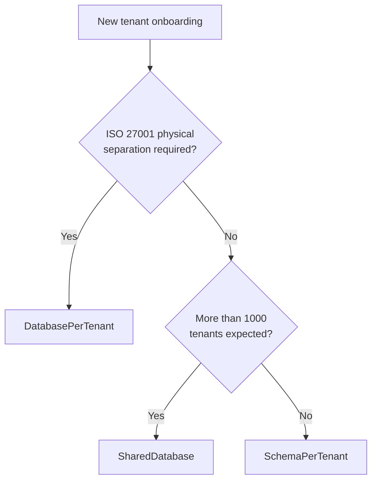

import { Tabs, TabItem } from "@astrojs/starlight/components";

## The problem

SaaS applications serve multiple organizations from a single deployment.
Without framework support, every repository method ends up with
`WHERE TenantId = @tenantId` scattered across the codebase. Miss one filter
and you leak data between tenants — a GDPR incident waiting to happen.

Granit solves this with **transparent tenant isolation**: the framework resolves
the current tenant, stores it in an async-safe context, and automatically
appends query filters to every EF Core query. Application code never writes
a tenant WHERE clause.

## Tenant resolution

The middleware pipeline resolves the tenant identity on every request.
Four built-in resolvers run in priority order — **first match wins**:

| Order | Resolver | Source | Use case |
|-------|----------|--------|----------|
| 50 | `DomainTenantResolver` | Subdomain → `ITenantReader` | SaaS branded URLs (`acme.monsaas.com`) |
| 100 | `HeaderTenantResolver` | `X-Tenant-Id` header | Service-to-service calls, API gateways |
| 200 | `JwtClaimTenantResolver` | `tenant_id` JWT claim | End-user requests via Keycloak |
| 300 | `QueryStringTenantResolver` | `?__tenant={guid}` | Development and debugging |

The domain resolver uses a configurable template (`{0}.monsaas.com`) and resolves
the identifier via `ITenantReader.FindByIdentifierAsync()`. The query string
resolver is a dev/debug fallback — disable in production by setting
`QueryStringParamName` to `null`.

### Custom resolvers

Implement `ITenantResolver` to add your own resolution logic (e.g., cookie-based).
Register in DI — the pipeline auto-discovers all implementations:

```csharp
services.AddScoped<ITenantResolver, CookieTenantResolver>();
```

## Async-safe tenant context

`ICurrentTenant` is backed by `AsyncLocal<T>`. This means:

- The tenant context **propagates** through `async`/`await` calls automatically.
- Parallel tasks (`Task.WhenAll`, `Parallel.ForEachAsync`) each get their own
  isolated copy — no cross-contamination.
- Background jobs must explicitly set the tenant context before executing
  tenant-scoped work.

```csharp
public class InvoiceService(ICurrentTenant currentTenant)
{
    public void PrintCurrentTenant()
    {
        if (!currentTenant.IsAvailable)
        {
            // No tenant context — running in a host-level scope
            return;
        }

        var tenantId = currentTenant.Id; // Guid
    }
}
```

:::caution[Warning]
Always check `ICurrentTenant.IsAvailable` before using `Id`.
`NullTenantContext` (`IsAvailable = false`) is the normal state when
multi-tenancy is not installed. Accessing `Id` without checking throws
`InvalidOperationException`.
:::

## Isolation strategies

Granit supports three isolation strategies. You choose per deployment — or
mix them dynamically for different tenant tiers.

### 1. SharedDatabase

All tenants share one database. Isolation is purely logical via
`WHERE TenantId = @id` query filters.

- Simplest to operate and migrate.
- Scales to **1 000+ tenants** without connection pool pressure.
- Single backup/restore covers all tenants.
- Not suitable when regulations require physical data separation.

### 2. SchemaPerTenant

Each tenant gets its own PostgreSQL schema within a shared database.
Tables are identical, but isolated at the schema level.

- Practical limit: **~1 000 tenants** (PostgreSQL catalog overhead).
- Per-tenant backup possible via `pg_dump --schema`.
- Migrations must run per schema — Granit handles this automatically.

### 3. DatabasePerTenant

Each tenant gets a dedicated database. Full physical separation.

- Required for **ISO 27001** when the client demands physical isolation.
- Practical limit: **~200 tenants** with PgBouncer connection pooling.
- Independent backup, restore, and retention policies per tenant.
- Highest operational cost.

### Decision matrix



### Dynamic strategy

Premium and standard tenants can coexist in the same deployment.
Configure the strategy per tenant in the tenant registry:

```csharp
public class Tenant
{
    public Guid Id { get; set; }
    public string Name { get; set; } = string.Empty;
    public TenantIsolationStrategy Strategy { get; set; }
    public string? ConnectionString { get; set; } // For DatabasePerTenant
    public string? Schema { get; set; }            // For SchemaPerTenant
}
```

Resolution is split across three focused contracts in
`Granit.Persistence.EntityFrameworkCore.MultiTenancy` — one per question the
runtime needs answered, so a host on a single strategy only implements what it
actually uses:

```csharp
public interface ITenantIsolationStrategyProvider
{
    ValueTask<TenantIsolationStrategy> GetStrategyAsync(
        Guid? tenantId, CancellationToken cancellationToken = default);
}

public interface ITenantConnectionStringProvider
{
    Task<string> GetConnectionStringAsync(
        Guid tenantId, CancellationToken cancellationToken = default);
}

public interface ITenantSchemaProvider
{
    ValueTask<string> GetSchemaNameAsync(
        Guid tenantId, CancellationToken cancellationToken = default);
}
```

`TenantIsolationStrategy` has three members: `SharedDatabase`,
`DatabasePerTenant`, and `SchemaPerTenant`. `AddGranitIsolatedDbContext` asks
the strategy provider first, then calls the connection-string provider (for
`DatabasePerTenant`) or the schema provider (for `SchemaPerTenant`).

A host override replaces the default registration:

```csharp
services.AddSingleton<ITenantConnectionStringProvider, VaultTenantConnectionStringProvider>();
```

:::note[Good to know]
The providers are called once per request scope and the result is cached for the
duration of the scope. `SchemaPerTenant` does **not** rewrite the EF model: the
schema is switched on the connection by `ITenantSchemaActivator` — on PostgreSQL
that is `SET search_path`, executed **unconditionally on every activation**.
Pooled connections retain the previous tenant's schema, so skipping the switch
would be a cross-tenant data breach; the contract mandates it rather than
optimising it away.
:::

## Transparent query filters

When your `DbContext` derives from `GranitDbContext`, the framework
automatically registers a named `HasQueryFilter` for every entity
implementing `IMultiTenant`:

```sql
-- Generated by EF Core query filter, not written by hand
WHERE "t"."TenantId" = @__currentTenant_Id
```

Each applicable interface (`ISoftDeletable`, `IActive`, `IPublishable`,
`IProcessingRestrictable`, `IHasMergeTombstone`) gets its own **named** filter,
and EF Core combines them as AND conditions. You never write manual
`HasQueryFilter` calls — the conventions pass owns them, and a manual filter
would collide with the named keys.

:::note[Good to know]
Manual `HasQueryFilter` calls conflict with the framework's auto-applied
filters. EF Core 10 supports several **named** filters per entity, but an
unnamed `HasQueryFilter(expr)` silently **replaces** them all. Let the
conventions pass own every query filter, and bypass individual ones with
`IgnoreQueryFilters([GranitFilterNames.SoftDelete])`.
:::

## Implementing a multi-tenant entity

Entities opt into tenant isolation by implementing `IMultiTenant`:

```csharp
using Granit.Domain;
using Granit.MultiTenancy;

public class Invoice : AggregateRoot, IMultiTenant
{
    public Guid? TenantId { get; set; }
    public string Number { get; set; } = string.Empty;
    public decimal Amount { get; set; }
    public DateTimeOffset IssuedAt { get; set; }
}
```

:::caution[Warning]
`TenantId` must be `Guid?` (nullable), never `string`. The interface contract
in `Granit.Domain` enforces this. Non-nullable `Guid` will fail the
architecture tests.
:::

## Soft dependency rule

Granit modules that need to read `ICurrentTenant` should reference
`Granit.MultiTenancy` — **not** `Granit.MultiTenancy`. There is no need
to add `[DependsOn(typeof(GranitMultiTenancyModule))]` or a
`<ProjectReference>` to the `Granit.MultiTenancy` package.

A `NullTenantContext` is registered by default in every Granit application.
It returns `IsAvailable = false` and acts as the null object when
multi-tenancy is not installed.

Hard dependency on `Granit.MultiTenancy` is allowed **only** when a module
must enforce strict tenant isolation (e.g., `Granit.BlobStorage` throws if
no tenant context exists — required for GDPR data segregation).

```csharp
// Correct — soft dependency via Granit
using Granit.MultiTenancy;

public class ReportService(ICurrentTenant currentTenant)
{
    public async Task<Report> GenerateAsync(CancellationToken cancellationToken)
    {
        if (currentTenant.IsAvailable)
        {
            // Tenant-scoped logic
        }

        // Host-level fallback
        // ...
    }
}
```

## Host vs Tenant side — the `MultiTenancySides` enum

Multi-tenant applications expose two distinct admin surfaces: the **host** plane
(platform operators creating tenants, viewing cross-tenant usage, paying for the
infrastructure) and the **tenant** plane (a tenant's own admins managing their
workspace). The same controller wired to both contexts would leak data; refusing to
share any building blocks would force every endpoint to be written twice.

Granit's answer is a single `[Flags]` enum, `MultiTenancySides`, declared in the
foundation `Granit` assembly:

```csharp
[Flags]
public enum MultiTenancySides
{
    Host   = 1 << 0,  // No tenant context active (cross-tenant operations)
    Tenant = 1 << 1,  // A tenant context is active (per-tenant operations)
    Both   = Host | Tenant,
}
```

Every permission declaration carries a side. A `Host`-scoped permission can only be
checked when `ICurrentTenant.IsAvailable` is `false`; a `Tenant`-scoped permission is
only grantable inside an active tenant context. `Both` is for cross-side primitives
(e.g. `Users.Read` in a self-service profile page).

```csharp
// In a permission definition provider
group.AddPermission(
    BillingPermissions.Administration.Read,
    LocalizableString.Create(...),
    MultiTenancySides.Host);  // Only platform admins, never tenant users
```

The same enum drives BFF frontend scoping (`BffFrontendOptions.MultiTenancySide`),
OData host-feed validation
([ADR-050](/dotnet/architecture/adr/050-odata-edm-whitelist-via-entity-definition/);
`MapGranitODataHostEndpoints` refuses non-host permissions), and authorization
test harnesses. Because the enum lives in `Granit` (not `Granit.MultiTenancy`),
declaring side-scoped permissions doesn't pull a runtime dependency on the
multi-tenancy module — the framework filters gracefully when no tenant context
provider is registered.

## Automatic tenant provisioning

When a tenant is created at runtime, the framework automatically provisions its
database resources. `Granit.MultiTenancy.Provisioning` provides a handler that listens
to `TenantCreatedEvent` and delegates to `ITenantProvisioner`, which discovers all
isolated DbContexts, creates schemas, runs migrations, and seeds tenant data.

No application code is needed — install the package, add the module dependency,
and tenant provisioning works out of the box. See
[Automatic Tenant Provisioning](/dotnet/infrastructure/multi-tenancy/isolation/#automatic-tenant-provisioning)
for the full reference.

## Further reading

- [Multi-Tenancy reference](/dotnet/infrastructure/multi-tenancy/) — overview,
  resolvers, isolation strategies, cache isolation, host/tenant separation
- [Configure multi-tenancy](/dotnet/guides/configure-multi-tenancy/) — step-by-step
  setup guide
- [Persistence concept](/dotnet/concepts/persistence/) — how query filters and interceptors
  integrate with tenant isolation
