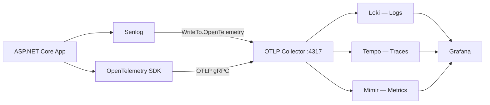

import { Tabs, TabItem } from "@astrojs/starlight/components";

Granit.Observability wires Serilog structured logging and OpenTelemetry (traces + metrics)
into a single `AddGranitObservability()` call. Logs ship to Loki, traces to Tempo, and
metrics to Mimir — all via an OTLP collector.

## Packages

| Package | Role | Depends on |
| ------- | ---- | ---------- |
| `Granit.Observability` | Serilog + OpenTelemetry (traces, metrics, logs), OTLP export | `Granit` |
| `Granit.Observability.AI` | AI-driven log analysis — feeds Loki excerpts into an LLM for incident summaries | `Granit.Observability`, `Granit.AI` |

Beyond the framework stack, six **satellite packages** in `granit-business` register
declarative `MetricDefinition` and `DashboardDefinition` records consumed by
`Granit.Analytics` and `Granit.Dashboards`: `Granit.BlobStorage.{Analytics,Dashboards}`,
`Granit.Webhooks.{Analytics,Dashboards}`, `Granit.Notifications.Analytics`,
`Granit.Identity.Federated.Analytics`. They live next to the modules they describe so
analytics contracts ship with the domain that owns them — see
[Application metrics reference](/dotnet/core/metrics/).

## OTLP pipeline



## Setup

```csharp
[DependsOn(typeof(GranitObservabilityModule))]
public class AppModule : GranitModule { }
```

```json
{
  "Observability": {
    "ServiceName": "my-backend",
    "ServiceVersion": "1.2.0",
    "OtlpEndpoint": "http://otel-collector:4317",
    "ServiceNamespace": "my-company",
    "Environment": "production"
  }
}
```

## Serilog configuration

`AddGranitObservability()` configures two Serilog sinks:

| Sink | Purpose |
| ---- | ------- |
| `Console` | Local development, `[HH:mm:ss LEV] SourceContext Message` |
| `OpenTelemetry` | OTLP export to Loki via the collector |

Every log entry is enriched with `ServiceName`, `ServiceVersion`, and `Environment`
properties, matching the OpenTelemetry resource attributes for correlation.

Additional Serilog settings (minimum level, overrides, extra sinks) can be added via
standard `Serilog` configuration in `appsettings.json` — `ReadFrom.Configuration` is
called before the Granit enrichers.

## OpenTelemetry instrumentation

Three built-in instrumentations are registered automatically:

| Instrumentation | What it captures |
| --------------- | ---------------- |
| ASP.NET Core | Inbound HTTP requests (method, route, status code) |
| HttpClient | Outbound HTTP calls (dependency tracking) |
| EF Core | Database queries (command text, duration) |

Health check endpoints (`/health/*`) are filtered out of traces to avoid noise.

## Activity source auto-registration

Granit modules register their own `ActivitySource` names via `GranitActivitySourceRegistry.Register()`
during host configuration. `AddGranitObservability()` reads the registry and calls
`AddSource()` for each — no manual wiring needed.

```csharp
// Inside a module's AddGranit*() extension method
GranitActivitySourceRegistry.Register("Granit.Workflow");
```

### Registered activity sources

Around 70 `ActivitySource` names are pre-registered. Major groups:

| Domain | ActivitySource names |
| ------ | -------------------- |
| Core data | `Granit.Persistence`, `Granit.Entities`, `Granit.Encryption`, `Granit.Events`, `Granit.Wolverine` |
| Security & identity | `Granit.HttpSecurity`, `Granit.DPoP`, `Granit.TokenManagement`, `Granit.OpenIddict`, `Granit.Identity`, `Granit.Identity.Local`, `Granit.Identity.{Cognito,EntraId,GoogleCloud,Keycloak}` |
| Vault / KMS | `Granit.Vault.{Aws,Azure,GoogleCloud,HashiCorp}` |
| Blob storage | `Granit.BlobStorage.{Azure,Database,FileSystem,GoogleCloud,Proxy,S3}` |
| Notifications | `Granit.Notifications`, `Granit.Notifications.{AwsSes,Scaleway,SendGrid,AzureCommunicationServices,AwsSns,AzureNotificationHubs,GoogleFcm}` |
| Privacy / compliance | `Granit.Privacy`, `Granit.Auditing` |
| Background work | `Granit.BackgroundJobs`, `Granit.Scheduling`, `Granit.Webhooks`, `Granit.Browsing` |
| Documents & media | `Granit.Templating`, `Granit.PdfRendering`, `Granit.Imaging.{AI,MagickNet}`, `Granit.Documents`, `Granit.Documents.PublicLinks`, `Granit.AssetMetadata`, `Granit.Renditions` |
| AI | `Granit.AI`, `Granit.AI.{AzureOpenAI,Ollama,OpenAI}`, `Granit.QueryEngine.AI`, `Granit.Observability.AI`, `Granit.Timeline.AI` |
| Query engine / BFF | `Granit.QueryEngine.EfCore`, `Granit.DataExchange`, `Granit.DataLookup`, `Granit.ReferenceData`, `Granit.Bff` |
| Multi-tenant primitives | `Granit.RateLimiting`, `Granit.Bulkhead`, `Granit.Features`, `Granit.Settings`, `Granit.Localization`, `Granit.IO` |
| SaaS business | `Granit.Activities`, `Granit.Workflow`, `Granit.Catalog`, `Granit.CustomerBalance`, `Granit.Invoicing`, `Granit.Payments`, `Granit.Parties`, `Granit.Subscriptions`, `Granit.Tax`, `Granit.Taxonomy`, `Granit.Metering`, `Granit.Analytics` |
| MCP / integration | `Granit.Mcp` |

The canonical list is the `GranitActivitySourceRegistry` registrations performed inside
each module's `AddGranit*()` extension — read it in source for the exact set shipped
by your current Granit version.

## PII redaction — `LogRedaction`

Logs and trace spans must **never** contain raw PII (GDPR Art. 5, ISO 27001 A.5.34).
The `LogRedaction` static class (namespace `Granit.Diagnostics`, shipped in the core `Granit` package) provides redaction helpers for use
in `[LoggerMessage]` call sites and `Activity.SetTag()` calls:

| Method | Input | Output | Use case |
| ------ | ----- | ------ | -------- |
| `Email(string)` | `john.doe@example.com` | `joh***@example.com` | Log templates |
| `EmailDomain(string)` | `john.doe@example.com` | `example.com` | Span tags (bounded cardinality) |
| `Phone(string)` | `+33612345678` | `+336*****78` | Log templates |
| `Token(string)` | `dLkj3FDmAbCdEfGh` | `dLkj...fGh` | Device tokens, API tokens |
| `IpAddress(string)` | `192.168.1.42` | `192.168.1.***` | IPv4 /24 masking |
| `Username(string)` | `john_admin` | `joh***` | DB credentials, identity |
| `HashPrefix(string)` | *(any)* | `a1b2c3d4` | Non-reversible correlation (span tags) |

**Architecture tests** enforce PII-safe naming in `[LoggerMessage]` templates
(`LoggerMessagePiiConventionTests`) and `*ActivitySource.cs` tag constants
(`ActivitySourcePiiConventionTests`). GUIDs (user IDs, session IDs) are
pseudonymous and exempt.

## Configuration reference

| Property | Type | Default | Description |
| -------- | ---- | ------- | ----------- |
| `ServiceName` | `string` | `"unknown-service"` | Service name for OTEL resource |
| `ServiceVersion` | `string` | `"0.0.0"` | Service version |
| `OtlpEndpoint` | `string` | `"http://localhost:4317"` | OTLP gRPC endpoint |
| `ServiceNamespace` | `string` | `"my-company"` | Service namespace |
| `Environment` | `string` | `"development"` | Deployment environment |
| `EnableTracing` | `bool` | `true` | Enable trace export via OTLP |
| `EnableMetrics` | `bool` | `true` | Enable metrics export via OTLP |

## Public API summary

| Category | Key types | Package |
| -------- | --------- | ------- |
| Module | `GranitObservabilityModule` | -- |
| Options | `ObservabilityOptions` | `Granit.Observability` |
| Registry | `GranitActivitySourceRegistry` | `Granit` |
| PII redaction | `LogRedaction` | `Granit` |
| Extensions | `AddGranitObservability()` | `Granit.Observability` |

## See also

- [Application metrics reference](/dotnet/core/metrics/) -- All metrics emitted by Granit modules, with PromQL examples
- [ADR-001: Serilog + OpenTelemetry](/dotnet/architecture/adr/001-observability/) -- Why this observability stack was chosen
- [Diagnostics module](/dotnet/core/diagnostics/) -- Kubernetes health probes
- [Core module](/dotnet/core/module-system/) -- `GranitActivitySourceRegistry` and `LogRedaction` live in the core `Granit` package (namespace `Granit.Diagnostics`)
- [Coding standards — PII redaction](/contributing/coding-standards/#pii-redaction-in-logs-and-traces) -- Mandatory `LogRedaction` usage in log templates
- [Blog: LoggerMessage over string interpolation](/blog/loggermessage-over-string-interpolation/) -- the high-performance logging pattern Granit enforces
- [Blog: Observability in .NET 10: Serilog + OpenTelemetry + Grafana](/blog/observability-dotnet-10-serilog-opentelemetry-grafana/) -- full stack walkthrough of the observability story
