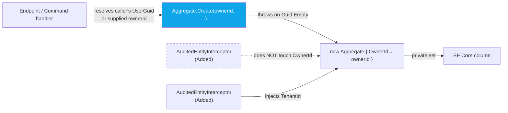

import { Aside } from "@astrojs/starlight/components";

`IOwnable` is the framework's marker interface for aggregates owned by a
specific user. It sits next to [`IMultiTenant`](/dotnet/concepts/multi-tenancy/),
`ISoftDeletable`, and [`IHasMergeTombstone`](/dotnet/data/entity-merge/) — a
declarative tag that EF Core conventions, authorization handlers, and GDPR
cascades all key off of.

```csharp
namespace Granit.Domain;

public interface IOwnable
{
    Guid OwnerId { get; }
}
```

Two design points distinguish it from `IMultiTenant`:

- **Get-only on the interface.** Ownership is a domain decision, not an
  ambient dimension. The aggregate exposes the value; mutation happens through
  a named behavioural method ([`TransferOwnership`](#transferownership)),
  never through the interface.
- **No automatic injection.** Unlike `TenantId`, `OwnerId` is **not** set by
  the persistence interceptor. The aggregate factory MUST require an explicit
  `Guid` and fail loudly when it cannot be resolved. The reason is laid out in
  [ADR-060](/dotnet/architecture/adr/060-identity-sub-as-guid/): the caller is
  not always the owner (imports, transfers, service accounts, GDPR
  reassignment).

## Why get-only

Compare to `IMultiTenant`:

```csharp
public interface IMultiTenant
{
    string? TenantId { get; set; }   // settable — interceptor injects
}

public interface IOwnable
{
    Guid OwnerId { get; }            // get-only — factory enforces
}
```

The settable shape on `IMultiTenant` exists because `TenantId` is **ambient
state**: the persistence interceptor reads `ICurrentTenant.Id` and injects it
into every `IMultiTenant` entity at `Added` time. The caller never thinks
about tenants; the framework guarantees the value.

`OwnerId` cannot work that way. An admin importing a CSV creates documents
owned by *the imported users*, not by the admin. A GDPR reassignment flow
changes ownership of orphaned records without an active session. A service
account creating an entity on behalf of a human cannot use its own machine
identity as the owner. The interceptor has no way to decide which of those is
the right answer — only the command handler does.

So the contract is:



The dashed line is the key contrast: the interceptor reads `IMultiTenant` and
writes `TenantId`; it reads `IOwnable` for **nothing**. EF Core still
materialises the value through the entity's `private set`, which keeps DDD
encapsulation intact and lets tests build aggregates via the factory rather
than property initialisers.

## Automatic index convention

`ApplyGranitConventions` in `Granit.Persistence.EntityFrameworkCore`
detects every `IOwnable` entity and emits a composite index:

| Entity also implements | Index | Column order |
|---|---|---|
| `IMultiTenant` | `(TenantId, OwnerId)` | Tenant first — aligns with the multi-tenant query filter |
| (only `IOwnable`) | `(OwnerId)` | Single-column |

The convention skips entities without their own table (TPH-derived types,
keyless query types) and de-duplicates: if you declare an index over the same
property set explicitly (with a custom name, say), the convention sees it and
backs off.

```csharp
// In a *Configuration.cs — only needed if you want a custom index name,
// since the convention emits the same shape automatically.
builder.HasIndex(x => new { x.TenantId, x.OwnerId })
       .HasDatabaseName("IX_Documents_TenantId_OwnerId");
```

<Aside type="note" title="Why an index, not a query filter?">
The framework deliberately does **not** register a global query filter for
ownership. Owner is an *exposed column* — admins must be able to list "all
documents owned by Alice", role-based shares must let other users see
non-owned content, GDPR cascades must scan by owner without filter
acrobatics. A query filter would hide rows by default; the index makes
"my entities in this tenant" a seek without hiding anything.
</Aside>

## Pattern of use

A typical `IOwnable` aggregate combines four pieces: the marker, an explicit
factory, a behavioural transfer method, and an `*OwnerChangedEvent` raised
through the domain-event pipeline.

```csharp
public sealed class Document : AggregateRoot, IMultiTenant, IOwnable, IEmitEntityLifecycleEvents
{
    public string Name { get; private set; }
    public string? TenantId { get; set; }
    public Guid OwnerId { get; private set; }

    private Document() { } // EF

    public static Document Create(Guid ownerId, string name, Guid folderId)
    {
        if (ownerId == Guid.Empty)
        {
            throw new ArgumentException("Owner id cannot be empty.", nameof(ownerId));
        }
        // ... other invariants

        var doc = new Document { Id = Guid.NewGuid(), Name = name, OwnerId = ownerId, /* ... */ };
        doc.AddDomainEvent(new DocumentCreatedEvent(doc.Id, doc.TenantId, doc.FolderId, doc.OwnerId, doc.Name));
        return doc;
    }

    public void TransferOwnership(Guid newOwnerId)
    {
        ThrowIfNotActive(nameof(TransferOwnership));
        if (newOwnerId == Guid.Empty)
        {
            throw new ArgumentException("New owner id cannot be empty.", nameof(newOwnerId));
        }
        if (newOwnerId == OwnerId)
        {
            return; // idempotent
        }

        Guid oldOwnerId = OwnerId;
        OwnerId = newOwnerId;
        AddDomainEvent(new DocumentOwnerChangedEvent(Id, TenantId, oldOwnerId, newOwnerId));
    }
}
```

Four invariants the factory enforces, that the interface cannot:

1. **`Guid.Empty` rejected at construction.** A nullable `UserGuid` upstream
   surfaces as a parse-time throw, not a silent zero in the database.
2. **State-aware mutation.** `ThrowIfNotActive` (or `ThrowIfTrashed`,
   `ThrowIfTenantRoot` for folders) gates transfer on aggregate state — you
   cannot transfer ownership of a trashed document.
3. **Idempotent self-transfer.** Re-transferring to the same owner is a no-op
   — no event emitted, no audit noise.
4. **Domain event emitted.** Every transfer publishes
   `<Aggregate>OwnerChangedEvent` carrying old and new ids, which the audit
   pipeline and per-module reactors consume.

### TransferOwnership

The convention is a public instance method named **`TransferOwnership`** on
the aggregate, taking a single `Guid newOwnerId`. It pairs with a
`*OwnerChangedEvent` record in the same namespace as the aggregate:

```csharp
public sealed record DocumentOwnerChangedEvent(
    Guid DocumentId,
    string? TenantId,
    Guid OldOwnerId,
    Guid NewOwnerId) : IDomainEvent;
```

Endpoints expose it as `PUT /{resource}/{id}/owner`, gated by a dedicated
`<Resource>.TransferOwnership` permission distinct from the regular write
permission. That separation matters: a user with `Documents.Manage` may
edit metadata without being able to give away ownership.

### Forbidden roots

If the aggregate has a notion of a "system anchor" instance — a root entity
that exists per tenant and that the framework itself depends on — that
instance MUST be excluded from `TransferOwnership` at the domain layer, not
at the endpoint layer. `Folder` does this with `ThrowIfTenantRoot`. The
reason: GDPR cascades and admin scripts call the service method directly;
the guard belongs where the invariant lives.

## Authorization

`Granit.Authorization` ships an `OwnedRequirement` and a resource-based
handler so policies can express "user X may perform action Y on resource R
because they own it".

```csharp
public sealed class OwnedRequirement : IAuthorizationRequirement;
```

The handler is **fail-silent**:

```csharp
internal sealed class OwnedByCurrentUserHandler(ICurrentUserService currentUser)
    : AuthorizationHandler<OwnedRequirement, IOwnable>
{
    protected override Task HandleRequirementAsync(
        AuthorizationHandlerContext context,
        OwnedRequirement requirement,
        IOwnable resource)
    {
        if (currentUser.UserGuid is Guid id && id == resource.OwnerId)
        {
            context.Succeed(requirement);
        }
        return Task.CompletedTask;
    }
}
```

Three points worth calling out:

- **The handler never calls `context.Fail()`.** When `UserGuid` is `null`
  (non-Guid `sub`, machine actor, unauthenticated) or when ownership doesn't
  match, the requirement simply stays unsatisfied. A stacked handler —
  permission-based, role-based, share-based — can still grant access. See
  [ADR-060](/dotnet/architecture/adr/060-identity-sub-as-guid/#caller-contract)
  for the rationale.
- **Resource is `IOwnable`.** The handler matches on the marker, so any
  aggregate that implements `IOwnable` works without a per-type registration.
- **Composition with permission policies.** Typical pattern: combine an
  ownership grant with an explicit "I can manage what I own" permission,
  letting share-based grants from other modules ([share ACL](/dotnet/business/documents/#share-acl-model))
  override or extend the ownership default.

### Composing in a policy

```csharp
services.AddAuthorization(options =>
{
    options.AddPolicy("Documents.Edit", policy =>
    {
        policy.RequireAuthenticatedUser();
        // Either: user has Documents.Edit permission, OR they own the resource
        policy.AddRequirements(
            new PermissionRequirement("Documents.Documents.Edit"),
            new OwnedRequirement());
    });
});
```

Because both requirements are added to the same policy, ASP.NET evaluates them
with **OR semantics**: either handler succeeding is enough. To enforce AND,
register two policies and apply both.

### Calling the resource-based check

Resource-based checks must go through `IAuthorizationService.AuthorizeAsync`
with the resource instance — the requirement cannot fire on the principal
alone, since it depends on the resource's `OwnerId`:

```csharp
var auth = await authorizationService.AuthorizeAsync(
    user: HttpContext.User,
    resource: document,
    requirements: [new OwnedRequirement()]);

if (!auth.Succeeded) { return Results.Forbid(); }
```

## Sibling markers

`IOwnable` is one of a small family of declarative domain markers in
`Granit.Domain` / framework code. Each one drives a distinct slice of EF
plumbing through `ApplyGranitConventions`:

| Marker | Plane | Convention applied |
|---|---|---|
| [`IMultiTenant`](/dotnet/concepts/multi-tenancy/) | Tenant isolation | Interceptor injection + `MultiTenant` query filter |
| `ISoftDeletable` | Lifecycle | Interceptor sets `IsDeleted` on delete + `SoftDelete` query filter |
| `IOwnable` | Ownership | `(TenantId, OwnerId)` or `(OwnerId)` index — **no** filter, **no** injection |
| [`IHasMergeTombstone`](/dotnet/data/entity-merge/#ihasmergetombstone--state-only) | Merge lineage | `MergedIntoId` / `MergedAt` columns + `MergeTombstone` query filter |

The conventional column type for ownership identifiers is `Guid` — see
[ADR-060](/dotnet/architecture/adr/060-identity-sub-as-guid/) for the IDP
compatibility matrix and the rationale.

## GDPR cascade

`IOwnable` is the join key for the framework's personal-data deletion
fan-out: a module that owns user-keyed aggregates subscribes to
`PersonalDataDeletionRequestedEto` and processes every aggregate where
`OwnerId == request.UserId`. The pattern, the handler shape, and the
"system anchor" exclusion rule are documented in
[Personal Data Deletion — Cascade cleanup for owned entities](/dotnet/compliance/privacy/data-deletion/#cascade-cleanup-for-owned-entities).

## See also

- [ADR-060 — OIDC sub as Guid](/dotnet/architecture/adr/060-identity-sub-as-guid/) — `UserGuid` contract and IDP matrix
- [Multi-tenancy](/dotnet/concepts/multi-tenancy/) — `IMultiTenant`, the ambient-injection counterpart
- [EntityMerge](/dotnet/data/entity-merge/) — `IHasMergeTombstone`, sibling marker
- [Query filters](/dotnet/data/query-filters/) — why ownership is **not** a filter
- [Authorization](/dotnet/security/authorization/) — permissions, policies, requirement stacking
- [Personal Data Deletion](/dotnet/compliance/privacy/data-deletion/) — GDPR Art. 17 cascade for `IOwnable` modules
- [Documents](/dotnet/business/documents/) — first business module to adopt the pattern
