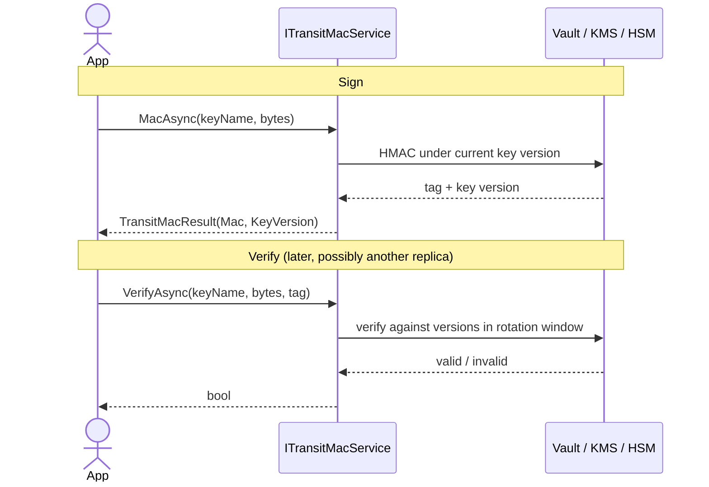

import { Tabs, TabItem, Aside, CardGrid, LinkCard } from "@astrojs/starlight/components";

A **MAC** (Message Authentication Code) is a keyed integrity tag: anyone holding
the key can prove a payload was produced by a trusted party and has not been
altered. `ITransitMacService` is Granit's provider-agnostic MAC primitive — you
sign and verify bytes, and the signing key stays inside the vault (HashiCorp
Transit, AWS KMS, GCP Cloud KMS, Azure Managed HSM) exactly like
[transit encryption](/dotnet/data/vault/encryption/) keeps your encryption keys
out of process memory.

Use it whenever you need to detect tampering on data that leaves your trust
boundary and comes back: signed webhooks, download tokens, and — the headline
consumer — [personal-data export fragments and manifests](/dotnet/compliance/privacy/export-signing/).

## The contract

```csharp
public interface ITransitMacService
{
    // Produce an opaque integrity tag for `input` under the named key.
    Task<TransitMacResult> MacAsync(
        string keyName, ReadOnlyMemory<byte> input, CancellationToken ct = default);

    // True when `mac` verifies for `input` under any key version still in the
    // provider's rotation window.
    Task<bool> VerifyAsync(
        string keyName, ReadOnlyMemory<byte> input, string mac, CancellationToken ct = default);
}

public readonly record struct TransitMacResult(string Mac, int KeyVersion);
```

```csharp
public sealed class WebhookSigner(ITransitMacService mac)
{
    public async Task<string> SignAsync(byte[] body, CancellationToken ct)
    {
        TransitMacResult result = await mac.MacAsync("granit-webhook-mac", body, ct);
        return result.Mac; // store / send verbatim — never parse it
    }

    public Task<bool> VerifyAsync(byte[] body, string tag, CancellationToken ct) =>
        mac.VerifyAsync("granit-webhook-mac", body, tag, ct);
}
```

<Aside type="caution" title="The tag is opaque — never parse it">
`TransitMacResult.Mac` is an opaque string whose format is the implementing
provider's business (HashiCorp emits `vault:vN:…`, AWS prefixes its alias). The
only contract is that `VerifyAsync` accepts whatever `MacAsync` produced. Parsing
the tag outside the provider is forbidden — the framework's convention tests fail
the build if you do. `KeyVersion` is surfaced only for diagnostics and for ageing
out tags past a chosen rolling window.
</Aside>

## Sign / verify flow



The key never reaches your process: the bytes go to the vault, the tag (or a
boolean) comes back. A tag signed by one replica verifies on every other replica
and survives restarts, because the key lives in shared infrastructure rather than
process memory.

## Provider matrix

| Provider | Primitive | Algorithm | Key version semantics | Key leaves vault? |
| -------- | --------- | --------- | --------------------- | :---------------: |
| HashiCorp Transit (`Granit.Vault.HashiCorp`) | `transit/hmac` + `transit/verify` | SHA-256 | Native — honours `min_decryption_version` | No |
| AWS KMS (`Granit.Vault.Aws`) | `GenerateMac` / `VerifyMac` | `HMAC_256` | `Current` / `Previous` alias pair (KMS keys are not versioned in place) | No |
| GCP Cloud KMS (`Granit.Vault.GoogleCloud`) | `MacSign` / `MacVerify` | `HMAC_SHA256` | Native — refuses `DISABLED` / `DESTROYED` versions | No |
| Azure Managed HSM (`Granit.Vault.Azure`) | `HS256` on an `oct-HSM` key | HMAC-SHA256 | Native enabled-version semantics | No |
| `SecretBackedMacService` (`Granit.Vault`) | local HMAC over a pulled key | HMAC-SHA256 | `Current` / `Previous` secret pair | **Yes — explicit trade-off** |

Pick the native primitive that matches where your infrastructure already lives.
The four cloud-native rows never expose the key — your bytes go to the provider
and the tag comes back. The fifth row is a deliberate fallback (see below).

## Rotation window

`VerifyAsync` accepts a tag signed under **any key version still inside the
provider's rotation window**, so a rolling key rotation never invalidates
in-flight tags:

- **Versioned providers** (HashiCorp, GCP, Azure HSM) use native semantics —
  HashiCorp's `min_decryption_version`, GCP/Azure's enabled-version state. Disable
  or destroy an old version and verification against it stops.
- **AWS KMS** does not version an HMAC key in place, so rolling rotation uses a
  `Current` + `Previous` alias pair. Both `VerifyMac` calls are always issued
  (constant-time fallback) so the grace window doesn't leak through a timing
  oracle.

Provision the MAC key with a 90-day auto-rotation period — ISO 27001 A.10.1.2:

<Tabs>
<TabItem label="HashiCorp">

```bash
vault write -f transit/keys/granit-privacy-export-fragment-hmac \
  type=hmac \
  auto_rotate_period=2160h   # 90 days
```

App policy needs `update` on `transit/hmac/<key>` and `transit/verify/<key>`.

</TabItem>
<TabItem label="GCP">

```hcl
resource "google_kms_crypto_key" "export_mac" {
  name            = "granit-privacy-export-mac"
  key_ring        = google_kms_key_ring.granit.id
  purpose         = "MAC"
  rotation_period = "7776000s" # 90 days
  version_template { algorithm = "HMAC_SHA256" }
}
```

</TabItem>
<TabItem label="AWS">

```text
1. Provision a new HMAC_256 key.
2. Point alias/granit/...-previous at the outgoing key.
3. Point alias/granit/...-current at the new key.
   Verify keeps accepting the previous tag throughout the grace window.
```

</TabItem>
</Tabs>

## `SecretBackedMacService` — portable fallback

When the underlying provider exposes **no** native HMAC primitive — Azure Key
Vault **Standard** tier, or a cost-constrained host — register the portable
fallback shipped in `Granit.Vault`. It pulls a 32-byte key from any registered
[`ISecretStore`](/dotnet/data/vault/secrets/) and computes the HMAC locally.

```csharp
services.AddGranitSecretBackedMacService(o =>
{
    o.CurrentSecretName  = "granit/mac/current";
    o.PreviousSecretName = "granit/mac/previous"; // optional — rolling rotation
    o.RefreshInterval    = TimeSpan.FromMinutes(5);
});
```

```jsonc
{
  "Vault": {
    "SecretBackedMac": {
      "CurrentSecretName":  "granit/mac/current",
      "PreviousSecretName": "granit/mac/previous",
      "RefreshInterval":    "00:05:00"
    }
  }
}
```

| Option | Default | Description |
| ------ | ------- | ----------- |
| `CurrentSecretName` | — | Secret holding the current key (base64, exactly 32 bytes decoded). Required. |
| `PreviousSecretName` | `null` | Previous key for rolling-window verification. Optional but recommended. |
| `RefreshInterval` | `00:05:00` | How often a background service re-reads the secrets from the vault. |

<Aside type="caution" title="Trust-boundary trade-off">
Unlike the four native primitives, `SecretBackedMacService` brings the key
**into process memory**. The memory is zeroed (`CryptographicOperations.ZeroMemory`)
on dispose and on every refresh, but the key has crossed the vault boundary —
that is a real, documented trade-off. Prefer a native HMAC primitive (HashiCorp
Transit, AWS KMS, GCP KMS, Azure Managed HSM) whenever one is available, and
reach for this fallback only when none is.
</Aside>

A startup refresh warms the cache so the first `MacAsync` call doesn't pay the
round-trip; periodic refreshes keep the previously cached keys if the vault is
briefly unreachable.

## See also

<CardGrid>
  <LinkCard title="Signing personal-data exports" href="/dotnet/compliance/privacy/export-signing/" description="Granit.Privacy.Vault — the production consumer that swaps the ephemeral export signer for a vault-backed one." />
  <LinkCard title="Transit encryption" href="/dotnet/data/vault/encryption/" description="The sibling primitive — encrypt/decrypt strings with the key kept inside the vault." />
  <LinkCard title="Secret retrieval" href="/dotnet/data/vault/secrets/" description="ISecretStore — the key source behind SecretBackedMacService." />
  <LinkCard title="Vault providers" href="/dotnet/data/vault/providers/" description="Auth, config, and the per-provider MAC settings for all four backends." />
</CardGrid>
