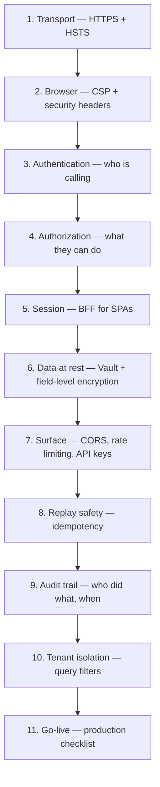

import { Aside, Steps, Tabs, TabItem, CardGrid, Card } from "@astrojs/starlight/components";

This guide walks through the order in which you should harden a Granit application,
from a fresh `dotnet new` project to a production-ready deployment. Each step is
self-contained, links out to the reference page for the module it configures, and
ends with a pointer to the next layer.

The [Security Overview](/dotnet/security/security-overview/) page is a lookup table
("which module solves problem X"). This guide is the opposite: a recommended
**order of operations** with the code for each step.

## Defense in depth

Granit's security primitives stack like an onion — each layer assumes the outer
layers are present, and each one mitigates a different class of threat. Skipping
a layer doesn't break the next one, but it leaves a known gap.



<Aside type="tip" title="Minimum security stack">
If you only ship steps **1, 2, 3, 4, 9** you already meet the OWASP ASVS L1 baseline
for an internal API. Steps 5–10 are required for public, multi-tenant, or regulated
workloads (GDPR, NIS2, SOC 2, FAPI).
</Aside>

## Prerequisites

- A .NET 10 project bootstrapped from
  [`granit-microservice-template`](/dotnet/getting-started/) — the template wires
  `Bundle.Essentials` for you, which already activates security headers and
  exception handling.
- An identity provider chosen up front
  ([Keycloak, Entra ID, Cognito, or self-hosted OpenIddict](/dotnet/security/authentication/)).
- A secret store reachable from your environment
  ([HashiCorp Vault or Azure Key Vault](/dotnet/data/vault/)) — production only.

<Aside type="caution" title="Don't postpone secrets">
Wire Vault from day one, even in development. Retro-fitting a secret store after
secrets have leaked into Git history, CI logs, or Docker images is significantly
more expensive than starting with it.
</Aside>

## Step 1 — Enforce HTTPS everywhere

Plaintext HTTP is the only failure mode that invalidates every subsequent layer:
an attacker on the wire can strip auth headers, replay cookies, and inject
content before the browser ever sees a CSP. Enforce HTTPS at the Kestrel level
and disable HTTP/1.0 fallbacks.

```csharp
// Program.cs
builder.WebHost.ConfigureKestrel(opts =>
{
    opts.ConfigureEndpointDefaults(e => e.Protocols = HttpProtocols.Http1AndHttp2);
});

var app = builder.Build();

app.UseHttpsRedirection();
```

In `appsettings.Production.json`, force JWT metadata over HTTPS so token
discovery cannot be downgraded:

```json
{
  "Authentication": {
    "RequireHttpsMetadata": true
  }
}
```

HSTS is set automatically by [`Granit.Http.SecurityHeaders`](/dotnet/security/security-headers/)
in the next step — you do not need `app.UseHsts()`.

## Step 2 — Security headers and CSP

`Bundle.Essentials` already registers
[`Granit.Http.SecurityHeaders`](/dotnet/security/security-headers/). The
middleware emits HSTS, `X-Frame-Options: DENY`, `Referrer-Policy`,
`Permissions-Policy`, `X-Content-Type-Options: nosniff`, and removes the Kestrel
`Server` header. The only thing you typically need to add yourself is the CSP
policy for any UI surface your API serves.

```csharp
app.UseGranitExceptionHandling();   // 1st — catches errors
app.UseGranitSecurityHeaders();     // 2nd — headers on every response
app.UseRouting();
app.UseAuthentication();
app.UseAuthorization();
```

The default CSP is API-grade strict (`default-src 'none'; base-uri 'none';
frame-ancestors 'none'`). If you serve Scalar, an admin UI, or any browser
surface, ship an [`ICspContributor`](/dotnet/security/security-headers/) scoped
to that route rather than relaxing the global policy:

```csharp
public sealed class ScalarCspContributor : ICspContributor
{
    public bool AppliesTo(HttpContext ctx) =>
        ctx.Request.Path.StartsWithSegments("/scalar");

    public void Contribute(CspBuilder csp) => csp
        .StyleSrc("'self'", "'unsafe-inline'")
        .ScriptSrc("'self'");
}
```

<Aside type="tip" title="Per-endpoint CSP">
The [per-endpoint CSP composition pattern](/blog/csp-per-endpoint-composition/)
keeps your strict default intact while letting individual UI surfaces declare
their own relaxations. Same idea applies to the SPA side —
see [Frontend CSP](/frontend/security/csp/).
</Aside>

## Step 3 — Authentication

Pick the provider that matches your identity platform and add the matching
package. The
[`ICurrentUserService`](/dotnet/security/security-overview/#icurrentuserservice)
contract is identical across providers — switching from Keycloak to Entra ID
only changes one module reference.

<Tabs>
<TabItem label="Keycloak">

```csharp
[DependsOn(typeof(GranitAuthenticationJwtBearerKeycloakModule))]
public sealed class AppModule : GranitModule { }
```

```json
{
  "Authentication": {
    "Authority": "https://keycloak.example.com/realms/granit",
    "Audience": "granit-api",
    "RequireHttpsMetadata": true
  }
}
```

</TabItem>
<TabItem label="Entra ID">

```csharp
[DependsOn(typeof(GranitAuthenticationJwtBearerEntraIdModule))]
public sealed class AppModule : GranitModule { }
```

</TabItem>
<TabItem label="Cognito">

```csharp
[DependsOn(typeof(GranitAuthenticationJwtBearerCognitoModule))]
public sealed class AppModule : GranitModule { }
```

</TabItem>
</Tabs>

Detailed provider wiring — including [back-channel logout](/dotnet/security/authentication/),
[OIDC flows](/dotnet/security/authentication-oidc/), and
[DPoP-bound tokens](/dotnet/security/openiddict/advanced/private-key-jwt-authentication/) —
lives on the [Authentication](/dotnet/security/authentication/) page. If you
self-host the IdP, see [OpenIddict](/dotnet/security/openiddict/).

<Aside type="caution" title="Never bypass `RequireHttpsMetadata` in production">
Disabling HTTPS metadata validation lets an attacker on the same network swap
the JWKS endpoint and issue valid-looking tokens. Set it to `true` and fix any
certificate issues at the infrastructure layer instead.
</Aside>

## Step 4 — Authorization (RBAC)

Authentication tells you *who* is calling. Authorization tells you *what they
can do*. Granit's [`Granit.Authorization`](/dotnet/security/authorization/)
module ships a dynamic policy provider so permissions are not baked into
attributes — they are evaluated at request time against a per-tenant permission
store.

```csharp
[DependsOn(typeof(GranitAuthorizationModule))]
public sealed class AppModule : GranitModule { }
```

```csharp
app.MapPost("/invoices", CreateInvoice)
   .RequireAuthorization("invoices.create");
```

Permissions are defined declaratively per module and assigned to roles via the
[Authorization Roles](/dotnet/security/authorization-roles/) APIs. For
multi-tenant apps, the
[multi-tenancy side authorization](/dotnet/security/authorization-multitenancy-side/)
page covers per-tenant permission stores. For service-to-service calls, see
[Inter-service Authorization](/dotnet/security/inter-service-authorization/).

## Step 5 — BFF for SPAs

If your API is consumed by an SPA, **do not** hand access tokens to the browser.
Tokens in `localStorage` are an XSS exfiltration target; tokens in
`Authorization` headers travel through JavaScript that any third-party script
can read. The [`Granit.Bff`](/dotnet/security/bff/) module keeps tokens
server-side and exchanges them for a same-site session cookie.

```csharp
[DependsOn(typeof(GranitBffModule))]
public sealed class AppModule : GranitModule { }
```

The BFF terminates the OIDC flow, stores tokens in a server-side session, and
proxies API calls via YARP — see
[BFF Architecture](/dotnet/security/bff/architecture/),
[Configuration](/dotnet/security/bff/configuration/), and
[Token Security](/dotnet/security/bff/token-security/) for the full pattern.

On the SPA side, the [Frontend Authentication](/frontend/security/authentication/)
and [Frontend Cookies](/frontend/security/cookies/) pages cover the React
integration and the cookie-consent flow required by GDPR.

<Aside type="tip" title="When BFF is overkill">
For trusted first-party mobile apps or service-to-service traffic, plain JWT
Bearer is fine — BFF exists to mitigate browser-specific threats. See
[API Keys](/dotnet/security/api-keys/) for machine-to-machine calls.
</Aside>

## Step 6 — Secrets and data at rest

Plaintext secrets in `appsettings.json` are the most common production leak.
Wire a vault provider so connection strings, JWT signing keys, and encryption
passphrases live outside the deployment artifact.

```csharp
[DependsOn(typeof(GranitVaultHashiCorpModule))]
public sealed class AppModule : GranitModule { }
```

See [Vault & Encryption](/dotnet/data/vault/) for dynamic database credentials,
lease renewal, and the Azure Key Vault equivalent.

For PII at rest — national IDs, health records, payment metadata — use
[field-level encryption](/dotnet/data/encryption/) via the `[Encrypted]`
attribute. The [Encrypt Sensitive Data guide](/dotnet/guides/encrypt-sensitive-data/)
walks through the AES-256 local path and the Vault Transit production path
side by side.

```csharp
public sealed class Patient : FullAuditedEntity<Guid>
{
    public string Name { get; set; } = string.Empty;

    [Encrypted]
    public string NationalId { get; set; } = string.Empty;
}
```

For irreversible deletion (GDPR Art. 17 right to erasure on a per-tenant key),
see [Crypto-Shredding](/dotnet/compliance/crypto-shredding/).

## Step 7 — Public surface: CORS, rate limiting, API keys

The three controls every public-facing endpoint needs:

<CardGrid>
<Card title="CORS" icon="external">
[`Granit.Http.Cors`](/dotnet/api/cors-cross-origin/) — restrict allowed origins
to known SPAs. Never use `AllowAnyOrigin()` with credentialed requests.
</Card>
<Card title="Rate limiting" icon="rocket">
[`Granit.Http.RateLimiting`](/dotnet/api/rate-limiting/) — protect login, password
reset, and any unauthenticated endpoint from credential stuffing and scraping.
</Card>
<Card title="API keys" icon="seti:lock">
[`Granit.Authentication.ApiKey`](/dotnet/security/api-keys/) — service-to-service
calls with rotation, expiry scanning, and lifecycle notifications.
</Card>
</CardGrid>

```json
{
  "Cors": {
    "AllowedOrigins": [ "https://app.example.com" ],
    "AllowCredentials": true
  },
  "RateLimiting": {
    "Anonymous": { "PermitLimit": 30, "Window": "00:01:00" },
    "Authenticated": { "PermitLimit": 300, "Window": "00:01:00" }
  }
}
```

## Step 8 — Idempotency for mutating endpoints

Network retries are the most common cause of duplicate orders, double-charged
invoices, and duplicate webhook deliveries. Granit's
[`Idempotency-Key`](/dotnet/api/idempotency/) middleware deduplicates `POST` and
`PUT` requests by client-provided key — see the
[Configure Idempotency guide](/dotnet/guides/configure-idempotency/) for the
two-line wiring and the rationale in
[Idempotency keys: why every POST should be retry-safe](/blog/idempotency-keys-why-every-post-should-be-retry-safe/).

Not strictly a security control, but it closes a real exploit window: without
it, a hostile retry of a successful purchase is indistinguishable from a fresh
purchase.

## Step 9 — Audit trail and log hygiene

Every regulated framework (ISO 27001 A.12.4, GDPR Art. 30, NIS2 Art. 21) requires
a tamper-evident record of *who* did *what*, *when*, and *from where*. Granit's
[`AuditedEntityInterceptor`](/dotnet/data/interceptors/) populates `CreatedBy`,
`ModifiedBy`, and `DeletedBy` automatically from
[`ICurrentUserService`](/dotnet/security/security-overview/#icurrentuserservice).

```csharp
public sealed class Invoice : FullAuditedEntity<Guid>
{
    public string CustomerName { get; set; } = string.Empty;
    public decimal Amount { get; set; }
}
```

For change history at the field level (regulated audit trails), see the
[Implement Audit Timeline guide](/dotnet/guides/implement-audit-timeline/) and
the [Audit Log compliance page](/dotnet/compliance/audit-log/). Background on
the interceptor stack lives in
[Soft deletes, audit trails, query filters](/blog/soft-deletes-audit-trails-query-filters-interceptor-stack/).

<Aside type="caution" title="No PII in structured logs">
The structured logging pipeline serializes object properties by default — that
includes encrypted PII fields after decryption. Mark sensitive properties with
`[LogMasked]` or project to a DTO before logging. See the
[Privacy](/dotnet/compliance/privacy/) page for the redaction rules.
</Aside>

## Step 10 — Multi-tenant isolation

If your application is multi-tenant, a single missing `WHERE TenantId = @id`
clause leaks one tenant's data to another — the worst class of bug in a SaaS.
Granit's [Configure Multi-Tenancy guide](/dotnet/guides/configure-multi-tenancy/)
shows the three isolation strategies (shared DB with row filter, schema per
tenant, database per tenant) and the
[`ApplyGranitConventions`](/dotnet/data/query-filters/) global query filter that
enforces row-level isolation automatically.

The interceptor stack relies on
[`ICurrentTenant`](/dotnet/core/module-system/) being populated before the DbContext
is resolved — which means tenant resolution must run *after* authentication and
*before* any data-access middleware.

## Step 11 — Verify before go-live

Once every layer is wired, run through the
[Production Checklist](/dotnet/operations/production-checklist/) — it converts
the eleven steps above into a concrete tick-list mapped to GDPR, ISO 27001, and
operational gates. Treat it as the gate between staging and production, not as
a post-incident retrospective.

For the compliance narrative behind these controls:

- [NIS2-ready .NET applications](/blog/nis2-ready-dotnet-applications/) — how
  Granit's primitives map to NIS2 controls.
- [SOC 2 Type 2-ready SaaS with Granit](/blog/soc2-type2-ready-saas-granit/) —
  the audit-trail surface you get for free.
- [Adding authentication with Keycloak](/blog/adding-authentication-with-keycloak-in-granit/) —
  a worked example end-to-end.

## See also

- [Security Overview](/dotnet/security/security-overview/) — which module solves
  which problem (lookup table).
- [Production Checklist](/dotnet/operations/production-checklist/) — go-live
  verification.
- [Frontend Security](/frontend/security/csp/) — the SPA-side counterparts
  (CSP, authentication, cookies).
- [Security Model](/dotnet/concepts/security-model/) — the threat model behind
  these controls.
