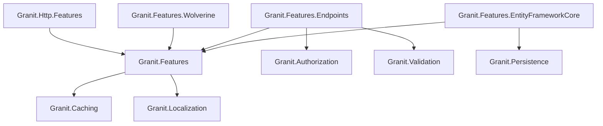

import { Tabs, TabItem, FileTree } from "@astrojs/starlight/components";

SaaS feature management with three value types — toggle (boolean), numeric (bounded),
and selection (enum). Features cascade through a Tenant → Plan → Default chain and
support gating via attributes, middleware, and imperative checks.

## Package structure

The core is **framework-pure** — no ASP.NET Core dependency. Enforcement ships as
separate transport bindings, the same layout as
[Granit.RateLimiting](/dotnet/api/rate-limiting/) (see
[ADR-062](/dotnet/architecture/adr/062-framework-pure-core-transport-bindings/)).

<FileTree>

- Granit.Features/ Framework-pure SaaS feature management (Toggle/Numeric/Selection)
  - Granit.Http.Features Minimal-API endpoint filter `.RequiresFeature()`
  - Granit.Features.Wolverine `[RequiresFeature]` + message middleware
  - Granit.Features.Endpoints Feature definitions, values, and override HTTP endpoints
  - Granit.Features.EntityFrameworkCore Isolated FeaturesDbContext

</FileTree>

| Package | Role | Depends on |
|---------|------|------------|
| `Granit.Features` | `IFeatureChecker`, `IFeatureLimitGuard`, plan-based cascade | `Granit.Caching`, `Granit.Localization` |
| `Granit.Http.Features` | Minimal-API endpoint filter `.RequiresFeature()` → HTTP 403 | `Granit.Features` |
| `Granit.Features.Wolverine` | `[RequiresFeature]` attribute + pipeline middleware (no `WolverineFx` reference) | `Granit.Features` |
| `Granit.Features.Endpoints` | Definitions, values, and override HTTP endpoints | `Granit.Features`, `Granit.Authorization`, `Granit.Validation` |
| `Granit.Features.EntityFrameworkCore` | `FeaturesDbContext` (isolated) | `Granit.Features`, `Granit.Persistence` |

## Choosing the right package

Reference the core plus the binding that matches where you enforce the gate:

| Need | Package |
| ---- | ------- |
| Resolve values, guard numeric limits in code (`IFeatureChecker`, `IFeatureLimitGuard`) | `Granit.Features` |
| Gate a Minimal-API endpoint (`.RequiresFeature("name")`, 403 when disabled) | `Granit.Http.Features` |
| Gate a Wolverine message handler (`[RequiresFeature]` on the message) | `Granit.Features.Wolverine` |
| Browse/override definitions over REST | `Granit.Features.Endpoints` |
| Persist tenant overrides | `Granit.Features.EntityFrameworkCore` |

## Dependency graph



## Setup

<Tabs>
<TabItem label="Core only">

```csharp
[DependsOn(typeof(GranitFeaturesModule))]
public class AppModule : GranitModule { }
```

Uses `InMemoryFeatureStore` by default (no persistence).

</TabItem>
<TabItem label="With EF Core">

```csharp
[DependsOn(
    typeof(GranitFeaturesModule),
    typeof(GranitFeaturesEntityFrameworkCoreModule))]
public class AppModule : GranitModule { }
```

```csharp
builder.AddGranitFeaturesEntityFrameworkCore(opt =>
    opt.UseNpgsql(connectionString));
```

</TabItem>
<TabItem label="With endpoints">

```csharp
[DependsOn(
    typeof(GranitFeaturesModule),
    typeof(GranitFeaturesEntityFrameworkCoreModule),
    typeof(GranitFeaturesEndpointsModule))]
public class AppModule : GranitModule { }
```

```csharp
// Program.cs — map endpoints
app.MapGranitFeatures();  // GET/PUT/DELETE /features/*
```

</TabItem>
</Tabs>

## Defining features

Implement `IFeatureDefinitionProvider` to declare features. Features are grouped for
admin UI organization.

```csharp
public sealed class AcmeFeatureDefinitionProvider : IFeatureDefinitionProvider
{
    public void Define(IFeatureDefinitionContext context)
    {
        FeatureGroupDefinition group = context.AddGroup("Acme", "Acme Application");

        group.AddToggle("Acme.VideoConsultation",
            defaultValue: false,
            displayName: "Video Consultation");

        group.AddNumeric("Acme.MaxUsersCount",
            defaultValue: 50,
            min: 1,
            max: 10_000,
            displayName: "Maximum Users");

        group.AddSelection("Acme.StorageTier",
            defaultValue: "standard",
            ["standard", "premium", "enterprise"],
            displayName: "Storage Tier");
    }
}
```

### FeatureDefinition properties

| Property | Description |
|----------|-------------|
| `Name` | Unique feature name (convention: `Module.FeatureName`) |
| `DefaultValue` | Fallback string value |
| `ValueType` | `Toggle`, `Numeric`, or `Selection` |
| `NumericConstraint` | Min/Max bounds for `Numeric` features |
| `SelectionValues` | Allowed values for `Selection` features |

## Value cascade

Features are resolved through a Tenant → Plan → Default cascade:

```text
Tenant override → Plan value → Default (code)
```

The application must implement `IPlanIdProvider` and `IPlanFeatureStore` to activate
plan-level resolution. Without these, features fall back to their default values.

## IFeatureChecker

The main abstraction for querying feature state at runtime:

```csharp
public class ConsultationService(IFeatureChecker features)
{
    public async Task StartAsync(CancellationToken ct)
    {
        // Gate: throws FeatureNotEnabledException (HTTP 403) if disabled
        await features
            .RequireEnabledAsync("Acme.VideoConsultation", ct)
            .ConfigureAwait(false);

        // Conditional logic
        bool isEnabled = await features
            .IsEnabledAsync("Acme.VideoConsultation", ct)
            .ConfigureAwait(false);

        // Numeric value
        long maxUsers = await features
            .GetNumericAsync("Acme.MaxUsersCount", ct)
            .ConfigureAwait(false);
    }
}
```

## IFeatureLimitGuard

Enforces numeric feature limits before mutating operations. Throws
`FeatureLimitExceededException` (HTTP 403) when the limit is reached.

```csharp
public sealed class CreatePatientHandler(
    IFeatureLimitGuard limitGuard,
    IPatientRepository patients)
{
    public async Task HandleAsync(CreatePatientCommand cmd, CancellationToken ct)
    {
        long current = await patients.CountAsync(ct).ConfigureAwait(false);
        await limitGuard
            .CheckAsync("Acme.MaxUsersCount", current, ct)
            .ConfigureAwait(false);

        // ... proceed with creation
    }
}
```

## Feature gating

Granit is Minimal-API-first: the endpoint filter ships in `Granit.Http.Features`
and the Wolverine attribute in `Granit.Features.Wolverine`. MVC controller
support has been removed (see [Migrating from the single package](#migrating-from-the-single-package)).

<Tabs>
<TabItem label="Minimal API">

```csharp
using Granit.Http.Features.AspNetCore; // Granit.Http.Features

app.MapPost("/consultations", handler)
    .RequiresFeature("Acme.VideoConsultation");

// Or on a group:
app.MapGroup("/export")
   .RequiresFeature("Acme.ExportPdf");
```

</TabItem>
<TabItem label="Wolverine">

```csharp
using Granit.Features.Wolverine.Attributes; // Granit.Features.Wolverine

// Decorate the message type
[RequiresFeature("Acme.ExportPdf")]
public sealed record GenerateExportCommand(Guid Id);
```

```csharp
// In Wolverine configuration
opts.Policies.AddMiddleware<RequiresFeatureMiddleware>(
    chain => chain.MessageType.HasAttribute<RequiresFeatureAttribute>());
```

</TabItem>
</Tabs>

When the feature is disabled, `FeatureNotEnabledException` is thrown and mapped to
HTTP 403 with `errorCode: "Features:NotEnabled"`.

## Feature store abstractions

```csharp
public interface IFeatureStoreReader
{
    Task<string?> GetOrNullAsync(
        string featureName, string? tenantId,
        CancellationToken cancellationToken = default);
}

public interface IFeatureStoreWriter
{
    Task SetAsync(
        string featureName, string? tenantId, string value,
        CancellationToken cancellationToken = default);

    Task DeleteAsync(
        string featureName, string? tenantId,
        CancellationToken cancellationToken = default);
}
```

## Endpoints

`Granit.Features.Endpoints` exposes REST endpoints for browsing definitions, reading
resolved values, and managing tenant-level overrides.

| Scope | Method | Route | Permission |
|-------|--------|-------|------------|
| Definitions | `GET` | `/features/definitions` | `Features.Flags.Read` |
| Values | `GET` | `/features/values` | Authenticated |
| Values | `GET` | `/features/values/{name}` | Authenticated |
| Overrides | `PUT` | `/features/overrides/{name}` | `Features.Flags.Manage` |
| Overrides | `DELETE` | `/features/overrides/{name}` | `Features.Flags.Manage` |

Override values are validated against the feature's value type before persistence:

- **Toggle** — must be `"true"` or `"false"` (case-insensitive)
- **Numeric** — must be a valid integer within `NumericConstraint` bounds
- **Selection** — must be one of the declared `SelectionValues`

Invalid values return HTTP 422 with a descriptive `ProblemDetails` response.

## Public API summary

| Category | Key types | Package |
|----------|-----------|---------|
| Modules | `GranitFeaturesModule`, `GranitHttpFeaturesModule`, `GranitFeaturesWolverineModule`, `GranitFeaturesEntityFrameworkCoreModule`, `GranitFeaturesEndpointsModule` | -- |
| Abstractions | `IFeatureChecker`, `IFeatureLimitGuard`, `IFeatureStoreReader`, `IFeatureStoreWriter` | `Granit.Features` |
| Definitions | `FeatureDefinition`, `IFeatureDefinitionProvider`, `FeatureValueType`, `NumericConstraint`, `SelectionValues` | `Granit.Features` |
| HTTP gating | `.RequiresFeature()` (`Granit.Http.Features.AspNetCore`) | `Granit.Http.Features` |
| Wolverine gating | `[RequiresFeature]`, `RequiresFeatureMiddleware` (`Granit.Features.Wolverine.Attributes`) | `Granit.Features.Wolverine` |
| Endpoints | `MapGranitFeatures()`, `FeaturesPermissions`, `FeaturesEndpointsOptions` | `Granit.Features.Endpoints` |

## Migrating from the single package

Before the [layer split](/dotnet/architecture/adr/062-framework-pure-core-transport-bindings/),
`Granit.Features` carried the ASP.NET Core integration. These are breaking moves (pre-1.0):

| Was | Now |
| --- | --- |
| `[RequiresFeature]` on an **MVC controller action** (`IFilterFactory`) | **Removed.** Granit is Minimal-API-first — use `.RequiresFeature()` on the endpoint, or move the check into the handler with `IFeatureChecker.RequireEnabledAsync()` |
| `[RequiresFeature]` attribute in `Granit.Features` | `Granit.Features.Wolverine.Attributes` (on the **message type**) + reference `Granit.Features.Wolverine` |
| `.RequiresFeature()` filter in `Granit.Features` | `using Granit.Http.Features.AspNetCore;` + reference `Granit.Http.Features` |
| One `GranitFeaturesModule` | Core module + `GranitHttpFeaturesModule` / `GranitFeaturesWolverineModule` |

## Diagnostics

The module registers `FeaturesMetrics` (singleton) with `IMeterFactory` and a
`FeaturesActivitySource` in the `GranitActivitySourceRegistry`.

| Metric | Type | Tags | Description |
|--------|------|------|-------------|
| `granit.features.value.resolved` | Counter | `tenant_id`, `feature_name`, `value_provider` | Feature values resolved through the cascade |
| `granit.features.override.changed` | Counter | `tenant_id`, `feature_name`, `operation` | Override mutations (set or delete) |
| `granit.features.limit.checked` | Counter | `tenant_id`, `feature_name` | Limit guard checks |
| `granit.features.limit.exceeded` | Counter | `tenant_id`, `feature_name` | Limit guard checks that exceeded the plan limit |

Structured log messages use `[LoggerMessage]` in `FeaturesLog`:

- Override changes (feature name, tenant, old/new value)
- Limit exceeded warnings
- Startup warning when `InMemoryFeatureStore` is active outside Development

:::caution[InMemoryFeatureStore]
Without `Granit.Features.EntityFrameworkCore`, feature overrides are stored in-memory
and lost on restart. The module logs a warning at startup if this happens outside a
Development environment.
:::

## See also

- [Rate Limiting](/dotnet/api/rate-limiting/) -- same core + transport-binding split; consumes feature-based dynamic quotas
- [ADR-062: framework-pure core + transport bindings](/dotnet/architecture/adr/062-framework-pure-core-transport-bindings/) -- the layering convention
- [Settings](/dotnet/infrastructure/application-settings/) -- cascading key-value settings
- [Multi-tenancy](/dotnet/infrastructure/multi-tenancy/) -- tenant context for feature resolution
- [Caching](/dotnet/data/caching/) -- used for feature value caching
- [Blog: Feature flags without LaunchDarkly: built-in feature management](/blog/feature-flags-without-launchdarkly-built-in-feature-management/) -- the case for keeping feature flags in-process and how this module is wired
