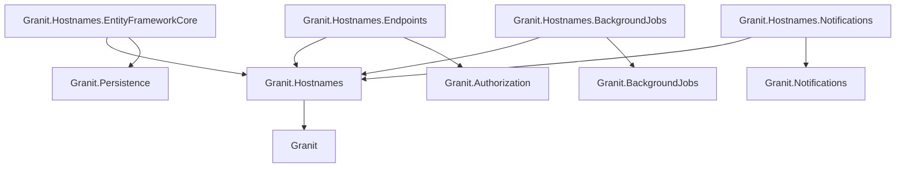
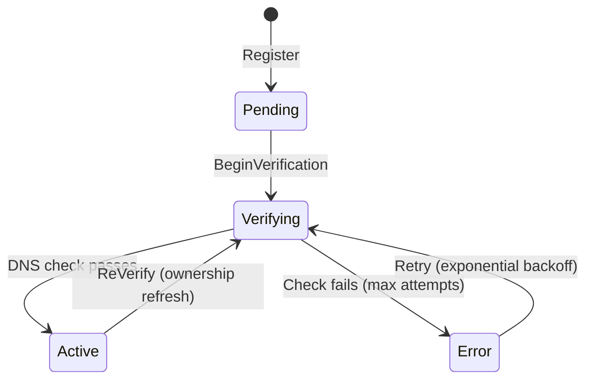
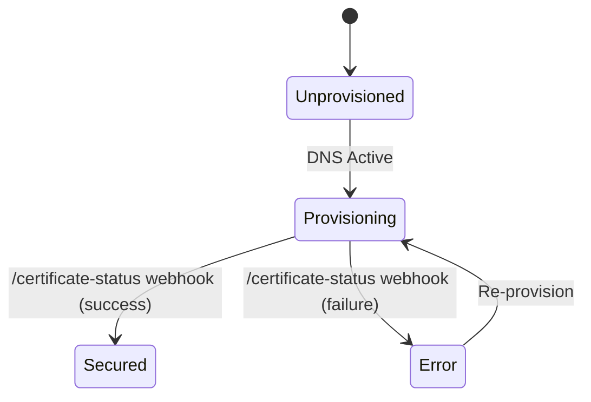

import { Tabs, TabItem, FileTree, Aside, Badge } from "@astrojs/starlight/components";

Granit.Hostnames lets any consumer (CMS, billing portal, API gateway, …) bind a
custom domain to an opaque resource identified by an `OwnerType` + `OwnerId` pair.
The module manages the full lifecycle: DNS TXT-record verification (with exponential
backoff), SSL certificate provisioning, and status webhooks — without any reverse
dependency on the consuming application. Communication is fully decoupled via
**ETOs** (External Transfer Objects).

## Package structure

<FileTree>
- Granit.Hostnames/ Domain model, ManagedHostname aggregate, DNS state machine, backoff
  - Granit.Hostnames.EntityFrameworkCore HostnamesDbContext, EfManagedHostnameStore, EfHostnameResolver
  - Granit.Hostnames.Endpoints CRUD, availability check, /verify-now, /certificate-status webhook
  - Granit.Hostnames.BackgroundJobs HostnameVerificationJob (every 5 min), batch service
  - Granit.Hostnames.Notifications hostname_verified + hostname_verification_failed (36 templates × 18 cultures)
</FileTree>

| Package | Role | Depends on |
| ------- | ---- | ---------- |
| `Granit.Hostnames` | `ManagedHostname` aggregate, `IHostnameResolver`, `IHostnameVerifier`, `IHostnameWriter`/`Reader`, DNS FSM, exponential backoff | `Granit` |
| `Granit.Hostnames.EntityFrameworkCore` | `HostnamesDbContext`, `EfManagedHostnameStore`, `EfHostnameResolver`, `HostnamesOptions` | `Granit.Hostnames`, `Granit.Persistence` |
| `Granit.Hostnames.Endpoints` | Minimal API: CRUD, availability check, `/verify-now`, `/certificate-status` webhook | `Granit.Hostnames`, `Granit.Authorization` |
| `Granit.Hostnames.BackgroundJobs` | `HostnameVerificationJob` (5-min cron), `HostnameVerificationBatchService` | `Granit.Hostnames`, `Granit.BackgroundJobs` |
| `Granit.Hostnames.Notifications` | `HostnameVerifiedNotificationType`, `HostnameVerificationFailedNotificationType` | `Granit.Hostnames`, `Granit.Notifications` |

## Dependency graph



## Hostname lifecycle

`ManagedHostname` drives two independent state machines: DNS verification and
certificate provisioning. Both advance independently — a hostname can be
DNS-verified while certificate provisioning is still in progress.

### DNS verification



| State | Description |
| ----- | ----------- |
| `Pending` | Hostname registered; TXT record not yet checked |
| `Verifying` | Background job polling DNS; backoff counter incrementing |
| `Active` | TXT record found and validated; hostname is live |
| `Error` | Max verification attempts reached; manual retry required |

Retries use **exponential backoff** — delay doubles on each failed attempt up to
a configurable ceiling (`HostnamesOptions.MaxBackoffMinutes`).

### Certificate status



| Status | Description |
| ------ | ----------- |
| `Unprovisioned` | DNS not yet active; SSL provider not contacted |
| `Provisioning` | SSL provider notified; awaiting certificate issuance |
| `Secured` | Certificate issued and installed |
| `Error` | Provisioning failed; webhook reported an error |

The `/certificate-status` webhook is a **host-level** endpoint — the SSL provider
calls it to report provisioning outcomes. It requires the
`Hostnames.Certificates.Report` permission, scoped to host-level callers.

## Setup

<Tabs>
<TabItem label="Full stack (recommended)">

```csharp
[DependsOn(
    typeof(GranitHostnamesEntityFrameworkCoreModule),
    typeof(GranitHostnamesEndpointsModule),
    typeof(GranitHostnamesBackgroundJobsModule),
    typeof(GranitHostnamesNotificationsModule))]
public class AppModule : GranitModule { }
```

```csharp
builder.AddGranitHostnames();
builder.AddGranitHostnamesEntityFrameworkCore(options =>
    options.UseNpgsql(builder.Configuration.GetConnectionString("Hostnames")));
```

```json
{
  "Hostnames": {
    "VerificationPollInterval": "00:05:00",
    "MaxVerificationAttempts": 10,
    "BackoffBaseMinutes": 1,
    "MaxBackoffMinutes": 60
  }
}
```

</TabItem>
<TabItem label="Domain only (no endpoints)">

Use this when another service owns the HTTP surface and your application only
needs to resolve or verify hostnames programmatically.

```csharp
[DependsOn(
    typeof(GranitHostnamesEntityFrameworkCoreModule),
    typeof(GranitHostnamesBackgroundJobsModule))]
public class AppModule : GranitModule { }
```

```csharp
builder.AddGranitHostnames();
builder.AddGranitHostnamesEntityFrameworkCore(options =>
    options.UseNpgsql(builder.Configuration.GetConnectionString("Hostnames")));
```

</TabItem>
</Tabs>

<Aside type="caution">
The background job polls DNS every 5 minutes by default. Ensure the host running
`HostnameVerificationJob` has outbound UDP/TCP access to port 53 on your DNS
resolver. In Kubernetes, check that `NetworkPolicy` allows egress to `kube-dns`.
</Aside>

## Core abstractions

### IHostnameResolver

Resolves a `ManagedHostname` by its hostname string or by owner identity:

```csharp
public interface IHostnameResolver
{
    Task<ManagedHostname?> FindByHostnameAsync(
        string hostname,
        CancellationToken cancellationToken = default);

    Task<IReadOnlyList<ManagedHostname>> FindByOwnerAsync(
        string ownerType,
        Guid ownerId,
        CancellationToken cancellationToken = default);
}
```

### IHostnameWriter / IHostnameReader

CQRS split — inject the interface that matches your intent:

```csharp
// Read-side: querying hostname metadata
public class HostnameQueryHandler(IHostnameReader reader) { }

// Write-side: registering or updating hostnames
public class HostnameCommandHandler(IHostnameWriter writer) { }
```

### IHostnameVerifier

The DNS verification abstraction. Inject it to trigger on-demand verification
outside the background job:

```csharp
public interface IHostnameVerifier
{
    Task<VerificationResult> VerifyAsync(
        ManagedHostname hostname,
        CancellationToken cancellationToken = default);
}
```

`VerificationResult` carries the resolved DNS values and the failure reason when
the check does not pass, allowing callers to surface actionable feedback to users.

## Registering a hostname

```csharp
public class RegisterHostnameHandler(IHostnameWriter writer)
{
    public async Task HandleAsync(RegisterHostnameCommand cmd, CancellationToken ct)
    {
        var hostname = ManagedHostname.Create(
            id:        Guid.NewGuid(),
            hostname:  cmd.Hostname,          // e.g. "app.customer.com"
            ownerType: "CmsPortal",
            ownerId:   cmd.PortalId);

        await writer.AddAsync(hostname, ct).ConfigureAwait(false);
    }
}
```

The aggregate is created in `Pending` state. The background job picks it up
within the next poll interval and begins DNS verification.

## Endpoints

All routes live under the `Hostnames` OpenAPI tag.

| Method | Route | Permission | Description |
| ------ | ----- | ---------- | ----------- |
| `GET` | `/api/{version}/hostnames` | `Hostnames.Hostnames.Read` | List managed hostnames (filterable by `ownerType`, `ownerId`, `verificationStatus`) |
| `POST` | `/api/{version}/hostnames` | `Hostnames.Hostnames.Manage` | Register a new custom hostname |
| `GET` | `/api/{version}/hostnames/{id}` | `Hostnames.Hostnames.Read` | Get hostname details and current status |
| `DELETE` | `/api/{version}/hostnames/{id}` | `Hostnames.Hostnames.Manage` | Remove a managed hostname |
| `GET` | `/api/{version}/hostnames/availability` | — (public) | Check whether a hostname is already registered |
| `POST` | `/api/{version}/hostnames/{id}/verify-now` | `Hostnames.Hostnames.Manage` | Trigger an immediate DNS check (bypasses backoff) |
| `POST` | `/api/{version}/hostnames/certificate-status` | `Hostnames.Certificates.Report` | SSL provider webhook — updates `CertificateStatus` |

### Availability check

`GET /api/{version}/hostnames/availability?hostname=app.customer.com` returns
`{ "available": true }`. This endpoint is unauthenticated so that registration
UIs can validate before prompting the user to configure DNS.

### Certificate-status webhook

The `/certificate-status` endpoint is designed to be called by the SSL provider
(e.g., Cloudflare for SaaS, a Let's Encrypt proxy). It accepts a JSON body
describing the outcome and transitions `CertificateStatus` accordingly, then
publishes `HostnameCertificateSecuredEto` or `HostnameCertificateFailedEto`.

## Background jobs

| Job | Cron | Description |
| --- | ---- | ----------- |
| `HostnameVerificationJob` | `*/5 * * * *` | Fetches all hostnames in `Pending`/`Verifying`/`Error` state and dispatches them to `HostnameVerificationBatchService` for DNS checking |

`HostnameVerificationBatchService` processes the batch in parallel, applies
exponential backoff between retries, and transitions each hostname to `Active` or
`Error` depending on the DNS check outcome.

## Notifications

`Granit.Hostnames.Notifications` ships **2 notification types** with **36
templates** (2 × 18 cultures):

| Type | Name | Severity | Opt-out |
| ---- | ---- | -------- | ------- |
| `HostnameVerifiedNotificationType` | `hostnames.hostname_verified` | Info | Yes |
| `HostnameVerificationFailedNotificationType` | `hostnames.hostname_verification_failed` | Warning | No |

Default channel: **InApp** + **Email**. Each notification carries the hostname
string and owner identity so the consumer can route the message to the right user.

## Events

`ManagedHostname` publishes ETOs on verification and certificate transitions.
Consume them via Wolverine handlers to react in downstream services without
coupling to `Granit.Hostnames`.

| ETO | Trigger | Key fields |
| --- | ------- | ---------- |
| `HostnameVerifiedEto` | DNS check passes → `Active` | `HostnameId`, `Hostname`, `OwnerType`, `OwnerId`, `VerifiedAt` |
| `HostnameVerificationFailedEto` | Max attempts reached → `Error` | `HostnameId`, `Hostname`, `OwnerType`, `OwnerId`, `FailureReason`, `AttemptCount` |
| `HostnameCertificateSecuredEto` | Webhook reports success → `Secured` | `HostnameId`, `Hostname`, `CertificateExpiresAt` |
| `HostnameCertificateFailedEto` | Webhook reports failure → certificate `Error` | `HostnameId`, `Hostname`, `FailureReason` |

```csharp
public class HostnameVerifiedHandler(ILogger<HostnameVerifiedHandler> logger)
{
    public Task HandleAsync(HostnameVerifiedEto eto, CancellationToken ct)
    {
        logger.LogInformation(
            "Hostname {Hostname} verified for {OwnerType}/{OwnerId}",
            eto.Hostname, eto.OwnerType, eto.OwnerId);
        return Task.CompletedTask;
    }
}
```

## Permissions

| Permission | Scope | Description |
| ---------- | ----- | ----------- |
| `Hostnames.Hostnames.Read` | Standard | List and read managed hostnames |
| `Hostnames.Hostnames.Manage` | Standard | Register, delete, and trigger verification |
| `Hostnames.Certificates.Report` | Host-level | Allowed for SSL provider webhook callers only |

`Hostnames.Certificates.Report` is a **host-level** permission — it is not
assignable to regular users. Grant it to the machine account or API key used by
your SSL provider to call the `/certificate-status` webhook.

## Configuration reference

| Property | Default | Description |
| -------- | ------- | ----------- |
| `VerificationPollInterval` | `00:05:00` | Cron cadence for `HostnameVerificationJob` |
| `MaxVerificationAttempts` | `10` | Attempts before transitioning to `Error` |
| `BackoffBaseMinutes` | `1` | Initial retry delay (doubles each attempt) |
| `MaxBackoffMinutes` | `60` | Ceiling for exponential backoff |

## Public API summary

| Category | Key types | Package |
| -------- | --------- | ------- |
| Module | `GranitHostnamesModule`, `GranitHostnamesEntityFrameworkCoreModule`, `GranitHostnamesEndpointsModule`, `GranitHostnamesBackgroundJobsModule`, `GranitHostnamesNotificationsModule` | — |
| Aggregate | `ManagedHostname`, `VerificationStatus`, `CertificateStatus` | `Granit.Hostnames` |
| Interfaces | `IHostnameResolver`, `IHostnameVerifier`, `IHostnameWriter`, `IHostnameReader` | `Granit.Hostnames` |
| Value objects | `VerificationResult`, `HostnamesOptions` | `Granit.Hostnames` |
| ETOs | `HostnameVerifiedEto`, `HostnameVerificationFailedEto`, `HostnameCertificateSecuredEto`, `HostnameCertificateFailedEto` | `Granit.Hostnames` |
| Persistence | `HostnamesDbContext`, `EfManagedHostnameStore`, `EfHostnameResolver` | `Granit.Hostnames.EntityFrameworkCore` |
| Background | `HostnameVerificationJob`, `HostnameVerificationBatchService` | `Granit.Hostnames.BackgroundJobs` |
| Notifications | `HostnameVerifiedNotificationType`, `HostnameVerificationFailedNotificationType` | `Granit.Hostnames.Notifications` |
| Extensions | `AddGranitHostnames()`, `AddGranitHostnamesEntityFrameworkCore()` | — |

## See also

- [Background Jobs](/dotnet/infrastructure/background-jobs/) — recurring job infrastructure used by `HostnameVerificationJob`
- [Notifications](/dotnet/infrastructure/notifications/) — notification dispatch and template system
- [Event Bus](/dotnet/infrastructure/event-bus/) — ETO publishing and Wolverine handler registration
- [Authorization](/dotnet/security/authorization/) — host-level permissions and RBAC
