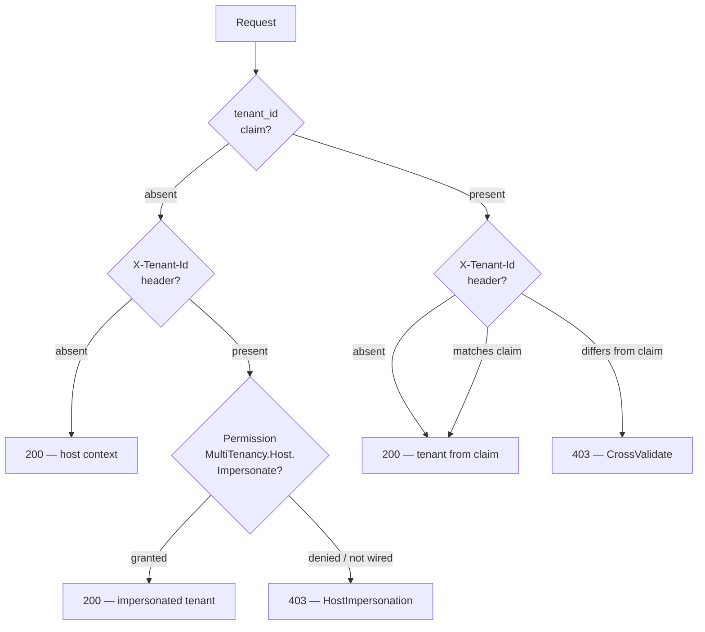
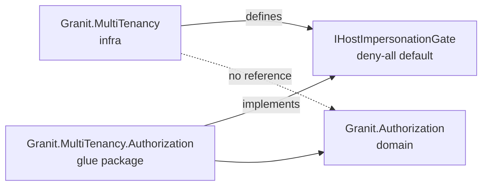

import { Aside, Steps } from "@astrojs/starlight/components";

Granit identifies the **scope of a user** through a single OIDC claim: `tenant_id`.
If the claim is present in the token, the user belongs to that tenant. If the claim
is absent, the user is a host user. This rule is the only signal — there is no
parallel `is_host` claim, and frontends must never infer host status from the
absence of a tenant identifier they computed themselves.

## The rule

| Token contents | User scope |
|----------------|------------|
| `tenant_id: <guid>` | Tenant user, scoped to that tenant |
| *(no `tenant_id` claim)* | Host user |

The rule is **biconditional**: claim present ⇔ tenant, claim absent ⇔ host. The
backend never emits a `tenant_id` claim with a `null` or empty value to represent
a host user — it omits the claim entirely.

## Why no parallel `is_host` claim

A separate `is_host` boolean would be redundant with the presence of `tenant_id`,
and redundancy invites drift: a token with `tenant_id` set and `is_host: true`,
or with neither, is unambiguous in intent but impossible to interpret without a
tiebreaker. The single-claim convention keeps the OIDC principal as the **single
source of truth**, and every layer (BFF, resolvers, middleware, authorization)
reads the same signal.

<Aside type="caution" title="Don't infer host from frontend state">
SPAs must not compute "I am a host user" from `tenantId == null` in client memory.
The `tenant_id` claim lives in the OIDC token, server-side. The BFF surfaces an
explicit `isHost` boolean (see below) so clients have a stable, server-vetted
signal instead of guessing.
</Aside>

## Server-side emission (OIDC)

`OidcPrincipalFactory` emits the `tenant_id` claim **only when**
`user.TenantId is not null`. There is no fallback, no empty-string variant, and
no null-typed claim — when the user is a host user, the claim is simply not
written to the principal.

```csharp
// Excerpt: OidcPrincipalFactory
if (user.TenantId is not null)
{
    identity.SetClaim("tenant_id", user.TenantId.Value.ToString());
}
```

`DefaultClaimsDestinationProvider` routes the claim to both `access_token` and
`id_token`, so every consumer (API resolvers, BFF user endpoint, downstream
services) sees the same value. The convention is pinned by three tests in
`OidcPrincipalFactoryTests` covering:

- A tenant user produces a `tenant_id` claim equal to `user.TenantId.ToString()`.
- A host user produces a principal with **no** `tenant_id` claim at all.
- The claim is propagated to both `access_token` and `id_token` destinations.

These tests are the canonical regression net for the convention — change them
only when changing the contract itself.

## BFF surface — `/bff/user`

The BFF user endpoint returns a derived `isHost: bool` computed server-side from
the `id_token`. Clients read this boolean directly instead of inspecting tenant
identifiers:

```json
GET /bff/user

{
  "isAuthenticated": true,
  "userId": "...",
  "tenantId": "3fa85f64-5695-4b5a-b7d9-c4f11f0b7f5e",
  "isHost": false,
  "claims": [ /* ... */ ]
}
```

For a host user, the response is:

```json
{
  "isAuthenticated": true,
  "userId": "...",
  "tenantId": null,
  "isHost": true,
  "claims": [ /* ... */ ]
}
```

SPAs gate UI on `isHost`. They do not gate on `tenantId == null` — that field is
informational, and the server's `isHost` value is the contract.

## Backend tenant authority

`TenantResolutionMiddleware` runs after authentication and is the only component
that decides the active tenant for a request. In the default `CrossValidate`
mode, if both an `X-Tenant-Id` header and a `tenant_id` claim are present, they
**must match exactly** — any mismatch is rejected with HTTP 403.



This is the **only** place tenant authority is decided. Downstream code reads
`ICurrentTenant`; it never re-checks the JWT or the header.

See [Tenant Resolvers](/dotnet/infrastructure/multi-tenancy/resolvers/) for the resolver pipeline and the trust
modes (`Unrestricted` vs `CrossValidate`).

## Host impersonation

A host user has no `tenant_id` claim. When such a user wants to act inside a
tenant scope, they send `X-Tenant-Id: <guid>` on the request. The middleware
only honors that header if the caller holds the permission
`MultiTenancy.Host.Impersonate`. Without the permission, the request is rejected
with 403.

Impersonation is **secure-by-default**: the abstraction shipped with
`Granit.MultiTenancy` is a deny-all `IHostImpersonationGate` implementation. The
permission-aware gate ships in the glue package
`Granit.MultiTenancy.Authorization` and is wired explicitly by the host:

```csharp
services.AddGranitHostImpersonationWithPermissions();
```

If `AddGranitHostImpersonationWithPermissions()` is not called, **every**
impersonation attempt is denied with reason `HostImpersonation.NotConfigured`.
There is no implicit fallback — opting in is an explicit, auditable step.

<Aside type="tip" title="Permission key">
The permission key is `MultiTenancy.Host.Impersonate`. Grant it sparingly —
typically only to host administrators acting through support tooling.
</Aside>

## Architecture — no domain dependency

`Granit.MultiTenancy` (infrastructure) does **not** reference
`Granit.Authorization` (domain). The infra package exposes an abstraction —
`IHostImpersonationGate` — with a deny-all default implementation. The
permission-aware implementation lives in the glue package
`Granit.MultiTenancy.Authorization` and is the only place where the two domains
meet.



The architecture test
`Granit_MultiTenancy_must_not_reference_Granit_Authorization` enforces this rule
in CI. The direction of the dependency matters: infrastructure must not pull in
domain concerns, otherwise every multi-tenant app drags the authorization
domain into its lowest-level packages.

## See also

- [Tenant Resolvers](/dotnet/infrastructure/multi-tenancy/resolvers/) — `JwtClaimTenantResolver`, header trust
  modes, and the resolver pipeline
- [Host vs Tenant](/dotnet/infrastructure/multi-tenancy/host-tenant/) — schema separation and host admin
  cross-tenant access
- [Multi-tenancy concept](/dotnet/concepts/multi-tenancy/) — the problem and
  the query-filter model
