import { Tabs, TabItem, FileTree } from "@astrojs/starlight/components";

Granit.Notifications is a multi-channel notification engine built on a fan-out
pattern. A single `INotificationPublisher.PublishAsync()` call fans out to every
registered channel (InApp, Email, SMS, WhatsApp, Mobile Push, SignalR, SSE,
Web Push, Zulip) after filtering through user preferences. Delivery attempts are
recorded in an immutable audit trail (ISO 27001). By default, notifications
dispatch via an in-process `Channel<T>` -- add `Granit.Notifications.Wolverine`
for durable outbox-backed dispatch with exponential backoff retry.

## Package structure

Channel packages (`Email`, `Sms`, `MobilePush`, `WhatsApp`, …) define the
capability contracts; provider packages sit at the top level and implement one
or more capabilities as Keyed Services. Multi-capability providers
(`AwsSns`, `AzureCommunicationServices`, `Brevo`, `Twilio`) register each
capability only when its configuration section exists — an SMS-only host never
wires the push sender.

<FileTree>
- Granit.Notifications/ Core: fan-out engine, InApp channel, definitions, entity tracking
  - Granit.Notifications.EntityFrameworkCore EF Core persistence (all stores)
  - Granit.Notifications.Endpoints Minimal API REST endpoints
  - Granit.Notifications.Wolverine Durable outbox dispatch via IMessageBus
  - Granit.Notifications.Privacy GDPR export/deletion satellite (notifications data)
  - Granit.Notifications.Email Email channel abstraction (Keyed Services)
  - Granit.Notifications.Sms SMS channel abstraction (Keyed Services)
  - Granit.Notifications.WhatsApp WhatsApp Business API channel
  - Granit.Notifications.MobilePush/ Mobile push abstraction + token store
    - Granit.Notifications.MobilePush.Privacy GDPR export/deletion satellite (push tokens)
  - Granit.Notifications.SignalR Real-time SignalR channel + Redis backplane
  - Granit.Notifications.WebPush/ W3C Web Push (VAPID, RFC 8030)
    - Granit.Notifications.WebPush.Privacy GDPR export/deletion satellite (subscriptions)
  - Granit.Notifications.Sse/ Server-Sent Events channel (.NET 10)
    - Granit.Notifications.Sse.StackExchangeRedis Redis pub/sub backplane for multi-replica SSE
  - Granit.Notifications.Smtp MailKit SMTP provider (Email)
  - Granit.Notifications.AwsSes AWS SES provider (Email)
  - Granit.Notifications.Scaleway Scaleway TEM provider (Email)
  - Granit.Notifications.SendGrid SendGrid provider (Email)
  - Granit.Notifications.AzureCommunicationServices Azure Communication Services (Email + SMS)
  - Granit.Notifications.AwsSns AWS SNS (SMS + Mobile Push)
  - Granit.Notifications.Brevo Unified Brevo provider (Email + SMS + WhatsApp)
  - Granit.Notifications.Twilio Twilio provider (SMS + WhatsApp)
  - Granit.Notifications.GoogleFcm Firebase Cloud Messaging provider (Mobile Push)
  - Granit.Notifications.AzureNotificationHubs Azure Notification Hubs provider (Mobile Push)
  - Granit.Notifications.Zulip Zulip chat integration
</FileTree>

| Package | Role | Depends on |
|---------|------|------------|
| `Granit.Notifications` | Fan-out engine, InApp channel, definitions, entity tracking | `Granit.Guids`, `Granit.Timing`, `Granit.QueryEngine` |
| `Granit.Notifications.EntityFrameworkCore` | EF Core stores (all entities + mobile push tokens) | `Granit.Notifications`, `Granit.Notifications.MobilePush`, `Granit.Persistence` |
| `Granit.Notifications.Endpoints` | Minimal API endpoints (inbox, preferences, subscriptions, followers) | `Granit.Notifications`, `Granit.Notifications.MobilePush`, `Granit.Validation`, `Granit.Http.ApiDocumentation` |
| `Granit.Notifications.Wolverine` | Durable outbox-backed dispatch via `IMessageBus` | `Granit.Notifications`, `Granit.Wolverine` |
| `Granit.Notifications.Privacy` | GDPR export/deletion satellite for notifications data | `Granit.Notifications`, `Granit.Privacy.BlobStorage` |
| `Granit.Notifications.Email` | Email channel abstraction, Keyed Services resolution | `Granit.Notifications` |
| `Granit.Notifications.Sms` | SMS channel abstraction, Keyed Services resolution | `Granit.Notifications` |
| `Granit.Notifications.WhatsApp` | WhatsApp Business API channel | `Granit.Notifications` |
| `Granit.Notifications.MobilePush` | Mobile push abstraction + device token store | `Granit.Notifications` |
| `Granit.Notifications.MobilePush.Privacy` | GDPR export/deletion satellite for push device tokens (masked) | `Granit.Notifications.MobilePush`, `Granit.Privacy.BlobStorage` |
| `Granit.Notifications.Smtp` | MailKit SMTP provider (Keyed Service `"Smtp"`) | `Granit.Notifications.Email` |
| `Granit.Notifications.AwsSes` | AWS SES email provider (Keyed Service `"AwsSes"`) | `Granit.Notifications.Email` |
| `Granit.Notifications.Scaleway` | Scaleway TEM email provider (Keyed Service `"Scaleway"`) | `Granit.Notifications.Email` |
| `Granit.Notifications.SendGrid` | SendGrid email provider (Keyed Service `"SendGrid"`) | `Granit.Notifications.Email` |
| `Granit.Notifications.AzureCommunicationServices` | Azure Communication Services provider — Email + SMS, each capability activated by its config section (Keyed Service `"AzureCommunicationServices"`) | `Granit.Notifications.Email`, `Granit.Notifications.Sms` |
| `Granit.Notifications.AwsSns` | AWS SNS provider — SMS + Platform Application push, each capability activated by its config section (Keyed Service `"AwsSns"`) | `Granit.Notifications.Sms`, `Granit.Notifications.MobilePush` |
| `Granit.Notifications.Brevo` | Unified Brevo provider (Email + SMS + WhatsApp) | `Granit.Notifications.Email`, `Granit.Notifications.Sms`, `Granit.Notifications.WhatsApp` |
| `Granit.Notifications.Twilio` | Twilio SMS + WhatsApp provider (Keyed Service `"Twilio"`) | `Granit.Notifications.Sms`, `Granit.Notifications.WhatsApp` |
| `Granit.Notifications.GoogleFcm` | Firebase Cloud Messaging (FCM HTTP v1 API, OAuth2 bearer via service account) | `Granit.Notifications.MobilePush` |
| `Granit.Notifications.AzureNotificationHubs` | Azure Notification Hubs push provider (Keyed Service `"AzureNotificationHubs"`) | `Granit.Notifications.MobilePush` |
| `Granit.Notifications.SignalR` | Real-time SignalR channel + Redis backplane | `Granit.Notifications` |
| `Granit.Notifications.WebPush` | W3C Web Push (VAPID, RFC 8030/8291/8292) | `Granit.Notifications` |
| `Granit.Notifications.WebPush.Privacy` | GDPR export/deletion satellite for Web Push subscriptions (masked) | `Granit.Notifications.WebPush`, `Granit.Privacy.BlobStorage` |
| `Granit.Notifications.Sse` | Server-Sent Events channel (.NET 10 native SSE) | `Granit.Notifications` |
| `Granit.Notifications.Sse.StackExchangeRedis` | Redis pub/sub backplane for multi-replica SSE delivery (shared `IConnectionMultiplexer`) | `Granit.Notifications.Sse` |
| `Granit.Notifications.Zulip` | Zulip Bot API chat integration | `Granit.Notifications` |

## Dependency graph

```mermaid
graph TD
    N[Granit.Notifications] --> G[Granit.Guids]
    N --> T[Granit.Timing]
    N --> Q[Granit.QueryEngine]

    NEF[Granit.Notifications.EntityFrameworkCore] --> N
    NEF --> MP[Granit.Notifications.MobilePush]
    NEF --> P[Granit.Persistence]

    NE[Granit.Notifications.Endpoints] --> N
    NE --> MP
    NE --> V[Granit.Validation]
    NE --> AD[Granit.Http.ApiDocumentation]

    NW[Granit.Notifications.Wolverine] --> N
    NW --> W[Granit.Wolverine]

    EM[Granit.Notifications.Email] --> N
    SMTP[Granit.Notifications.Smtp] --> EM
    SES[Granit.Notifications.AwsSes] --> EM
    SCW[Granit.Notifications.Scaleway] --> EM
    SG[Granit.Notifications.SendGrid] --> EM
    ACS[Granit.Notifications.AzureCommunicationServices] --> EM
    ACS --> SMS[Granit.Notifications.Sms]
    BR[Granit.Notifications.Brevo] --> EM
    BR --> SMS
    BR --> WA[Granit.Notifications.WhatsApp]

    SMS --> N
    SNS[Granit.Notifications.AwsSns] --> SMS
    SNS --> MP
    TW[Granit.Notifications.Twilio] --> SMS
    TW --> WA
    WA --> N
    MP --> N
    FCM[Granit.Notifications.GoogleFcm] --> MP
    ANH[Granit.Notifications.AzureNotificationHubs] --> MP
    SR[Granit.Notifications.SignalR] --> N
    WP[Granit.Notifications.WebPush] --> N
    SSE[Granit.Notifications.Sse] --> N
    SSER[Granit.Notifications.Sse.StackExchangeRedis] --> SSE
    ZU[Granit.Notifications.Zulip] --> N

    PRV[Granit.Notifications.Privacy] --> N
    MPPRV[Granit.Notifications.MobilePush.Privacy] --> MP
    WPPRV[Granit.Notifications.WebPush.Privacy] --> WP
```



## Setup

<Tabs>
<TabItem label="Production (Wolverine + EF Core)">

```csharp
[DependsOn(typeof(GranitNotificationsWolverineModule))]
[DependsOn(typeof(GranitNotificationsEntityFrameworkCoreModule))]
[DependsOn(typeof(GranitNotificationsEndpointsModule))]
public class AppModule : GranitModule
{
    public override void ConfigureServices(ServiceConfigurationContext context)
    {
        // EF Core persistence (replaces in-memory defaults)
        context.Builder.AddGranitNotificationsEntityFrameworkCore(
            opts => opts.UseNpgsql(context.Configuration
                .GetConnectionString("Notifications")));

        // Email channel via SMTP
        context.Services.AddGranitNotificationsEmail(opts => opts.Provider = "Smtp");
        context.Services.AddGranitNotificationsSmtp();

        // SignalR real-time channel with Redis backplane
        context.Services.AddGranitNotificationsSignalR(
            context.Configuration.GetConnectionString("Redis")!);
    }

    public override void OnApplicationInitialization(ApplicationInitializationContext context)
    {
        context.App.MapGranitNotifications();
        context.App.MapHub<NotificationHub>("/hubs/notifications");
    }
}
```

</TabItem>
<TabItem label="Development (in-memory)">

```csharp
[DependsOn(typeof(GranitNotificationsModule))]
public class AppModule : GranitModule { }
```

In-memory stores, in-process `Channel<T>` dispatch. No database, no outbox.
Notifications are lost on crash -- suitable for development only.

</TabItem>
<TabItem label="With Brevo (Email + SMS + WhatsApp)">

```csharp
// One provider for three channels
context.Services.AddGranitNotificationsBrevo();
context.Services.AddGranitNotificationsEmail(opts => opts.Provider = "Brevo");
context.Services.AddGranitNotificationsSms(opts => opts.Provider = "Brevo");
context.Services.AddGranitNotificationsWhatsApp(opts => opts.Provider = "Brevo");
```

```json
{
  "Notifications": {
    "Brevo": {
      "ApiKey": "vault:secret/data/brevo#api-key",
      "DefaultSenderEmail": "noreply@clinic.example.com",
      "DefaultSenderName": "Clinic Portal",
      "DefaultSmsSenderId": "CLINIC"
    }
  }
}
```

</TabItem>
</Tabs>

## Building your own `*.Notifications` package

Modules that emit user-facing events (export ready, payment succeeded, quota
exceeded…) ship a sibling `Granit.{Module}.Notifications` package wiring the
event to the fan-out engine and providing the email templates. The
[notifications package conventions](/dotnet/infrastructure/notifications/conventions/) page documents the
canonical file layout, the Wolverine handler shape, the `<title>`-tag subject
extraction, the JSON-array `*Display` companion gotcha, the manifest pinning
test, and the embedded-vs-DB template override mechanics.

## What's next

- [Fan-Out Engine](/dotnet/infrastructure/notifications/fan-out-engine/) — multi-channel dispatch, preference filtering, audit trail
- [Channels Overview](/dotnet/infrastructure/notifications/channels/) — capability matrix across InApp, Email, SMS, Push, Realtime
- [Email Channel](/dotnet/infrastructure/notifications/email-channel/) — SMTP, SendGrid, Azure, Scaleway, Brevo providers
- [SMS, Push & Real-Time](/dotnet/infrastructure/notifications/sms-push-realtime/) — WhatsApp, FCM, SignalR, SSE, Web Push
- [Wolverine Integration](/dotnet/infrastructure/notifications/wolverine-integration/) — durable outbox dispatch with retry
- [Data Model](/dotnet/infrastructure/notifications/data-model/) — entities, CQRS stores, user preferences
- [Endpoints](/dotnet/infrastructure/notifications/endpoints/) — inbox, preferences, subscriptions, follower REST API
- [Configuration](/dotnet/infrastructure/notifications/configuration/) — options, health checks, provider selection
- [Package Conventions](/dotnet/infrastructure/notifications/conventions/) — file layout, Wolverine handler shape, manifest pinning
- [Recipes](/dotnet/infrastructure/notifications/recipes/) — workflow integration, authorization, encryption patterns

## See also

- [Templating module](/dotnet/building-blocks/templating/) — the engine that renders notification subjects and bodies
- [Wolverine messaging](/dotnet/infrastructure/wolverine-messaging/) — outbox pattern and tenant context propagation
- [Multi-tenancy](/dotnet/infrastructure/multi-tenancy/) — tenant-scoped delivery and preferences
- [Set up notifications guide](/dotnet/guides/set-up-notifications/) — step-by-step provider wiring
- [Blog: Multi-channel notifications in .NET](/blog/multi-channel-notifications-dotnet/) — architectural walkthrough of the channels and fan-out engine
