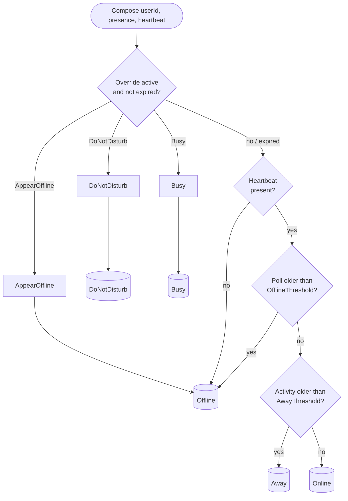
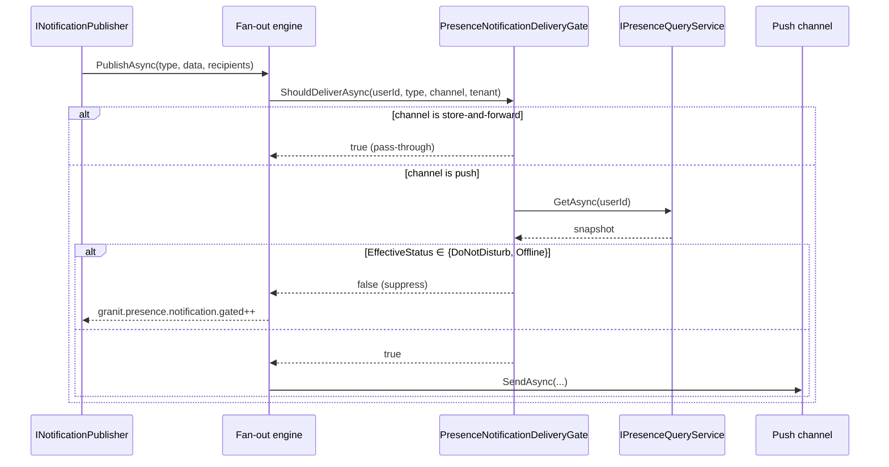

import { Aside, Card, CardGrid, FileTree, LinkCard, Tabs, TabItem } from "@astrojs/starlight/components";

`Granit.Presence` answers two orthogonal questions about who is around. The
first — the original dimension — is **user-global**: *is this user reachable
right now, and through which channels?* It blends a volatile client heartbeat
with a persisted manual override (`Available`, `Busy`, `DoNotDisturb`,
`AppearOffline`) into an effective `PresenceStatus`, and exposes that snapshot
through HTTP endpoints, an integration event, and an optional notification
delivery gate that suppresses push channels when the user does not want to be
paged.

The second dimension — **resource-scoped rooms** — answers *who else is looking
at this resource right now?* It is the Google Docs / Notion face-pile primitive:
informational, non-blocking awareness for collaborative surfaces. The rest of
this page documents the user-global dimension; the room model lives on its own
[Resource rooms](/dotnet/infrastructure/presence/resource-rooms/) page.

The module is split across four NuGet packages so apps only pay for the moving
parts they need: the core (`Granit.Presence`) is in-memory and single-pod by
default, persistence is opt-in (`Granit.Presence.EntityFrameworkCore`), HTTP
endpoints are opt-in (`Granit.Presence.Endpoints`), and the bridge to the
notification fan-out engine is opt-in (`Granit.Presence.Notifications`).

## Two dimensions of presence

These dimensions are independent — a surface can use either or both. They share
the same FusionCache backplane, options, and diagnostics meter, so there is
nothing extra to install for rooms.

<CardGrid>
  <Card title="User-global presence" icon="user">
    *Is this person reachable?* One status per human, composed from a heartbeat
    and a manual override, driving notification suppression. **This page.**
  </Card>
  <Card title="Resource-scoped rooms" icon="document">
    *Who is in this room?* A live participant list per `(Kind, Id)` resource —
    the co-editing face-pile. Action-driven and non-blocking.
  </Card>
</CardGrid>

<LinkCard
  title="Resource rooms →"
  description="The room model, lifecycle, REST API, DnD interplay, and the migration recipe from an in-house implementation."
  href="/dotnet/infrastructure/presence/resource-rooms/"
/>

<Aside type="tip" title="Rooms vs EditLocking">
Rooms surface *awareness* but never block writes. When you need to actually
prevent concurrent edits, that is the complementary `Granit.EditLocking`
primitive — see the
[decision table](/dotnet/infrastructure/presence/resource-rooms/#when-to-use-rooms-vs-editlocking).
</Aside>

## Why presence?

Presence shows up wherever the framework needs to make a routing decision
*before* the user is informed of something:

- **Timeline / mentions / messaging** — render the right dot next to an
  avatar, decide whether to nudge with a desktop toast or wait for the user
  to come back.
- **Notification suppression** — drop push, SignalR, SSE, and mobile push
  for users in `DoNotDisturb` or `Offline`, but keep store-and-forward
  channels (`InApp`, `Email`, `Sms`, `WhatsApp`, `Zulip`) delivering.
- **Cross-pod fan-out** — paired with `Granit.Caching.StackExchangeRedis`,
  the FusionCache backplane broadcasts heartbeat updates between hosts so a
  user who pings pod A is visible from pod B without a database round-trip.

## At a glance

| Package | Role |
|---------|------|
| `Granit.Presence` | Abstractions, domain types, in-memory store, FusionCache tracker, query/recorder/override services, meter + ActivitySource. |
| `Granit.Presence.EntityFrameworkCore` | Durable `IPresenceStore` backed by `PresenceDbContext` (host schema, table `presence_user_presence`). |
| `Granit.Presence.Endpoints` | Minimal API (`/presence/*`), DTOs, FluentValidation validators, `Presence.Self.Manage` / `Presence.Users.Read` permissions, 18-culture localization. |
| `Granit.Presence.Notifications` | `INotificationDeliveryGate` that suppresses push channels for `DoNotDisturb` / `Offline` recipients. |

## Package structure

<FileTree>
- Granit.Presence/ Abstractions, domain, in-memory + FusionCache defaults, DI
  - Granit.Presence.EntityFrameworkCore EF Core store, `presence_user_presence` table
  - Granit.Presence.Endpoints Minimal API, DTOs, validators, permissions, i18n
  - Granit.Presence.Notifications Push-channel suppression for DnD / Offline
</FileTree>

## Quickstart

<Tabs>
<TabItem label="1. In-memory (dev)">

```csharp
[DependsOn(typeof(GranitPresenceModule))]
public sealed class AppModule : GranitModule { }
```

In-memory `IPresenceStore`, FusionCache L1 only. Single-pod, no persistence —
suitable for development and tests.

</TabItem>
<TabItem label="2. + EF Core persistence">

```csharp
[DependsOn(
    typeof(GranitPresenceModule),
    typeof(GranitPresenceEntityFrameworkCoreModule))]
public sealed class AppModule : GranitModule
{
    public override void ConfigureServices(ServiceConfigurationContext context)
    {
        context.Builder.AddGranitPresenceEntityFrameworkCore(
            opts => opts.UseNpgsql(context.Configuration
                .GetConnectionString("Presence")));
    }

    public override void OnApplicationInitialization(ApplicationInitializationContext context)
    {
        context.App.MapGranitPresence();
    }
}
```

`UserPresence` rows are persisted to the host schema (table
`presence_user_presence`). The heartbeat stays cache-only — see
[Why the heartbeat is cache-only](#why-the-heartbeat-is-not-persisted).

</TabItem>
<TabItem label="3. + Notification gate">

```csharp
[DependsOn(
    typeof(GranitPresenceModule),
    typeof(GranitPresenceEntityFrameworkCoreModule),
    typeof(GranitPresenceNotificationsModule),
    typeof(GranitNotificationsModule))]
public sealed class AppModule : GranitModule { /* … */ }
```

Once `Granit.Presence.Notifications` is loaded, the fan-out engine consults
`PresenceNotificationDeliveryGate` per delivery attempt. Push channels are
suppressed for recipients in `DoNotDisturb` or `Offline`; store-and-forward
channels keep delivering.

</TabItem>
</Tabs>

## Conceptual model

`EffectiveStatus` is **composed server-side** from two sources:

1. The **manual override** persisted on the `UserPresence` aggregate (DB via
   EF Core, or in-memory by default) — `Available`, `Busy`, `DoNotDisturb`,
   `AppearOffline`, with an optional `OverrideUntilUtc`.
2. The **live heartbeat** cached in FusionCache (L1 + optional Redis L2
   backplane) — `LastPollUtc` + `LastActivityUtc`.

`PresenceQueryService.Compose(userId, presence, heartbeat)` deterministically
folds them into a `PresenceSnapshot`:



### Anti-flapping multi-tab merge

A user with three tabs open polls three times per cycle, each with its own
client-reported idle duration. The tracker reconstructs `LastActivityUtc` as
`now − idleDuration` and merges with the existing entry using a MAX rule:

```text
LastActivityUtc := MAX(existing.LastActivityUtc, now − idleDuration)
```

This avoids the classic flap where a backgrounded tab reports a long idle
period right after an active tab reported zero. No front-end coordination is
required — the merge is server-side in `FusionCachePresenceTracker.RecordPollAsync`.

### Why presence is global (no `TenantId`)

`UserPresence` is **not** `IMultiTenant`. A human carries one presence across
every tenant they belong to: the consultant logged into three customer
tenants is online once, not three times. The aggregate's primary key is
`UserId`, the EF Core configuration places the table in the host schema, and
the visibility policy (`IPresenceVisibilityPolicy`) is the seam multi-tenant
apps use to restrict cross-tenant reads.

### Why the heartbeat is not persisted

The heartbeat is volatile by design — every 30-60 s a fresh poll arrives,
the previous one is moot. Persisting it would generate sustained write
amplification (≈ 1 write per active user per polling cycle) for data that
must be discarded on pod restart anyway. The cache TTL (`HeartbeatCacheTtl`,
default 120 s) is the entire lifecycle: an absent entry naturally means
*offline*.

## Configuration

Bound from the `Presence` section of `appsettings.json` and validated at
startup by `PresenceOptionsValidator`:

| Option | Default | Bounds | Purpose |
|--------|---------|--------|---------|
| `OfflineThreshold` | `00:01:30` (90 s) | `> 0`, `≤ 30 min` | Heartbeat older than this → `Offline`. |
| `AwayThreshold` | `00:03:00` (3 min) | `> 0`, `≤ 2 h` | Activity older than this → `Away`. |
| `HeartbeatCacheTtl` | `00:02:00` (120 s) | `≥ OfflineThreshold` | TTL of the cached heartbeat. |
| `MaxBatchSize` | `200` | `1`–`1000` | Cap on `POST /presence/users/batch`. |
| `MaxOverrideDuration` | `7.00:00:00` (7 d) | `> 0`, `≤ 30 d` | Cap on `OverrideUntilUtc - now`. |

```json
{
  "Presence": {
    "OfflineThreshold": "00:01:30",
    "AwayThreshold": "00:03:00",
    "HeartbeatCacheTtl": "00:02:00",
    "MaxBatchSize": 200,
    "MaxOverrideDuration": "7.00:00:00"
  }
}
```

<Aside type="caution" title="HeartbeatCacheTtl must be ≥ OfflineThreshold">
A TTL shorter than the offline threshold makes the cache forget the
heartbeat *before* it is considered stale, flipping the user to Offline
prematurely. The startup validator rejects this combination.
</Aside>

## HTTP API

`MapGranitPresence(endpoints, configure?)` mounts six routes under the
`PresenceEndpointsOptions.RoutePrefix` (default `presence`) and tags them
`Presence` in the OpenAPI document. All routes require authentication; the
self routes additionally require `Presence.Self.Manage` and the cross-user
routes require `Presence.Users.Read`.

| Method | Route | Permission | Rate-limit policy |
|--------|-------|------------|-------------------|
| `GET` | `/presence/my` | (auth only) | — |
| `PUT` | `/presence/my` | `Presence.Self.Manage` | `presence-mutate` |
| `DELETE` | `/presence/my/override` | `Presence.Self.Manage` | `presence-mutate` |
| `POST` | `/presence/my/poll` | `Presence.Self.Manage` | `presence-poll` |
| `GET` | `/presence/users/{userId:guid}` | `Presence.Users.Read` | `presence-query` |
| `POST` | `/presence/users/batch` | `Presence.Users.Read` | `presence-query` |

<Aside type="note" title="Mount behind Granit.Bff">
The mutating routes (`PUT /my`, `DELETE /my/override`, `POST /my/poll`,
`POST /users/batch`) are state-changing and must NOT be reachable from a
browser session without CSRF protection. The intended topology mounts these
endpoints behind `Granit.Bff`, which enforces the anti-forgery token on every
mutating call.
</Aside>

### `POST /presence/my/poll`

Records a heartbeat and returns the post-merge snapshot. Clients call this
every 30–60 s with the user's local idle duration in seconds; the server
reconstructs `LastActivityUtc` using its own clock to avoid client clock-skew.

```http
POST /presence/my/poll
Content-Type: application/json

{ "idleSeconds": 12 }
```

```json
{
  "userId": "f4a1…",
  "effectiveStatus": "Online",
  "manualOverride": null,
  "overrideUntilUtc": null,
  "lastSeenUtc": "2026-05-23T08:42:11.123Z"
}
```

### `PUT /presence/my`

Sets or clears the caller's manual override. Passing
`manualStatus: "Available"` clears it; `untilUtc` is optional and bounded by
`Presence:MaxOverrideDuration`.

```http
PUT /presence/my
Content-Type: application/json

{
  "manualStatus": "DoNotDisturb",
  "untilUtc": "2026-05-23T18:00:00Z"
}
```

### `POST /presence/users/batch`

Returns snapshots for up to `MaxBatchSize` users (default 200) in a single
call. `POST` is used because UUID lists exceed practical URL length around
50 entries. Targets the caller is not allowed to read (per
`IPresenceVisibilityPolicy`) are **silently omitted** from the response — not
403'd — so the response shape cannot be used as an enumeration oracle.

```http
POST /presence/users/batch
Content-Type: application/json

{ "userIds": ["f4a1…", "9c00…", "21b8…"] }
```

```json
{
  "presences": {
    "f4a1…": { "userId": "f4a1…", "effectiveStatus": "Online",       "manualOverride": null,           "overrideUntilUtc": null, "lastSeenUtc": "2026-05-23T08:42:11.123Z" },
    "9c00…": { "userId": "9c00…", "effectiveStatus": "DoNotDisturb", "manualOverride": "DoNotDisturb", "overrideUntilUtc": "2026-05-23T18:00:00Z", "lastSeenUtc": "2026-05-23T08:40:55.000Z" }
  }
}
```

### Validation error codes

Validators are auto-discovered (FluentValidation + Granit.Validation) and
return localized messages keyed by the following error codes:

| Code | Trigger |
|------|---------|
| `Granit:Validation:PresenceBatchDuplicates` | Same user id appears twice in `userIds`. |
| `Granit:Validation:PresenceBatchTooLarge` | `userIds.Count > MaxBatchSize`. |
| `Granit:Validation:PresenceIdleSecondsNegative` | `idleSeconds < 0`. |
| `Granit:Validation:PresenceIdleSecondsTooLarge` | `idleSeconds > 2 × OfflineThreshold`. |
| `Granit:Validation:PresenceOverrideUntilInPast` | `untilUtc ≤ now + 1s`. |
| `Granit:Validation:PresenceOverrideUntilTooFar` | `untilUtc - now > MaxOverrideDuration`. |
| `Granit:Validation:PresenceUntilWithoutOverride` | `manualStatus = Available` with a non-null `untilUtc`. |

Messages ship in the **18 cultures** Granit standardizes on (15 base
languages + 3 regional variants) via `PresenceEndpointsLocalizationResource`.

## Permissions

Declared by `PresencePermissionDefinitionProvider` (auto-discovered) under
the `Presence` permission group, both with `MultiTenancySides.Both`:

| Permission | Allows |
|------------|--------|
| `Presence.Self.Manage` | Set or clear one's own manual override; record one's own heartbeat. |
| `Presence.Users.Read` | Read another user's presence snapshot (single or batch). |

## Notification delivery gate

`PresenceNotificationDeliveryGate` (registered as `INotificationDeliveryGate`
when `Granit.Presence.Notifications` is loaded) is consulted by the fan-out
engine **per delivery attempt**:



**Push channels gated** (suppressed when `EffectiveStatus` is
`DoNotDisturb` or `Offline`): `SignalR`, `Sse`, `Push` (web push),
`MobilePush`.

**Channels always delivered** (store-and-forward): `InApp`, `Email`, `Sms`,
`WhatsApp`, `Zulip`. The user can read them when they return.

<Aside type="tip" title="AllowDoNotDisturbBypass for security alerts">
Notifications whose `NotificationDefinition` opts into
`AllowDoNotDisturbBypass = true` bypass the gate — the fan-out engine never
asks the gate for them. Reserve the bypass for the narrow set of messages
that must reach the user regardless of presence (security alerts, account
lockouts, regulatory notices). See
[Notifications package conventions](/dotnet/infrastructure/notifications/conventions/#delivery-gates).
</Aside>

<Aside type="note" title="External (non-GUID) user ids fail open">
`Granit.Presence` keys on `Guid`. When the notification recipient is an
external identity (OIDC `sub`, email, …) the gate cannot look the user up
and lets the message through. Apps that need stricter coupling can replace
the gate with a custom implementation.
</Aside>

## Diagnostics

### Meter: `Granit.Presence`

| Counter | Tags |
|---------|------|
| `granit.presence.heartbeat.received` | `tenant_id` |
| `granit.presence.status.changed` | `tenant_id`, `from`, `to` |
| `granit.presence.override.set` | `tenant_id`, `status`, `has_until` |
| `granit.presence.notification.gated` | `tenant_id`, `channel` |

`tenant_id` defaults to the literal `"global"` when `ICurrentTenant` is
unavailable (single-tenant host, background work).

### ActivitySource: `Granit.Presence`

| Operation | Emitted by |
|-----------|------------|
| `presence.record_poll` | `PresenceHeartbeatRecorder.RecordAsync` |
| `presence.query_effective` | `PresenceQueryService.GetAsync` / `GetManyAsync` |
| `presence.set_override` | `PresenceOverrideService.SetAsync` / `ClearAsync` |
| `presence.gate_notification` | `PresenceNotificationDeliveryGate.ShouldDeliverAsync` |

`Granit.Observability` registers the source automatically via
`GranitActivitySourceRegistry` when both packages are loaded.

## Cross-pod operation

The default `FusionCachePresenceTracker` uses the `IFusionCache` provided by
`Granit.Caching` with the key prefix `granit:presence:`. Single-pod
deployments need nothing more. **Multi-pod deployments** must also load
`Granit.Caching.StackExchangeRedis`: FusionCache's Redis L2 backplane then
propagates heartbeat updates between hosts, so a user who pings pod A is
visible from pod B without each pod re-querying.

Without the Redis backplane, a heartbeat recorded on pod A is invisible to
pod B for the L1 TTL — clients hitting different pods would see different
effective statuses for the same user. The startup checks in
`PresenceStartupChecks` log a warning when this combination is detected.

## Limitations and non-goals

- **No presence history.** `UserPresence` stores only the *current* override.
  There is no audit trail of past statuses — `Granit.Auditing` covers the
  override mutation if you need a paper trail.
- **`LastSeenUtc` reflects the heartbeat, not the activity.** It is the
  instant of the most recent successful poll. A user with the tab open but
  truly idle is "last seen" 30 s ago, not "last active" — the activity timing
  surfaces only inside `Away` derivation, not in the response.
- **Fixed status vocabulary.** Only the five `PresenceStatus` values
  (`Online`, `Away`, `Offline`, `Busy`, `DoNotDisturb`). Custom status strings
  ("In a meeting", "Driving") are explicitly out of scope — they belong in a
  domain-specific module, not in the presence primitive.
- **No mobile background lifecycle.** The heartbeat is driven by the client
  app being foregrounded. A backgrounded mobile app will not poll;
  presence-aware push must read the *snapshot* (via the gate), not assume
  the client is alive.

## Companion SDK

A React / TanStack Query integration ships separately in `granit-front` and
demonstrates the polling cadence, multi-tab merge handling on the client
side, and the realtime invalidation triggered by `UserPresenceChangedEto`.
See the showcase apps in `granit-showcase-react` and
`granit-showcase-dotnet` for a complete wiring example.

## See also

- [Resource rooms](/dotnet/infrastructure/presence/resource-rooms/) — the resource-scoped awareness dimension
- [Resource kind naming](/dotnet/infrastructure/presence/resource-kind-naming/) — the `<module>.<entity>` convention for rooms
- [Metadata contract](/dotnet/infrastructure/presence/metadata-contract/) — the participant metadata blob: shape, size cap, PII rules
- [Notifications conventions — delivery gates](/dotnet/infrastructure/notifications/conventions/#delivery-gates)
- [Notifications overview](/dotnet/infrastructure/notifications/)
- [Multi-tenancy](/dotnet/infrastructure/multi-tenancy/) — visibility policies and `ICurrentTenant`
- [Rate limiting](/dotnet/api/rate-limiting/) — configuring the `presence-*` policies
- [Granit.Caching with Redis backplane](/dotnet/infrastructure/multi-tenancy/cache/) — required for multi-pod heartbeats
