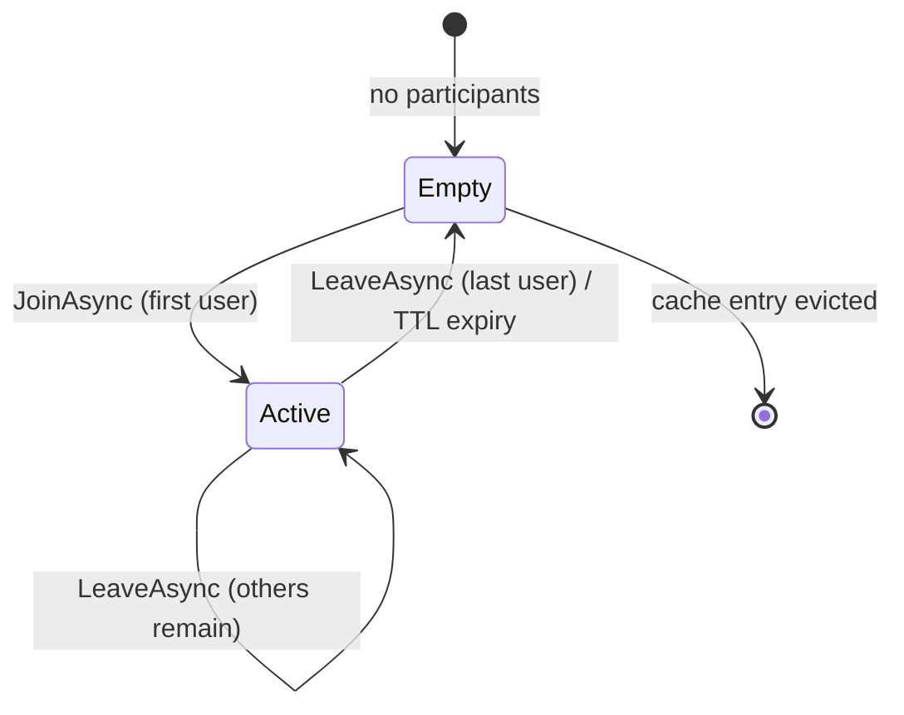

import { Aside, Steps, Tabs, TabItem } from "@astrojs/starlight/components";

`Granit.Presence` ships **two orthogonal dimensions** of presence. The
[overview](/dotnet/infrastructure/presence/) covers the first — *user-global*
presence, which answers **"is this person reachable, and through which
channels?"** This page covers the second — *resource-scoped* presence rooms,
which answer a different question entirely:

> **Who else is looking at this resource right now?**

This is the Google Docs / Notion face-pile primitive: open a CMS page and see
the avatars of the two colleagues already editing it. It is **informational and
non-blocking** — a room never prevents anyone from doing anything. It just
surfaces awareness so humans can coordinate themselves.

<Aside type="note" title="One module, two dimensions">
Rooms reuse the same FusionCache backplane, options, and diagnostics meter as
user-global presence — there is no new package to install. Resource rooms are
served from the existing `Granit.Presence` (tracker) and
`Granit.Presence.Endpoints` (HTTP) packages.
</Aside>

## When to use rooms vs EditLocking

Rooms are *awareness*, not *coordination enforcement*. When you need to actually
**prevent** two users from clobbering each other's writes, that is a different
primitive — pessimistic locking — tracked as `Granit.EditLocking`
([granit-dotnet#293](https://github.com/granit-fx/granit-dotnet/issues/293), not
yet shipped). The two are complementary and deliberately orthogonal: a surface
can show a presence face-pile *and* hold an edit lock at the same time.

| Aspect | User-global presence | **Resource rooms** (this page) | `Granit.EditLocking` (#293) |
|--------|----------------------|--------------------------------|-----------------------------|
| Question answered | "Is this user reachable?" | **"Who is in this room?"** | "Who holds the lock?" |
| Scope | user-global (one per human) | **resource (1-to-N users)** | resource (1-to-1 holder) |
| Semantics | presence / DnD | **informational / awareness** | pessimistic / blocking |
| Blocks writes? | no | **no** | yes |
| Persistence | FusionCache + EF Core | **FusionCache (ephemeral)** | EF Core (audited, tenant-scoped) |
| Crash recovery | heartbeat TTL expiry | **room TTL expiry, no DB** | explicit release or lease timeout |

<Aside type="tip" title="Rule of thumb">
Reach for **rooms** when the worst case of a collision is two people *talking to
each other* ("oh, you're editing this too — go ahead, I'll wait"). Reach for
**EditLocking** when the worst case is *silent data loss*.
</Aside>

## The room model

A room is identified by a `(Kind, Id)` pair and resolves to a live list of
participants:

```text
ResourceRef (Kind, Id)  →  IReadOnlyList<ResourcePresenceEntry>
```

Three abstractions in `Granit.Presence.Abstractions` carry the model:

```csharp
// Identifies the room. Kind must match ^[a-z][a-z0-9_.-]{0,63}$ (≤ 64 chars);
// Id is opaque (≤ 256 chars). See the kind-naming convention page.
public readonly partial record struct ResourceRef(string Kind, string Id);

// One participant. LastSeenUtc drives stale-entry expiry on read.
public sealed record ResourcePresenceEntry(
    Guid UserId,
    DateTimeOffset LastSeenUtc,
    string? Metadata = null);

// The snapshot returned by the tracker — already de-duplicated and
// filtered to live participants.
public sealed record ResourceRoom(
    ResourceRef Resource,
    IReadOnlyList<ResourcePresenceEntry> Participants);
```

The `Metadata` slot is an optional opaque string (≤ 512 bytes) the UI uses to
render *where* in the resource each person is — cursor section, open tab, scroll
position. Its shape and rules are a contract in their own right; see
[Metadata contract](/dotnet/infrastructure/presence/metadata-contract/).

## Lifecycle

A room has no explicit creation or deletion step. It springs into existence when
the first user joins and evaporates when the last live participant leaves (or
times out). There is **no database row and no cleanup job** — the entire
lifecycle is the cache TTL.

<Steps>

1. **Join.** A surface (a CMS page editor, a document preview pane, a dashboard
   detail view) calls `JoinAsync(resource, userId, metadata)` when the user
   opens it. The user is added to the room; the call returns the current
   snapshot so the client can render the face-pile in one round-trip.

2. **Heartbeat.** The same `JoinAsync` call doubles as the heartbeat — the
   client re-calls it every 30–60 s while the user stays on the surface. Repeat
   calls are idempotent per `userId`: `LastSeenUtc` is MAX-merged (multi-tab
   safe, same anti-flapping rule as user presence) and the metadata is
   overwritten — *last write wins*.

3. **Leave.** When the user navigates away, the client calls
   `LeaveAsync(resource, userId)`. It is idempotent — a no-op if the user was
   already absent.

4. **TTL expiry (crash recovery).** If the client never sends `LeaveAsync`
   (tab crash, network drop, killed process), the entry simply ages out:
   participants older than `Presence:OfflineThreshold` are filtered at read
   time, and the whole cache entry is evicted once empty. **Closing the laptop
   is a valid "leave".**

</Steps>



## Quickstart

The tracker is registered automatically by `AddGranitPresence()` — no extra
wiring. Inject `IResourcePresenceTracker` wherever a domain surface needs to
publish or read awareness.

<Tabs>
<TabItem label="Server — tracker API">

```csharp
public sealed class CmsPageEditorService(IResourcePresenceTracker rooms)
{
    private const string Kind = "cms.page"; // see the kind-naming convention

    public Task<ResourceRoom> OpenAsync(Guid pageId, Guid userId, CancellationToken ct)
    {
        var room = new ResourceRef(Kind, pageId.ToString());
        // metadata is optional; here we tell peers which tab the user is on
        return rooms.JoinAsync(room, userId, """{"tab":"content"}""", ct);
    }

    public Task CloseAsync(Guid pageId, Guid userId, CancellationToken ct) =>
        rooms.LeaveAsync(new ResourceRef(Kind, pageId.ToString()), userId, ct);

    public Task<ResourceRoom> WhoIsHereAsync(Guid pageId, CancellationToken ct) =>
        rooms.GetAsync(new ResourceRef(Kind, pageId.ToString()), ct);
}
```

</TabItem>
<TabItem label="Host — expose the REST surface">

```csharp
[DependsOn(
    typeof(GranitPresenceModule),
    typeof(GranitPresenceEndpointsModule))]
public sealed class AppModule : GranitModule
{
    public override void OnApplicationInitialization(ApplicationInitializationContext context)
    {
        // Mounts BOTH the user-global routes and the resource-room routes
        // under the same /presence prefix.
        context.App.MapGranitPresence();
    }
}
```

</TabItem>
</Tabs>

The tracker validates eagerly: an empty `userId`, a `Kind` that fails the
[naming regex](/dotnet/infrastructure/presence/resource-kind-naming/), or
metadata over 512 bytes all throw `ArgumentException` from `JoinAsync` before
anything is cached.

## HTTP API

`MapGranitPresence()` mounts three room routes under the same prefix as the
user-global endpoints (default `presence`), tagged separately in the OpenAPI
document. All require authentication.

| Method | Route | Permission | Rate-limit policy |
|--------|-------|------------|-------------------|
| `POST` | `/presence/rooms/{kind}/{id}/heartbeat` | `Presence.Rooms.Join` | `presence-poll` |
| `GET` | `/presence/rooms/{kind}/{id}` | `Presence.Rooms.Read` | `presence-query` |
| `DELETE` | `/presence/rooms/{kind}/{id}` | `Presence.Rooms.Join` | `presence-mutate` |

<Aside type="note" title="Mount behind Granit.Bff">
`POST .../heartbeat` and `DELETE` are state-changing. Like the user-global
mutating routes, they must not be reachable from a browser session without CSRF
protection — the intended topology mounts them behind `Granit.Bff`, which
enforces the anti-forgery token on every mutating call.
</Aside>

### `POST /presence/rooms/{kind}/{id}/heartbeat`

Join-or-refresh. The client calls this on open and then every 30–60 s. The body
is optional; when present it carries the metadata blob. Returns the full,
visibility-filtered room snapshot to save a round-trip.

```http
POST /presence/rooms/cms.page/8f2c.../heartbeat
Content-Type: application/json

{ "metadata": "{\"tab\":\"content\",\"section\":\"hero\"}" }
```

```json
{
  "kind": "cms.page",
  "id": "8f2c...",
  "participants": [
    { "userId": "f4a1...", "lastSeenUtc": "2026-05-28T08:42:11.123Z", "metadata": "{\"tab\":\"content\",\"section\":\"hero\"}" },
    { "userId": "9c00...", "lastSeenUtc": "2026-05-28T08:42:03.000Z", "metadata": "{\"tab\":\"seo\"}" }
  ]
}
```

### `GET /presence/rooms/{kind}/{id}`

Read-only snapshot. Stale participants (older than `Presence:OfflineThreshold`)
are filtered out; the visibility policy is consulted before anything is
returned.

### `DELETE /presence/rooms/{kind}/{id}`

Removes the caller from the room. Idempotent — always `204 No Content`,
whether or not the caller was present. The cache entry is evicted when the last
participant leaves.

### Error responses

| Status | When |
|--------|------|
| `400 Bad Request` | `kind` fails the naming regex, or `id` exceeds 256 chars — returned as RFC 7807 `ValidationProblem`. |
| `401 Unauthorized` | Caller is not authenticated. |
| `404 Not Found` | The visibility policy denies the read. **404, not 403** — so the response cannot be used to probe which rooms exist (same anti-enumeration contract as user-presence reads). |
| `429 Too Many Requests` | The relevant `presence-*` rate-limit policy tripped. |

## Visibility and multi-tenancy

Rooms are addressed by an opaque `(kind, id)` pair the framework cannot
independently authorize. Authorization is delegated to
`IResourcePresenceVisibilityPolicy`, which has two seams:

- `CanReadRoomAsync(caller, resource)` — gates the whole room (denial → 404).
- `FilterVisibleParticipantsAsync(caller, resource, participantIds)` — hides
  individual participants (e.g. users in another tenant) even when the room
  itself is readable.

The framework ships `AllowAllResourcePresenceVisibilityPolicy` as a permissive
default suitable only for single-tenant hosts. **Multi-tenant deployments MUST
register a tenant-aware replacement** before mapping the endpoints — otherwise
cross-tenant reads succeed. Rooms are already tenant-partitioned in the cache
key, so the policy's job is enforcing the *application's* collaboration scope on
top of that.

## Cross-pod operation

Rooms ride the same FusionCache backplane as user-global presence. The cache key
is `granit.presence.room:{tenantId}:{kind}:{id}` (tenant coalesces to `global`
when no tenant context is available). Single-pod deployments need nothing more.

**Multi-pod deployments must also load `Granit.Caching.StackExchangeRedis`** so
the Redis L2 backplane propagates joins and leaves between hosts — otherwise a
user who joins on pod A is invisible to a colleague reading from pod B for the
L1 TTL. See
[Granit.Caching with Redis backplane](/dotnet/infrastructure/multi-tenancy/cache/).

## DnD interplay — rooms are action-driven

User-global presence has a manual override (`DoNotDisturb`, `AppearOffline`).
Rooms **deliberately ignore it.** A user who has set Do-Not-Disturb still shows
up in a room the moment they open the resource, because room membership is
*action-driven, not status-driven* — they took the action of opening the page,
so their collaborators should know.

This is intentional separation of concerns:

- **User-global presence** answers "should I *page* this person?" — and DnD
  rightly suppresses push notifications there (see the
  [notification delivery gate](/dotnet/infrastructure/presence/#notification-delivery-gate)).
- **Rooms** answer "who is *here right now*?" — a factual statement about an
  action in progress, which DnD does not contradict.

<Aside type="tip" title="Composition is the admin UI's call">
If a product wants "ghost mode" — appear-offline users hidden from face-piles —
that composition is left to the consumer. Inject `IPresenceQueryService`
alongside the tracker and filter the room's participants by their effective
status in your own `IResourcePresenceVisibilityPolicy`. The framework does not
bake this in, because the right behaviour is product-specific.
</Aside>

## Diagnostics

Room operations emit on the existing `Granit.Presence` meter and
ActivitySource — no new instruments to register.

### Meter: `Granit.Presence`

| Instrument | Kind | Tags |
|------------|------|------|
| `granit.presence.room.join` | counter | `tenant_id`, `resource_kind` |
| `granit.presence.room.leave` | counter | `tenant_id`, `resource_kind`, `reason` (`explicit` / `stale`) |
| `granit.presence.room.size` | histogram | `tenant_id`, `resource_kind` |
| `granit.presence.room.metadata.bytes` | histogram | `resource_kind` |

### ActivitySource: `Granit.Presence`

| Operation | Emitted by |
|-----------|------------|
| `Granit.Presence.Room.Join` | `JoinAsync` |
| `Granit.Presence.Room.Leave` | `LeaveAsync` |
| `Granit.Presence.Room.Get` | `GetAsync` |

Span tags include `resource.kind`, `resource.id` (SHA-256-truncated when longer
than 32 chars to bound cardinality), `tenant.id`, and `room.size`.

## Migration from an in-house implementation

If you already hand-rolled an editing-presence service, the framework primitive
replaces it wholesale. The canonical example is `granit-website`, whose pending
`!35` introduced a custom `IPageEditingPresenceService` (~300 lines: a service,
a cache abstraction, a controller, DTOs, and tests). Becoming a framework
consumer collapses that to a thin shim.

```csharp
// ── BEFORE (in-house, granit-website MR !35) ─────────────────────────
// A bespoke module: interface + FusionCache impl + controller + DTOs.
public interface IPageEditingPresenceService
{
    Task JoinAsync(Guid pageId, Guid userId, string? cursor);
    Task LeaveAsync(Guid pageId, Guid userId);
    Task<IReadOnlyList<PageEditor>> GetEditorsAsync(Guid pageId);
}
// ... ~300 lines of implementation, caching, and HTTP plumbing ...

// ── AFTER (framework consumer) ───────────────────────────────────────
// 1. Delete the custom module entirely.
// 2. Map the framework endpoints — one line:
endpoints.MapGranitPresence(); // mounts /presence/rooms/{kind}/{id}

// 3. Standardise the resource kind as a constant:
public const string CmsPageKind = "cms.page";

// 4. userId is already resolved by the Granit.Identity pipeline —
//    no need to thread it through manually.
```

What changes for the `granit-website` team:

- The custom `cursor` string maps onto the room **metadata** blob — re-read the
  [metadata contract](/dotnet/infrastructure/presence/metadata-contract/) and
  keep it PII-free (the in-house version stored the editor's display name, which
  is **not** allowed).
- The resource identifier becomes `ResourceRef("cms.page", pageId)`. The
  `cms.page` kind is the convention; see
  [resource kind naming](/dotnet/infrastructure/presence/resource-kind-naming/).
- Multi-tenant `granit-website` deployments must register an
  `IResourcePresenceVisibilityPolicy` — the in-house service had its tenant
  scoping baked in; the framework makes it an explicit seam.

The net result is a **module deletion**: ~300 lines of bespoke code become a
one-line endpoint mapping plus a constant.

## See also

- [Presence overview](/dotnet/infrastructure/presence/) — the user-global dimension
- [Resource kind naming](/dotnet/infrastructure/presence/resource-kind-naming/) — the `<module>.<entity>` convention
- [Metadata contract](/dotnet/infrastructure/presence/metadata-contract/) — shape, size cap, PII rules
- [Granit.Caching with Redis backplane](/dotnet/infrastructure/multi-tenancy/cache/) — required for multi-pod rooms
- [Multi-tenancy](/dotnet/infrastructure/multi-tenancy/) — visibility policies and `ICurrentTenant`
- [`Granit.EditLocking` (granit-dotnet#293)](https://github.com/granit-fx/granit-dotnet/issues/293) — the complementary pessimistic-locking primitive (not yet shipped)
