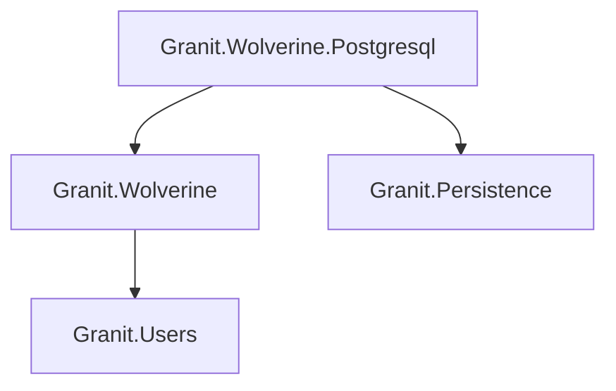
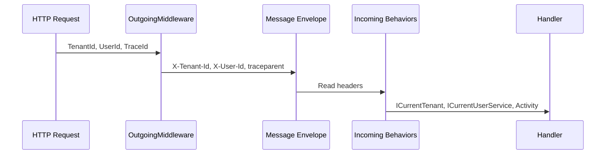
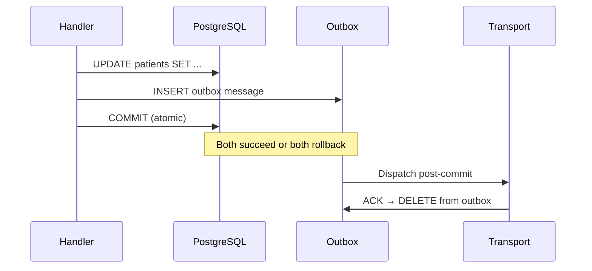

import { Tabs, TabItem, FileTree, Badge, Steps } from "@astrojs/starlight/components";

Granit.Wolverine integrates the [Wolverine](https://wolverinefx.net/) message bus into the
module system. Domain events route to local queues, integration events persist in a
transactional outbox, and tenant/user/trace context propagates automatically across
async message processing. FluentValidation runs as bus middleware — invalid commands
go straight to the error queue, no retry.

## Package structure

<FileTree>
- Granit.Wolverine/ Core: routing, context propagation, FluentValidation middleware
  - Granit.Wolverine.Postgresql PostgreSQL outbox, EF Core transactions
</FileTree>

| Package | Role | Depends on |
|---------|------|------------|
| `Granit.Wolverine` | Domain event routing, context propagation, validation | `Granit.Users` |
| `Granit.Wolverine.Postgresql` | PostgreSQL transactional outbox, EF Core integration | `Granit.Wolverine`, `Granit.Persistence` |

## Dependency graph



## Setup

<Tabs>
<TabItem label="With PostgreSQL outbox (production)">

```csharp
[DependsOn(typeof(GranitWolverinePostgresqlModule))]
public class AppModule : GranitModule { }
```

```json
{
  "Wolverine": {
    "MaxRetryAttempts": 3,
    "RetryDelays": ["00:00:05", "00:00:30", "00:05:00"]
  },
  "Wolverine:Postgresql": {
    "TransportConnectionString": "Host=db;Database=myapp;Username=app;Password=..."
  }
}
```

</TabItem>
<TabItem label="In-memory only (development)">

```csharp
[DependsOn(typeof(GranitWolverineModule))]
public class AppModule : GranitModule { }
```

No outbox — messages are in-memory only. Lost on crash.

</TabItem>
<TabItem label="Per-tenant database">

```csharp
[DependsOn(typeof(GranitWolverinePostgresqlModule))]
public class AppModule : GranitModule
{
    public override void ConfigureServices(ServiceConfigurationContext context)
    {
        context.Builder.AddGranitWolverineWithPostgresqlPerTenant<AppDbContext>();
    }
}
```

Each tenant's messages persist in their own database (strictest ISO 27001 isolation).

</TabItem>
</Tabs>

## Domain events vs integration events

| | Domain event | Integration event |
|---|---|---|
| Interface | `IDomainEvent` | `IIntegrationEvent` |
| Naming | `PatientDischargedOccurred` | `BedReleasedEvent` |
| Scope | In-process, same transaction | Cross-module, durable |
| Transport | Local queue (`"domain-events"`) | Outbox → PostgreSQL transport |
| Retry | Yes (configurable delays) | Yes (at-least-once delivery) |

```csharp
public sealed record PatientDischargedOccurred(
    Guid PatientId, Guid BedId) : IDomainEvent;

public sealed record BedReleasedEvent(
    Guid BedId, Guid WardId, DateTimeOffset ReleasedAt) : IIntegrationEvent;
```

:::tip
Integration events must be flat, serializable DTOs. Never include EF Core entities
or internal domain objects — they cross module boundaries.
:::

## Handler conventions

### Discovery

Mark handler assemblies with `[WolverineHandlerModule]` — Granit auto-discovers
handlers and validators:

```csharp
[assembly: WolverineHandlerModule]

namespace MyApp.Handlers;

public static class DischargePatientHandler
{
    public static IEnumerable<object> Handle(
        DischargePatientCommand command,
        PatientDbContext db)
    {
        var patient = db.Patients.Find(command.PatientId)
            ?? throw new EntityNotFoundException(typeof(Patient), command.PatientId);

        patient.Discharge();

        // Domain event — same transaction
        yield return new PatientDischargedOccurred(patient.Id, patient.BedId);

        // Integration event — persisted in outbox
        yield return new BedReleasedEvent(
            patient.BedId, patient.WardId, DateTimeOffset.UtcNow);
    }
}
```

Handlers returning `IEnumerable<object>` produce multiple outbox messages atomically
(fan-out pattern).

### FluentValidation

Validators run as bus middleware **before** handler execution:

```csharp
public class DischargePatientCommandValidator
    : AbstractValidator<DischargePatientCommand>
{
    public DischargePatientCommandValidator()
    {
        RuleFor(x => x.PatientId).NotEmpty();
    }
}
```

`ValidationException` goes directly to the error queue — no retry. Other exceptions
follow the retry policy.

:::caution
Modules **without** `[WolverineHandlerModule]` must register validators manually:

```csharp
services.AddGranitValidatorsFromAssemblyContaining<MyValidator>();
```

Without registration, `FluentValidationEndpointFilter<T>` silently skips validation.
:::

## Context propagation

Three contexts automatically propagate through message envelopes:



| Header | Source | Behavior |
|--------|--------|----------|
| `X-Tenant-Id` | `ICurrentTenant.Id` | `TenantContextBehavior` restores AsyncLocal |
| `X-User-Id` | `ICurrentUserService.UserId` | `UserContextBehavior` restores via `WolverineCurrentUserService` |
| `X-Actor-Kind` | `ICurrentUserService.ActorKind` | `User`, `ExternalSystem`, or `System` |
| `X-Api-Key-Id` | `ICurrentUserService.ApiKeyId` | Service account identification |
| `traceparent` | `Activity.Current?.Id` | W3C Trace Context for distributed tracing |

This means `AuditedEntityInterceptor` populates `CreatedBy`/`ModifiedBy` correctly
even in background handlers — the user context travels with the message.

## Transactional outbox

The PostgreSQL outbox guarantees at-least-once delivery by persisting messages in the
**same transaction** as business data:



**Transaction modes:**

| Mode | Behavior | Use case |
|------|----------|----------|
| `Eager` (default) | Explicit `BeginTransactionAsync()` | ISO 27001 compliance |
| `Lightweight` | `SaveChangesAsync()`-level isolation | Non-critical operations |

## Claim Check pattern

For large payloads that shouldn't travel through the message bus:

```csharp
public class LargeReportHandler(IClaimCheckStore claimCheck)
{
    public async Task<ClaimCheckReference> Handle(
        GenerateReportCommand command, CancellationToken cancellationToken)
    {
        byte[] reportData = await GenerateReportAsync(command, cancellationToken)
            .ConfigureAwait(false);

        return await claimCheck.StorePayloadAsync(
            reportData, expiry: TimeSpan.FromHours(1), cancellationToken)
            .ConfigureAwait(false);
    }
}

// Consumer retrieves and deletes in one call
var report = await claimCheck.ConsumePayloadAsync<byte[]>(
    reference, cancellationToken)
    .ConfigureAwait(false);
```

Register with `services.AddInMemoryClaimCheckStore()` for development.
Production implementations use blob storage.

## Retry policy

```json
{
  "Wolverine": {
    "RetryDelays": ["00:00:05", "00:00:30", "00:05:00"],
    "MaxRetryAttempts": 3
  }
}
```

| Property | Default | Description |
|----------|---------|-------------|
| `RetryDelays` | `[5s, 30s, 5min]` | Delay between retries |
| `MaxRetryAttempts` | `3` | Max attempts before dead letter |

`ValidationException` bypasses retries entirely — sent directly to the error queue.

## Production code generation

Wolverine generates the C# that wires each handler and HTTP endpoint into the bus. By
default Granit runs in **Dynamic** mode: that code is compiled at runtime with Roslyn
(via `WolverineFx.RuntimeCompilation`, referenced transitively by `Granit.Wolverine`).
That is convenient locally, but **every cold start recompiles every handler and endpoint
chain** — paying both startup latency and ~100 MB of resident Roslyn. In a scaled-out
deployment that cost is repeated on every replica, on every restart.

`Granit.Wolverine` exposes the mode through `WolverineMessagingOptions.CodeGenerationMode`
(bound from `Wolverine:CodeGenerationMode`, type `JasperFx.CodeGeneration.TypeLoadMode`):

| Mode | Behavior | When |
|------|----------|------|
| `Dynamic` (default) | Roslyn compiles handler code at startup | Local development |
| `Static` | Loads pre-generated code from the assembly; **no runtime fallback** | Production |
| `Auto` | Generates on first run if missing, then reuses it | Accepted, but discouraged by the Wolverine community |

### Opt in to Static

Set the mode in `appsettings.Production.json`. No code change is needed — Granit binds it
onto `opts.CodeGeneration.TypeLoadMode` for you:

```json
{
  "Wolverine": {
    "CodeGenerationMode": "Static"
  }
}
```

:::danger[Static has no runtime fallback]
`Static` never compiles anything at runtime. If the pre-generated code is missing or
stale, the host **throws at startup** — there is no environment-based switch back to
Dynamic. The code must be generated in your build and shipped with the image. Enabling
Static without the steps below turns a deploy into a crash loop.
:::

### Pre-generate the code in your build

<Steps>

1. **Wire the JasperFx CLI into `Program.cs`.** Replace the final `await app.RunAsync();`
   with the JasperFx command runner so the `codegen` verb becomes available:

   ```csharp
   var app = builder.Build();

   // ... middleware, UseGranitAsync(), etc. ...

   return await app.RunJasperFxCommands(args);
   ```

   With no arguments this still starts the web host exactly as before — confirm
   `dotnet run` boots normally. Keep any external-resource calls (database, broker)
   *after* this line: `codegen write` boots the host only far enough to discover handlers
   and must not reach infrastructure that is unavailable at build time.

2. **Generate the code as a build step.** Run the `codegen` verb before publishing — a
   dedicated Docker build stage, or a CI step ahead of `dotnet publish`:

   ```bash
   dotnet run -- codegen write
   ```

   This writes the handler and endpoint sources under `Internal/Generated/` (Wolverine
   handlers land in `Internal/Generated/WolverineHandlers/`).

3. **Ship `Internal/Generated/` with the image.** The generated files must be compiled
   into the published assembly. Either commit them, or generate them in the build stage
   and copy them into the publish output — either way they travel with the deployed
   artifact.

</Steps>

### Fail fast on stale code (optional)

To turn a *silent* mismatch into a loud startup error, assert that every expected
pre-generated type exists. This flag lives on the Critter Stack production profile, not on
the Granit option — the mode itself stays controlled by `Wolverine:CodeGenerationMode`;
this only adds the existence check:

```csharp
builder.Services.CritterStackDefaults(x =>
{
    x.Production.AssertAllPreGeneratedTypesExist = true;
});
```

Now a handler added after the last `codegen write` fails the host immediately at
startup, instead of surfacing as a missing-type error deep in message processing.

### Keep Roslyn out of the production image

`Granit.Wolverine` pulls in `WolverineFx.RuntimeCompilation` transitively so Dynamic mode
works out of the box. Static mode never compiles at runtime, so that ~100 MB of Roslyn is
dead weight in a production image. Strip the transitive assets from Release builds while
keeping them for local Dynamic development:

```xml
<!-- Roslyn runtime codegen is used only by Dynamic mode (local dev).
     Production runs Static + pre-generated code, so drop the transitive
     WolverineFx.RuntimeCompilation assets from Release builds. -->
<ItemGroup Condition="'$(Configuration)' == 'Release'">
  <PackageReference Include="WolverineFx.RuntimeCompilation" ExcludeAssets="all" />
</ItemGroup>
```

:::note
Under Central Package Management, add a matching `PackageVersion` entry for
`WolverineFx.RuntimeCompilation` so the conditional reference resolves.
:::

## Wolverine is optional

Wolverine is **not** required to use Granit. These modules have built-in `Channel<T>`
fallbacks when Wolverine is not installed:

| Module | Without Wolverine | With Wolverine |
|--------|-------------------|----------------|
| `Granit.BackgroundJobs` | In-memory Channel | Durable outbox |
| `Granit.Notifications` | In-memory Channel | Durable outbox |
| `Granit.Webhooks` | In-memory Channel | Durable outbox |
| `Granit.DataExchange` | In-memory Channel | Durable outbox |
| `Granit.Persistence.Migrations` | In-memory Channel | Durable outbox |

## Public API summary

| Category | Key types | Package |
|----------|-----------|---------|
| Module | `GranitWolverineModule`, `GranitWolverinePostgresqlModule` | — |
| Options | `WolverineMessagingOptions`, `WolverinePostgresqlOptions` | — |
| Context | `OutgoingContextMiddleware`, `TenantContextBehavior`, `UserContextBehavior`, `TraceContextBehavior` | `Granit.Wolverine` |
| User service | `WolverineCurrentUserService` (internal, implements `ICurrentUserService`) | `Granit.Wolverine` |
| Claim Check | `IClaimCheckStore`, `ClaimCheckReference` | `Granit.Wolverine` |
| Attributes | `[WolverineHandlerModule]` | `Granit.Wolverine` |
| Extensions | `AddGranitWolverine()`, `AddGranitWolverineWithPostgresql()`, `AddGranitWolverineWithPostgresqlPerTenant<T>()`, `AddInMemoryClaimCheckStore()` | — |

## Common pitfalls

:::caution[Messages stuck in dead letter queue]
If messages accumulate in the DLQ, check:

1. The handler throws an unhandled exception — Wolverine retries then moves to DLQ
2. `ValidationException` bypasses retries (by design) — fix the sender, not the handler
3. The handler's DI dependencies are missing (module not loaded)

Use `IDeadLetterQueueInspector` or the Wolverine admin endpoints to inspect DLQ entries.
:::

:::caution[Tenant/user context lost in async handlers]
Wolverine handlers run outside the HTTP pipeline. If a handler needs `ICurrentTenant`
or `ICurrentUserService`, ensure `OutgoingContextMiddleware` is configured (it is by
default with `AddGranitWolverine()`). Context is serialized in message headers and
restored before handler execution.
:::

:::caution[Handler not discovered]
Wolverine discovers handlers from assemblies marked with `[assembly: WolverineHandlerModule]`.
If your handler is in an assembly without this attribute, it will not be found. Add the
attribute to the assembly's `AssemblyInfo.cs` or any file in the project.
:::

## Troubleshooting

| Symptom | Likely cause | Fix |
|---------|-------------|-----|
| Message published but handler never runs | Handler not discovered | Add `[assembly: WolverineHandlerModule]` to the assembly |
| `TenantId` is null in handler | Context middleware not configured | Verify `AddGranitWolverine()` is called |
| Messages retry indefinitely | No dead letter policy configured | Check `WithFailureRules()` in Wolverine options |
| PostgreSQL transport errors on startup | Missing PostgreSQL transport registration | Call `AddGranitWolverineWithPostgresql()` instead of `AddGranitWolverine()` |
| Slow message throughput | Too many handlers in same queue | Split into dedicated queues with `[Queue("name")]` |

## See also

- [End-to-end tracing guide](/dotnet/guides/end-to-end-tracing/) — trace Wolverine handlers with OpenTelemetry
- [ADR-005: Wolverine + Cronos](/dotnet/architecture/adr/005-wolverine-cronos/) -- Why Wolverine was chosen for messaging and CQRS
- [ADR-022: ICommandSender + module naming](/dotnet/architecture/adr/022-command-sender-and-module-naming/) — command dispatch abstraction and `.Wolverine` suffix policy
- [Core module](/dotnet/core/module-system/) — `IDomainEvent`, `IIntegrationEvent`, `IDomainEventDispatcher`
- [Persistence module](./persistence/) — `DomainEventDispatcherInterceptor`, transactional outbox
- [Multi-tenancy module](./multi-tenancy/) — Tenant context propagation
- [Security module](./authentication/) — `ICurrentUserService` propagation
- [API Reference](/api/Granit.Wolverine.html) (auto-generated from XML docs)
- [Wolverine: Code Generation guide](https://wolverinefx.net/guide/codegen.html) — upstream reference for `TypeLoadMode`, the `codegen` CLI, and pre-built types
- [Blog: CQRS without MediatR — how Granit uses Wolverine](/blog/cqrs-without-mediatr-how-granit-uses-wolverine/) — the design rationale behind dropping MediatR in favor of Wolverine
