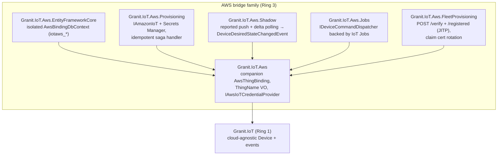
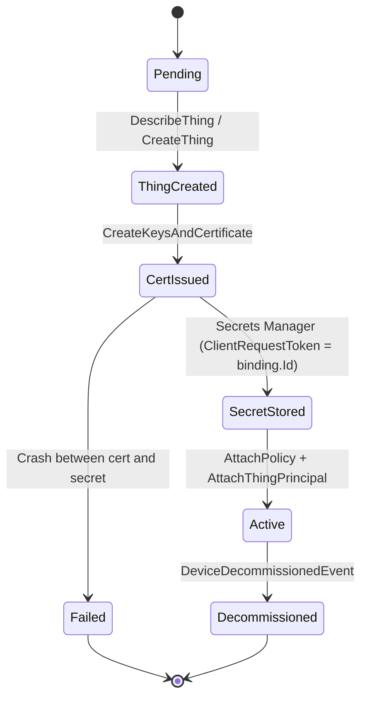
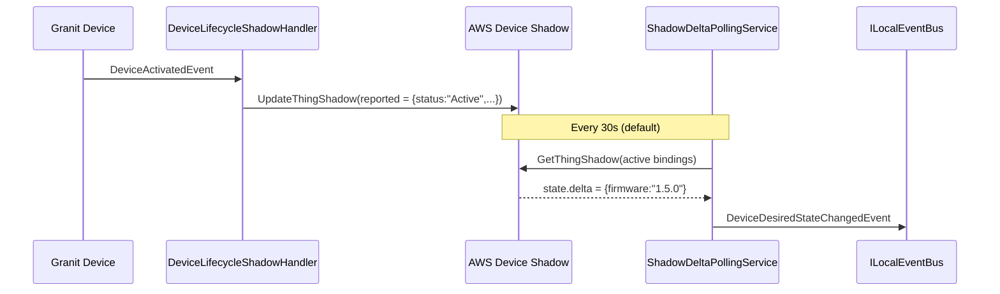
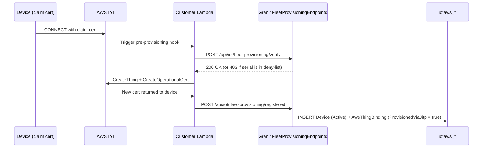

import { Aside, FileTree } from "@astrojs/starlight/components";

The AWS bridge is a **companion** to the cloud-agnostic `Device` aggregate
— not a replacement. Six Ring-3 packages map every device lifecycle event
to AWS IoT Core resources (Things, X.509 certificates, Secrets Manager
entries, Device Shadow documents, IoT Jobs) without ever modifying the
core domain.

## Why a bridge, not a replacement aggregate?

The cloud-agnostic `Device` already owns `SerialNumber`, `Status`,
`Credential`, `Heartbeat`, `Workflow` state and `Timeline` entries.
Stamping a second AWS-specific `Device` next to it would create two sources
of truth and force a permanent synchronisation problem.

We instead introduce a 1:1 companion **`AwsThingBinding`** keyed by
`Device.Id`. The binding stores everything AWS needs (`ThingName`,
`ThingArn`, `CertificateArn`, `CertificateSecretArn`, `ProvisioningStatus`,
`LastShadowReportedAt`, `ClaimCertificateExpiresAt`, `ProvisionedViaJitp`)
— and nothing the core domain needs.

Reactions to `DeviceProvisionedEvent` / `DeviceActivatedEvent` /
`DeviceDecommissionedEvent` happen via Wolverine handlers in the bridge
packages. The same pattern as
[Notifications](/dotnet/iot/notifications-bridge/) and
[Timeline](/dotnet/iot/timeline-bridge/), just sized for an entire cloud
provider.

## Package map



The umbrella **`Granit.Bundle.IoT.Aws`** meta-package references all six.
Hosts targeting AWS pull it once; sister bundles for other providers
(Azure IoT Hub, Scaleway IoT Hub) ship separately and never collide.

| Package | Role |
| --- | --- |
| `Granit.IoT.Aws` | Companion `AwsThingBinding`, `ThingName` VO, `IAwsIoTCredentialProvider` |
| `Granit.IoT.Aws.EntityFrameworkCore` | Isolated `AwsBindingDbContext` (`iotaws_*` schema) |
| `Granit.IoT.Aws.Provisioning` | `IAmazonIoT` + `IAmazonSecretsManager`, idempotent saga handler |
| `Granit.IoT.Aws.Shadow` | `IAmazonIotData`, reported-state push + delta polling |
| `Granit.IoT.Aws.Jobs` | `IDeviceCommandDispatcher` backed by AWS IoT Jobs |
| `Granit.IoT.Aws.FleetProvisioning` | JITP endpoints + `ClaimCertificateRotationCheckService` |

## The provisioning saga

`AwsThingBinding.ProvisioningStatus` is the saga state machine:



`AwsThingBridgeHandler` reacts to `DeviceProvisionedEvent` and walks the
binding through every checkpoint. Each forward step:

1. **Short-circuits** if the binding has already crossed the matching
   checkpoint (lock-free read of `ProvisioningStatus`).
2. Defensively calls AWS `Describe*` before any `Create*`. A crash
   between an AWS-side success and the matching DB commit recovers
   cleanly on Wolverine replay.
3. Mutates the in-memory binding and lets the handler persist the new
   state immediately afterwards.

<Aside type="note" title="Cert + secret are fused into one saga step">
  `CreateKeysAndCertificate` returns a private key that AWS will never
  give back, so we persist the key to Secrets Manager (with a
  `ClientRequestToken = binding.Id` for native idempotency) inside the
  same logical operation as the cert creation. A crash strictly between
  the two AWS calls leaves a dangling certificate, surfaced via the
  `granit.iot.aws.provisioning.failed` counter and a `Status = Failed`
  binding for operator triage.
</Aside>

## `ThingName` format — per-tenant IAM isolation

`AwsThingBinding.ThingName` is imposed as `t{tenantId:N}-{serialNumber}`
(32-char hex tenant id + dash + serial). Two reasons:

- **Zero collision** across tenants — Guid uniqueness baked in.
- **IAM policy isolation** — AWS IoT policies can use
  `${iot:Connection.Thing.ThingName}` with a strict `t{tenantId}-*` prefix
  to enforce per-tenant scoping at the broker level. The unique DB
  constraint on `thing_name` therefore also enforces tenant isolation in
  the persistence layer.

## Credential pipeline — two modes

`Granit.IoT.Aws` ships two `IAwsIoTCredentialProvider` implementations,
selected by configuration:

| Mode | When picked | Behaviour |
| --- | --- | --- |
| **IAM-role mode** | `FleetCredentialSecretArn` is `null` | Returns `null` for every key; the AWS SDK default credential chain authenticates outbound traffic (instance role, ECS task role, env vars). `IsReady` is always `true` |
| **Rotating mode** | `FleetCredentialSecretArn` set | `BackgroundService` polls an `IAwsIoTCredentialLoader` on `RotationCheckIntervalMinutes` (default 5). Lock-free volatile reads, stale-ok on refresh failure, bounded initial fetch via `TimeProvider` |

The Secrets-Manager-backed loader ships in `Granit.IoT.Aws.Provisioning`
so `Granit.IoT.Aws` itself never references the AWS SDK.

The `IsReady` gate must be checked by every endpoint that calls AWS; hosts
publish a matching readiness probe via `HealthChecks`.

## Bidirectional Device Shadow sync

`Granit.IoT.Aws.Shadow` mirrors device lifecycle into the AWS Device
Shadow:



- **Granit → AWS**: `DeviceLifecycleShadowHandler` reacts to
  `Device{Activated,Suspended,Reactivated}Event` and pushes
  `{"status":"…","updatedAt":"…"}` (`IClock` injected for deterministic
  timestamps).
- **AWS → Granit**: `ShadowDeltaPollingService` walks active bindings
  every `PollIntervalSeconds` (default 30), parses `state.delta`, and
  publishes `DeviceDesiredStateChangedEvent` on `ILocalEventBus`.

`Granit.IoT.Aws.Jobs` consumes that event and turns each delta key into
an AWS IoT Job dispatched against the originating Thing. The
correlationId is `SHA-256(deviceId, shadowVersion)` so re-delivery
dispatches into the same Job.

## Fleet Provisioning (JITP)

`Granit.IoT.Aws.FleetProvisioning` handles the inverted flow where AWS
IoT creates the Thing and certificate **before** notifying Granit:



The standard saga handler short-circuits on `ProvisionedViaJitp == true`
to avoid attempting to recreate a Thing that AWS already created.

`ClaimCertificateRotationCheckService` runs daily and surfaces expiring
claim certificates as `ClaimCertificateExpiringEvent` so operators rotate
them before fleet enrolments break.

## Wiring

```csharp
builder.Services.AddGranitIoTAwsCredentials();
builder.Services.AddGranitIoTAwsEntityFrameworkCore(o =>
    o.UseNpgsql(connectionString));
builder.Services.AddGranitIoTAwsProvisioning();
builder.Services.AddGranitIoTAwsShadow();
builder.Services.AddGranitIoTAwsJobs();
builder.Services.AddGranitIoTAwsFleetProvisioning();

app.MapGranitIoTAwsFleetProvisioningEndpoints();
```

Or, with the meta-bundle:

```csharp
builder.Services.AddGranitBundleIoTAws(o => o.UseNpgsql(connectionString));
```

## Configuration

Each package has its own section under `IoT:Aws:*`. Defaults are
production-sane; override per environment.

| Section | Knobs |
| --- | --- |
| `IoT:Aws:Credentials` | `FleetCredentialSecretArn`, `RotationCheckIntervalMinutes`, `InitialFetchTimeoutSeconds` |
| `IoT:Aws:Provisioning` | `DevicePolicyName` (required), `SecretNameTemplate`, `SecretKmsKeyId` |
| `IoT:Aws:Shadow` | `PollIntervalSeconds`, `PollBatchSize`, `AutoPushLifecycleStatus` |
| `IoT:Aws:Jobs` | `JobIdPrefix`, `JobTrackingTtlHours`, `StatusPollIntervalSeconds`, `StatusPollBatchSize` |
| `IoT:Aws:FleetProvisioning` | `ExpiryWarningWindowDays`, `RotationCheckIntervalHours`, `RotationCheckBatchSize` |

## Observability

Every package ships a dedicated meter (`Granit.IoT.Aws.*`) tagged with
`tenant_id` and, where it makes sense, the matching `operation`.
Dashboards can roll up across the family or split per package. Architecture
tests enforce that every `Internal` namespace stays internal-only.

## Operational caveats

<Aside type="caution" title="InMemoryJobTrackingStore is per-host">
  Multi-host deployments must override `IJobTrackingStore` with a
  Redis-backed implementation. Otherwise IoT Jobs status polling sees only
  the jobs initiated on the current node.
</Aside>

<Aside type="note" title="Polling vs IoT Rule">
  The Shadow and Jobs polling services are fine up to a few thousand
  devices per host. Larger fleets should switch to AWS IoT Rule → SNS /
  SQS — the bridge is wired through `ILocalEventBus.PublishAsync`, so
  dropping in an event-driven consumer is mechanical.
</Aside>

<Aside type="caution" title="Certificate leak window">
  A crash strictly between `CreateKeysAndCertificate` and the matching DB
  commit leaks one AWS certificate. Surfaced via the
  `granit.iot.aws.provisioning.failed` counter; a follow-up story will add
  a sweeper that deletes certificates with no attached principal.
</Aside>

## Compliance

- **GDPR**: AWS resources tied to a tenant are deleted by the
  `DecommissionAsync` path on `DeviceDecommissionedEvent` — Thing,
  certificate, secret, and binding all torn down idempotently.
- **ISO 27001**: every saga transition is logged via `LoggerMessage`
  source-gen with structured fields; every counter is tagged by
  `tenant_id`; and the `AwsThingBinding` aggregate is
  `FullAuditedAggregateRoot` so `CreatedBy` / `ModifiedBy` / `DeletedBy`
  travel with every row.

## See also

- [Device management](/dotnet/iot/device-management/) — the cloud-agnostic aggregate this bridge companions
- [Telemetry ingestion](/dotnet/iot/telemetry-ingestion/) — AWS IoT Core also has its own ingestion provider (SNS / Direct / API Gateway)
- [Bundle reference](/dotnet/iot/bundle/) — `Granit.Bundle.IoT.Aws` pulls all six packages at once
