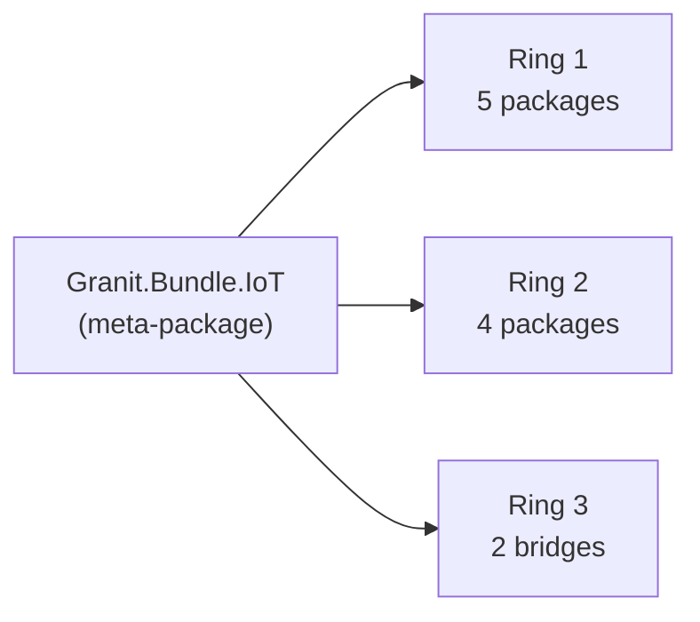

import { Aside } from "@astrojs/starlight/components";

The two meta-bundles ship the full Granit.IoT stack as single NuGet
references — one for the cloud-agnostic core, one for the AWS bridge
family. Teams can onboard IoT device management, telemetry ingestion,
threshold alerts, background jobs, the audit timeline, and (optionally)
the full AWS IoT Core bridge without hand-picking 17 packages.

## `Granit.Bundle.IoT` — cloud-agnostic stack (11 packages)

### When to use the bundle

Use `Granit.Bundle.IoT` when:

- You want the full Ring 1 + Ring 2 + Ring 3 stack wired up with sensible
  defaults
- You're starting a new greenfield Granit application
- You don't need to cherry-pick a subset (e.g. ingestion without endpoints)

Use individual packages when:

- You only need the domain (tests, shared libraries)
- You want to swap the EF Core layer for a custom persistence adapter
- You're integrating with an alternative web framework that doesn't use
  Minimal API

### What's inside

| # | Package | Ring | Role |
| --- | --- | --- | --- |
| 1 | `Granit.IoT` | 1 | Domain, value objects, events, CQRS abstractions |
| 2 | `Granit.IoT.EntityFrameworkCore` | 1 | `IoTDbContext`, EF Core configurations |
| 3 | `Granit.IoT.EntityFrameworkCore.Postgres` | 1 | PostgreSQL migrations (BRIN, GIN, partitioning) |
| 4 | `Granit.IoT.Endpoints` | 1 | Device CRUD + telemetry queries |
| 5 | `Granit.IoT.BackgroundJobs` | 1 | Purge, heartbeat, partition maintenance |
| 6 | `Granit.IoT.Ingestion` | 2 | Provider-agnostic ingestion pipeline |
| 7 | `Granit.IoT.Ingestion.Endpoints` | 2 | `POST /iot/ingest/{source}` webhook |
| 8 | `Granit.IoT.Ingestion.Scaleway` | 2 | Scaleway IoT Hub provider |
| 9 | `Granit.IoT.Wolverine` | 2 | Wolverine handlers + threshold evaluation |
| 10 | `Granit.IoT.Notifications` | 3 | Bridge to `Granit.Notifications` |
| 11 | `Granit.IoT.Timeline` | 3 | Bridge to `Granit.Timeline` |



### Not included — these are opt-in

- `Granit.IoT.Mqtt` + `Granit.IoT.Mqtt.Mqttnet` — add only if you need to
  consume from a non-Scaleway MQTT broker. See
  [MQTT transport](/dotnet/iot/mqtt/).
- `Granit.IoT.EntityFrameworkCore.Timescale` — opt-in TimescaleDB backend.
  See [Time-series storage](/dotnet/iot/time-series/).
- `Granit.IoT.Mcp` — opt-in MCP bridge for AI assistants. See
  [MCP bridge](/dotnet/iot/mcp-bridge/).
- `Granit.IoT.Ingestion.Aws` and the entire `Granit.IoT.Aws` family — use
  [`Granit.Bundle.IoT.Aws`](#granitbundleiotaws--aws-iot-core-bridge-6-packages)
  on top.

### Installation

```bash
dotnet add package Granit.Bundle.IoT
```

This single reference transitively pulls in all 11 bundled packages. No
dependency conflicts — every package in the bundle targets the same
`Granit.*` framework version pinned in `Directory.Packages.props`.

### Registration

```csharp
using Granit.Bundle.IoT;

builder.Services
    .AddGranit(builder.Configuration)
    .AddIoT();

app.MapGranitIoTEndpoints();          // /iot/devices + /iot/telemetry
app.MapGranitIoTIngestionEndpoints(); // /iot/ingest/{source}
```

`AddIoT()` enumerates the 11 modules in topological order. Actual DI
registration is driven by each module's `[DependsOn(...)]` graph — the
bundle's enumeration is just a complete list, so dependency order is
never a concern.

### What you get out of the box

After `AddIoT()`:

- Device CRUD endpoints at `/iot/devices` (permissions, FluentValidation, OpenAPI)
- Telemetry query endpoints at `/iot/telemetry/{deviceId}`
- Scaleway webhook at `/iot/ingest/scaleway` (HMAC + Redis dedup + Wolverine outbox)
- Three recurring background jobs (purge, heartbeat, partition maintenance)
- Two notification types (threshold alert + device offline) auto-registered
- Device lifecycle → timeline audit chatter
- OpenTelemetry metrics for every stage (see
  [Operations — Observability](/dotnet/iot/operations/#observability))

### Breaking down the bundle if you need to

If the bundle is "too much," register only what you need — each module's
DI extension is public:

```csharp
builder.Services
    .AddGranitIoT()                       // domain only
    .AddGranitIoTEntityFrameworkCore()    // persistence
    .AddGranitIoTEndpoints();             // CRUD API
// skip ingestion / wolverine / jobs / bridges
```

The module system enforces ring discipline — you can't accidentally
register a Ring 3 bridge without its Ring 2 producer. Architecture tests
catch violations at build time.

## `Granit.Bundle.IoT.Aws` — AWS IoT Core bridge (6 packages)

The opt-in companion bundle for hosts targeting AWS IoT Core. Add **on top
of** `Granit.Bundle.IoT` — the core stack stays cloud-agnostic.

### What's inside

| # | Package | Role |
| --- | --- | --- |
| 1 | `Granit.IoT.Aws` | Companion `AwsThingBinding`, `ThingName` VO, `IAwsIoTCredentialProvider` |
| 2 | `Granit.IoT.Aws.EntityFrameworkCore` | Isolated `AwsBindingDbContext` (`iotaws_*` schema) |
| 3 | `Granit.IoT.Aws.Provisioning` | `IAmazonIoT` + Secrets Manager, idempotent provisioning saga |
| 4 | `Granit.IoT.Aws.Shadow` | Device Shadow sync (reported push + delta polling) |
| 5 | `Granit.IoT.Aws.Jobs` | `IDeviceCommandDispatcher` backed by AWS IoT Jobs |
| 6 | `Granit.IoT.Aws.FleetProvisioning` | JITP endpoints + claim cert rotation |

### Installation

```bash
dotnet add package Granit.Bundle.IoT.Aws
```

### Registration

```csharp
builder.Services
    .AddGranit(builder.Configuration)
    .AddIoT()                                       // cloud-agnostic core
    .AddGranitBundleIoTAws(o => o.UseNpgsql(connectionString)); // AWS bridge family
```

Full deep dive: [AWS IoT Core bridge](/dotnet/iot/aws/).

## Versioning

The bundles track the Granit.IoT release cycle. Pre-release
(pre-`v1.0.0`), breaking changes land in minor versions; post-`v1.0.0`,
SemVer applies strictly.

| Granit.IoT version | Granit framework version | .NET | EF Core |
| --- | --- | --- | --- |
| `0.x` (current) | `1.0.x` | 10.0 | 10 |

Check the [releases page](https://github.com/granit-fx/granit-iot/releases)
for the current compatibility matrix.

## See also

- [Getting started](/dotnet/iot/getting-started/) — 5-minute quickstart using `Granit.Bundle.IoT`
- [Overview](/dotnet/iot/) — ring structure and design decisions
- [MQTT transport](/dotnet/iot/mqtt/) — the one package group **not** in the bundle (opt-in)
- [AWS IoT Core bridge](/dotnet/iot/aws/) — `Granit.Bundle.IoT.Aws` deep dive
