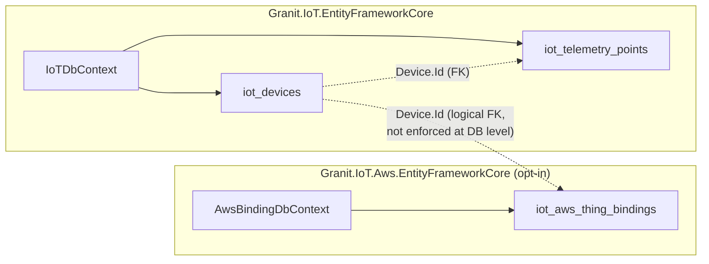
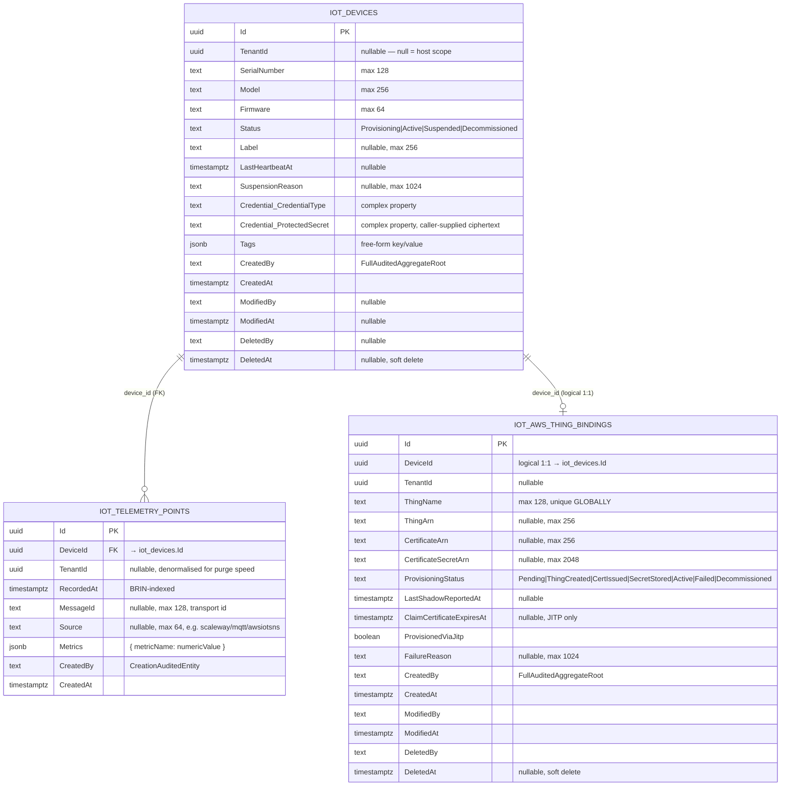
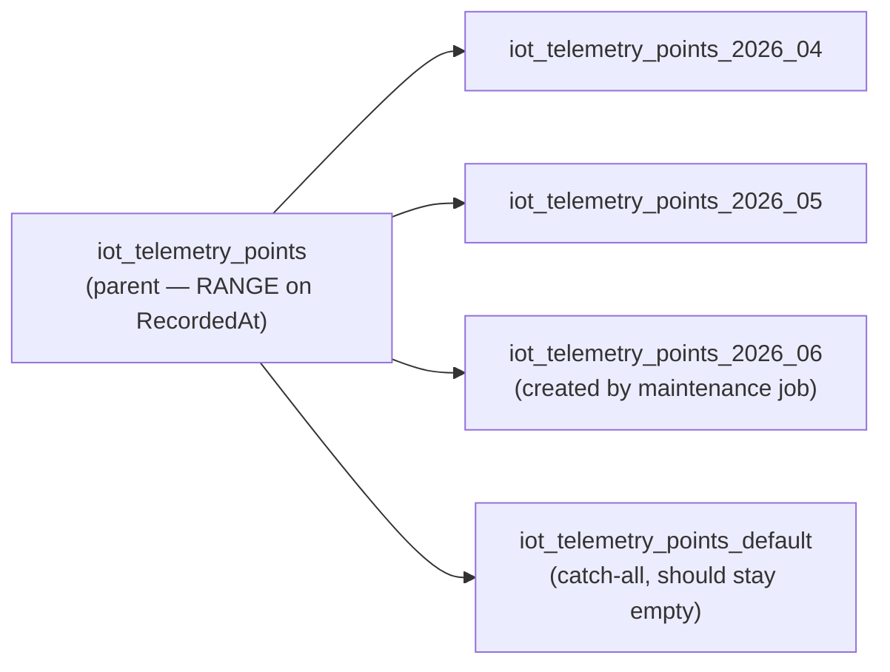

import { Aside, FileTree, Tabs, TabItem } from "@astrojs/starlight/components";

This page consolidates everything that lives in PostgreSQL when Granit.IoT
is deployed: two isolated `DbContext`s, three core tables, the JSONB
telemetry convention, the secrets-at-rest model, migration ordering, and
sizing guidelines that scale from a 100-device pilot to a billion-row
hypertable.

## Two isolated `DbContext`s

Granit.IoT ships **two independent EF Core contexts** — one for the
cloud-agnostic domain, one for the AWS bridge. Each owns its own
migrations history (`__EFMigrationsHistory_*`), its own table prefix, and
can be added or removed from a deployment without touching the other.



| DbContext | Table prefix | Tables | Package |
| --- | --- | --- | --- |
| `IoTDbContext` | `iot_` | `iot_devices`, `iot_telemetry_points` | `Granit.IoT.EntityFrameworkCore` |
| `AwsBindingDbContext` | `iot_aws_` | `iot_aws_thing_bindings` | `Granit.IoT.Aws.EntityFrameworkCore` |

<Aside type="note" title="Why no cross-context FK?">
  `iot_aws_thing_bindings.DeviceId` references `iot_devices.Id`, but no
  PostgreSQL FOREIGN KEY enforces the relation — the two contexts maintain
  separate migration histories and can be deployed independently. Integrity
  is maintained by the bridge handlers (`AwsThingBridgeHandler` reacts to
  `DeviceDecommissionedEvent` to tear down its row). A host that stops
  using the AWS bridge can `DROP TABLE iot_aws_thing_bindings` without
  affecting the core schema.
</Aside>

## Entity-Relationship diagram



## Table — `iot_devices`

The aggregate root for IoT device management. One row per physical /
logical device, per tenant.

### Columns

| Column | Type | Constraints | Notes |
| --- | --- | --- | --- |
| `Id` | `uuid` | `PK` | DDD aggregate identifier |
| `TenantId` | `uuid` | nullable | `null` = host-scope; otherwise tenant-scoped |
| `SerialNumber` | `text` | NOT NULL, max 128 | `^[A-Za-z0-9][A-Za-z0-9\-_]{0,127}$` — mixed-case alphanumeric, dash, or underscore, enforced by `DeviceSerialNumber` VO |
| `Model` | `text` | NOT NULL, max 256 | Hardware model identifier (`HardwareModel` VO) |
| `Firmware` | `text` | NOT NULL, max 64 | Semver-like (`FirmwareVersion` VO) |
| `Status` | `text` | NOT NULL, max 32 | Enum stored as string per the [framework convention](/dotnet/data/enum-persistence/) — forward-compatible across enum reorderings |
| `Label` | `text` | nullable, max 256 | Operator-friendly name |
| `LastHeartbeatAt` | `timestamptz` | nullable | Updated by `IDeviceWriter.UpdateHeartbeatAsync` (bulk SQL) |
| `SuspensionReason` | `text` | nullable, max 1024 | Set on `Suspend(reason)` |
| `Credential_CredentialType` | `text` | nullable, max 64 | `DeviceCredential` complex property; e.g. `api-key`, `x509-thumbprint`, `aws-iot-cert-arn` |
| `Credential_ProtectedSecret` | `text` | nullable, max 2048 | `DeviceCredential` complex property; **caller-supplied ciphertext** (see [Secrets at rest](#secrets-at-rest)) |
| `Tags` | `jsonb` | nullable | Free-form key/value (e.g. `{"location": "WH-A"}`) |
| `CreatedBy` / `CreatedAt` | `text` / `timestamptz` | NOT NULL | `FullAuditedAggregateRoot` |
| `ModifiedBy` / `ModifiedAt` | `text` / `timestamptz` | nullable | `FullAuditedAggregateRoot` |
| `DeletedBy` / `DeletedAt` | `text` / `timestamptz` | nullable | Soft delete |

### Indexes

| Name | Columns | Type | Purpose |
| --- | --- | --- | --- |
| `pk_iot_devices` | `(Id)` | PRIMARY KEY | Aggregate lookup |
| `ix_iot_devices_tenant_serial` | `(TenantId, SerialNumber)` | `UNIQUE` | Per-tenant serial uniqueness — the FAIL-CLOSED safety net |
| `ix_iot_devices_tenant_status` | `(TenantId, Status)` | btree | Filter by status within a tenant (admin list) |

## Table — `iot_telemetry_points`

The append-only ledger of every device payload. **One row per device send**,
metrics co-located in a single JSONB column.

### Columns

| Column | Type | Constraints | Notes |
| --- | --- | --- | --- |
| `Id` | `uuid` | `PK` | Surrogate per row |
| `DeviceId` | `uuid` | NOT NULL | FK target → `iot_devices.Id` (not enforced at DB level for partitioning compatibility) |
| `TenantId` | `uuid` | nullable | Denormalised from `iot_devices` so GDPR purge avoids a join |
| `RecordedAt` | `timestamptz` | NOT NULL | Device-reported timestamp; **BRIN-indexed** |
| `MessageId` | `text` | nullable, max 128 | Transport message ID (Scaleway `X-Scaleway-Message-Id`, MQTT packet id, SNS ID) |
| `Source` | `text` | nullable, max 64 | `scaleway`, `mqtt`, `awsiotsns`, `awsiotdirect`, `awsiotapigw` |
| `Metrics` | `jsonb` | NOT NULL | `{ metricName: numericValue }` (see [JSONB schema](#jsonb-schema-for-metrics)) |
| `CreatedBy` / `CreatedAt` | `text` / `timestamptz` | NOT NULL | `CreationAuditedEntity` — append-only, no `Modified*` |

### Indexes (PostgreSQL native backend)

| Name | Columns | Type | Purpose |
| --- | --- | --- | --- |
| `pk_iot_telemetry_points` | `(Id)` | PRIMARY KEY | Row lookup |
| `ix_iot_telemetry_device_time` | `(DeviceId, RecordedAt DESC)` | btree | Covering index for the most common query |
| `ix_iot_telemetry_tenant_time` | `(TenantId, RecordedAt)` | btree | GDPR bulk erasure + per-tenant purge |
| `ix_iot_telemetry_brin_recorded_at` | `(RecordedAt)` | **BRIN** | 10× smaller than B-tree for append-only data |
| `ix_iot_telemetry_gin_metrics` | `(Metrics)` | **GIN `jsonb_ops`** | Per-key filters: `WHERE Metrics @> '{"temperature": 22.5}'` |

The BRIN and GIN indexes are created by the
`Granit.IoT.EntityFrameworkCore.Postgres` migration helpers — EF Core
cannot emit them declaratively:

```csharp
migrationBuilder.CreateTelemetryBrinIndex();        // BRIN(recorded_at)
migrationBuilder.CreateTelemetryGinIndex();         // GIN(metrics jsonb_ops)
migrationBuilder.CreateIoTPostgresIndexes();        // both, in one call
```

### Partitioning (opt-in, RANGE by month)



Each partition carries its **own** BRIN(`RecordedAt`) and GIN(`Metrics`)
indexes — dropping a partition drops its indexes with it. That's why GDPR
erasure at a month boundary is O(1). See
[Operations — Partition maintenance](/dotnet/iot/operations/#telemetrypartitionmaintenancejob--ahead-of-time-partition-creation).

### TimescaleDB hypertable (alternative opt-in)

When `Granit.IoT.EntityFrameworkCore.Timescale` is registered, the same
table is converted to a hypertable with 7-day chunks, plus two continuous
aggregates:

| Object | Type | Refresh policy | Used by |
| --- | --- | --- | --- |
| `iot_telemetry_points` | hypertable, 7-day chunks | n/a | All raw-row queries |
| `iot_telemetry_hourly` | continuous aggregate | every 30 min, lag 1 h, window 3 h | Window 1 h – 24 h |
| `iot_telemetry_daily` | continuous aggregate | every 6 h, lag 1 d, window 3 d | Window ≥ 24 h |

See [Time-series storage](/dotnet/iot/time-series/) for the full decision
tree between PostgreSQL-native and TimescaleDB.

## Table — `iot_aws_thing_bindings`

The AWS-companion aggregate. 1:1 with `iot_devices` (logical) but lives in
its own isolated context under the `iot_aws_` table prefix, so a non-AWS
deployment can drop it without touching the core tables.

### Columns

| Column | Type | Constraints | Notes |
| --- | --- | --- | --- |
| `Id` | `uuid` | `PK` | Aggregate identifier |
| `DeviceId` | `uuid` | NOT NULL | Logical FK → `iot_devices.Id` (not enforced at DB level) |
| `TenantId` | `uuid` | nullable | Matches `Device.TenantId` |
| `ThingName` | `text` | NOT NULL, max 128 | Format: `t{tenantId:N}-{serial}`; **globally** unique on the AWS account |
| `ThingArn` | `text` | nullable, max 256 | AWS Thing ARN |
| `CertificateArn` | `text` | nullable, max 256 | X.509 cert ARN issued by `CreateKeysAndCertificate` |
| `CertificateSecretArn` | `text` | nullable, max 2048 | Secrets Manager ARN holding the private key |
| `ProvisioningStatus` | `text` | NOT NULL, max 32 | Saga state machine — see [AWS bridge](/dotnet/iot/aws/#the-provisioning-saga) |
| `LastShadowReportedAt` | `timestamptz` | nullable | Updated by `DeviceLifecycleShadowHandler` |
| `ClaimCertificateExpiresAt` | `timestamptz` | nullable | JITP-only; surfaced as expiring by `ClaimCertificateRotationCheckService` |
| `ProvisionedViaJitp` | `boolean` | NOT NULL | Saga skips Thing creation when `true` |
| `FailureReason` | `text` | nullable, max 1024 | Set when `ProvisioningStatus = Failed` for operator triage |
| `CreatedBy` / `CreatedAt` / `ModifiedBy` / `ModifiedAt` / `DeletedBy` / `DeletedAt` | — | — | `FullAuditedAggregateRoot` |

### Indexes

| Name | Columns | Type | Purpose |
| --- | --- | --- | --- |
| `pk_iot_aws_thing_bindings` | `(Id)` | PRIMARY KEY | Aggregate lookup |
| `ix_iot_aws_thing_bindings_tenant_device` | `(TenantId, DeviceId)` | `UNIQUE` | Enforces the 1:1 relation per tenant |
| `ix_iot_aws_thing_bindings_thing_name` | `(ThingName)` | `UNIQUE` (GLOBAL) | AWS Thing names are global; the `t{tenantId}-*` prefix doubles as tenant isolation at the DB level |
| `ix_iot_aws_thing_bindings_tenant_status` | `(TenantId, ProvisioningStatus)` | btree | Reconciliation queries (find stuck or expired bindings) |

## JSONB schema for `Metrics`

`Metrics` is a single JSONB column storing one device payload — one entry
per metric the device emitted. The schema is intentionally minimal: keys
are metric names, values are doubles.

```json
{
  "temperature": 22.5,
  "humidity": 45.0,
  "battery": 90,
  "rssi": -67
}
```

### Naming conventions (`MetricName` VO)

`MetricName` enforces:

- **Lowercase** dot-notation segments — `pressure.intake` is valid;
  `Pressure-Intake` is not.
- **Max 10 segments** — guards against pathological deep paths.
- **Length-bounded** — total length capped (see VO source for current
  limit).

These rules make MQTT-topic ↔ metric mapping predictable and keep GIN
index size sane.

### Typical queries

<Tabs>
  <TabItem label="Per-metric filter">
    ```sql
    SELECT *
    FROM iot_telemetry_points
    WHERE device_id = $1
      AND recorded_at >= $2
      AND metrics @> '{"temperature": 22.5}';
    ```
    The GIN index makes this a direct lookup, not a JSONB scan.
  </TabItem>
  <TabItem label="Extract one metric">
    ```sql
    SELECT recorded_at, (metrics->>'temperature')::float AS temperature
    FROM iot_telemetry_points
    WHERE device_id = $1
      AND recorded_at BETWEEN $2 AND $3
    ORDER BY recorded_at DESC;
    ```
    The JSONB-extraction pattern behind the `/iot/telemetry/{deviceId}/aggregate`
    endpoint (`ITelemetryReader.GetAggregateAsync`) and any single-metric chart.
  </TabItem>
  <TabItem label="Aggregate in SQL">
    ```sql
    SELECT
      AVG((metrics->>'temperature')::float) AS avg_temp,
      MAX((metrics->>'temperature')::float) AS max_temp
    FROM iot_telemetry_points
    WHERE device_id = $1
      AND recorded_at BETWEEN $2 AND $3;
    ```
    Aggregates are computed in PostgreSQL, never loaded into the app.
  </TabItem>
</Tabs>

## Secrets at rest

The only column carrying a secret is
`iot_devices.Credential_ProtectedSecret` — the `ProtectedSecret` field of the
`DeviceCredential` complex property.

Granit does **not** encrypt this column with an EF Core value converter. The
`DeviceCredential.Create(credentialType, protectedSecret)` factory expects an
**already-encrypted** value: the ciphertext is produced by the caller (the
provisioning flow or credential domain service) before the value object is
constructed, and EF Core persists the string verbatim — the mapping is a plain
`ComplexProperty` with `HasMaxLength(2048)`, no `HasConversion`. Store
ciphertext, never plaintext.

Mitigations carried by the framework:

- `[SensitiveData(Level = Sensitivity.Restricted, Mode = SensitiveDataMode.Omit)]`
  (namespace `Granit.DataProtection`) on `DeviceCredential.ProtectedSecret` — the
  data-protection pipeline omits it from logs, serialization, OpenAPI schemas,
  and `422` validation payloads.
- The secret is never projected into `DeviceResponse` nor whitelisted as a
  `GET /iot/devices` query column, so it cannot leak through the API or the
  admin grid.

<Aside type="caution" title="Don't store secrets in Tags">
  The `Tags` JSONB column is **not** sanitised. Treat it as
  operator-visible free text — labels, locations, owner team. Secrets
  belong on `DeviceCredential`, full stop.
</Aside>

## Migration ordering

Each context has its own `EFMigrationsHistory` table and migrates
independently. Apply them in this order on a fresh deployment:

<Tabs>
  <TabItem label="Cloud-agnostic only">
    ```bash
    # 1. Core IoT schema (iot_devices, iot_telemetry_points)
    dotnet ef database update \
      --context IoTDbContext \
      --project MyApp.Host
    ```
  </TabItem>
  <TabItem label="With AWS bridge">
    ```bash
    # 1. Core IoT schema
    dotnet ef database update \
      --context IoTDbContext \
      --project MyApp.Host

    # 2. AWS bridge schema (iot_aws_thing_bindings)
    dotnet ef database update \
      --context AwsBindingDbContext \
      --project MyApp.Host
    ```
    Order matters only on the **first** deploy — the AWS bridge handlers
    reference `Device.Id`, so a binding created against an unknown device
    would orphan. On every subsequent deploy the contexts migrate
    independently.
  </TabItem>
  <TabItem label="With partitioning enabled">
    ```csharp
    // In your application's IoT migration — RUN BEFORE FIRST LARGE INSERT
    public partial class EnablePartitioning : Migration
    {
        protected override void Up(MigrationBuilder migrationBuilder)
        {
            migrationBuilder.EnableTelemetryPartitioning();
            migrationBuilder.CreateTelemetryPartition(2026, 5);
            migrationBuilder.CreateTelemetryPartition(2026, 6);
            // Future months provisioned by TelemetryPartitionMaintenanceJob
        }
    }
    ```
  </TabItem>
  <TabItem label="With TimescaleDB">
    ```csharp
    // In an application migration — requires timescaledb extension installed
    public partial class EnableTimescale : Migration
    {
        protected override void Up(MigrationBuilder migrationBuilder)
        {
            migrationBuilder.EnableTelemetryHypertable();
            migrationBuilder.CreateTelemetryHourlyAggregate();
            migrationBuilder.CreateTelemetryDailyAggregate();
        }
    }
    ```
    Or let `GranitIoTTimescaleModule` apply the DDL at startup
    (idempotent). Pick one path, not both.
  </TabItem>
</Tabs>

<Aside type="caution" title="Don't run EnableTelemetryPartitioning() on a populated table">
  Converting a populated table to RANGE-partitioned moves existing rows
  into `_default` — and you lose time-bounded drop semantics. Enable
  partitioning on an empty table at the start of your project, or write a
  dedicated data-copy migration.
</Aside>

## Sizing guidelines

Indicative numbers — exact ratios depend on the average `Metrics` payload
size, retention window, and provider.

| Scale (rows/day) | Recommended backend | Row size | Storage / month | Notes |
| --- | --- | --- | --- | --- |
| < 1 M | PostgreSQL native, no partitioning | ~250-400 B | ~10 GB | BRIN + GIN; default backend |
| 1 M – 10 M | PostgreSQL native + monthly partitioning | ~250-400 B | ~100 GB | Enable `EnableTelemetryPartitioning()` |
| 10 M – 100 M | PostgreSQL or **TimescaleDB** | ~200-350 B (Timescale chunks compress better) | ~1 TB | Consider hypertable for dashboard speed-up |
| > 100 M | **TimescaleDB hypertable + continuous aggregates** | ~150-300 B | ≥ 10 TB | Continuous aggregates become mandatory |

### Row size estimate

A typical row in `iot_telemetry_points`:

| Component | Bytes (typical) |
| --- | --- |
| Header + visibility | 28 |
| `Id` (uuid) | 16 |
| `DeviceId` (uuid) | 16 |
| `TenantId` (uuid) | 16 |
| `RecordedAt` (timestamptz) | 8 |
| `MessageId` (text, ~36 chars) | ~40 |
| `Source` (text, ~8 chars) | ~12 |
| `Metrics` (jsonb, 3-5 numeric keys) | ~80-150 |
| Audit columns | ~40 |
| Index overhead (per row) | ~50-80 |
| **Total** | **~300-400 B** |

A 256 KB `MaxPayloadBytes` cap on ingestion (see
[Telemetry ingestion](/dotnet/iot/telemetry-ingestion/#the-ingestion-endpoint--post-iotingestsource))
guards against degenerate payloads that would balloon `Metrics`.

## Compliance — what gets erased and where

| Action | Affected tables | Mechanism |
| --- | --- | --- |
| **Per-tenant retention** | `iot_telemetry_points` | `StaleTelemetryPurgeJob` — bucketed `ExecuteDeleteAsync` |
| **Month rollover** (partitioned) | `iot_telemetry_points_YYYY_MM` | `DROP TABLE` of the oldest partition (O(1)) |
| **Device decommission** | `iot_devices` (soft delete) + `iot_aws_thing_bindings` (hard delete on AWS side) | `Device.Decommission()` raises events; bridges tear down |
| **GDPR Art. 17 erasure** | `iot_telemetry_points` (full purge); `iot_devices` (soft delete + audit retention per policy) | Combination of purge job + manual aggregate flow |
| **Tenant offboarding** | All `iot_*` and `iot_aws_*` rows with matching `TenantId` | Host-driven bulk SQL inside the offboarding pipeline |

The Timeline bridge keeps an immutable audit trail — see
[Timeline bridge](/dotnet/iot/timeline-bridge/) — so erasure of telemetry
does not erase the record that the device existed.

## See also

- [Device management](/dotnet/iot/device-management/) — the aggregate behaviours behind these tables
- [Telemetry ingestion](/dotnet/iot/telemetry-ingestion/) — the write path that produces telemetry rows
- [Time-series storage](/dotnet/iot/time-series/) — PostgreSQL native vs TimescaleDB
- [Operations](/dotnet/iot/operations/) — purge, heartbeat, partition maintenance
- [AWS IoT Core bridge](/dotnet/iot/aws/) — the saga that owns `iot_aws_thing_bindings`
- [Security overview](/dotnet/security/security-overview/) — secrets-at-rest model
