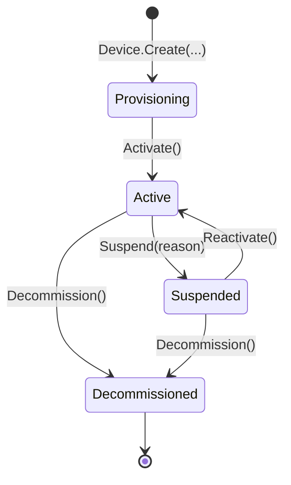
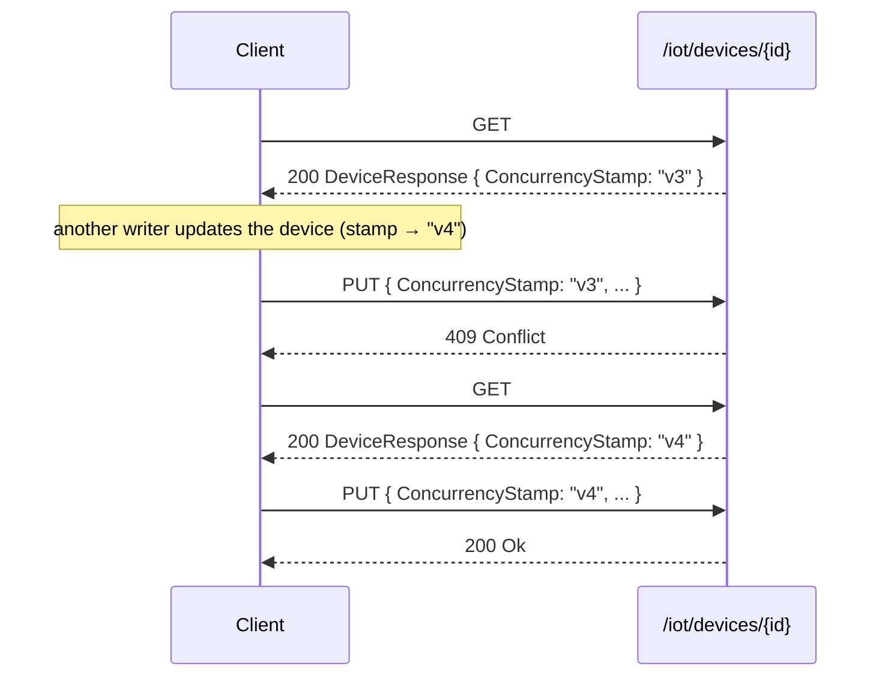

import { Aside, FileTree } from "@astrojs/starlight/components";

This guide covers **Ring 1** of Granit.IoT — the core device-management
stack. Four packages, all framework-aligned: a DDD aggregate, a Minimal API
surface, an isolated EF Core DbContext, and a PostgreSQL provider that ships
the indexes and partitioning helpers EF Core cannot emit on its own.

## What problem does Ring 1 solve?

Without a shared device model, every team rebuilds the same plumbing — and
most rebuilds leak in one of four ways:

- **Ad-hoc lifecycle.** Devices jump from "new" to "broken" with no audit
  trail of who suspended them or why. ISO 27001 asset traceability fails the
  next audit.
- **Leaky multi-tenancy.** A missing `WHERE tenant_id = …` eventually
  returns another customer's devices. The fix is not discipline; it's a
  named query filter at the EF Core level.
- **Credentials in the response body.** Device secrets end up serialised
  into JSON responses or OpenAPI examples.
- **Slow telemetry queries.** A B-tree on `recorded_at` grows unbounded;
  GDPR erasure becomes a multi-minute `DELETE`.

Ring 1 ships an opinionated domain model with private setters, a state
machine enforced in code, `[SensitiveData]` on credentials, and time-series
indexes (BRIN + GIN + partitioning) as first-class migration helpers.

## Package layout

<FileTree>
- src/
  - Granit.IoT/ Aggregates, value objects, events, CQRS abstractions, diagnostics
  - Granit.IoT.Endpoints/ Minimal API: /iot/devices + /iot/telemetry
  - Granit.IoT.EntityFrameworkCore/ IoTDbContext, query filters, reader/writer impls
  - Granit.IoT.EntityFrameworkCore.Postgres/ BRIN, GIN, JSONB, RANGE partitioning helpers
</FileTree>

## Device — the central aggregate

`Device` is a `FullAuditedAggregateRoot` implementing `IMultiTenant`,
`IWorkflowStateful`, and `ITimelined`. Every property has a `private set` —
all mutations go through methods enforced by architecture tests.

### Lifecycle state machine



Each transition raises a domain event (`DeviceProvisionedEvent`,
`DeviceActivatedEvent`, `DeviceSuspendedEvent`, `DeviceReactivatedEvent`,
`DeviceDecommissionedEvent`) consumed locally by handlers. Cross-boundary
events carry the `*Eto` suffix — for example `DeviceProvisionedEto`,
emitted through the integration bus.

Illegal transitions throw a domain exception. `device.Activate()` on a
`Decommissioned` device fails loudly, not silently.

### Mutating methods

```csharp
public static Device Create(
    Guid id, Guid? tenantId,
    DeviceSerialNumber serialNumber, HardwareModel model, FirmwareVersion firmware,
    string? label = null, DeviceCredential? credential = null);

public void Activate();
public void Suspend(string reason);
public void Reactivate();
public void Decommission();
public void UpdateFirmware(FirmwareVersion firmware);
public void UpdateLabel(string? label);
public void UpdateCredential(DeviceCredential? credential);
public void UpdateTags(IReadOnlyDictionary<string, string>? tags);
public void RecordHeartbeat(DateTimeOffset timestamp);
```

### Value objects

| Type | Base | Validation |
| --- | --- | --- |
| `DeviceSerialNumber` | `SingleValueObject<string>` | Uppercase alphanumeric + dash, length-bounded |
| `HardwareModel` | `SingleValueObject<string>` | Non-empty, length-bounded |
| `FirmwareVersion` | `SingleValueObject<string>` | Semver-like, length-bounded |
| `DeviceCredential` | `ValueObject` | `CredentialType` + `ProtectedSecret` (`[SensitiveData]`) |
| `MetricName` | `SingleValueObject<string>` | Dot-notation, lowercase, max 10 segments |

`DeviceCredential.ProtectedSecret` carries the `[SensitiveData]` attribute —
`Granit.Http.Sanitization` strips it from logs, OpenAPI schemas, and
validation-error payloads.

## CQRS — reader/writer split

The reader and writer interfaces are **never merged** into a `*Store`.
Readers query with `AsNoTracking()`; writers mutate; heartbeat updates
bypass the full aggregate load via `ExecuteUpdateAsync`.

```csharp
public interface IDeviceReader
{
    Task<Device?> FindAsync(Guid id, CancellationToken ct = default);
    Task<Device?> FindBySerialNumberAsync(string serialNumber, CancellationToken ct = default);
    Task<IReadOnlyList<Device>> ListAsync(DeviceStatus? status, int skip, int take, CancellationToken ct = default);
    Task<int> CountAsync(DeviceStatus? status, CancellationToken ct = default);
    Task<bool> ExistsAsync(string serialNumber, CancellationToken ct = default);
    Task<IReadOnlyList<Guid?>> GetDistinctTenantIdsAsync(CancellationToken ct = default);
    Task<IReadOnlyList<Device>> FindStaleAsync(
        IReadOnlyCollection<Guid?> tenantIds,
        DateTimeOffset lastHeartbeatBefore,
        int batchSize,
        CancellationToken ct = default);
}

public interface IDeviceWriter
{
    Task AddAsync(Device device, CancellationToken ct = default);
    Task UpdateAsync(Device device, CancellationToken ct = default);
    Task DeleteAsync(Device device, CancellationToken ct = default);
    Task UpdateHeartbeatAsync(Guid deviceId, DateTimeOffset timestamp, CancellationToken ct = default);
}
```

`UpdateHeartbeatAsync` emits one
`UPDATE iot_devices SET last_heartbeat_at = $1 WHERE id = $2` via EF Core's
bulk update — **no `SELECT` round-trip**. At 100k devices publishing every
10 minutes, this keeps the write path predictable.

`FindStaleAsync` is the multi-tenant batch signature consumed by
`DeviceHeartbeatTimeoutJob`. It bypasses the tenant query filter via
`IgnoreQueryFilters()` and uses `WHERE tenant_id = ANY(@list)`.

## Minimal API — `/iot/devices`

`Granit.IoT.Endpoints` registers the route group via
`MapGranitIoTEndpoints()`:

| Method | Route | Permission | Returns |
| --- | --- | --- | --- |
| `GET` | `/iot/devices` | `IoT.Devices.Read` | `200 Ok` — `IReadOnlyList<DeviceResponse>` |
| `GET` | `/iot/devices/{id}` | `IoT.Devices.Read` | `200 Ok` / `404 Not Found` |
| `POST` | `/iot/devices` | `IoT.Devices.Manage` | `201 Created` — `DeviceResponse` |
| `PUT` | `/iot/devices/{id}` | `IoT.Devices.Manage` | `200 Ok` / `409` on `ConcurrencyStamp` mismatch |
| `DELETE` | `/iot/devices/{id}` | `IoT.Devices.Manage` | `204 No Content` / `409` when still `Active` |

### Request / response shapes

```csharp
public sealed record DeviceProvisionRequest
{
    public required string SerialNumber { get; init; }
    public required string HardwareModel { get; init; }
    public required string FirmwareVersion { get; init; }
    public string? Label { get; init; }
}

public sealed record DeviceResponse(
    Guid Id,
    string SerialNumber,
    string HardwareModel,
    string FirmwareVersion,
    string Status,
    string? Label,
    DateTimeOffset? LastHeartbeatAt,
    DateTimeOffset CreatedAt,
    DateTimeOffset? ModifiedAt,
    string ConcurrencyStamp);

public sealed record DeviceUpdateRequest : IConcurrencyStampRequest
{
    [Required(AllowEmptyStrings = false)]
    public string ConcurrencyStamp { get; init; } = null!;

    public string? FirmwareVersion { get; init; }
    public string? Label { get; init; }
}
```

FluentValidation rejects malformed requests with `422 Unprocessable Entity`
**before** your handler runs. `DeviceCredential.ProtectedSecret` is never
serialised back to the client.

### Optimistic concurrency

`GET /iot/devices/{id}` returns a `ConcurrencyStamp` — an opaque token that
tracks the aggregate version. To update a device, echo that stamp back in the
`DeviceUpdateRequest`. Its other fields are optional: `null` leaves a value
unchanged; an empty `Label` clears it.

The server compares the submitted stamp against the current stored value. If
another writer modified the device in the meantime, the stamps differ and the
`PUT` returns `409 Conflict`. Re-read the device, reapply your change on top of
the fresh stamp, and retry.



`DeviceUpdateRequest` implements `IConcurrencyStampRequest`, so the stamp is
`[Required]` — a missing or empty value fails validation with
`422 Unprocessable Entity`.

## Telemetry query endpoints — `/iot/telemetry`

| Method | Route | Permission | Notes |
| --- | --- | --- | --- |
| `GET` | `/iot/telemetry/{deviceId}` | `IoT.Telemetry.Read` | Time-range query, `maxPoints` 1–10000 |
| `GET` | `/iot/telemetry/{deviceId}/latest` | `IoT.Telemetry.Read` | Most recent value per metric key |
| `GET` | `/iot/telemetry/{deviceId}/aggregate` | `IoT.Telemetry.Read` | Server-side `Avg` / `Min` / `Max` / `Count` |

All three delegate to `ITelemetryReader`; aggregates are computed in
PostgreSQL via `(metrics->>'<key>')::float`, never loaded into memory.

Cross-tenant access returns `404 Not Found` — the existence of another
tenant's device is never leaked.

## TelemetryPoint — append-only ledger

`TelemetryPoint` is a `CreationAuditedEntity`, never an aggregate. A single
device payload (`{temp: 22.5, humidity: 45, battery: 90}`) is **one row**
with three metrics in the `metrics` JSONB column.

```csharp
public static TelemetryPoint Create(
    Guid id, Guid deviceId, Guid? tenantId,
    DateTimeOffset recordedAt,
    IReadOnlyDictionary<string, double> metrics,
    string? messageId, string? source);
```

### Why JSONB-per-payload and not EAV?

- **One row vs N rows** per payload — 3-10× smaller storage
- One index lookup per query, not N joins
- Writes don't need a transaction to keep multi-metric payloads atomic
- GIN index on `metrics` still allows per-key filters:

  ```sql
  WHERE metrics @> '{"temperature": 22.5}'
  ```

## IoTDbContext — isolated schema

Granit.IoT ships its own `DbContext`. No shared context across modules —
this keeps migrations independent and architecture tests enforceable.

```csharp
public sealed class IoTDbContext : DbContext
{
    public DbSet<Device> Devices => Set<Device>();
    public DbSet<TelemetryPoint> TelemetryPoints => Set<TelemetryPoint>();
}
```

All tables are prefixed `iot_` (`iot_devices`, `iot_telemetry_points`).
Query filters for multi-tenancy and soft-delete are applied via
`modelBuilder.ApplyGranitConventions(currentTenant, dataFilter)` at the end
of `OnModelCreating` — the same pattern used everywhere else in Granit.

### Indexes (initial migration)

| Table | Index | Purpose |
| --- | --- | --- |
| `iot_devices` | `UNIQUE (tenant_id, serial_number)` | Per-tenant serial uniqueness |
| `iot_devices` | `(tenant_id, status)` | Filter by status within a tenant |
| `iot_telemetry_points` | `(device_id, recorded_at DESC)` | Covering index for the most common query |
| `iot_telemetry_points` | `(tenant_id, recorded_at)` | GDPR bulk erasure + per-tenant purge |

## PostgreSQL-specific helpers

`Granit.IoT.EntityFrameworkCore.Postgres` ships `MigrationBuilder`
extensions for the indexes and partitioning EF Core cannot emit
declaratively:

```csharp
migrationBuilder.CreateTelemetryBrinIndex();        // BRIN(recorded_at)
migrationBuilder.CreateTelemetryGinIndex();         // GIN(metrics jsonb_ops)
migrationBuilder.CreateIoTPostgresIndexes();        // BRIN + GIN in one call
migrationBuilder.EnableTelemetryPartitioning();     // Convert to RANGE-partitioned
migrationBuilder.CreateTelemetryPartition(2026, 5); // iot_telemetry_points_2026_05
```

A BRIN index on `recorded_at` is an order of magnitude smaller than a
B-tree for append-only data — critical at hundreds of millions of rows.

See [Operations](/dotnet/iot/operations/) for the partition-maintenance job
that provisions future partitions automatically.

## Permissions

Declared in `IoTPermissions` and auto-discovered by `Granit.Authorization`:

| Key | Granted action |
| --- | --- |
| `IoT.Devices.Read` | List and retrieve devices |
| `IoT.Devices.Manage` | Provision, update, decommission |
| `IoT.Telemetry.Read` | Query telemetry and aggregates |

## Anti-patterns to avoid

<Aside type="caution" title="Don't query IoTDbContext from endpoint handlers">
  Always go through `IDeviceReader` / `ITelemetryReader`. Architecture tests
  fail CI if a handler references the context directly.
</Aside>

<Aside type="caution" title="Don't expose Device entities in responses">
  Use `DeviceResponse`. Returning the entity leaks `Credential` (even
  scrubbed by `[SensitiveData]`, it's a bad habit) and tightly couples your
  API to your persistence model.
</Aside>

<Aside type="caution" title="Don't load the full aggregate to update LastHeartbeatAt">
  Use `IDeviceWriter.UpdateHeartbeatAsync(id, timestamp)` — a single
  `ExecuteUpdateAsync` call with no change tracking. The aggregate-load path
  costs a SELECT + UPDATE per device, which collapses at fleet scale.
</Aside>

## See also

- [Getting started](/dotnet/iot/getting-started/) — 5-minute quickstart
- [Data model](/dotnet/iot/data-model/) — full PostgreSQL schema, JSONB conventions, sizing
- [Telemetry ingestion](/dotnet/iot/telemetry-ingestion/) — how telemetry actually lands in the table
- [Time-series storage](/dotnet/iot/time-series/) — PostgreSQL-native vs TimescaleDB hypertables
- [Operations](/dotnet/iot/operations/) — partitioning, purge, heartbeat detection
- [Timeline bridge](/dotnet/iot/timeline-bridge/) — device lifecycle events as audit chatter
