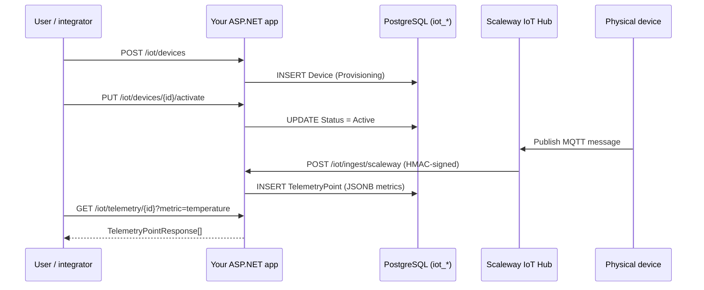

import { Aside, Steps, Tabs, TabItem } from "@astrojs/starlight/components";

This walk-through wires Granit.IoT into an existing Granit host application
and gets a real device → webhook → telemetry table flow running in five
minutes. You'll register the bundle, provision a device, point Scaleway IoT
Hub at the webhook, and query the telemetry that lands in PostgreSQL.

## What you'll build

By the end of this page, your ASP.NET Core app exposes:

- `GET|POST|PUT|DELETE /iot/devices` — device CRUD
- `GET /iot/telemetry/{deviceId}` — time-range telemetry queries
- `POST /iot/ingest/scaleway` — HMAC-validated webhook for Scaleway IoT Hub
- Three recurring background jobs (purge, heartbeat, partition maintenance)
- Threshold alerts via `Granit.Notifications`
- Device lifecycle entries in `Granit.Timeline`



## Prerequisites

- [.NET 10 SDK](https://dotnet.microsoft.com/download/dotnet/10.0)
- [PostgreSQL 16+](https://www.postgresql.org/) — local or managed (Scaleway DB, RDS, OVH)
- [Redis 7+](https://redis.io/) — for transport-level deduplication
- An existing Granit host (see [Project templates](/dotnet/getting-started/project-templates/))
- Read access to the
  [Granit GitHub Packages](https://github.com/orgs/granit-fx/packages) NuGet feed

<Steps>

1. ### Configure the Granit NuGet feed

   Granit.IoT packages live on GitHub Packages. Authenticate once with a
   personal access token (PAT) that has the `read:packages` scope. If the
   feed isn't registered yet, add it first; otherwise update the
   credentials on the existing entry:

   ```bash
   # First-time setup
   dotnet nuget add source https://nuget.pkg.github.com/granit-fx/index.json \
     --name granit-registry \
     --username YOUR_GITHUB_USERNAME \
     --password YOUR_GITHUB_PAT \
     --store-password-in-clear-text \
     --configfile nuget.config

   # Subsequent credential rotation
   dotnet nuget update source granit-registry \
     --username YOUR_GITHUB_USERNAME \
     --password YOUR_GITHUB_PAT \
     --store-password-in-clear-text \
     --configfile nuget.config
   ```

   <Aside type="caution" title="Never commit your PAT">
     `.gitignore` your `nuget.config` when it contains credentials, or inject
     the token at CI time via `NUGET_AUTH_TOKEN` + a dynamic feed source.
   </Aside>

2. ### Install the bundle

   A single NuGet reference pulls in the full cloud-agnostic stack:

   ```bash
   dotnet add package Granit.Bundle.IoT
   ```

   That's 12 packages — domain, EF Core persistence, PostgreSQL migrations,
   device CRUD endpoints, ingestion pipeline, ingestion webhook,
   Scaleway provider, Wolverine handlers, background jobs, notifications
   bridge, timeline bridge, and the MCP bridge.

   <Aside type="note" title="MQTT, TimescaleDB and AWS-native ingestion are opt-in">
     `Granit.IoT.Mqtt[.Mqttnet]`,
     `Granit.IoT.EntityFrameworkCore.Timescale`, and
     `Granit.IoT.Ingestion.Aws` are not included in `Granit.Bundle.IoT`.
     Add them only when needed — see [MQTT transport](/dotnet/iot/mqtt/),
     [Time-series storage](/dotnet/iot/time-series/), and the AWS provider
     section of
     [Telemetry ingestion](/dotnet/iot/telemetry-ingestion/#provider--aws-iot-core-telemetry).
   </Aside>

3. ### Register the modules

   Chain `.AddIoT()` onto the existing Granit builder:

   ```csharp
   using Granit.Bundle.IoT;

   var builder = WebApplication.CreateBuilder(args);

   builder.Services
       .AddGranit(builder.Configuration)
       .AddIoT();

   var app = builder.Build();

   app.MapGranitIoTEndpoints();          // /iot/devices + /iot/telemetry
   app.MapGranitIoTIngestionEndpoints(); // /iot/ingest/{source}

   app.Run();
   ```

   `AddIoT()` enumerates the 11 active modules in topological order
   (`Granit.IoT.EntityFrameworkCore.Postgres` ships as migration helpers only,
   so it has no module class to register). Actual DI order is driven by each
   module's `[DependsOn(...)]` graph — you can't accidentally skip a
   dependency.

4. ### Configure PostgreSQL, Redis, and Scaleway

   Add the following to `appsettings.json` (placeholders only — never commit
   real secrets):

   ```json
   {
     "ConnectionStrings": {
       "Default": "Host=localhost;Database=granit;Username=granit;Password=__FROM_SECRET_STORE__",
       "Redis": "localhost:6379"
     },
     "IoT": {
       "TelemetryRetentionDays": 365,
       "HeartbeatTimeoutMinutes": 15,
       "Ingestion": {
         "Scaleway": {
           "SharedSecret": "__FROM_SECRET_STORE__",
           "TopicDeviceSegmentIndex": 1
         }
       }
     },
     "RateLimiting": {
       "Policies": {
         "iot-ingest": { "PermitLimit": 100, "Window": "00:00:01" }
       }
     }
   }
   ```

   | Key | Default | Purpose |
   | --- | --- | --- |
   | `IoT:TelemetryRetentionDays` | `365` | Per-tenant retention window enforced by `StaleTelemetryPurgeJob` |
   | `IoT:HeartbeatTimeoutMinutes` | `15` | Time without heartbeat before a device is flagged offline |
   | `IoT:Ingestion:Scaleway:SharedSecret` | *(required)* | HMAC secret configured in Scaleway IoT Hub |
   | `IoT:Ingestion:Scaleway:TopicDeviceSegmentIndex` | `1` | Index of the topic segment carrying the device serial |

   <Aside type="tip" title="Per-tenant overrides">
     Every `IoT:*` key is registered with `Granit.Settings` providers
     `["T", "G"]` — a tenant admin can lower retention or raise the threshold
     for noisy hardware without redeploying. See
     [Notifications bridge](/dotnet/iot/notifications-bridge/#per-tenant-configuration-via-iotsettingnames)
     for the cascade order.
   </Aside>

5. ### Apply migrations

   Granit.IoT ships its own isolated `IoTDbContext`. Tables are prefixed
   `iot_` and never share a context with another module:

   ```bash
   dotnet ef database update \
     --context IoTDbContext \
     --project MyApp.Host
   ```

   The initial migration creates the schema, including:

   - `UNIQUE (tenant_id, serial_number)` on `iot_devices`
   - BRIN index on `iot_telemetry_points.recorded_at` (10× smaller than B-tree)
   - GIN index on `iot_telemetry_points.metrics` (per-key JSONB queries)
   - Covering index `(device_id, recorded_at DESC)` for the most common query

   For high-volume deployments, enable monthly partitioning before your first
   production insert — see [Operations](/dotnet/iot/operations/). For the full
   schema (column types, secrets-at-rest, sizing per row count, AWS-companion
   tables), see [Data model](/dotnet/iot/data-model/).

6. ### Provision your first device

   ```bash
   curl -X POST https://your-app/iot/devices \
     -H "Authorization: Bearer $TOKEN" \
     -H "Content-Type: application/json" \
     -d '{
       "serialNumber": "ACME-TH-001",
       "hardwareModel": "ACME-ThermoHumidity-v2",
       "firmwareVersion": "1.4.2",
       "label": "Warehouse A — aisle 3"
     }'
   ```

   Response — `201 Created`:

   ```json
   {
     "id": "7f3c9b2a-1d54-4a7e-9c1f-d3a8e5b0f9aa",
     "serialNumber": "ACME-TH-001",
     "status": "Provisioning",
     "lastHeartbeatAt": null,
     "createdAt": "2026-05-20T08:12:33Z"
   }
   ```

   The device starts in `Provisioning`. Call
   `PUT /iot/devices/{id}/activate` to move it to `Active`. Every transition
   is mirrored to `Granit.Timeline` automatically.

7. ### Point Scaleway IoT Hub at your webhook

   In the Scaleway console:

   1. Open your IoT Hub and create a new **Route** of type **REST**.
   2. **Endpoint URL**: `https://your-app.example.com/iot/ingest/scaleway`
   3. **HTTP verb**: `POST`.
   4. **Headers**: let Scaleway add `X-Scaleway-Signature` automatically.
   5. **Shared secret**: same value as `IoT:Ingestion:Scaleway:SharedSecret`.
   6. **Topic filter**: e.g. `devices/+/telemetry` — matches the configured
      `TopicDeviceSegmentIndex` rule.

   The first device message arriving on that topic hits your webhook,
   verifies HMAC-SHA256, deduplicates via Redis, enqueues a
   `TelemetryIngestedEto` on the Wolverine outbox, and returns `202 Accepted`.
   End-to-end latency from device publish to `202` stays under one second
   at P99.

8. ### Query telemetry

   <Tabs>
     <TabItem label="Time range">
       ```bash
       curl "https://your-app/iot/telemetry/$DEVICE_ID?from=2026-05-20T00:00:00Z&to=2026-05-20T23:59:59Z&maxPoints=500" \
         -H "Authorization: Bearer $TOKEN"
       ```
     </TabItem>
     <TabItem label="Latest per metric">
       ```bash
       curl "https://your-app/iot/telemetry/$DEVICE_ID/latest" \
         -H "Authorization: Bearer $TOKEN"
       ```
     </TabItem>
     <TabItem label="Server-side aggregate">
       ```bash
       curl "https://your-app/iot/telemetry/$DEVICE_ID/aggregate?metric=temperature&aggregation=avg&from=2026-05-20T00:00:00Z&to=2026-05-20T23:59:59Z" \
         -H "Authorization: Bearer $TOKEN"
       ```
     </TabItem>
   </Tabs>

   All telemetry endpoints are **read-only** and delegate to
   `ITelemetryReader`. Multi-tenancy is enforced by a named query filter on
   `TenantId`, so a compromised JWT can never surface another tenant's data.

</Steps>

## What's next

| I want to… | Read |
| --- | --- |
| Understand the domain model and state machine | [Device management](/dotnet/iot/device-management/) |
| See the full PostgreSQL schema, JSONB conventions, and sizing | [Data model](/dotnet/iot/data-model/) |
| Dive into the ingestion pipeline internals | [Telemetry ingestion](/dotnet/iot/telemetry-ingestion/) |
| Connect a non-Scaleway broker (Mosquitto, EMQX, HiveMQ, AWS IoT Core via MQTT) | [MQTT transport](/dotnet/iot/mqtt/) |
| Pick a time-series backend (PostgreSQL native vs TimescaleDB) | [Time-series storage](/dotnet/iot/time-series/) |
| Prepare for production scale (partitioning, purge, heartbeat) | [Operations](/dotnet/iot/operations/) |
| Provision AWS IoT Things with X.509 certs and Secrets Manager | [AWS bridge](/dotnet/iot/aws/) |
| Route threshold alerts into my notification pipeline | [Notifications bridge](/dotnet/iot/notifications-bridge/) |
| Surface device lifecycle in my audit UI | [Timeline bridge](/dotnet/iot/timeline-bridge/) |
| Let Claude or Copilot talk to my fleet | [MCP bridge](/dotnet/iot/mcp-bridge/) |
| See the complete package list and bundle semantics | [Bundle reference](/dotnet/iot/bundle/) |
