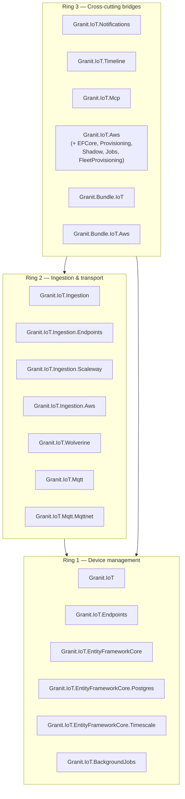

import { Aside, Badge, CardGrid, Card, FileTree, LinkCard } from "@astrojs/starlight/components";

`Granit.IoT` is the **IoT and Industry 4.0** module family of the Granit framework.
It ships **22 focused NuGet packages plus two meta-bundles** that turn any
multi-tenant Granit application into a production-grade IoT platform: device
inventory, telemetry ingestion, threshold alerting, audit trail, AI agent
access, MQTT and AWS IoT Core transports, and PostgreSQL- or TimescaleDB-backed
time-series storage.

It is the open-source, modular answer to platforms like
[ThingsBoard](https://thingsboard.io/docs/), [AWS IoT Core](https://aws.amazon.com/iot-core/),
and [Azure IoT Hub](https://azure.microsoft.com/en-us/products/iot-hub) — wired
into the same DDD aggregates, CQRS readers/writers, Wolverine outbox, and
multi-tenant query filters as the rest of the Granit stack.

<Aside type="note" title="Repository">
  Granit.IoT lives in its own repository:
  [github.com/granit-fx/granit-iot](https://github.com/granit-fx/granit-iot). It
  depends on published `Granit.*` packages from
  [granit-dotnet](https://github.com/granit-fx/granit-dotnet) — you don't have
  to fork or vendor anything to use it.
</Aside>

## Problems Granit.IoT solves

Teams adding IoT features on top of any .NET SaaS hit the same wall every time.
Granit.IoT closes the gap with opinionated, framework-aligned defaults.

| Problem | Without Granit.IoT | With Granit.IoT |
| --- | --- | --- |
| **No standard device model** | Every app reinvents `Device` + lifecycle | DDD aggregate with state machine + `FullAuditedAggregateRoot` |
| **Blocking webhooks** | Provider retries collide with slow DB writes | `202 Accepted` in < 1 s + Wolverine transactional outbox |
| **Forgotten signature validation** | A webhook becomes a public DB insert | HMAC-SHA256 / SigV4 validated **before** any DB hit |
| **Duplicate messages** | Same payload fires alerts N times | Redis `SETNX` dedup on transport message-id (TTL 5 min) |
| **Multi-tenancy leaks** | A missing `WHERE tenant_id = …` ships another customer's data | Named query filter on `TenantId`, enforced by arch tests |
| **Exploding telemetry tables** | A year of data → multi-minute queries | BRIN + GIN + monthly partitioning, opt-in TimescaleDB hypertables |
| **Provider lock-in** | Each cloud is a re-integration | Pluggable `IIngestionParser` / `IPayloadSignatureValidator` |
| **Silos for alerts & audit** | Threshold alerts live in their own UI | Bridge to `Granit.Notifications` + `Granit.Timeline` |
| **No AI surface** | Operators chase dashboards by hand | `[McpServerTool]` wrappers, tenant-scoped, read-only |

## Ring architecture

The 22 packages are organised in three cohesion rings. Each ring depends only
on itself and inner rings — Ring 2 cannot reach Ring 3, and Ring 3 never
duplicates infrastructure that already exists in Ring 1 or Ring 2. The
discipline is enforced by `Granit.IoT.ArchitectureTests` and fails CI on
violation.

### Ring 1 — Device management

The DDD core. Aggregates, value objects, persistence, recurring jobs. No
network I/O, no external providers.

| Package | Role |
| --- | --- |
| `Granit.IoT` | `Device` aggregate, `TelemetryPoint`, value objects, CQRS readers / writers, domain events, diagnostics |
| `Granit.IoT.Endpoints` | Minimal API route groups (`/iot/devices`, `/iot/telemetry`) |
| `Granit.IoT.EntityFrameworkCore` | Isolated `IoTDbContext`, named query filters, EF Core configurations |
| `Granit.IoT.EntityFrameworkCore.Postgres` | BRIN / GIN / JSONB indexes, RANGE partitioning helpers |
| `Granit.IoT.EntityFrameworkCore.Timescale` | Opt-in TimescaleDB hypertable + continuous aggregates |
| `Granit.IoT.BackgroundJobs` | Purge, heartbeat timeout, partition maintenance |

→ Read [Device management](/dotnet/iot/device-management/) and
[Time-series storage](/dotnet/iot/time-series/).

### Ring 2 — Ingestion & transport

Everything that turns raw provider payloads into normalised domain events.

| Package | Role |
| --- | --- |
| `Granit.IoT.Ingestion` | Provider-agnostic pipeline (validate → parse → dedup → outbox) |
| `Granit.IoT.Ingestion.Endpoints` | `POST /iot/ingest/{source}` (202 Accepted) |
| `Granit.IoT.Ingestion.Scaleway` | Scaleway IoT Hub — HMAC-SHA256 + JSON envelope |
| `Granit.IoT.Ingestion.Aws` | AWS IoT Core — SNS / Direct / API Gateway (RSA-SHA256, SigV4) |
| `Granit.IoT.Wolverine` | Wolverine handlers + threshold evaluation |
| `Granit.IoT.Mqtt` + `Granit.IoT.Mqtt.Mqttnet` | MQTT transport (any 3.1.1 / 5.0 broker) |

→ Read [Telemetry ingestion](/dotnet/iot/telemetry-ingestion/) and
[MQTT transport](/dotnet/iot/mqtt/).

### Ring 3 — Cross-cutting bridges

Thin adapters that connect IoT events to other Granit modules. Every bridge is
opt-in — the core pipeline works without them.

| Package | Role |
| --- | --- |
| `Granit.IoT.Notifications` | Threshold + offline alerts → `INotificationPublisher` |
| `Granit.IoT.Timeline` | Device lifecycle → `ITimelineWriter` audit chatter |
| `Granit.IoT.Mcp` | `[McpServerTool]` wrappers for AI assistants (read-only, tenant-scoped) |
| `Granit.IoT.Aws` family (6 packages) | AWS IoT Core bridge: companion `AwsThingBinding`, provisioning saga, Device Shadow sync, IoT Jobs, JITP |

→ Read [Notifications bridge](/dotnet/iot/notifications-bridge/),
[Timeline bridge](/dotnet/iot/timeline-bridge/),
[MCP bridge](/dotnet/iot/mcp-bridge/), and
[AWS IoT Core bridge](/dotnet/iot/aws/).

### Meta-bundles

| Bundle | Includes | When to use |
| --- | --- | --- |
| `Granit.Bundle.IoT` | Full Ring 1 + 2 + 3 cloud-agnostic stack (11 packages) | New projects, full IoT functionality, MQTT is opt-in |
| `Granit.Bundle.IoT.Aws` | Full AWS IoT Core bridge (6 packages) | Add on top of `Granit.Bundle.IoT` when targeting AWS |

→ Read [Bundle reference](/dotnet/iot/bundle/).

## What you can build in a day

<CardGrid>
  <Card title="Cold-chain monitoring" icon="information">
    Ingest temperature + humidity from Scaleway IoT Hub, alert when threshold is
    breached, drill into the timeline of each sensor — all per tenant.
  </Card>
  <Card title="Industrial fleet management" icon="setting">
    Provision thousands of devices on AWS IoT Core via fleet provisioning (JITP),
    push lifecycle into Device Shadows, dispatch firmware updates as IoT Jobs.
  </Card>
  <Card title="Smart-building sensors" icon="puzzle">
    Subscribe to MQTT topics (Mosquitto, EMQX, HiveMQ), persist telemetry in
    PostgreSQL, expose live state to Claude / Copilot through MCP.
  </Card>
  <Card title="Predictive maintenance" icon="rocket">
    Aggregate billions of rows in a TimescaleDB hypertable, surface anomalies in
    a `Granit.Notifications` channel, audit every state transition.
  </Card>
</CardGrid>

## Designed for compliance — GDPR + ISO 27001

| Requirement | Built-in mechanism |
| --- | --- |
| **GDPR Art. 17 — right to erasure** | `StaleTelemetryPurgeJob` bulk-deletes per tenant; partition drops are O(1) at month boundaries |
| **GDPR Art. 30 — records of processing** | Every device transition mirrored in `Granit.Timeline` with `CreatedBy` / `ModifiedBy` |
| **ISO 27001 A.8.1.1 — asset inventory** | `Device` is `FullAuditedAggregateRoot` with full provenance trail |
| **ISO 27001 A.12.4.1 — event logging** | Timeline entries are tenant-scoped, tamper-resistant, durable past log rotation |
| **Data residency** | No telemetry ever leaves the host's database; webhooks terminate locally |
| **Secrets at rest** | `DeviceCredential.ProtectedSecret` is encrypted via `Granit.Encryption` and stripped from logs, OpenAPI, and validation errors |
| **Multi-tenant isolation** | Named query filter on `TenantId`, enforced by EF Core + arch tests |

## Where to go next

<LinkCard
  title="Getting started"
  description="Provision your first device and receive a Scaleway IoT Hub telemetry payload in under 5 minutes."
  href="/dotnet/iot/getting-started/"
/>

<LinkCard
  title="Device management"
  description="Ring 1 deep dive — the Device aggregate, state machine, CQRS readers/writers, REST endpoints, and PostgreSQL schema."
  href="/dotnet/iot/device-management/"
/>

<LinkCard
  title="Telemetry ingestion"
  description="Ring 2 deep dive — HMAC validation, Redis deduplication, Wolverine outbox, threshold evaluation. The 1-second-P99 pipeline."
  href="/dotnet/iot/telemetry-ingestion/"
/>

<LinkCard
  title="AWS IoT Core bridge"
  description="Six packages: provisioning saga, X.509 cert lifecycle, Device Shadow sync, IoT Jobs dispatcher, JITP fleet provisioning."
  href="/dotnet/iot/aws/"
/>

## See also

- [`Granit.Bundle.IoT`](/dotnet/iot/bundle/) — full stack in one NuGet reference
- [Operational hardening](/dotnet/iot/operations/) — partitioning, purge, heartbeat
- [Time-series storage](/dotnet/iot/time-series/) — PostgreSQL-native vs TimescaleDB
- [MCP bridge](/dotnet/iot/mcp-bridge/) — let AI assistants talk to your fleet
- [Granit framework](/dotnet/) — the .NET modular framework Granit.IoT builds on
