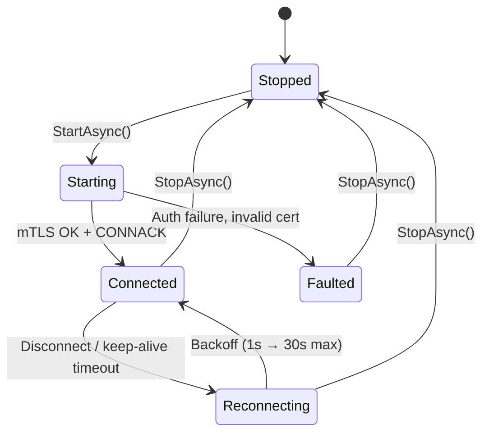
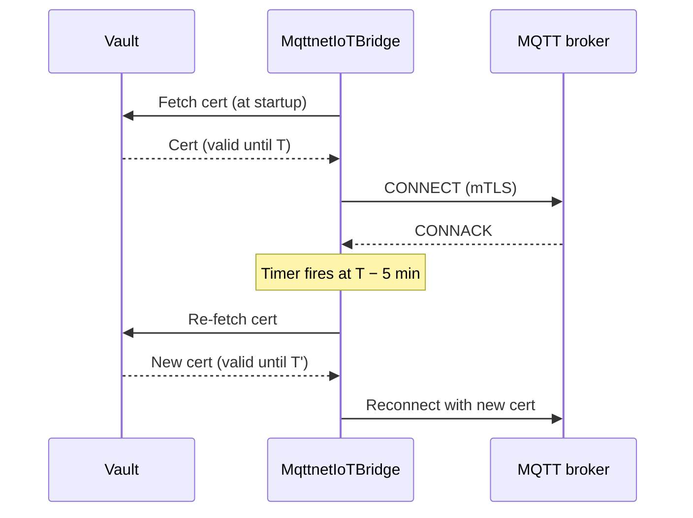
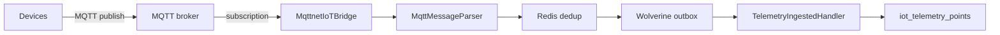

import { Aside } from "@astrojs/starlight/components";

Granit.IoT's MQTT bridge connects your application to **any** MQTT 3.1.1 or
5.0 broker — Mosquitto, EMQX, HiveMQ, VerneMQ, Scaleway IoT Hub in MQTT
mode, AWS IoT Core via forwarding, Azure IoT Hub via the MQTT endpoint, or a
self-hosted broker. Two opt-in packages, mTLS via Vault, exponential-backoff
reconnection, QoS 0–2.

## When to use MQTT instead of webhooks

| Use the MQTT bridge | Use the webhook path |
| --- | --- |
| You consume from a broker (broker handles device fan-in, auth, retention) | Provider natively pushes HTTP (Scaleway Routes, AWS SNS) |
| You have no inbound port (firewalls, on-prem) | You have a public HTTPS endpoint |
| You need broker-level QoS 2 (exactly-once delivery) | Transport-level dedup is enough |
| You want messages buffered while your app is down | Provider retries are sufficient |

The two paths share **exactly** the same downstream pipeline — see
[Telemetry ingestion](/dotnet/iot/telemetry-ingestion/). Switching transports
never touches your domain code.

<Aside type="tip" title="MQTT vs SNS/Direct/API-GW on AWS">
  Targeting AWS IoT Core? You have a choice: subscribe via MQTT (this page)
  or let AWS push to HTTP via SNS / Direct / API Gateway (the AWS provider
  in [Telemetry ingestion](/dotnet/iot/telemetry-ingestion/#provider--aws-iot-core-telemetry)).
  Pair either ingestion mode with the
  [AWS IoT Core bridge](/dotnet/iot/aws/) for the device-binding side
  (provisioning, shadow, jobs, JITP).
</Aside>

## Packages

| Package | Role |
| --- | --- |
| `Granit.IoT.Mqtt` | Abstractions — `IIoTMqttBridge` (with the `MqttBridgeStatus` lifecycle enum surfaced via `IIoTMqttBridge.Status`), message parser, signature validator |
| `Granit.IoT.Mqtt.Mqttnet` | Implementation on top of [MQTTnet](https://github.com/dotnet/MQTTnet) — broker connection, mTLS, backoff, hosted service |

Both are **opt-in** — they are not pulled in by `Granit.Bundle.IoT`. Add
them explicitly:

```bash
dotnet add package Granit.IoT.Mqtt.Mqttnet
```

## Registration

```csharp
using Granit.IoT.Mqtt.Extensions;
using Granit.IoT.Mqtt.Mqttnet.Extensions;

builder.AddGranit(granit => granit
    .AddIoT());

builder.Services.AddGranitIoTMqtt();          // abstractions + parser
builder.Services.AddGranitIoTMqttMqttnet();   // MQTTnet implementation
```

`GranitIoTMqttMqttnetModule` registers a hosted service — the broker
connection starts when the app boots and stops on shutdown.

## Configuration — `IoT:Mqtt`

```json
{
  "IoT": {
    "Mqtt": {
      "BrokerUri": "mqtts://mqtt.example.com:8883",
      "ClientId": "granit-iot",
      "DefaultQoS": 1,
      "MaxPayloadBytes": 262144,
      "KeepAliveSeconds": 60,
      "FeatureFlagCacheSeconds": 30,
      "MaxPendingMessages": 1000,
      "CertificateExpiryWarningMinutes": 5
    }
  }
}
```

| Key | Default | Purpose |
| --- | --- | --- |
| `BrokerUri` | *(required)* | Must use `mqtts://`. Plain `mqtt://` is rejected — IoT telemetry is never sent in clear |
| `ClientId` | `granit-iot` | MQTT client identifier sent to the broker |
| `DefaultQoS` | `1` | Default QoS for subscriptions (0 = at-most-once, 1 = at-least-once, 2 = exactly-once) |
| `MaxPayloadBytes` | `262144` (256 KB) | Oversize messages are dropped in the bridge before the pipeline and recorded as `granit.iot.mqtt.messages_dispatched` with `outcome="oversized"` |
| `KeepAliveSeconds` | `60` | Broker keep-alive interval |
| `FeatureFlagCacheSeconds` | `30` | TTL for the "is the MQTT bridge enabled for tenant X" cache |
| `MaxPendingMessages` | `1000` | In-flight message buffer; backpressure applied above this |
| `CertificateExpiryWarningMinutes` | `5` | How early to re-fetch a rotating mTLS cert from Vault |

<Aside type="caution" title="Plain MQTT is rejected at startup">
  IoT brokers frequently live on the public internet. Always terminate TLS
  at the broker and present a client certificate. `mqtt://` URIs fail the
  options validator before the host even attempts to connect.
</Aside>

## Connection lifecycle



Reconnection uses exponential backoff capped at 30 seconds. The bridge
never gives up on a transient failure — only terminal auth or cert errors
move it to `Faulted`.

## mTLS and Vault integration

The MQTTnet bridge loads its client certificate from `Granit.Vault` (via
`ISecretStore`, declared with `[DependsOn(typeof(GranitVaultModule))]`) —
**never** from disk or configuration. A
certificate rotated in Vault is picked up automatically
`CertificateExpiryWarningMinutes` before its `NotAfter`:



This removes the entire class of "expired TLS cert took down my IoT fleet"
incidents.

## Consuming telemetry — same pipeline as webhooks

The MQTT bridge wires into the **exact same ingestion pipeline** used by
webhook providers. `MqttMessageParser` produces a `ParsedTelemetryBatch`,
the deduplicator runs against Redis, the outbox publishes
`TelemetryIngestedEto`, and `TelemetryIngestedHandler` persists — none of
the downstream code needs to care whether the message arrived over HTTP or
MQTT.



## Observability

The bridge emits its own OpenTelemetry meter, `Granit.IoT.Mqtt`, kept
separate from the shared `Granit.IoT` ingestion meter so MQTT dashboards
don't have to filter by tag:

| Metric | Tags | Meaning |
| --- | --- | --- |
| `granit.iot.mqtt.messages_received` | — | Raw inbound MQTT messages observed by the bridge |
| `granit.iot.mqtt.messages_dispatched` | `outcome` | Messages forwarded to the pipeline, tagged with the pipeline outcome (`Accepted`, `oversized`, `pipeline_failure`, …) |
| `granit.iot.mqtt.feature_disabled` | — | Messages dropped because the MQTT-bridge feature flag was off |
| `granit.iot.mqtt.connection_failures` | — | Connect or reconnect attempts that threw at the broker |
| `granit.iot.mqtt.reconnect_attempts` | — | Reconnect retry callbacks fired |
| `granit.iot.mqtt.certificate_reloads` | — | Proactive mTLS certificate reloads triggered by the expiry timer |

There is no connection-state gauge. Track connection health via the
`connection_failures` and `reconnect_attempts` counters — a rising
`reconnect_attempts` rate surfaces `Reconnecting` storms before users
notice — or read `IIoTMqttBridge.Status` directly for the current
`MqttBridgeStatus`. Once a message reaches the shared pipeline, the standard
[ingestion counters](/dotnet/iot/telemetry-ingestion/#observability--iotmetrics)
(`granit.iot.telemetry.ingested`, `granit.iot.ingestion.duplicate_skipped`, …)
fire downstream with `source = mqtt`.

## Broker compatibility matrix

| Broker | Status | Notes |
| --- | --- | --- |
| **Mosquitto** | Tested | Reference broker — works with any client cert chain |
| **EMQX** | Tested | Supports both 3.1.1 and 5.0 |
| **HiveMQ** | Tested | Tested with HiveMQ Cloud |
| **VerneMQ** | Tested | Tested with VerneMQ 1.x cluster |
| **Scaleway IoT Hub (MQTT mode)** | Tested | Alternative to the Scaleway webhook provider |
| **AWS IoT Core** | Works | mTLS + per-topic IAM policy. For full provisioning / shadow / jobs see [AWS bridge](/dotnet/iot/aws/) |
| **Azure IoT Hub** | Works | SAS token on CONNECT |

## Anti-patterns to avoid

<Aside type="caution" title="Don't register the MQTT bridge twice">
  One `AddGranitIoTMqttMqttnet()` per host. Duplicating the hosted service
  opens two broker sessions with the same `ClientId`, which most brokers
  interpret as "kick the first one" — you'll see infinite reconnect loops.
</Aside>

<Aside type="caution" title="Don't bypass the bridge and subscribe MQTTnet directly">
  You lose the parser, the dedup, and the outbox. The bridge abstraction
  exists precisely so broker swaps don't touch your domain code.
</Aside>

## See also

- [Telemetry ingestion](/dotnet/iot/telemetry-ingestion/) — the shared pipeline the bridge feeds
- [Device management](/dotnet/iot/device-management/) — the `Device` aggregate that gets `LastHeartbeatAt` updated
- [Operations](/dotnet/iot/operations/) — heartbeat timeout detection
- [Security overview](/dotnet/security/security-overview/) — framework security baseline including Vault-backed secrets
