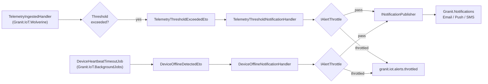

import { Aside } from "@astrojs/starlight/components";

`Granit.IoT.Notifications` is the **15-line bridge** between Ring 2's
integration events and `Granit.Notifications`. Threshold breaches and
offline detections become typed notifications the rest of your app already
understands — same admin UI, same channel matrix, same throttle primitives.

## What problem does this bridge solve?

IoT alerts repeatedly end up in a silo:

- **A dedicated IoT inbox.** The operations team watches one UI for
  device alerts, another for billing, another for support tickets.
  Critical alerts get lost in the split.
- **Duplicate notification infrastructure.** Teams ship an "IoT alert
  email service" next to the app's existing notification pipeline,
  doubling the SMTP integration and the bounce handling.
- **Alert storms on flaky hardware.** A sensor dancing around its
  threshold publishes an alert every 10 seconds. The notification channel
  throttles itself (or the customer throttles the app).
- **No per-tenant personalisation.** *"My warehouse is hot, ship alerts
  by SMS"* is impossible without a tenant-override mechanism.

The bridge closes all four by mapping IoT ETOs to `INotificationPublisher`
invocations, honouring per-tenant settings, and throttling via
`IAlertThrottle` — the same primitives every other Granit module uses.

## How it fits in the pipeline



The IoT module publishes ETOs; the bridge handlers translate them into
notifications the rest of the app already understands.

## The two notification types

| Class | Severity | Default channels | Triggered by |
| --- | --- | --- | --- |
| `IoTTelemetryThresholdAlertNotificationType` | `Warning` | Email, Push | `TelemetryThresholdExceededEto` |
| `IoTDeviceOfflineNotificationType` | `Fatal` | Email, Push, SMS | `DeviceOfflineDetectedEto` |

Both are registered by `GranitIoTNotificationsModule` via
`INotificationDefinitionProvider` — they show up automatically in the
`Granit.Notifications` admin UI, where end users configure channels and
override per recipient.

<Aside type="tip" title="Customers choose their own channels">
  Each tenant's admin can toggle Email/Push/SMS per notification type. The
  IoT module never decides routing — it only raises typed notifications and
  lets the notification module fan out.
</Aside>

## Alert throttling

Every alert publish goes through `IAlertThrottle` (from
`Granit.Notifications`) before reaching `INotificationPublisher`. The
throttle is per `(tenantId, notificationType, deduplicationKey)` with a
configurable window:

| Key | Default | Purpose |
| --- | --- | --- |
| `IoT:NotificationThrottleMinutes` | `15` | Minutes between repeat alerts for the same `(device, metric)` pair |

A second breach of the same metric within the window increments
`granit.iot.alerts.throttled` instead of paging the on-call.

## Per-tenant configuration via `IoTSettingNames`

All IoT settings are registered by `IoTSettingDefinitionProvider` with
providers `["T", "G"]` (Tenant + Global cascade) — a tenant admin can
override any key without code changes.

| Key | Default | Cascade | Purpose |
| --- | --- | --- | --- |
| `IoT:TelemetryRetentionDays` | `365` | T → G | Retention window enforced by `StaleTelemetryPurgeJob` |
| `IoT:HeartbeatTimeoutMinutes` | `15` | T → G | Offline detection threshold |
| `IoT:HeartbeatOfflineNotificationCacheMinutes` | `60` | T → G | TTL of the offline tracker, preventing alert spam |
| `IoT:NotificationThrottleMinutes` | `15` | T → G | Same-alert throttle window |
| `IoT:IngestRateLimit` | `1000` | T → G | Per-tenant ingest rate in requests/minute (used by `Granit.Http.RateLimiting`) |
| `IoT:Threshold:{metricName}` | *(unset)* | T → G | Per-metric threshold (e.g. `IoT:Threshold:temperature = 28.5`) |

All keys are read through `ISettingProvider.GetOrNullAsync()` — lookup
cost is `~µs` after FusionCache warmup.

## Registration

Bundled in `Granit.Bundle.IoT`:

```csharp
builder.AddGranit(granit => granit.AddIoT());
```

Or standalone:

```csharp
builder.AddGranit(granit => granit
    .AddModule<GranitIoTNotificationsModule>());
```

`GranitIoTNotificationsModule` depends on `GranitIoTModule`,
`GranitNotificationsAbstractionsModule`, `GranitSettingsModule`, and
`GranitCachingModule`. No further setup is required — the Wolverine
handlers are auto-discovered.

## Wiring your own alert sources

Need to raise a custom alert that isn't a threshold breach or offline
event? Publish your own `IIntegrationEvent` via
`IDistributedEventBus.PublishAsync()` and register a handler that maps it
to `INotificationPublisher.PublishAsync(YourNotificationType.From(eto))`.
The IoT bridges are the reference pattern — 15 lines apiece.

<Aside type="note" title="Don't raise notifications from the ingestion endpoint">
  The endpoint's job is to return 202 fast. Publish an ETO and let a
  Wolverine handler decide whether it becomes a notification. That's what
  retries, the outbox, and throttling are for.
</Aside>

## Observability

| Metric | Tags | Fires when |
| --- | --- | --- |
| `granit.iot.ingestion.threshold_exceeded` | `tenant_id`, `metric_name` | Threshold evaluator flagged a breach |
| `granit.iot.alerts.throttled` | `tenant_id`, `metric_name` | Throttle suppressed a duplicate alert |
| `granit.iot.device.offline_detected` | `tenant_id` | Heartbeat job flagged first offline detection |

`Granit.Notifications` adds its own metrics on channel-level delivery
(`granit.notifications.sent`, `granit.notifications.failed`) — wire both
for a complete picture of *"alert fired → customer notified"*.

## Anti-patterns to avoid

<Aside type="caution" title="Don't call INotificationPublisher directly from the ingestion handler">
  You skip the throttle, skip the tenant cascade, and tie business
  alerting to transport code. Always publish an ETO and let the bridge
  handle it.
</Aside>

<Aside type="caution" title="Don't lower IoT:NotificationThrottleMinutes below 1">
  Most SMS providers throttle at 1 msg/sec/recipient; exceeding that gets
  your sender flagged as spam.
</Aside>

## See also

- [Telemetry ingestion](/dotnet/iot/telemetry-ingestion/) — where `TelemetryThresholdExceededEto` is raised
- [Operations](/dotnet/iot/operations/) — where `DeviceOfflineDetectedEto` is raised
- [Timeline bridge](/dotnet/iot/timeline-bridge/) — the other cross-cutting Ring 3 package
