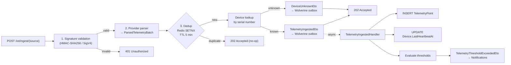
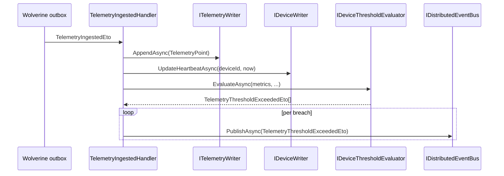

import { Aside, FileTree } from "@astrojs/starlight/components";

This guide covers **Ring 2** of Granit.IoT — the ingestion pipeline. Four
packages build a three-stage flow (validate → parse → dedup → publish) that
returns `202 Accepted` in under a second at P99, even at 100k devices
emitting every 10 seconds.

## What problem does Ring 2 solve?

Teams wiring their first IoT provider hit the same five problems every time:

- **Blocking webhooks.** Inline persistence and threshold evaluation slow
  the HTTP response and trip provider retry timers. The provider retries,
  you persist twice.
- **Forgotten signature validation.** A webhook endpoint without HMAC
  validation is a public insert into your database.
- **Duplicate messages.** MQTT redelivery, provider retries, and network
  flaps push the same payload multiple times. Without dedup, alerts fire
  twice.
- **Provider lock-in.** Scaleway ships one envelope, AWS another, Azure a
  third. Handling each in your domain code makes the code rot.
- **Silent thresholds.** Alert rules live in spreadsheets or in handler
  `if`-chains that can't be overridden per tenant.

Ring 2 closes all five with a three-stage pipeline plus the Wolverine
transactional outbox — validate-and-acknowledge stays synchronous, persist
and evaluate happen asynchronously.

## Pipeline overview



Stages 1 and 2 are synchronous — they must succeed before returning `202`.
Stage 3 and everything downstream are asynchronous via Wolverine's
transactional outbox, so a slow database never blocks the HTTP response.

## Pipeline abstractions

Each provider plugs into three extension points:

```csharp
public interface IPayloadSignatureValidator
{
    string SourceName { get; }                                       // "scaleway", "awsiotsns", ...
    ValueTask<SignatureValidationResult> ValidateAsync(
        ReadOnlyMemory<byte> body,
        IReadOnlyDictionary<string, string> headers,
        CancellationToken ct = default);
}

public interface IInboundMessageParser
{
    string SourceName { get; }                                       // matches validator's SourceName
    ValueTask<ParsedTelemetryBatch> ParseAsync(
        ReadOnlyMemory<byte> body,
        CancellationToken ct = default);
}

public interface IInboundMessageDeduplicator
{
    Task<bool> TryAcquireAsync(string sanitizedMessageId, CancellationToken ct = default);
}
```

`IIngestionPipeline.ProcessAsync(source, body, headers, ct)` looks up the
validator and parser by `SourceName` (case-insensitive), runs the three
stages, and publishes the right ETO. Adding a new provider is two new
classes.

### Normalised shape — `ParsedTelemetryBatch`

Whatever the provider ships, the parser produces:

```csharp
public sealed record ParsedTelemetryBatch(
    string MessageId,
    string DeviceExternalId,
    DateTimeOffset RecordedAt,
    IReadOnlyDictionary<string, double> Metrics,
    string Source,
    IReadOnlyDictionary<string, string>? Tags);
```

Downstream handlers only ever see this shape — they never care that it
came from a Scaleway Base64 envelope or an AWS SNS message.

## The ingestion endpoint — `POST /iot/ingest/{source}`

Mapped by `MapGranitIoTIngestionEndpoints()`:

| Status | Meaning |
| --- | --- |
| `202 Accepted` | Signature valid, payload parsed, dispatched to outbox (or duplicate silently accepted) |
| `400 Bad Request` | Malformed payload (Base64 fail, missing field, invalid JSON) |
| `401 Unauthorized` | Signature validation failed |
| `415 Unsupported Media Type` | Non-JSON content type |
| `422 Unprocessable Entity` | No parser registered for the `{source}` path parameter |

The endpoint buffers the request body up to **256 KB** (enough for even the
chattiest MQTT payload), snapshots headers into a case-insensitive
dictionary, and delegates to `IIngestionPipeline.ProcessAsync()`.

Rate limiting is enforced at the route group level via
`Granit.RateLimiting` (`iot-ingest` policy by default) — configure per-tenant
limits under `RateLimiting:Policies:iot-ingest` in `appsettings.json`.

## Provider — Scaleway IoT Hub

`Granit.IoT.Ingestion.Scaleway` is the production-ready provider for
[Scaleway IoT Hub](https://www.scaleway.com/en/iot-hub/). It ships three
internal services registered by `AddGranitIoTIngestionScaleway()`:

| Service | Responsibility |
| --- | --- |
| `ScalewaySignatureValidator` | Validates `X-Scaleway-Signature` (HMAC-SHA256) via `CryptographicOperations.FixedTimeEquals` |
| `ScalewayMessageParser` | Decodes the JSON envelope, Base64-decodes the payload, extracts metrics |
| `ScalewayTopicMapper` | Extracts the device serial from the MQTT topic (`devices/{serial}/...` by default) |

### Scaleway envelope shape

```json
{
  "topic": "devices/ACME-TH-001/telemetry",
  "message_id": "550e8400-e29b-41d4-a716-446655440000",
  "payload": "eyJ0ZW1wIjoyMi41LCJodW1pZGl0eSI6NDUuMH0=",
  "qos": 1,
  "timestamp": "2026-05-20T12:34:56Z"
}
```

The `payload` decodes to `{"temp": 22.5, "humidity": 45.0}`, which becomes
the `Metrics` dictionary in `ParsedTelemetryBatch`.

### Configuration

```json
{
  "IoT": {
    "Ingestion": {
      "Scaleway": {
        "SharedSecret": "__FROM_SECRET_STORE__",
        "TopicDeviceSegmentIndex": 1
      }
    }
  }
}
```

Options bind via `IOptionsMonitor<ScalewayIoTOptions>` — rotating the shared
secret is a configuration reload, no restart required.

## Provider — AWS IoT Core (telemetry)

`Granit.IoT.Ingestion.Aws` ships three inbound sources:

| Source key | Path | Signature |
| --- | --- | --- |
| `awsiotsns` | SNS HTTP subscription endpoint | RSA-SHA256 (SNS signing cert, cached behind a CDN-guarded validator) |
| `awsiotdirect` | Device → API directly (mTLS-fronted) | SigV4 |
| `awsiotapigw` | Device → API Gateway → app | SigV4 |

All three terminate at the same `POST /iot/ingest/{source}` route and emit
the same `ParsedTelemetryBatch`. SigV4 is verified against the AWS public
`get-vanilla` test vector byte-for-byte.

<Aside type="note" title="Add Granit.IoT.Ingestion.Aws explicitly">
  Neither `Granit.Bundle.IoT` nor `Granit.Bundle.IoT.Aws` ship this
  provider — Scaleway is the default inbound shape and AWS-native telemetry
  is opt-in. Install it on its own:

  ```bash
  dotnet add package Granit.IoT.Ingestion.Aws
  ```

  Then register: `builder.Services.AddGranitIoTIngestionAws();`. The
  device-binding side of AWS IoT Core (provisioning saga, shadow, jobs,
  JITP) ships separately in `Granit.Bundle.IoT.Aws` — see
  [AWS IoT Core bridge](/dotnet/iot/aws/).
</Aside>

## Deduplication — transport-level, Redis-backed, fail-open

`IdempotencyStoreInboundMessageDeduplicator` backs onto Redis via
`IIdempotencyStore` (from `Granit.Http.Idempotency`). The key is the
**sanitised transport message ID** (trimmed, capped at 128 chars,
non-alphanumeric replaced with `-`), prefixed `iot-msg:`.

| Parameter | Default | Key |
| --- | --- | --- |
| TTL | 5 minutes | `IoT:Ingestion:DeduplicationWindowMinutes` |

<Aside type="note" title="Why fail-open?">
  If Redis is unreachable, the deduplicator returns `true` (process the
  message). Availability wins over strict idempotency — dropping a real
  reading is worse than processing a rare duplicate. The
  `granit.iot.ingestion.duplicate_skipped` counter still reflects what
  Redis *did* observe.
</Aside>

<Aside type="tip" title="Transport-level, not business-level">
  The key is the provider message ID (`X-Scaleway-Message-Id`, MQTT packet
  identifier, SNS message ID) — not `(device, timestamp)`. This keeps the
  pipeline generic and lets the provider's own retry semantics drive the
  dedup window. Business-key idempotency belongs in the
  [Wolverine handler](#the-wolverine-handler) layer.
</Aside>

## The Wolverine handler

`TelemetryIngestedHandler` consumes `TelemetryIngestedEto` from the outbox:



Everything in the handler runs inside a single Wolverine transaction — if
the threshold publication fails, the telemetry persist rolls back and the
message is retried. No half-written state.

## Threshold evaluation

`IDeviceThresholdEvaluator` is the extension point. The default
implementation `SettingsDeviceThresholdEvaluator` reads thresholds via
`Granit.Settings`:

```csharp
public interface IDeviceThresholdEvaluator
{
    Task<IReadOnlyList<TelemetryThresholdExceededEto>> EvaluateAsync(
        Guid deviceId, Guid? tenantId,
        IReadOnlyDictionary<string, double> metrics,
        DateTimeOffset recordedAt,
        CancellationToken ct = default);
}
```

Settings key format: `IoT:Threshold:{metricName}` — for example
`IoT:Threshold:temperature = 28.5`. The cascade order is
**User → Tenant → Global → Configuration → Default**, so a single operator
can raise the threshold on one noisy device without touching the global
baseline.

<Aside type="tip" title="Device-family thresholds">
  Need different thresholds per device family (sensor A vs sensor B)?
  Override `IDeviceThresholdEvaluator` with your own implementation — it's
  a single DI registration swap. Threshold breaches still feed into the
  Notifications bridge unchanged.
</Aside>

## Observability — `IoTMetrics`

Every pipeline stage emits OpenTelemetry counters. Scrape them with the
standard Prometheus exporter registered by `Granit.Diagnostics`:

| Counter | Tags | Fires when |
| --- | --- | --- |
| `granit.iot.telemetry.ingested` | `tenant_id`, `source` | `TelemetryPoint` persisted |
| `granit.iot.ingestion.signature_rejected` | `tenant_id`, `source` | HMAC / SigV4 validation failed |
| `granit.iot.ingestion.duplicate_skipped` | `tenant_id`, `source` | Redis dedup hit |
| `granit.iot.ingestion.unknown_device` | `tenant_id`, `source` | Serial not registered |
| `granit.iot.ingestion.threshold_exceeded` | `tenant_id`, `metric_name` | Threshold breached |
| `granit.iot.alerts.throttled` | `tenant_id`, `metric_name` | Notification suppressed by the bridge |
| `granit.iot.device.offline_detected` | `tenant_id` | Heartbeat job flagged a device |
| `granit.iot.background.telemetry_purged` | `tenant_id` | Purge job deleted rows |
| `granit.iot.background.partition_created` | `partition_name` | Partition maintenance job ran |

Alert routing goes through `Granit.Notifications` — see
[Notifications bridge](/dotnet/iot/notifications-bridge/).

## Anti-patterns to avoid

<Aside type="caution" title="Don't run synchronous DB logic in the endpoint">
  The endpoint's job is: validate, parse, dedup, publish. The persist
  happens in the Wolverine handler so the HTTP response stays fast.
</Aside>

<Aside type="caution" title="Don't skip signature validation 'just for testing'">
  A public `/iot/ingest/scaleway` endpoint without HMAC validation is an
  insert-only database backdoor. Use a test-specific validator
  (`NoopValidator`) behind `IsDevelopment()` if you really need it.
</Aside>

<Aside type="caution" title="Don't tune the dedup TTL up to cover 'long retries'">
  Redis memory scales with the active working set. If your provider's
  retry window is 30 minutes, use idempotency keys on the business key
  (via Wolverine), not on the Redis transport cache.
</Aside>

## See also

- [Device management](/dotnet/iot/device-management/) — the domain that receives the telemetry
- [MQTT transport](/dotnet/iot/mqtt/) — alternative to webhooks for MQTT-native providers
- [Operations](/dotnet/iot/operations/) — purge, heartbeat, partition maintenance
- [Notifications bridge](/dotnet/iot/notifications-bridge/) — where threshold alerts land
- [AWS IoT Core bridge](/dotnet/iot/aws/) — beyond telemetry: provisioning, shadow, jobs
