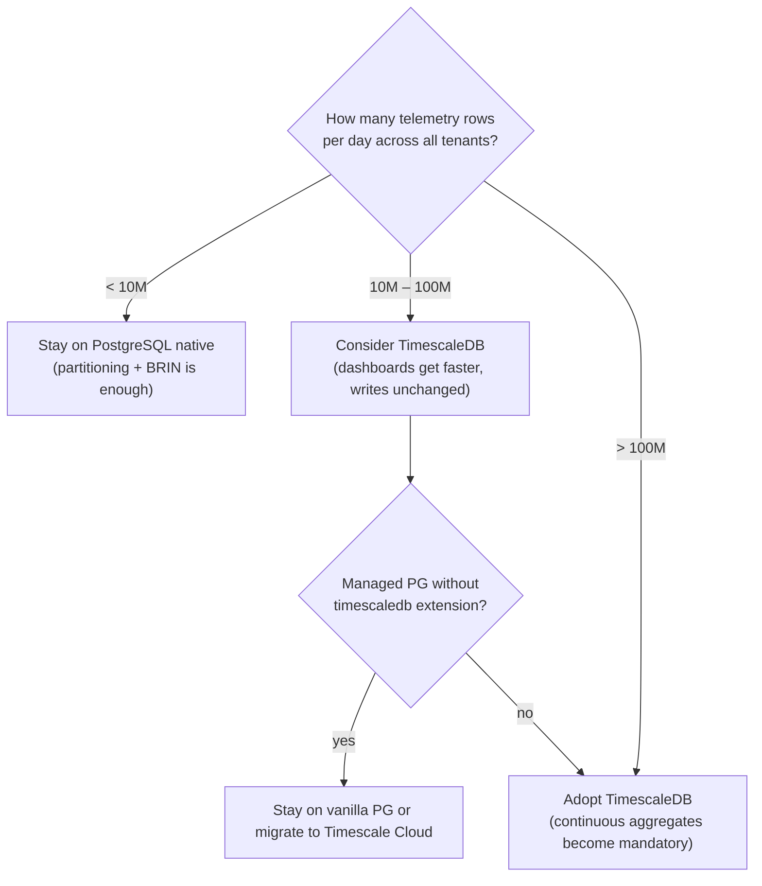
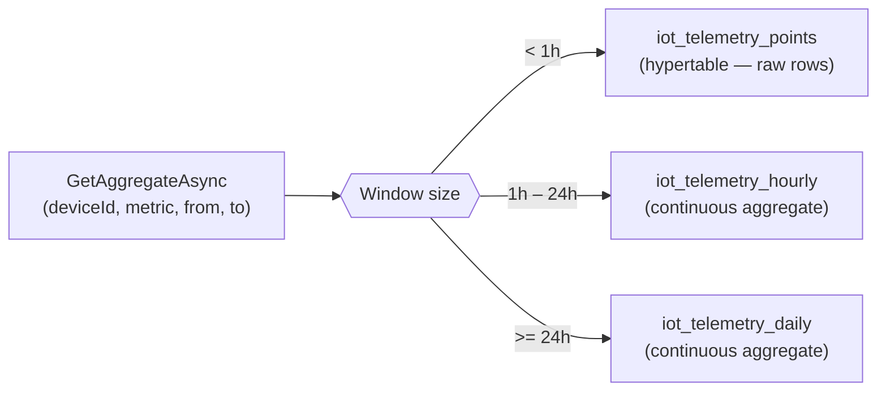

import { Aside } from "@astrojs/starlight/components";

Granit.IoT stores every device payload as **one row per send**, metrics in
a single JSONB column. That collapses storage, keeps writes atomic, and
makes per-metric queries indexable. The choice of *which* time-series
backend you sit on top of that schema is one of the two opinionated
decisions you'll make on day 1.

This guide covers the trade-offs between the two backends shipped in
Granit.IoT:

| Backend | Package | Status | When to adopt |
| --- | --- | --- | --- |
| **PostgreSQL native** | `Granit.IoT.EntityFrameworkCore.Postgres` | Default | Up to ~100M rows/day |
| **TimescaleDB hypertables** | `Granit.IoT.EntityFrameworkCore.Timescale` | Opt-in | Past ~100M rows/day, or for dashboard query speed-up |

## Decision tree



| Hosting model | TimescaleDB available? |
| --- | --- |
| Self-hosted PostgreSQL | ✅ Install via `apt` / Helm / Docker image |
| Scaleway Managed Database | ❌ Not available — stay on vanilla |
| AWS RDS PostgreSQL | ❌ Not available — use Timescale Cloud, Aurora + self-managed, or stay on RDS + `pg_partman` |
| AWS Aurora PostgreSQL | ❌ Not available |
| Azure Database for PostgreSQL (Flexible Server) | ✅ Available as a server-level extension |
| Timescale Cloud | ✅ Default |

Managed-service extension support shifts over time — always confirm
against the provider's current extension list before committing
([AWS RDS PostgreSQL extensions](https://docs.aws.amazon.com/AmazonRDS/latest/UserGuide/CHAP_PostgreSQL.Extensions.html),
[Azure flexible-server extensions](https://learn.microsoft.com/en-us/azure/postgresql/flexible-server/concepts-extensions)).

## Backend 1 — PostgreSQL native (default)

The default backend leans on PostgreSQL's native features. No extension
required, no managed-service restrictions, works everywhere.

### Indexes (initial migration)

| Table | Index | Why |
| --- | --- | --- |
| `iot_telemetry_points` | BRIN on `recorded_at` | 10× smaller than B-tree for append-only data |
| `iot_telemetry_points` | GIN on `metrics` (jsonb_ops) | Per-key JSONB filters: `WHERE metrics @> '{"temp": 22}'` |
| `iot_telemetry_points` | `(device_id, recorded_at DESC)` | Covering index for the most common query |
| `iot_telemetry_points` | `(tenant_id, recorded_at)` | GDPR bulk erasure + per-tenant purge |

`Granit.IoT.EntityFrameworkCore.Postgres` ships `MigrationBuilder`
extensions for the indexes EF Core cannot emit declaratively:

```csharp
migrationBuilder.CreateTelemetryBrinIndex();        // BRIN(recorded_at)
migrationBuilder.CreateTelemetryGinIndex();         // GIN(metrics jsonb_ops)
migrationBuilder.CreateIoTPostgresIndexes();        // BRIN + GIN in one call
migrationBuilder.EnableTelemetryPartitioning();     // Convert to RANGE-partitioned
migrationBuilder.CreateTelemetryPartition(2026, 5); // iot_telemetry_points_2026_05
```

### Monthly RANGE partitioning

Partitioning is opt-in because converting an already-populated table
requires a data-copy migration. Enable it **before** your first
production-scale insert:

```csharp
protected override void Up(MigrationBuilder migrationBuilder)
{
    migrationBuilder.EnableTelemetryPartitioning();
    migrationBuilder.CreateTelemetryPartition(2026, 4);
    migrationBuilder.CreateTelemetryPartition(2026, 5);
    // Subsequent months are provisioned automatically by the job
}
```

Once enabled, `TelemetryPartitionMaintenanceJob` (Sundays at 01:00 UTC)
provisions the next two months ahead of time so writes never fail at month
boundaries. Each partition carries its own BRIN + GIN — dropping a
partition drops the indexes with it, which is why GDPR erasure at a
month boundary is O(1).

See [Operations](/dotnet/iot/operations/) for the partition-maintenance
job details.

## Backend 2 — TimescaleDB hypertables (opt-in)

`Granit.IoT.EntityFrameworkCore.Timescale` converts the telemetry table to
a TimescaleDB hypertable and ships hourly + daily continuous aggregates so
dashboard queries finish in milliseconds.

### How it speeds up dashboard queries



Continuous aggregates store one row per `(hour|day, device, metric)` tuple
with pre-computed avg / min / max / count. Querying them is an indexed
lookup — no JSONB extraction, no row scan, no aggregation at query time.

Indicative speed-up on a 100-million-row table:

| Query | Raw hypertable | Continuous aggregate |
| --- | --- | --- |
| `AVG(temperature)` over 24h for one device | ~180 ms | ~3 ms |
| `MAX(temperature)` over 7 days for one device | ~1.5 s | ~4 ms |
| `COUNT(*)` over 30 days for one device | ~4 s | ~6 ms |

### Enabling TimescaleDB

```csharp
builder.Services
    .AddGranit(builder.Configuration)
    .AddModule<GranitIoTModule>()
    .AddModule<GranitIoTEntityFrameworkCoreModule>()
    .AddModule<GranitIoTTimescaleModule>();
```

On first startup the module runs:

1. `SELECT 1 FROM pg_extension WHERE extname = 'timescaledb'` — extension
   detection. If absent, log a warning and stop (the table stays plain
   PostgreSQL; the app starts normally).
2. `SELECT create_hypertable('iot_telemetry_points', 'RecordedAt',
   chunk_time_interval => INTERVAL '7 days', migrate_data => TRUE)` —
   safe on empty and populated tables.
3. `CREATE MATERIALIZED VIEW iot_telemetry_hourly WITH
   (timescaledb.continuous) AS …` — expand the JSONB `Metrics` column via
   `LATERAL jsonb_each`, one row per metric per hour bucket.
4. Same for `iot_telemetry_daily`.
5. `add_continuous_aggregate_policy` on both views — refresh hourly view
   every 30 min, daily view every 6 h. Wrapped in
   `WHEN duplicate_object THEN NULL` so re-runs are no-ops.

All DDL is idempotent. Deploying the module twice does nothing the second
time.

### Migration-driven alternative

If you prefer the DDL in a versioned migration rather than at startup:

```csharp
public partial class AddTimescale : Migration
{
    protected override void Up(MigrationBuilder migrationBuilder)
    {
        migrationBuilder.EnableTelemetryHypertable();
        migrationBuilder.CreateTelemetryHourlyAggregate();
        migrationBuilder.CreateTelemetryDailyAggregate();
    }
}
```

In this mode, skip the module — just register the
`TimescaleTelemetryEfCoreReader` via `services.AddGranitIoTTimescale()`.

## Anti-patterns to avoid

<Aside type="caution" title="Don't run CREATE EXTENSION from app code">
  `CREATE EXTENSION timescaledb` requires superuser privileges. Install the
  extension during cluster provisioning (Terraform, Helm, or DBA task) and
  let the application merely detect it.
</Aside>

<Aside type="caution" title="Don't mix hypertables with EnableTelemetryPartitioning()">
  TimescaleDB already partitions the table transparently via chunks.
  Adding PostgreSQL RANGE partitions on top of a hypertable conflicts.
  Pick one strategy.
</Aside>

<Aside type="caution" title="Don't compress chunks without a retention policy">
  TimescaleDB compression is lossy-for-ordering (compressed chunks can't be
  updated in place) and should only cover data past its write-once window.
  Pair any `add_compression_policy` call with `add_retention_policy` to drop
  chunks older than your GDPR deadline. The Timescale module does not
  configure compression by default — it's a per-tenant decision driven by
  `IoT:TelemetryRetentionDays`.
</Aside>

<Aside type="caution" title="Don't call EnableTelemetryPartitioning() on a populated table">
  It converts the table to partitioned, which means existing rows move into
  `DEFAULT` — and you've lost time-bounded drop semantics. Do this on an
  empty table at project start, or write a dedicated data-copy migration.
</Aside>

## See also

- [Device management](/dotnet/iot/device-management/) — the schema being indexed
- [Operations](/dotnet/iot/operations/) — partition maintenance + retention enforcement
- [Telemetry ingestion](/dotnet/iot/telemetry-ingestion/) — the write path
- [TimescaleDB continuous aggregates documentation](https://www.tigerdata.com/docs/learn/continuous-aggregates) — upstream reference
