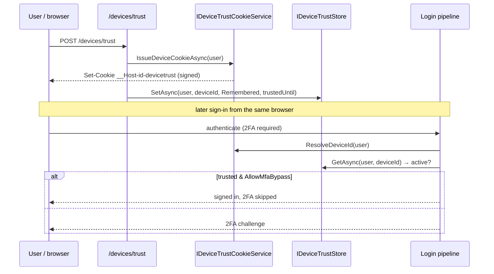
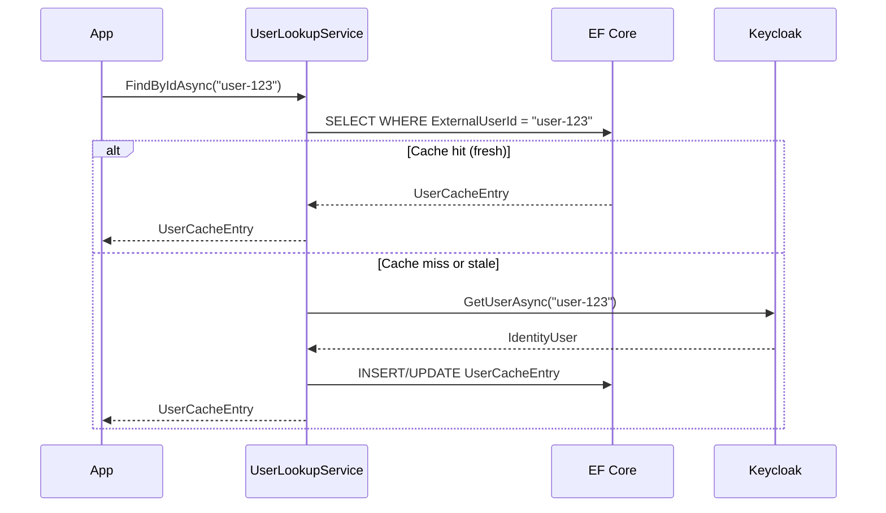

import { Tabs, TabItem, FileTree, Badge } from "@astrojs/starlight/components";

Granit.Identity provides a provider-agnostic identity management layer. Keycloak, Cognito,
Google Cloud Identity Platform (Firebase Auth), or any OIDC provider handles authentication
— Granit.Identity handles everything else: user
lookup, role management, session control, password operations, and a local user cache
with GDPR erasure and pseudonymization built in.

## Package structure

<FileTree>
- Granit.Identity/ Abstractions (6 identity interfaces + unified session manager), null defaults
  - Granit.Identity.Federated/ Federated identity abstractions
    - Granit.Identity.Federated.Keycloak Keycloak Admin API implementation (+ realm-vs-client role distinction)
    - Granit.Identity.Federated.EntraId Microsoft Graph API implementation (+ Entra ID App Role distinction)
    - Granit.Identity.Federated.Cognito AWS Cognito User Pool API implementation
    - Granit.Identity.Federated.GoogleCloud Google Cloud Identity Platform (Firebase Auth) implementation
    - Granit.Identity.Federated.EntityFrameworkCore User cache (cache-aside, login-time sync)
    - Granit.Identity.Federated.Privacy Personal-data export provider for the federated user cache
  - Granit.Identity.Local/ Shared domain types for self-hosted identity providers
    - Granit.Identity.Local.AspNetIdentity ASP.NET Core Identity provider (LocalIdentity + role orchestration + tenant-aware lookup)
    - Granit.Identity.Local.Endpoints Account self-service endpoints (login, register, profile, 2FA, passkey) + role CRUD + admin impersonation
    - Granit.Identity.Local.Notifications 9 security notifications (welcome, password reset, 2FA, email change, impersonation)
    - Granit.Identity.Local.Privacy Personal-data export provider for the local identity store
  - Granit.Identity.Endpoints Minimal API endpoints (provider CRUD, user cache sync, sessions & devices, GDPR, webhook)
  - Granit.Identity.Notifications Opt-in IRecipientResolver bridge for the notification pipeline
</FileTree>

| Package | Role | Depends on |
|---------|------|------------|
| `Granit.Identity` | Abstractions, null defaults | — |
| `Granit.Identity.Federated` | Federated identity abstractions | `Granit.Identity` |
| `Granit.Identity.Federated.Keycloak` | Keycloak Admin API implementation (+ realm-vs-client role distinction) | `Granit.Identity.Federated` |
| `Granit.Identity.Federated.EntraId` | Microsoft Graph API implementation (+ App Role boot-time sync) | `Granit.Identity.Federated` |
| `Granit.Identity.Federated.Cognito` | AWS Cognito User Pool API implementation | `Granit.Identity.Federated` |
| `Granit.Identity.Federated.GoogleCloud` | Firebase Auth implementation (Firebase Admin SDK) | `Granit.Identity.Federated` |
| `Granit.Authentication.JwtBearer.GoogleCloud` | JWT Bearer for Firebase Auth + claims transformation | `Granit.Authentication.JwtBearer` |
| `Granit.Identity.Federated.EntityFrameworkCore` | EF Core user cache | `Granit.Identity.Federated`, `Granit.Persistence` |
| `Granit.Identity.Federated.Privacy` | Personal-data export provider for the federated user cache | `Granit.Identity.Federated`, `Granit.Privacy.BlobStorage` |
| `Granit.Identity.Local` | Shared domain types for self-hosted identity providers | `Granit.Identity`, `Granit.Events`, `Granit.Guids`, `Granit.Settings`, `Granit.Timing` |
| `Granit.Identity.Local.AspNetIdentity` | ASP.NET Core Identity provider, role orchestration, tenant-aware role lookup | `Granit.Identity.Local`, `Granit.Persistence.EntityFrameworkCore` |
| `Granit.Identity.Local.Endpoints` | Account self-service + role CRUD + admin impersonation REST endpoints | `Granit.Identity.Local`, `Granit.Authorization` |
| `Granit.Identity.Local.Notifications` | 9 security email/in-app notifications (17 cultures) | `Granit.Identity.Local`, `Granit.Notifications.Abstractions`, `Granit.Templating` |
| `Granit.Identity.Local.Privacy` | Personal-data export provider for the local identity store | `Granit.Identity.Local`, `Granit.Privacy.BlobStorage` |
| `Granit.Identity.Endpoints` | REST endpoints for user cache + provider CRUD + GDPR | `Granit.Identity`, `Granit.Authorization` |
| `Granit.Identity.Notifications` | Opt-in `IRecipientResolver` feeding recipient contact info to the notification pipeline | `Granit.Identity`, `Granit.Notifications.Abstractions` |

## Dependency graph

```mermaid
graph TD
    I[Granit.Identity] --> C[Granit]
    IF[Granit.Identity.Federated] --> I
    IK[Granit.Identity.Federated.Keycloak] --> IF
    IEI[Granit.Identity.Federated.EntraId] --> IF
    IC[Granit.Identity.Federated.Cognito] --> IF
    IGC[Granit.Identity.Federated.GoogleCloud] --> IF
    AGC[Granit.Authentication.JwtBearer.GoogleCloud] --> JB[Granit.Authentication.JwtBearer]
    IEF[Granit.Identity.Federated.EntityFrameworkCore] --> IF
    IEF --> P[Granit.Persistence]
    IFP[Granit.Identity.Federated.Privacy] --> IF
    IFP --> PR[Granit.Privacy.BlobStorage]
    IL[Granit.Identity.Local] --> I
    IL --> S[Granit.Settings]
    ILA[Granit.Identity.Local.AspNetIdentity] --> IL
    ILE[Granit.Identity.Local.Endpoints] --> IL
    ILE --> AZ[Granit.Authorization]
    ILN[Granit.Identity.Local.Notifications] --> IL
    ILN --> N[Granit.Notifications.Abstractions]
    ILN --> T[Granit.Templating]
    ILP[Granit.Identity.Local.Privacy] --> IL
    ILP --> PR
    IE[Granit.Identity.Endpoints] --> I
    IE --> AZ
    IN[Granit.Identity.Notifications] --> I
    IN --> N
```



## Setup

<Tabs>
<TabItem label="Keycloak + User cache">

```csharp
[DependsOn(typeof(GranitIdentityFederatedKeycloakModule))]
[DependsOn(typeof(GranitIdentityFederatedEntityFrameworkCoreModule))]
[DependsOn(typeof(GranitIdentityEndpointsModule))]
public class AppModule : GranitModule
{
    public override void ConfigureServices(ServiceConfigurationContext context)
    {
        context.Services.AddGranitIdentityEntityFrameworkCore<AppDbContext>();
        context.Services.AddGranitIdentityEndpoints();
    }

    public override void OnApplicationInitialization(ApplicationInitializationContext context)
    {
        context.App.MapGranitIdentityUserCache();
    }
}
```

</TabItem>
<TabItem label="Cognito + User cache">

```csharp
[DependsOn(typeof(GranitIdentityFederatedCognitoModule))]
[DependsOn(typeof(GranitIdentityFederatedEntityFrameworkCoreModule))]
[DependsOn(typeof(GranitIdentityEndpointsModule))]
public class AppModule : GranitModule
{
    public override void ConfigureServices(ServiceConfigurationContext context)
    {
        context.Services.AddGranitIdentityEntityFrameworkCore<AppDbContext>();
        context.Services.AddGranitIdentityEndpoints();
    }

    public override void OnApplicationInitialization(ApplicationInitializationContext context)
    {
        context.App.MapGranitIdentityUserCache();
    }
}
```

</TabItem>
<TabItem label="Google Cloud (Firebase Auth)">

```csharp
[DependsOn(typeof(GranitIdentityFederatedGoogleCloudModule))]
[DependsOn(typeof(GranitAuthenticationJwtBearerGoogleCloudModule))]
[DependsOn(typeof(GranitIdentityFederatedEntityFrameworkCoreModule))]
[DependsOn(typeof(GranitIdentityEndpointsModule))]
public class AppModule : GranitModule
{
    public override void ConfigureServices(ServiceConfigurationContext context)
    {
        context.Services.AddGranitIdentityEntityFrameworkCore<AppDbContext>();
        context.Services.AddGranitIdentityEndpoints();
    }

    public override void OnApplicationInitialization(ApplicationInitializationContext context)
    {
        context.App.MapGranitIdentityUserCache();
    }
}
```

</TabItem>
<TabItem label="Abstractions only">

```csharp
[DependsOn(typeof(GranitIdentityModule))]
public class AppModule : GranitModule { }
```

Registers `NullIdentityProvider` and `NullUserLookupService` — useful for development
or modules that only need the interfaces.

</TabItem>
<TabItem label="Custom provider">

```csharp
context.Services.AddIdentityProvider<MyCustomIdentityProvider>();
```

</TabItem>
</Tabs>

## Interface Segregation

`IIdentityProvider` is a composite interface built from 6 fine-grained interfaces
following ISP (Interface Segregation Principle). Inject only what you need:

| Interface | Methods | Purpose |
|-----------|---------|---------|
| `IIdentityUserReader` | `GetUsersAsync`, `GetUserAsync` | Read user profiles |
| `IIdentityUserWriter` | `CreateUserAsync`, `UpdateUserAsync`, `SetUserEnabledAsync` | Mutate user profiles |
| `IIdentityRoleManager` | `GetRolesAsync`, `GetUserRolesAsync`, `AssignRoleAsync`, `RemoveRoleAsync`, `GetRoleMembersAsync` | Role assignments |
| `IIdentityGroupManager` | `GetGroupsAsync`, `GetUserGroupsAsync`, `AddUserToGroupAsync`, `RemoveUserFromGroupAsync` | Group membership |
| `IIdentityPasswordManager` | `GetPasswordChangedAtAsync`, `SendPasswordResetEmailAsync`, `SetTemporaryPasswordAsync` | Password operations |
| `IIdentityCredentialVerifier` | `VerifyUserCredentialsAsync` | Credential validation |

:::note[Sessions are no longer part of `IIdentityProvider`]
Active-session and device control moved out of the provider composite into a dedicated,
topology-agnostic orchestrator — [`IUserSessionManager`](#user-sessions--devices). The old
`IIdentitySessionManager` sub-interface (and its `IdentitySession` / `IdentityDeviceActivity`
models) has been **removed**: session reads and revocation are now served identically whether the
backend is a BFF, OpenIddict, or Keycloak.
:::

```csharp
// Inject only what you need — not the full IIdentityProvider
public class UserProfileService(IIdentityUserReader userReader)
{
    public async Task<IdentityUser?> GetProfileAsync(
        string userId, CancellationToken cancellationToken)
    {
        return await userReader.GetUserAsync(userId, cancellationToken)
            .ConfigureAwait(false);
    }
}
```

### Provider capabilities

Not all providers support every operation. Query capabilities at runtime:

```csharp
public class GroupService(
    IIdentityGroupManager groups,
    IIdentityProviderCapabilities capabilities)
{
    public async Task PromoteToHierarchyAsync(
        string userId, string groupId, CancellationToken cancellationToken)
    {
        if (!capabilities.SupportsGroupHierarchy)
        {
            throw new BusinessException(
                "Identity:UnsupportedOperation",
                "Provider does not support nested groups");
        }

        await groups.AddUserToGroupAsync(userId, groupId, cancellationToken)
            .ConfigureAwait(false);
    }
}
```

## User sessions & devices

Listing a user's active sessions, revoking them, and inspecting their devices is a
**single, topology-agnostic API** — `IUserSessionManager`. It is the one orchestrator
every backend funnels through; the backend only contributes *mechanism* (where sessions
live, how to revoke them) through an `IUserSessionProvider` / `IUserDeviceProvider`
adapter, never *policy*.

```csharp
public interface IUserSessionManager
{
    // Caller's own sessions, enriched with geolocation + persisted risk (computed once).
    Task<IReadOnlyList<UserSessionView>> ListAsync(
        string userId, string? currentSessionId, CancellationToken cancellationToken = default);

    Task<bool> RevokeAsync(string userId, string sessionId, CancellationToken cancellationToken = default);
    Task<int> RevokeOthersAsync(string userId, string currentSessionId, CancellationToken cancellationToken = default);
    Task<int> RevokeAllAsync(string userId, CancellationToken cancellationToken = default);

    Task<IReadOnlyList<UserDevice>> ListDevicesAsync(string userId, CancellationToken cancellationToken = default);
}
```

The manager owns the cross-cutting concerns — authorization, audit, geolocation, and
risk enrichment are applied **exactly once**, regardless of backend. Each topology ships
one adapter:

| Adapter | Package | Backs |
|---------|---------|-------|
| `BffUserSessionProvider` | `Granit.Bff.UserSessions` | Cookie sessions in the BFF token store |
| `OpenIddictUserSessionProvider` | `Granit.OpenIddict` | OpenIddict refresh tokens (one valid refresh token = one session) |
| Keycloak / Cognito / Entra ID provider | `Granit.Identity.Federated.*` | The provider's own session/device APIs |

Firebase Auth ships no session adapter, so the endpoints return an empty list for
Google Cloud deployments.

### Endpoints

`Granit.Identity.Endpoints` exposes two route families over the same manager:

| Route | Method | Authorization | Purpose |
|-------|--------|---------------|---------|
| `/sessions` | `GET` | Authenticated caller | List the caller's own sessions |
| `/sessions/{sessionId}` | `DELETE` | Authenticated caller | Revoke one of the caller's sessions |
| `/sessions` | `DELETE` | Authenticated caller | Revoke all the caller's sessions except the current one |
| `/devices` | `GET` | Authenticated caller | List the caller's own devices (each carries `isTrusted` / `trustedUntil`) |
| `/devices/trust` | `POST` | Authenticated caller | Mark the caller's current device as [trusted](#trusted-devices) |
| `/devices/{deviceId}/trust` | `DELETE` | Authenticated caller | Revoke trust for one of the caller's devices |
| `/identity/provider/users/{userId}/sessions` | `GET` | `Identity.Sessions.Read` | List another user's sessions (admin) |
| `/identity/provider/users/{userId}/sessions/{sessionId}` | `DELETE` | `Identity.Sessions.Manage` | Terminate one session (admin) |
| `/identity/provider/users/{userId}/sessions` | `DELETE` | `Identity.Sessions.Manage` | Terminate all sessions (admin) |
| `/identity/provider/users/{userId}/devices` | `GET` | `Identity.Sessions.Read` | List another user's devices (admin) |

The canonical `/sessions` + `/devices` surface is **self-service**: it requires only an
authenticated caller and always scopes to that caller's own subject — there is no
`/bff/sessions` variant and no provider-specific read path anymore. Map it with
`MapGranitUserSessions()` (route prefix optional); the admin family rides on
`MapGranitIdentityProvider()` and is permission-gated per [authz convention](/dotnet/security/authorization/#authorization-is-permission-based).

```csharp
app.MapGranitUserSessions();            // → /sessions, /devices
app.MapGranitIdentityProvider();        // → /identity/provider/users/{userId}/sessions|devices
```

:::note[Enriched session list]
`ListAsync` returns each session as a `UserSessionView` enriched with **geolocation**, a
**risk level**, and **last-activity** — so a security settings screen can show
"Brussels · low risk · active 2 min ago" per session. Geolocation comes from
[IP Geolocation](/dotnet/security/ip-geolocation/) and the risk level from
[User Sessions](/dotnet/security/user-sessions/) anomaly detection. The same fields reach
SPAs unchanged through the canonical `/sessions` endpoint, whatever backend serves them.
:::

:::caution[The client IP is masked by default (GDPR)]
The session response returns the client IP **masked to its network portion** (IPv4 `/24`,
IPv6 `/48`) — data minimisation by default. The raw IP is *never* serialized unless a
deployment explicitly opts in via `Identity:Endpoints:ExposeRawIpAddress = true` (and the
endpoints are permission-gated, for forensics). The raw value always stays server-side on
`UserSessionDescriptor` so geolocation and [anomaly detection](/dotnet/security/user-sessions/)
keep working regardless of the flag.
:::

## Trusted devices

"Remember this device" lets a user vouch for the browser they routinely sign in from, so the
framework can reduce sign-in friction on that device without weakening security everywhere
else. The anchor is a **signed device cookie** bound to a stable device identity, backed by a
**durable trust store**; a recorded trust verdict then feeds two independent decisions — the
two-factor step-up at login and the [session-risk signal](/dotnet/security/user-sessions/).

### Trust levels

```csharp
public enum DeviceTrustLevel
{
    None = 0,        // no trust recorded — the device is treated as new/unknown
    Remembered = 1,  // signed, revocable "remember this device" cookie (time-bounded)
    Strong = 2,      // device-bound credential (passkey / WebAuthn) — strongest signal
}
```

Marking a device through `POST /devices/trust` records `Remembered` — trust derived from a
data-protected cookie, spoofable only by exfiltrating the token. `Strong` is reserved for
trust backed by a device-bound passkey (the credential cannot leave the authenticator);
wiring passkey assertions to `Strong` is a planned follow-up, so today the manage endpoint
always grants `Remembered`.

### Endpoints

The trust endpoints ride on the canonical `/devices` surface — self-service, scoped to the
authenticated caller, mapped by `MapGranitUserSessions()`:

| Route | Method | Body / result | Purpose |
|-------|--------|---------------|---------|
| `/devices/trust` | `POST` | → `{ deviceId, trustedUntil }` | Bind the current browser to a device identity and record a trust verdict for `TrustDuration` |
| `/devices/{deviceId}/trust` | `DELETE` | → `204 No Content` | Remove the trust verdict; if it is the current device, clear the cookie too |

Listing devices (`GET /devices`) now enriches each `UserDeviceResponse` with `isTrusted` and
`trustedUntil`, read back from the trust store by the manager.

:::note[Trust shows on a listed device only when its id matches the cookie]
`isTrusted` surfaces on a *listed* device only when its backend device id matches the cookie's
device id. The authoritative path — cookie → store → step-up / risk — is reliable regardless;
the list flag is a convenience that depends on the backend reporting the same id.
:::

### Configuration

```json
{
  "Identity": {
    "DeviceTrust": {
      "TrustDuration": "30.00:00:00",
      "AllowMfaBypass": false,
      "CookieName": "__Host-id-devicetrust"
    }
  }
}
```

| Key | Type | Default | Description |
|-----|------|---------|-------------|
| `Identity:DeviceTrust:TrustDuration` | `TimeSpan` | `30.00:00:00` (30 d) | Lifetime carried by both the signed cookie and the stored verdict |
| `Identity:DeviceTrust:AllowMfaBypass` | `bool` | `false` | Whether a trusted device may skip the 2FA step-up (see below) |
| `Identity:DeviceTrust:CookieName` | `string` | `__Host-id-devicetrust` | Device-cookie name; the `__Host-` prefix requires HTTPS + `Path=/` + no `Domain` (override for plain-HTTP dev) |

### Wiring

The manage endpoints and the login step-up bypass work out of the box once
`AddGranitIdentityEndpoints()` is registered. To also feed the **federated risk signal**, add
the resolution middleware so the device binding is decoded once per request and stamped onto
the session-created event:

```csharp
app.UseGranitDeviceTrust();   // decode the device cookie into HttpContext.Items, before endpoints
```

`UseGranitDeviceTrust()` is **optional**: when absent, trust still drives the manage endpoints
and the step-up bypass, but sessions are treated as coming from an untrusted device for risk
scoring (the signal degrades safely, never fails).

### Step-up bypass

When `AllowMfaBypass` is **enabled**, a login from a current device that is actively trusted
completes **without** the two-factor challenge; otherwise the challenge proceeds as usual.

:::caution[MFA bypass is opt-in, off by default (ISO 27001 A.9.4)]
Skipping 2FA on a trusted device is a deliberate relaxation of the authentication posture, so
it ships **disabled**. Leaving `AllowMfaBypass = false` keeps device trust useful elsewhere
(risk scoring, friction reduction) while **never** weakening the step-up. Turn it on only when
the trade-off — convenience versus a stolen, still-trusted device — is acceptable for the
deployment.
:::

### Risk interplay

An actively-trusted device dampens anomaly noise without masking real threats:

| Anomaly level | On a trusted device |
|---------------|---------------------|
| `High` | **Preserved** — a trusted device can still be compromised |
| `Medium` | **Downgraded to `Low`** and the suspicious-session alert is suppressed (reason `trusted_device` recorded) |
| `Low` / `None` | Unchanged |

Federated topologies benefit **only when the browser actually traverses Granit** — a BFF or
OpenIddict front-channel sign-in carries the device cookie, so the resolved `DeviceId` reaches
the risk evaluator. A pure IdP webhook session (server-to-server, no browser cookie) is
treated as **untrusted by design**. See [User Sessions](/dotnet/security/user-sessions/#device-trust-dampens-anomaly-noise)
for the evaluator detail.

### Persistence

`Granit.Identity.Abstractions` registers an in-memory, single-node `IDeviceTrustStore` — fine
for development. Installing `Granit.Identity.EntityFrameworkCore` swaps in a durable store
backed by the `identity_device_trusts` table (unique on `(UserId, DeviceId)`), mapped into the
**same `IdentityDbContext`** as the user-session risk store — one DbContext, one set of
migrations, no separate database to provision. The application owns the migration.

```csharp
public interface IDeviceTrustStore
{
    Task SetAsync(string userId, string deviceId, DeviceTrustVerdict verdict, CancellationToken ct = default);
    Task<DeviceTrustVerdict?> GetAsync(string userId, string deviceId, CancellationToken ct = default);
    Task<IReadOnlyDictionary<string, DeviceTrustVerdict>> GetManyAsync(
        string userId, IReadOnlyCollection<string> deviceIds, CancellationToken ct = default);
    Task RevokeAsync(string userId, string deviceId, CancellationToken ct = default);
}
```

### Security posture

:::note[The device cookie is a managed, signed security cookie]
The device-trust cookie is `__Host-`-prefixed, **HttpOnly**, **Secure**, `SameSite=Lax`, and
**DataProtection-signed** with an enforced lifetime; the user-binding is re-checked on read,
so a cookie minted for one subject is rejected for another. It is classified
`StrictlyNecessary` (a security control, exempt from consent suppression) and is written
through the managed [cookie registry](/dotnet/security/security-headers/) via
`IGranitCookieManager` — never raw `Response.Cookies` (GRSEC004). `SameSite=Lax` (not `Strict`)
is deliberate: the cookie must accompany the top-level navigation back through an OpenIddict
front-channel redirect for the trusted-device decision to apply.
:::



## Feeding the notification pipeline

Building on `IIdentityUserReader`, the opt-in `Granit.Identity.Notifications` bridge is
the recommended way to make the
[notification pipeline](/dotnet/infrastructure/notifications/channels/#ready-made-resolver-granitidentitynotifications)
deliverable without hand-rolling an `IRecipientResolver`. A single
`IdentityRecipientResolver` adapter feeds recipient `Email`, `DisplayName`,
`PhoneNumber`, and `PreferredCulture` from the identity layer -- local (OpenIddict) and
every federated provider alike, reading through the user cache so there is no extra IdP
round-trip per notification.

```csharp
[DependsOn(typeof(GranitIdentityNotificationsModule))]
public class AppModule : GranitModule
{
    public override void ConfigureServices(ServiceConfigurationContext context)
    {
        context.Services.AddGranitIdentityRecipientResolver();
    }
}
```

It registers with `TryAddScoped`, so an application-supplied `IRecipientResolver` always
wins. See [Notification channels](/dotnet/infrastructure/notifications/channels/#ready-made-resolver-granitidentitynotifications)
for the field mapping and the `Identity:RecipientResolver` options.

## Canonical `User` aggregate

`Granit.Identity` ships a canonical `User` aggregate that is the single anchor for
audit fields, ownership, and tenant assignment across every Granit module. It is
**not** the same row as the identity-provider credentials — those live on `LocalIdentity`
(`Granit.Identity.Local`, ASP.NET Identity-backed) or on a `UserCacheEntry` mirror of an
external IdP. The canonical `User` is the join point that lets the rest of the framework
talk about people without caring which provider authenticates them.

Per [ADR-051](/dotnet/architecture/adr/051-user-aggregate-and-parties-bridge/) and PR #1712,
a canonical `User` row is **auto-created** whenever a `LocalIdentity` is created
(B-step 2.5). The same handler runs after federated cache upserts so every
authenticated principal has exactly one canonical `User` per tenant, with stable
`Id`, `Email`, and audit fields the rest of the framework can reference.

:::note[PII at rest is encrypted]
Personal-data columns on the user aggregates (federated cache `Email`, `DisplayName`,
phone numbers) are flagged with `[Encrypted]` so they are transparently encrypted at
rest through `Granit.Encryption.EntityFrameworkCore` (PR #1907). The encryption test
suite refuses to compile if a `[SensitiveData(>=Confidential)]` field is added without
the matching `[Encrypted]`.
:::

## Default role provisioning

Self-registered users — both local (`POST /api/account/register`) and external
(sign in with Google / Microsoft / GitHub) — can be granted a default role
automatically. A single opt-in setting, `Identity.Local.DefaultUserRole` (default
empty), names the role; a shared `AssignDefaultRoleHandler` subscribes to
`UserRegisteredEto` — published by **both** registration paths — so the two flows
provision roles symmetrically through one handler.

The assignment is **idempotent, tenant-scoped, and non-blocking**: it resolves the
role inside the registering user's tenant scope (so a per-tenant override wins
under SchemaPerTenant — see [ADR-023](/dotnet/architecture/adr/023-tenant-aware-role-lookup/)),
and if the configured role does not exist, **registration still succeeds but the
user receives no role** (logged at `Warning`, never thrown). That is the
secure-by-default outcome: a misconfigured role grants nothing rather than
breaking sign-up or over-granting.

See [ADR-066](/dotnet/architecture/adr/066-account-creation-role-provisioning-and-external-profile-completion/)
for the full decision, and the
[account API](/dotnet/security/openiddict/account-management-api/#identitylocaldefaultuserrole)
for the setting and the external profile-completion flow.

## User cache (cache-aside)

`Granit.Identity.Federated.EntityFrameworkCore` maintains a local cache of user data from the
identity provider. This avoids hitting Keycloak on every "who is this user?" query.

### IUserLookupService

```csharp
public interface IUserLookupService
{
    Task<UserCacheEntry?> FindByIdAsync(string userId, CancellationToken cancellationToken);
    Task<IReadOnlyList<UserCacheEntry>> FindByIdsAsync(
        IReadOnlyCollection<string> userIds, CancellationToken cancellationToken);
    Task<PagedResult<UserCacheEntry>> SearchAsync(
        string searchTerm, int page, int pageSize, CancellationToken cancellationToken);
    Task RefreshByIdAsync(string userId, CancellationToken cancellationToken);
    Task RefreshAllAsync(CancellationToken cancellationToken);
    Task RefreshStaleAsync(CancellationToken cancellationToken);
    Task DeleteByIdAsync(string userId, CancellationToken cancellationToken);
    Task PseudonymizeByIdAsync(string userId, CancellationToken cancellationToken);
}
```

### Cache-aside strategy



### Entity

```csharp
public class UserCacheEntry : AuditedEntity, IMultiTenant
{
    public string ExternalUserId { get; set; } = string.Empty;
    public string? Username { get; set; }
    public string? Email { get; set; }
    public string? FirstName { get; set; }
    public string? LastName { get; set; }
    public bool Enabled { get; set; }
    public DateTimeOffset? LastSyncedAt { get; set; }
    public Guid? TenantId { get; set; }
}
```

:::note
`UserCacheEntry` is **hard-deleted** on GDPR erasure — not soft-deleted. This is
intentional: the right to erasure (Art. 17) requires actual data removal, not just
a flag.
:::

### Login-time sync

`UserCacheSyncMiddleware` automatically refreshes the cache entry when a user
authenticates. This ensures the cache stays fresh without polling.

### Configuration

```json
{
  "Identity:Federated:UserCache": {
    "StalenessThreshold": "1.00:00:00",
    "EnableLoginTimeSync": true,
    "IncrementalSyncBatchSize": 50
  }
}
```

| Property | Default | Description |
|----------|---------|-------------|
| `StalenessThreshold` | `24:00:00` | Age after which a cache entry is considered stale |
| `EnableLoginTimeSync` | `true` | Refresh cache on login |
| `IncrementalSyncBatchSize` | `50` | Batch size for `RefreshStaleAsync` |

## Keycloak provider

`Granit.Identity.Federated.Keycloak` implements the full `IIdentityProvider` against the
Keycloak Admin REST API.

### Configuration

```json
{
  "Identity:Federated:Keycloak": {
    "BaseUrl": "https://keycloak.example.com",
    "Realm": "my-realm",
    "ClientId": "admin-cli",
    "ClientSecret": "secret",
    "TimeoutSeconds": 30,
    "UseTokenExchangeForDeviceActivity": false,
    "DirectAccessClientId": "direct-access-client"
  }
}
```

**Required Keycloak service account roles:**

- `realm-management:view-users`
- `realm-management:manage-users`

### Health check

```csharp
builder.Services.AddHealthChecks()
    .AddGranitKeycloakHealthCheck();
```

Verifies Keycloak connectivity by requesting a `client_credentials` token. Tagged
`["readiness", "startup"]`. Returns Unhealthy on 401/403, Degraded on 5xx.

### OpenTelemetry

All Keycloak Admin API calls are traced via `IdentityKeycloakActivitySource`.
Activity names follow the pattern `Granit.Identity.Keycloak.{Operation}`.

## Cognito provider

`Granit.Identity.Federated.Cognito` implements the full `IIdentityProvider` against the
AWS Cognito User Pool API via `AWSSDK.CognitoIdentityProvider`.

### Configuration

```json
{
  "Identity:Federated:Cognito": {
    "UserPoolId": "eu-west-1_XXXXXXXXX",
    "Region": "eu-west-1",
    "AccessKeyId": "",
    "SecretAccessKey": "",
    "TimeoutSeconds": 30
  }
}
```

`AccessKeyId` and `SecretAccessKey` are optional — when omitted, the SDK uses the
default credential chain (IAM role, environment variables, `~/.aws/credentials`).

### Cognito-specific behavior

- **Groups as roles** — Cognito has no native "roles" concept. Groups serve as both
  roles and groups. `GetRolesAsync` and `GetGroupsAsync` return the same data.
- **No individual session termination** — Cognito supports `AdminUserGlobalSignOut`
  (terminate all sessions) but not individual session termination.
  `IIdentityProviderCapabilities.SupportsIndividualSessionTermination` returns `false`.
- **No device tracking** — Cognito exposes no per-device data, so the `/devices` endpoint
  returns an empty list for Cognito deployments.

### OpenTelemetry

All Cognito User Pool API calls are traced via `IdentityCognitoActivitySource`.
Activity names follow the pattern `cognito.{operation}`.

## Google Cloud Identity Platform provider

`Granit.Identity.Federated.GoogleCloud` implements the full `IIdentityProvider` against the
Firebase Auth API via Firebase Admin SDK v3.

### Configuration

```json
{
  "Identity": {
    "GoogleCloud": {
      "ProjectId": "my-firebase-project",
      "RolesClaimKey": "roles",
      "TimeoutSeconds": 30
    }
  }
}
```

For Workload Identity (recommended in GKE), omit `CredentialFilePath` —
Application Default Credentials are used automatically.

### Google Cloud-specific behavior

- **Roles via custom claims** — Firebase Auth has no native roles. User roles are
  stored as a JSON array in custom claims (configurable key, default `"roles"`).
  `GetRolesAsync` returns an empty list; `GetUserRolesAsync` extracts from claims.
- **Groups not supported** — Firebase Auth does not support groups.
  `AddUserToGroupAsync` and `RemoveUserFromGroupAsync` throw `NotSupportedException`.
- **No individual session termination** — Firebase supports
  `RevokeRefreshTokens` (terminate all sessions) but not individual session
  termination. `IIdentityProviderCapabilities.SupportsIndividualSessionTermination`
  returns `false`.
- **Credential verification** — `VerifyUserCredentialsAsync` validates email/password
  via the Firebase Auth REST API.

### Health check

```csharp
builder.Services.AddHealthChecks()
    .AddGranitGoogleCloudIdentityHealthCheck();
```

Verifies that `ProjectId` is configured. Tagged `["readiness"]`.

### OpenTelemetry

All Firebase Auth API calls are traced via `IdentityGoogleCloudActivitySource`.
Activity names follow the pattern `firebase.{operation}`.

## Google Cloud Authentication

`Granit.Authentication.JwtBearer.GoogleCloud` configures JWT Bearer authentication for
Firebase Auth tokens and transforms custom claims into standard `ClaimTypes.Role`.

### Configuration

```json
{
  "Authentication:GoogleCloud": {
    "ProjectId": "my-firebase-project",
    "RequireHttpsMetadata": true,
    "AdminRole": "admin",
    "RolesClaimKey": "roles"
  }
}
```

| Property | Default | Description |
|----------|---------|-------------|
| `ProjectId` | — | GCP project ID (derives OIDC authority) |
| `RequireHttpsMetadata` | `true` | Require HTTPS for OIDC metadata discovery |
| `AdminRole` | `"admin"` | Role name for the "Admin" authorization policy |
| `RolesClaimKey` | `"roles"` | Custom claims key containing roles |

The module derives the OIDC authority as `https://securetoken.google.com/{ProjectId}`
and configures JWT Bearer validation with `Audience = ProjectId`,
`NameClaimType = "email"`.

### Claims transformation

`GoogleCloudClaimsTransformation` maps Firebase custom claims to
`ClaimTypes.Role`. Supports JSON array format (`["admin","editor"]`) and
single string values. Existing `ClaimTypes.Role` claims are preserved without
duplication.

## Endpoints

`Granit.Identity.Endpoints` exposes user cache management as Minimal API endpoints.

| Method | Route | Permission | Description |
|--------|-------|------------|-------------|
| GET | `/identity/users/search` | `Identity.UserCache.Read` | Search cached users |
| GET | `/identity/users/{id}` | `Identity.UserCache.Read` | Get by external ID |
| POST | `/identity/users/batch` | `Identity.UserCache.Read` | Batch resolve by IDs |
| POST | `/identity/users/sync` | `Identity.UserCache.Sync` | Sync specific user |
| POST | `/identity/users/sync-all` | `Identity.UserCache.Sync` | Full sync from provider |
| DELETE | `/identity/users/{id}` | `Identity.UserCache.Delete` | GDPR erase |
| PATCH | `/identity/users/{id}/pseudonymize` | `Identity.UserCache.Delete` | GDPR pseudonymize |
| GET | `/identity/users/stats` | `Identity.UserCache.Read` | Cache statistics |
| GET | `/identity/users/capabilities` | `Identity.UserCache.Read` | Provider capabilities |
| POST | `/identity/webhook` | *(anonymous, signature-validated)* | IdP webhook receiver |

### Webhook

The webhook endpoint receives events from the identity provider and reacts to each:

| `EventType` | Reaction |
|-------------|----------|
| `user_created` / `user_updated` | Refresh the [user cache](#user-cache-cache-aside) entry |
| `user_deleted` | Drop the user cache entry |
| `login` | Publish a `UserSessionCreatedEto` so [anomaly detection](/dotnet/security/user-sessions/) runs off the login critical path |

:::caution[Secret required]
The webhook endpoint is **fail-closed**: all requests are rejected with `401 Unauthorized`
unless `Identity:Webhook:Secret` is configured. A warning is logged at startup when the
secret is missing. Payloads are limited to **64 KB**.
:::

Payload authenticity is verified via HMAC-SHA256 over `"{unix-timestamp}.{body}"`, presented
in a Stripe-style header (default `X-Webhook-Signature: t=<unix-seconds>,v1=<hex-digest>`) and
compared in constant time. Stale timestamps are rejected by a configurable replay window
(default 5 minutes). The secret, header name, and window live on `IdentityWebhookOptions`
(`Identity:Webhook`).

#### Keycloak login events (SPI event-listener)

Keycloak does not call the API on login, so it never sees session-creation directly. To feed
suspicious-session detection from a Keycloak topology, deploy the **Keycloak SPI event-listener**
(shipped with #2690): it subscribes to `LOGIN` events and `POST`s them to `/identity/webhook`
as a `login` payload (`UserId`, the Keycloak `sid` as `SessionId`, plus `IpAddress` and
`UserAgent`), signed with the shared HMAC secret.

```json
{
  "Identity": {
    "Webhook": {
      "Secret": "<shared-with-the-keycloak-spi>",
      "SignatureHeaderName": "X-Webhook-Signature",
      "ReplayWindow": "00:05:00"
    }
  }
}
```

Configure the matching secret on the Keycloak side so the SPI signs with the same key. The
receiver turns each `login` into a `UserSessionCreatedEto` (source `Keycloak`), decoupling
anomaly detection from the login path — the raw IP stays server-side for geolocation.

## GDPR operations

Two operations support data subject rights:

```csharp
// Right to erasure (Art. 17) — hard delete
await userLookupService.DeleteByIdAsync("user-123", cancellationToken)
    .ConfigureAwait(false);

// Right to restriction (Art. 18) — pseudonymize
await userLookupService.PseudonymizeByIdAsync("user-123", cancellationToken)
    .ConfigureAwait(false);
```

- **Delete** removes the `UserCacheEntry` entirely (physical delete, not soft delete)
- **Pseudonymize** replaces PII fields with anonymized values while preserving the record

Both operations emit Wolverine domain events (`IdentityUserDeletedEvent`,
`IdentityUserUpdatedEvent`) for downstream modules to react.

## Security notifications

`Granit.Identity.Local.Notifications` provides 9 out-of-the-box email and in-app
notifications for local identity management. Wolverine event handlers listen to
identity lifecycle events and dispatch notifications via `Granit.Notifications`.

| Notification | Channels | Opt-out | Trigger |
|---|---|---|---|
| `Security.Welcome` | Email | Yes | User registration |
| `Security.PasswordReset` | Email | No | Forgot password flow |
| `Security.EmailConfirmation` | Email | No | Registration / resend |
| `Security.PasswordChanged` | Email | No | Password change (compromise alert) |
| `Security.AccountLocked` | Email, InApp | No | Failed login attempts (includes password reset link for self-service unlock) |
| `Security.TwoFactorChanged` | Email | No | 2FA enabled/disabled |
| `Security.EmailChangeAlert` | Email | No | Email change alert (old address) |
| `Security.EmailChangeConfirmation` | Email | No | Email change confirm (new address) |
| `Security.ImpersonationAlert` | Email, InApp | No | Admin impersonation (GDPR/SOC2) |

### Setup

```csharp
[DependsOn(typeof(GranitIdentityLocalNotificationsModule))]
public class AppModule : GranitModule { }
```

```json
{
  "Identity": {
    "Notifications": {
      "FrontendBaseUrl": "https://app.example.com",
      "ResetPasswordPath": "reset-password",
      "ConfirmEmailPath": "confirm-email",
      "ChangeEmailPath": "confirm-email-change"
    }
  }
}
```

Templates are embedded in the package (9 types x 18 cultures) and wrapped by
`Layout.Email` via the layout registry. Tenants can override any template or
the layout via the database template store.

### Account lockout notification

The `Security.AccountLocked` notification is sent when a user's account is locked
after exceeding the maximum number of failed login attempts. The email includes:

- The number of failed attempts that triggered the lockout
- The exact lockout expiry date (formatted per the user's locale via Scriban)
- A **"Reset my password"** button with a one-time reset token

Resetting the password via this link **immediately unlocks the account** and resets
the exponential backoff counter — the user never needs to wait or contact support.

See [Account lockout](/dotnet/security/openiddict/account-management-api/#account-lockout)
for the complete lockout security architecture.

### Email change flow

Email change triggers two notifications from a single `EmailChangeRequestedEto` event:

1. `Security.EmailChangeAlert` → sent to the **current** email (security alert)
2. `Security.EmailChangeConfirmation` → sent to the **new** email (uses `RecipientOverride`)

The confirmation token is generated by ASP.NET Core Identity and encodes the
new email — no additional database column is needed.

## Federated identity notifications

`Granit.Identity.Federated.Notifications` ships notifications surfacing
federated-provider lifecycle events (Keycloak / Entra ID / Cognito / Firebase).
Tenants opt in via the notifications admin UI.

| Notification | Trigger | Channels | Severity |
| ------------ | ------- | -------- | :------: |
| `identity.sync_failed` | `IdentityUserSyncFailedEto` — login-time user-cache sync from the federated provider failed | Email, InApp | Warning |
| `identity.token_exchange_audit` | `IdentityTokenExchangedEto` — token exchange completed (audit trail of who acted on whose behalf) | Email, InApp | Warning |
| `identity.user_provisioning_removed` | `IdentityUserDeletedEto` — federated user removed from the provider; cache entry deprovisioned | Email, InApp | Info |

Email templates ship in EN + FR; additional cultures are produced via the
[translation script](/dotnet/building-blocks/templating/) (US #1311).

## Public API summary

| Category | Key types | Package |
|----------|-----------|---------|
| Module | `GranitIdentityModule`, `GranitIdentityFederatedModule`, `GranitIdentityFederatedKeycloakModule`, `GranitIdentityFederatedCognitoModule`, `GranitIdentityFederatedGoogleCloudModule`, `GranitAuthenticationJwtBearerGoogleCloudModule`, `GranitIdentityFederatedEntityFrameworkCoreModule`, `GranitIdentityEndpointsModule`, `GranitIdentityLocalAspNetIdentityModule` | — |
| Abstractions | `IIdentityProvider`, `IIdentityUserReader`, `IIdentityUserWriter`, `IIdentityRoleManager`, `IIdentityGroupManager`, `IIdentityPasswordManager`, `IIdentityCredentialVerifier` | `Granit.Identity` |
| Sessions | `IUserSessionManager`, `IUserSessionProvider`, `IUserDeviceProvider` | `Granit.Identity` |
| Device trust | `IDeviceTrustStore`, `DeviceTrustVerdict`, `DeviceTrustLevel`, `IDeviceTrustCookieService`, `DeviceTrustOptions`, `UseGranitDeviceTrust()` | `Granit.Identity` · `Granit.Identity.Endpoints` |
| Lookup | `IUserLookupService`, `IUserCacheStats`, `IIdentityProviderCapabilities` | `Granit.Identity` |
| Models | `IdentityUser`, `IdentityUserCreate`, `IdentityUserUpdate`, `IdentityRole`, `IdentityGroup`, `UserSessionDescriptor`, `UserSessionView`, `UserDevice` | `Granit.Identity` |
| Keycloak | `KeycloakIdentityProvider`, `KeycloakAdminOptions` | `Granit.Identity.Federated.Keycloak` |
| Cognito | `CognitoIdentityProvider`, `CognitoAdminOptions` | `Granit.Identity.Federated.Cognito` |
| Google Cloud | `GoogleCloudIdentityProvider`, `GoogleCloudIdentityOptions` | `Granit.Identity.Federated.GoogleCloud` |
| Google Cloud Auth | `GoogleCloudClaimsTransformation`, `GoogleCloudAuthenticationOptions` | `Granit.Authentication.JwtBearer.GoogleCloud` |
| EF Core | `UserCacheEntry`, `IUserCacheDbContext`, `UserCacheOptions` | `Granit.Identity.Federated.EntityFrameworkCore` |
| Endpoints | `IdentityEndpointsOptions`, `IdentityWebhookOptions` | `Granit.Identity.Endpoints` |
| Notifications | `WelcomeNotificationType`, `PasswordResetNotificationType`, `EmailConfirmationNotificationType`, `PasswordChangedNotificationType`, `AccountLockedNotificationType`, `TwoFactorChangedNotificationType`, `EmailChangeAlertNotificationType`, `EmailChangeConfirmationNotificationType`, `ImpersonationAlertNotificationType` | `Granit.Identity.Local.Notifications` |
| Notifications options | `IdentityNotificationOptions` | `Granit.Identity.Local.Notifications` |
| Recipient resolver | `GranitIdentityNotificationsModule`, `IdentityRecipientResolverOptions`, `AddGranitIdentityRecipientResolver()` | `Granit.Identity.Notifications` |
| Events | `PasswordChangedEto`, `AccountLockedEto` (includes `LockoutEndUtc` + `ResetToken`), `TwoFactorChangedEto`, `EmailConfirmationRequestedEto`, `EmailChangeRequestedEto` | `Granit.Identity.Local` |
| Extensions | `AddGranitIdentity()`, `AddIdentityProvider<T>()`, `AddGranitIdentityKeycloak()`, `AddGranitIdentityCognito()`, `AddGranitIdentityGoogleCloud()`, `AddGranitGoogleCloudAuthentication()`, `AddGranitIdentityEntityFrameworkCore<T>()`, `AddGranitIdentityEndpoints()`, `MapGranitIdentityUserCache()`, `MapGranitUserSessions()`, `MapGranitIdentityProvider()` | — |

## See also

- [Security module](/dotnet/security/authentication/) — Authentication, authorization, RBAC permissions
- [Privacy module](/dotnet/security/privacy/) — GDPR data export/deletion, cookie consent
- [Persistence module](/dotnet/data/persistence/) — `AuditedEntity`, interceptors
- [API Reference](/api/Granit.Identity.html) (auto-generated from XML docs)
