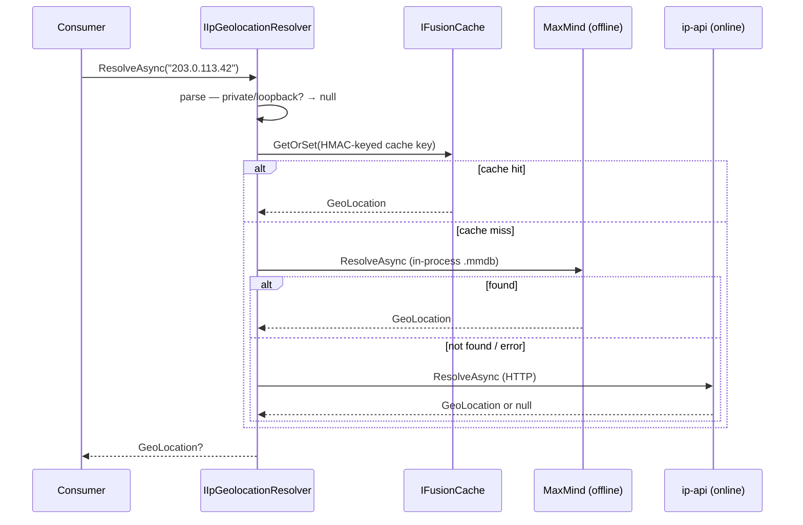

import { Tabs, TabItem, FileTree, Aside, Badge } from "@astrojs/starlight/components";

## Why a geolocation abstraction?

Knowing _roughly_ where a request comes from powers several Granit features: flagging
[suspicious sessions](/dotnet/security/user-sessions/) ("logged in from Brussels, then from
São Paulo eight minutes later"), enriching the session list a user sees in their security
settings, and feeding fraud heuristics. But "resolve an IP to a place" hides two traps:

- **Provider lock-in.** ip-api.com, MaxMind GeoIP2, DB-IP, IP2Location — each returns a
  different JSON shape, different field names, different granularity. Coding against one
  provider's response means rewriting every consumer when you switch.
- **Privacy.** An IP address is personal data under GDPR. The naive cache — `ip → location`
  keyed by the raw IP, or by an _unkeyed_ hash of it — is reversible back to the IP from a
  cache dump. Geolocation that leaks the very identifier it was meant to soften is worse
  than none.

`Granit.IpGeolocation` answers both. Consumers depend only on `IIpGeolocationResolver` and
the source-agnostic `GeoLocation` record; providers are opt-in plug-ins behind a fallback
chain; and the cache is keyed with HMAC-SHA-256 once you supply a secret.

## Package structure

<FileTree>
- Granit.IpGeolocation.Abstractions/ `GeoLocation` read-model, `IpMasking` — zero dependencies, safe to reference from contracts
- Granit.IpGeolocation/ `IIpGeolocationResolver`, fallback chain, FusionCache caching, the cache-key security knob
- Granit.IpGeolocation.IpApi/ ip-api.com / ipinfo.io HTTP provider (online, no local data)
- Granit.IpGeolocation.MaxMind/ MaxMind GeoIP2 / DB-IP `.mmdb` provider (offline, in-process)
</FileTree>

| Package | Role | Depends on |
| ------- | ---- | ---------- |
| `Granit.IpGeolocation.Abstractions` | `GeoLocation` record, `IpMasking` utility | _(none — contract-only)_ |
| `Granit.IpGeolocation` | `IIpGeolocationResolver`, `IIpGeolocationProvider`, caching | `Granit.Caching` |
| `Granit.IpGeolocation.IpApi` | `IpApiIpGeolocationProvider` (online HTTP lookup) | `Granit.IpGeolocation` |
| `Granit.IpGeolocation.MaxMind` | `MaxMindIpGeolocationProvider` (offline `.mmdb` lookup) | `Granit.IpGeolocation` |

## The GeoLocation read-model

`GeoLocation` is a `sealed record` with every member optional — a provider populates only
what its data source supports. An offline country-only database leaves `City` and the
coordinates `null`; an online provider may fill them all.

```csharp
public sealed record GeoLocation
{
    public string? City { get; init; }         // "Brussels"
    public string? Region { get; init; }        // "Brussels-Capital"
    public string? Country { get; init; }        // "Belgium"
    public string? CountryCode { get; init; }    // ISO 3166-1 alpha-2 — "BE"
    public double? Latitude { get; init; }
    public double? Longitude { get; init; }
}
```

The shape is deliberately provider-agnostic so future, non-IP geocoding modules (address →
coordinates) can reuse the same contract.

## Resolving an IP

Inject `IIpGeolocationResolver`. It short-circuits absent, private, loopback, and
link-local addresses to `null`, never throws, and degrades to the next provider when one
fails.

```csharp
public sealed class SessionEnricher(IIpGeolocationResolver resolver)
{
    public async Task<GeoLocation?> LocateAsync(string? ip, CancellationToken ct)
        => await resolver.ResolveAsync(ip, ct);   // null for private / unparseable IPs
}
```

```csharp
public interface IIpGeolocationResolver
{
    Task<GeoLocation?> ResolveAsync(string? ipAddress, CancellationToken cancellationToken = default);
}
```

<Aside type="note">
With **no provider package** registered, the resolver is a silent no-op that always returns
`null`. This is the privacy-first default: geolocation only happens once you opt in to a
provider.
</Aside>

## Providers & the fallback chain

Register one or both providers. The resolver tries them in `ProviderOrder` (or registration
order if unset) and returns the first non-null hit.

<Tabs>
<TabItem label="MaxMind (offline)">

Best default: a local `.mmdb` file, no external calls, no per-request latency or rate limit.

```csharp
builder.AddGranitIpGeolocationMaxMind();
```

```json
{
  "IpGeolocation": {
    "MaxMind": {
      "DatabasePath": "/var/lib/geoip/GeoLite2-City.mmdb",
      "ReloadOnChange": true,
      "FileAccess": "Memory"
    }
  }
}
```

The file must exist at startup (validated). `FileAccess: "Memory"` loads the whole database
into RAM and releases the OS handle — recommended, because it lets you atomically replace
the file on disk while the app runs. `"MemoryMapped"` trades a lower RAM footprint for a
held file handle.

</TabItem>
<TabItem label="ip-api (online)">

An HTTP lookup against ipinfo.io — no local data to ship or refresh, at the cost of a
network round-trip and a rate limit on the tokenless tier.

```csharp
builder.AddGranitIpGeolocationIpApi();
```

```json
{
  "IpGeolocation": {
    "IpApi": {
      "ApiToken": "${IPINFO_TOKEN}",
      "Timeout": "00:00:03"
    }
  }
}
```

The token is sent as a `Bearer` header; lookup failures are logged **without** the request
URI (which carries the IP). Auto-redirect is disabled and the response is size-bounded.

</TabItem>
<TabItem label="Both (chain)">

Run MaxMind first (fast, offline), fall through to ip-api only when the local database has
no answer.

```csharp
builder.AddGranitIpGeolocationMaxMind();
builder.AddGranitIpGeolocationIpApi();
```

```json
{
  "IpGeolocation": {
    "ProviderOrder": ["MaxMind", "IpApi"]
  }
}
```

</TabItem>
</Tabs>

## Caching & the cache-key security knob

Results (positive _and_ negative) are cached via `IFusionCache` for `CacheDuration`
(default **1 hour**). When `Granit.Caching.StackExchangeRedis` is installed, that cache is
shared across pods — which is exactly where the privacy trap lives.

<Aside type="danger" title="Set IpGeolocation:CacheKeySecret in production">
The cache key is a hash of the IP. **With no secret**, that hash is a plain SHA-256 of the
address. The entire IPv4 space is only 2³² values — an attacker holding a cache dump (e.g. a
leaked Redis snapshot) can brute-force every key back to its originating IP in minutes. The
recovered IP is **personal data under GDPR**.

Setting `IpGeolocation:CacheKeySecret` switches the derivation to **HMAC-SHA-256**, keyed by
the secret, closing the brute-force gap. Source it from configuration/Vault and keep it
**stable across every instance** that shares the cache.
</Aside>

When the resolver starts with providers registered but no secret configured, it logs this
warning once:

```text
warn: IP geolocation cache keys use an unkeyed SHA-256 hash. Over a shared cache this is
      reversible to the originating IPv4 address from a cache dump (GDPR personal data). Set
      'IpGeolocation:CacheKeySecret' (sourced from configuration/Vault, stable across
      instances) to key the hash with HMAC-SHA-256.
```

```json
{
  "IpGeolocation": {
    "CacheKeySecret": "${IPGEO_CACHE_KEY_SECRET}",
    "CacheDuration": "01:00:00",
    "ResolvePrivateAddresses": false
  }
}
```

### Masking for exposure

`IpMasking.Mask(ip)` zeros the host portion of an address — IPv4 to `/24`
(`203.0.113.42` → `203.0.113.0`), IPv6 to `/48`. Use it for data minimization when an IP
must appear on a contract or API surface, distinct from log redaction.

## How resolution flows



## Configuration reference

| Key | Type | Default | Description |
|---|---|---|---|
| `IpGeolocation:CacheKeySecret` | `string?` | `null` | HMAC key for cache-key hashing. **Unset = reversible SHA-256 (GDPR risk).** |
| `IpGeolocation:CacheDuration` | `TimeSpan` | `01:00:00` | TTL for positive and negative results. |
| `IpGeolocation:ResolvePrivateAddresses` | `bool` | `false` | When `false`, short-circuit private/loopback/link-local IPs to `null`. |
| `IpGeolocation:ProviderOrder` | `string[]` | `[]` | Provider fallback order; empty = registration order. |
| `IpGeolocation:MaxMind:DatabasePath` | `string` | _(required)_ | Path to the `.mmdb` file; must exist at startup. |
| `IpGeolocation:MaxMind:ProviderName` | `string` | `"MaxMind"` | Identifier used in `ProviderOrder`. |
| `IpGeolocation:MaxMind:ReloadOnChange` | `bool` | `true` | Reload the database when the file changes. |
| `IpGeolocation:MaxMind:FileAccess` | `enum` | `Memory` | `Memory` (load to RAM, release handle) or `MemoryMapped`. |
| `IpGeolocation:IpApi:ApiToken` | `string?` | `null` | ipinfo.io token sent as `Bearer`; tokenless tier is rate-limited. |
| `IpGeolocation:IpApi:BaseAddress` | `Uri` | `https://ipinfo.io` | Provider base address. |
| `IpGeolocation:IpApi:Timeout` | `TimeSpan` | `00:00:03` | Per-request timeout. |
| `IpGeolocation:IpApi:MaxResponseSizeBytes` | `long` | `65536` | Max buffered response size. |

## Public API summary

| Category | Key types | Package |
|----------|-----------|---------|
| Read-model | `GeoLocation`, `IpMasking` | `Granit.IpGeolocation.Abstractions` |
| Resolver | `IIpGeolocationResolver`, `IIpGeolocationProvider` | `Granit.IpGeolocation` |
| Options | `GranitIpGeolocationOptions` | `Granit.IpGeolocation` |
| ip-api provider | `AddGranitIpGeolocationIpApi()`, `IpApiIpGeolocationOptions` | `Granit.IpGeolocation.IpApi` |
| MaxMind provider | `AddGranitIpGeolocationMaxMind()`, `MaxMindIpGeolocationOptions`, `MaxMindFileAccess` | `Granit.IpGeolocation.MaxMind` |

## Compliance

- **GDPR Art. 5(1)(c)** — data minimization: `IpMasking` and the country/city-only read-model
  keep raw IPs off exposed surfaces.
- **GDPR Art. 5(1)(f)** — integrity and confidentiality: HMAC-keyed cache keys stop a cache
  dump from being reversed to the originating IP (one control — supports the principle, not
  standalone compliance).

## See also

- [User Sessions](/dotnet/security/user-sessions/) — consumes `GeoLocation` for impossible-travel
  and new-country anomaly detection
- [Identity](/dotnet/security/identity/) — the session list enriched with geolocation and risk
- [BFF](/dotnet/security/bff/) — the SPA-facing session endpoint that surfaces location per session
- [Caching](/dotnet/data/caching/) — the `IFusionCache` backing the geolocation cache
- [Vault & Encryption](/dotnet/data/vault/) — where to source `CacheKeySecret`
