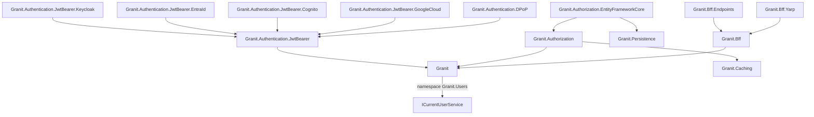

import { FileTree } from "@astrojs/starlight/components";

The base security package providing the `ICurrentUserService` abstraction and `ActorKind`
enum. Used by every module that needs to know "who is calling" — audit trails, tenant
resolution, authorization checks.

## Choosing the right security modules

| Problem | Module | When to use |
| ------- | ------ | ----------- |
| You need to verify who is calling your API | [Authentication](/dotnet/security/authentication/) | Always — choose the provider package matching your identity platform (Keycloak, Entra ID, or Cognito) |
| Users/roles need different access levels | [Authorization](/dotnet/security/authorization/) | When permissions change at runtime or differ per tenant |
| You store PII that must be encrypted at rest | [Field-level Encryption](/dotnet/data/encryption/) | GDPR Art. 32, ISO 27001 A.8.24 — national IDs, medical records, bank accounts |
| You need external secret/key management | [Vault & Encryption](/dotnet/data/vault/) | Production environments — never store encryption keys in config files |
| You manage user accounts (CRUD, sync) | [Identity](/dotnet/security/identity/) | When your API owns user lifecycle (registration, deactivation, profile sync) |
| Users can request data export or deletion | [Privacy](/dotnet/compliance/privacy/) | GDPR Art. 15–18 — any app handling EU personal data |
| Your SPA uses cookie-based auth with consent | [Cookies](/dotnet/compliance/cookies/) | Browser-based apps with GDPR cookie consent requirements |
| Your SPA should never touch tokens | [BFF](/dotnet/security/bff/) | SPAs where tokens must stay server-side (XSS mitigation, OAuth BCP) |
| You self-host your identity provider | [OpenIddict](/dotnet/security/openiddict/) | When you need full control over OIDC flows, token issuance, and user management |
| You need FAPI 2.0 financial-grade security | [FAPI 2.0](/dotnet/security/openiddict/advanced/fapi-2-security-profile/) | Banking, PSD2, or any high-security API requiring PAR + DPoP + private_key_jwt |
| You resolve client IPs to a location | [IP Geolocation](/dotnet/security/ip-geolocation/) | Session enrichment, fraud heuristics — with GDPR-safe, HMAC-keyed caching |
| You detect suspicious / hijacked sessions | [User Sessions](/dotnet/security/user-sessions/) | Impossible-travel, new-device, new-country anomaly detection (AI + heuristics) |

:::tip[Minimum security stack]
**Authentication** (pick one provider) + **Authorization** + **Exception Handling**
(for consistent 401/403 responses). Add Encryption, Privacy, and Identity as your
compliance and user management needs grow.

For a step-by-step walkthrough — including the order in which to wire each layer —
see the [Secure your Application guide](/dotnet/guides/secure-your-application/).
:::

## Package structure

The core actor abstractions ship inside the foundation `Granit` package — there is no
separate `Granit.Users` NuGet. `ICurrentUserService`, `ActorKind`, and the audit
identity primitives all live under the `Granit.Users` namespace within `Granit`.

| Namespace (within `Granit`) | Role |
|------------------------------|------|
| `Granit.Users` | `ICurrentUserService`, `ActorKind`, `SystemCurrentUserService` |

## ICurrentUserService

The core abstraction for accessing the authenticated actor. Injected everywhere
audit fields, tenant resolution, or authorization checks need to know "who is calling."

```csharp
public interface ICurrentUserService
{
    string? UserId { get; }
    string? UserName { get; }
    string? Email { get; }
    string? FirstName { get; }
    string? LastName { get; }
    bool IsAuthenticated { get; }
    ActorKind ActorKind { get; }
    bool IsMachine { get; }
    string? ApiKeyId { get; }
    IReadOnlyList<string> GetRoles();
    bool IsInRole(string role);
}
```

`ActorKind` distinguishes between `User` (human), `ExternalSystem` (API key / service account),
and `System` (background jobs, scheduled tasks).

:::tip
`AuditedEntityInterceptor` uses `ICurrentUserService.UserId` for `CreatedBy` / `ModifiedBy`.
When no user is authenticated, it falls back to `"system"`.
:::

## Full security stack

The complete authentication and authorization stack is documented in dedicated pages:



## See also

- [Authentication](/dotnet/security/authentication/) -- JWT Bearer, Keycloak, Entra ID, Cognito, Google Cloud, DPoP
- [API Keys](/dotnet/security/api-keys/) -- service-to-service authentication, rotation, expiry scanner, lifecycle notifications
- [BFF](/dotnet/security/bff/) -- Backend For Frontend pattern for SPAs, session management, YARP proxy
- [OpenIddict](/dotnet/security/openiddict/) -- self-hosted OIDC server, user management, FAPI 2.0
- [Authorization](/dotnet/security/authorization/) -- RBAC permissions, dynamic policy provider
- [Identity](/dotnet/security/identity/) -- user management, Keycloak Admin API, user cache
- [IP Geolocation](/dotnet/security/ip-geolocation/) -- source-agnostic IP → location, HMAC-keyed caching
- [User Sessions](/dotnet/security/user-sessions/) -- session anomaly detection, risk scoring, suspicious-session events
- [Privacy](/dotnet/compliance/privacy/) -- GDPR compliance, right to erasure
- [Core](/dotnet/core/module-system/) -- `ICurrentTenant`, exception hierarchy
- [Persistence](/dotnet/data/persistence/) -- `AuditedEntity` base class, interceptors
- [Blog: NIS2-ready .NET applications](/blog/nis2-ready-dotnet-applications/) -- how Granit's security primitives map to NIS2 controls
- [Blog: SOC 2 Type 2-ready SaaS with Granit](/blog/soc2-type2-ready-saas-granit/) -- the controls and audit trail you get out of the box
