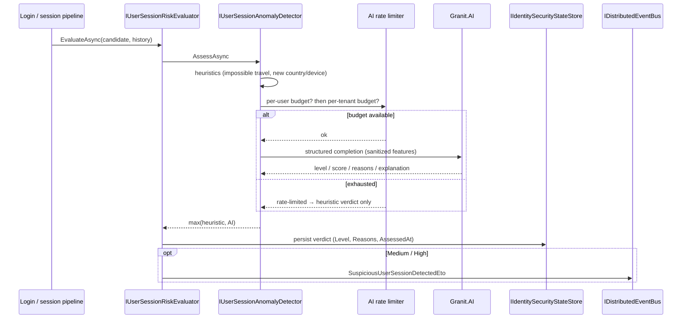

import { Tabs, TabItem, FileTree, Aside, Badge } from "@astrojs/starlight/components";

## Why session anomaly detection?

A valid session token says _the credential is correct_. It does not say _this is really the
user_. A stolen session cookie, a phished login, or a hijacked refresh token all present a
perfectly valid session. The signal that something is wrong lives in the **pattern**: a
login from Brussels followed eight minutes later by one from São Paulo, a brand-new device
family, a country the account has never touched.

Granit's **Identity** session-risk packages turn that pattern into a risk verdict. They combine
cheap, deterministic heuristics with an optional AI layer, persist the verdict, and raise an integration event
when a session looks suspicious — so the [session list](/dotnet/security/identity/) a user
sees can flag it and your handlers can step up authentication or notify the account owner.

## Package structure

<FileTree>
- Granit.Identity.Abstractions/ `UserSessionDescriptor`, `UserSessionRiskAssessment`, `IUserSessionAnomalyDetector`, `IIdentitySecurityStateStore`, the `...Eto` integration event — safe no-op defaults
- Granit.Identity.AnomalyDetection/ Heuristics (impossible travel, new device, new country) + opt-in AI layer over `Granit.AI`
- Granit.Identity.EntityFrameworkCore/ `EfCoreIdentitySecurityStateStore` — durable session risk, device trust, behavioural profile and session reviews, persisted in the Identity DbContext
</FileTree>

| Package | Role | Depends on |
| ------- | ---- | ---------- |
| `Granit.Identity.Abstractions` | Contracts + no-op detector + in-memory store | `Granit` |
| `Granit.Identity.AnomalyDetection` | Heuristic + AI detector, risk evaluator | `Granit.AI`, `Granit.Identity.Abstractions` |
| `Granit.Identity.EntityFrameworkCore` | `EfCoreIdentitySecurityStateStore`, mapped into the User DbContext | `Granit.Persistence.EntityFrameworkCore`, `Granit.Identity.Abstractions` |

<Aside type="note">
`Granit.Identity.Abstractions` alone registers a **no-op** detector (`None` for every
session) and an **in-memory** risk store. That keeps development and single-node setups
working with zero configuration; the production behaviour switches on when you add the
AnomalyDetection and EntityFrameworkCore packages.
</Aside>

## The session descriptor

The detector reasons over `UserSessionDescriptor` — a candidate session plus the user's
recent history.

```csharp
public sealed record UserSessionDescriptor
{
    public required string SessionId { get; init; }
    public string? UserId { get; init; }
    public bool IsCurrent { get; init; }
    public DateTimeOffset CreatedAt { get; init; }
    public DateTimeOffset? LastAccessedAt { get; init; }   // last-activity
    public string? UserAgent { get; init; }
    public string? IpAddress { get; init; }                // raw IP — server-side only, never log in clear
    public GeoLocation? Location { get; init; }            // derived via Granit.IpGeolocation
}
```

`Location` comes from [IP Geolocation](/dotnet/security/ip-geolocation/) — the privacy-friendly,
country/city read-model rather than the raw IP.

## Heuristics

Three deterministic checks run with no external dependency and no cost:

| Heuristic | Signal | Contribution |
|-----------|--------|--------------|
| **Impossible travel** | Great-circle (Haversine) distance between consecutive session locations vs. elapsed time exceeds `MaxTravelKilometersPerHour` (default **1000 km/h**) | **High** |
| **New country** | Candidate `Location.CountryCode` not seen in any prior session | Low |
| **New device** | `UserAgent` device family (`DeviceFingerprint.Family`) never seen before | Low |

```csharp
public interface IUserSessionAnomalyDetector
{
    Task<UserSessionRiskAssessment> AssessAsync(
        UserSessionDescriptor candidate,
        IReadOnlyList<UserSessionDescriptor> history,
        CancellationToken cancellationToken = default);
}
```

The result combines the heuristic verdict and (if enabled) the AI verdict by taking the
**higher** risk level and the **maximum** score — the AI can escalate but never silently
downgrade a heuristic that already fired.

## The AI layer (opt-in)

When `Granit.Identity.AnomalyDetection` is wired with an AI provider, the detector also
asks the model — via `IStructuredCompletion` from [Granit.AI](/dotnet/ai/) — for a structured
verdict: level, score, reason codes, and a short explanation. It degrades gracefully to the
heuristic verdict on rate-limit, timeout, or refusal.

```csharp
public sealed record UserSessionRiskAssessment
{
    public UserSessionRiskLevel Level { get; init; }        // None | Low | Medium | High
    public double Score { get; init; }                      // normalized [0, 1]
    public IReadOnlyList<string> Reasons { get; init; }     // machine-readable reason codes
    public string? Explanation { get; init; }               // ⚠ untrusted model output — see below
}
```

<Aside type="danger" title="Explanation is untrusted model output">
When the AI layer produces it, `UserSessionRiskAssessment.Explanation` is **untrusted model
output**. The model is _instructed_ to keep it PII-safe and benign, but that is **not
enforced**. Before you render it to a user, write it to logs or traces, or persist it:

- **Sanitize and bound it** — treat it as you would any user-supplied string (HTML-encode on
  display, strip control characters, cap the length).
- **Never persist it as-is.** The durable risk store deliberately keeps only `Level`,
  `Reasons`, and `AssessedAt` — not the free-text explanation.

Reason **codes** (`Reasons`) are the machine-readable, trustworthy output; the `Explanation`
is convenience text only.
</Aside>

<Aside type="caution" title="Prompt-injection hardening">
The country and city of each session are attacker-influenceable (a crafted `User-Agent` or a
spoofable header can steer what ends up here), and they are fed into the model's prompt. The
detector **sanitizes every tier before it reaches the prompt**: values are trimmed, capped at
64 characters, and any character outside `[A-Za-z0-9 .,'-]` is collapsed to `_`. This strips
the newlines and structural characters a prompt-injection payload would need. Keep this in
mind if you build your own descriptors — never hand the model un-sanitized free text.
</Aside>

## Rate limiting the AI calls

AI calls cost money and latency, so they are budgeted per hour on **two** axes. The crucial
detail: the **per-user** budget is checked **before** the per-tenant budget.

```json
{
  "Identity": {
    "AnomalyDetection": {
      "MaxAiCallsPerHourPerUser": 50,
      "MaxAiCallsPerHourPerTenant": 500,
      "MaxTravelKilometersPerHour": 1000
    }
  }
}
```

<Aside type="note" title="Why per-user is checked first">
Checking the per-user cap first means one noisy subject — a bot hammering logins, a
misbehaving client — **cannot drain the shared tenant budget** and silently downgrade every
other user in the tenant to heuristics-only detection. The blast radius of an abusive account
is contained to that account.
</Aside>

| Key | Type | Default | Description |
|---|---|---|---|
| `Identity:AnomalyDetection:MaxAiCallsPerHourPerUser` | `int` | `50` | AI assessments per user per hour. Checked **first**. |
| `Identity:AnomalyDetection:MaxAiCallsPerHourPerTenant` | `int` | `500` | AI assessments per tenant per hour. |
| `Identity:AnomalyDetection:MaxTravelKilometersPerHour` | `double` | `1000` | Impossible-travel speed threshold. |

## Persisting verdicts

`Granit.Identity.EntityFrameworkCore` swaps the in-memory store for a durable one backed by
the `identity_user_session_risks` table. The table is mapped into the **Identity DbContext**
(`IdentityDbContext`), so the risk store shares the identity connection and migrations — there
is no separate session-risk database to provision.

Adding the package and calling `AddGranitIdentityEntityFrameworkCore` is all that is required;
the module registers the EF Core–backed `IIdentitySecurityStateStore` automatically, overriding the
in-memory default.

```csharp
builder.Services.AddGranitIdentityEntityFrameworkCore(options =>
    options.UseNpgsql(builder.Configuration.GetConnectionString("Identity")));
```

<Aside type="caution" title="Breaking change">
`AddGranitUserSessionsEntityFrameworkCore(...)` and the standalone
`Granit.UserSessions.EntityFrameworkCore` package have been **removed**. The durable risk store
now lives in `Granit.Identity.EntityFrameworkCore` as the canonical `identity_user_session_risks`
table in the Identity DbContext. Migrate by deleting the separate registration call and the
`UserSessions` connection string; once you call `AddGranitIdentityEntityFrameworkCore`, the risk
store is wired automatically.
</Aside>

```csharp
// Session risk shares IIdentitySecurityStateStore with device trust,
// the behavioural profile, and single-use session reviews.
public interface IIdentitySecurityStateStore
{
    Task SetSessionRiskAsync(string userId, string sessionId, UserSessionRiskVerdict verdict, CancellationToken ct = default);
    Task<UserSessionRiskVerdict?> GetSessionRiskAsync(string userId, string sessionId, CancellationToken ct = default);
    Task<IReadOnlyDictionary<string, UserSessionRiskVerdict>> GetSessionRisksAsync(
        string userId, IReadOnlyCollection<string> sessionIds, CancellationToken ct = default);
    // … device-trust, behavioural-profile and session-review members
}
```

The stored `UserSessionRiskVerdict` carries only `Level`, `Reasons`, and `AssessedAt` — the
untrusted `Explanation` is intentionally **not** persisted. The risk store has no DbProperties
of its own — table prefix and schema follow the canonical `GranitIdentityDbProperties`
(default prefix `identity_`).

## End-to-end flow

`IUserSessionRiskEvaluator` orchestrates the pipeline: assess, persist any non-`None` verdict,
and publish a `SuspiciousUserSessionDetectedEto` integration event for **Medium/High** risk so
downstream handlers (notifications, step-up auth) can react.



## Device trust dampens anomaly noise

When the user has explicitly [trusted the device](/dotnet/security/identity/#trusted-devices)
the session originates from, the evaluator dampens the noise without masking real threats.
`IUserSessionRiskEvaluator.EvaluateAsync` takes the resolved `deviceId` and consults
`IIdentitySecurityStateStore.GetDeviceTrustAsync`:

| Detected level | On an actively-trusted device |
|----------------|-------------------------------|
| `High` | **Preserved** — a trusted device can still be compromised |
| `Medium` | **Downgraded to `Low`**, the `trusted_device` reason is appended, and the `SuspiciousUserSessionDetectedEto` alert is suppressed |
| `Low` / `None` | Unchanged |

The `deviceId` reaches the evaluator only when the browser traverses Granit and the
[device-trust middleware](/dotnet/security/identity/#wiring) (`UseGranitDeviceTrust()`) decoded
the cookie: a **BFF** or **OpenIddict front-channel** sign-in stamps it onto
`UserSessionCreatedEto`. A pure IdP webhook session is server-to-server with no browser cookie,
so it carries no `deviceId` and is treated as untrusted — the full risk verdict stands.

## Public API summary

| Category | Key types | Package |
|----------|-----------|---------|
| Contracts | `UserSessionDescriptor`, `UserSessionRiskAssessment`, `UserSessionRiskVerdict`, `UserSessionRiskLevel` | `Granit.Identity.Abstractions` |
| Detection | `IUserSessionAnomalyDetector`, `IIdentitySecurityStateStore`, `SuspiciousUserSessionDetectedEto` | `Granit.Identity.Abstractions` |
| Device trust | `IIdentitySecurityStateStore`, `DeviceTrustVerdict`, `DeviceTrustLevel` | `Granit.Identity.Abstractions` |
| AI + heuristics | `IUserSessionRiskEvaluator`, `IdentityAnomalyDetectionOptions` | `Granit.Identity.AnomalyDetection` |
| Persistence | `EfCoreIdentitySecurityStateStore`, `GranitIdentityDbProperties` | `Granit.Identity.EntityFrameworkCore` |

## Compliance

- **GDPR Art. 5(1)(f) / Art. 32** — integrity and confidentiality: anomaly detection is a
  technical measure against unauthorized account access; the untrusted model explanation is
  kept out of persistence and logs by default.
- **ISO 27001 A.8.16** — monitoring activities: suspicious-session events feed your SOC /
  notification bridge.

## See also

- [IP Geolocation](/dotnet/security/ip-geolocation/) — supplies the `GeoLocation` driving the
  travel and country heuristics
- [Identity](/dotnet/security/identity/#user-sessions--devices) — the canonical session list
  (`/sessions` + `/devices`), now enriched with risk
- [BFF](/dotnet/security/bff/) — one backend behind that canonical session API for SPAs
- [AI](/dotnet/ai/) — the `IStructuredCompletion` abstraction the AI layer builds on
- [Audit Log](/dotnet/compliance/audit-log/) — authentication audit, owned at its source
