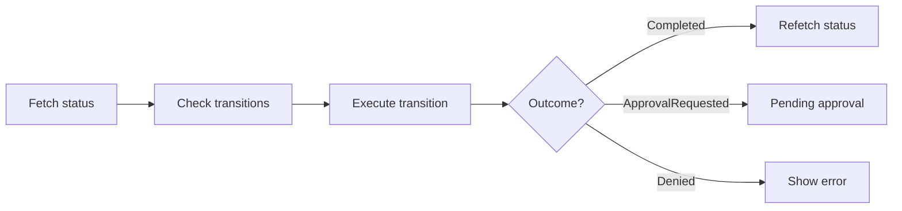

import { Tabs, TabItem, FileTree } from "@astrojs/starlight/components";

`@granit/workflow` provides framework-agnostic types and API functions for a finite
state machine — mirroring `Granit.Workflow` on the .NET backend. It models entity
lifecycle through named states, guarded transitions, and optional approval routing.

`@granit/react-workflow` wraps these into a provider and hooks that manage status
fetching, transition execution, and paginated audit history.

**Peer dependencies:** `axios`, `@granit/logger`, `react ^19`

## Package structure

<FileTree>
- @granit/workflow/ FSM types, transition/history API functions (framework-agnostic)
  - @granit/react-workflow WorkflowProvider, status/transition/history hooks
</FileTree>

| Package | Role | Depends on |
|---------|------|------------|
| `@granit/workflow` | DTOs, transition outcome enum, API functions | `axios` |
| `@granit/react-workflow` | `WorkflowProvider`, `useTransitions`, `useExecuteTransition`, `useWorkflowHistory`, `useWorkflowConfig` | `@granit/workflow`, `@granit/logger`, `react` |

## Setup

<Tabs>
<TabItem label="React (recommended)">

```tsx
import { WorkflowProvider } from '@granit/react-workflow';
import { api } from './api-client';

function App({ children }) {
  return (
    <WorkflowProvider apiClient={api} basePath="/api/v1/workflow">
      {children}
    </WorkflowProvider>
  );
}
```

</TabItem>
<TabItem label="TypeScript only">

```ts
import { listTransitions, executeStateMachineTransition, getHistory } from '@granit/workflow';
import type { WorkflowStatusResponse, WorkflowTransitionResultResponse } from '@granit/workflow';
```

</TabItem>
</Tabs>

## TypeScript SDK

### Enums

```ts
const TransitionOutcome = {
  Completed: 'Completed',
  ApprovalRequested: 'ApprovalRequested',
  Denied: 'Denied',
  InvalidTransition: 'InvalidTransition',
} as const;

type TransitionOutcomeValue = (typeof TransitionOutcome)[keyof typeof TransitionOutcome];

const WorkflowLifecycleStatus = {
  Draft: 0,
  PendingReview: 1,
  Published: 2,
  Archived: 3,
} as const;

type WorkflowLifecycleStatusValue =
  (typeof WorkflowLifecycleStatus)[keyof typeof WorkflowLifecycleStatus];
```

### Types

```ts
interface WorkflowTransitionResponse {
  readonly targetState: string;
  readonly name: string;
  readonly allowed: boolean;
  readonly requiresApproval: boolean;
}

interface TransitionRequestDto {
  readonly targetState: string;
  readonly comment?: string;
}

interface WorkflowTransitionResultResponse {
  readonly succeeded: boolean;
  readonly resultingState: string;
  readonly outcome: TransitionOutcomeValue;
}

interface WorkflowTransitionHistoryResponse {
  readonly previousState: string;
  readonly newState: string;
  readonly transitionedAt: string;
  readonly transitionedBy: string;
  readonly comment: string | null;
}

interface WorkflowStatusResponse {
  readonly currentState: string;
  readonly availableTransitions: WorkflowTransitionResponse[];
}

interface WorkflowHistoryPage {
  items: WorkflowTransitionHistoryResponse[];
  totalCount: number;
  nextCursor: string | null;
}
```

### API functions

| Function | Endpoint | Description |
|----------|----------|-------------|
| `listTransitions(client, basePath, entityType, entityId)` | `GET /{entityType}/{entityId}/transitions` | Current state and available transitions |
| `executeStateMachineTransition(client, basePath, entityType, entityId, request)` | `POST /{entityType}/{entityId}/transition` | Trigger a transition |
| `getHistory(client, basePath, entityType, entityId, params?)` | `GET /{entityType}/{entityId}/history` | Paginated transition history |

## React bindings

:::note[Framework-agnostic core]
All types and API functions live in `@granit/workflow` — pure TypeScript.
The React package below wraps them into a provider and hooks.
:::

### `WorkflowProvider`

```tsx
interface WorkflowProviderProps {
  apiClient: AxiosInstance;
  basePath?: string;       // default: '/api/v1/workflow'
  children: React.ReactNode;
}

<WorkflowProvider apiClient={api} basePath="/api/v1/workflow">
  {children}
</WorkflowProvider>
```

### `useWorkflowStatus(options)`

Fetches current state and available transitions for an entity.

```ts
interface UseWorkflowStatusReturn {
  readonly currentState: string | null;
  readonly transitions: WorkflowTransitionResponse[];
  readonly loading: boolean;
  readonly error: Error | null;
  readonly refetch: () => Promise<void>;
}
```

### `useWorkflowTransition(options)`

Executes a state transition with optional audit comment.

```ts
interface UseWorkflowTransitionOptions {
  entityType: string;
  entityId: string;
  onSuccess?: (result: WorkflowTransitionResultResponse) => void;
  onError?: (error: Error) => void;
}

interface UseWorkflowTransitionReturn {
  readonly transition: (targetState: string, comment?: string) => Promise<WorkflowTransitionResultResponse | null>;
  readonly loading: boolean;
  readonly result: WorkflowTransitionResultResponse | null;
  readonly error: Error | null;
}
```

### `useWorkflowHistory(options)`

Fetches paginated transition audit trail for an entity.

```ts
interface UseWorkflowHistoryOptions {
  entityType: string;
  entityId: string;
  enabled?: boolean;   // default: true
}

interface UseWorkflowHistoryReturn {
  readonly history: WorkflowTransitionHistoryResponse[];
  readonly loading: boolean;
  readonly error: Error | null;
  readonly refetch: () => Promise<void>;
}
```

### Transition lifecycle



### Approval routing

When a transition has `requiresApproval: true`, calling `executeStateMachineTransition` returns
`outcome: 'ApprovalRequested'` and the entity enters a pending state. An approver
must then complete or deny the transition via the same API.

## Public API summary

| Category | Key exports | Package |
|----------|-------------|---------|
| Enums | `TransitionOutcome`, `WorkflowLifecycleStatus` | `@granit/workflow` |
| Types | `WorkflowStatusResponse`, `WorkflowTransitionResponse`, `WorkflowTransitionResultResponse`, `WorkflowTransitionHistoryResponse` | `@granit/workflow` |
| API functions | `listTransitions()`, `executeStateMachineTransition()`, `getHistory()` | `@granit/workflow` |
| Provider | `WorkflowProvider`, `useWorkflowConfig()` | `@granit/react-workflow` |
| Hooks | `useWorkflowStatus()`, `useWorkflowTransition()`, `useWorkflowHistory()` | `@granit/react-workflow` |

## See also

- [Granit.Workflow module](/dotnet/building-blocks/workflow/) — .NET FSM engine with publication lifecycle
- [Timeline](/frontend/business/timeline/) — Audit entries can reference workflow transitions
- [Templating](/frontend/business/templating/) — Templates use `WorkflowLifecycleStatus` for publication lifecycle
