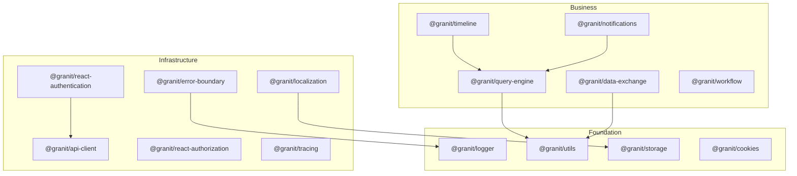

import { FileTree } from "@astrojs/starlight/components";

The Granit Frontend SDK is a collection of %%FRONTEND_PACKAGE_COUNT%% TypeScript packages that mirror the
Granit .NET backend modules. Every package follows a **two-tier architecture**:

1. **TypeScript SDK** (`@granit/<domain>`) — framework-agnostic types, API functions,
   factories, and constants. Zero React dependency. Works with Angular, Vue, Svelte,
   or plain TypeScript.
2. **React bindings** (`@granit/react-<domain>`) — Provider components and hooks that
   wrap the TypeScript SDK for React applications.

## Architecture

Data flows from types to API functions to hooks to providers:
`types/ → api/ → hooks/ → providers/`

## Package inventory

### Foundation

| Package | Role |
|---------|------|
| [`@granit/api-client`](/frontend/api/http-client/) | Axios factory, Bearer token interceptor, RFC 7807 error types |
| [`@granit/idempotency`](/frontend/api/http-client/) | Automatic `Idempotency-Key` header injection |
| [`@granit/utils`](/frontend/core/utils/) | Tailwind CSS class merging, date/number formatting |
| [`@granit/logger`](/frontend/observability/logger/) | Configurable logger factory with pluggable transports |
| [`@granit/logger-otlp`](/frontend/observability/logger/) | OTLP HTTP transport for log-to-trace correlation |

### Security

| Package | Role |
|---------|------|
| [`@granit/authentication`](/frontend/security/authentication/) | Keycloak/OIDC types (framework-agnostic) |
| [`@granit/react-authentication`](/frontend/security/authentication/) | Keycloak init hook, auth context factory, mock provider |
| [`@granit/authentication-api-keys`](/frontend/security/authentication/) | API key management types |
| [`@granit/react-authentication-api-keys`](/frontend/security/authentication/) | React hooks for API key CRUD |
| [`@granit/authorization`](/frontend/security/authorization/) | Permission and role types |
| [`@granit/react-authorization`](/frontend/security/authorization/) | Permission checking hooks |
| [`@granit/identity`](/frontend/security/identity/) | Identity provider capabilities |
| [`@granit/react-identity`](/frontend/security/identity/) | Identity provider and hooks |
| [`@granit/multi-tenancy`](/frontend/infrastructure/multi-tenancy/) | Tenant resolver abstraction |
| [`@granit/react-multi-tenancy`](/frontend/infrastructure/multi-tenancy/) | Tenant provider and hooks |

### Data and messaging

| Package | Role |
|---------|------|
| [`@granit/notifications`](/frontend/infrastructure/notifications/) | Transport-agnostic notification types and API |
| [`@granit/react-notifications`](/frontend/infrastructure/notifications/) | Notification provider and hooks |
| [`@granit/notifications-signalr`](/frontend/infrastructure/notifications/) | SignalR real-time transport |
| [`@granit/notifications-sse`](/frontend/infrastructure/notifications/) | Server-Sent Events transport |
| [`@granit/notifications-web-push`](/frontend/infrastructure/notifications/) | Web Push VAPID subscription API |
| [`@granit/react-notifications-web-push`](/frontend/infrastructure/notifications/) | Web Push React hook |
| [`@granit/notifications-mobile-push`](/frontend/infrastructure/notifications/) | Mobile push token registration API |
| [`@granit/react-notifications-mobile-push`](/frontend/infrastructure/notifications/) | Mobile push React hook |
| [`@granit/query-engine`](/frontend/data/query-engine/) | Headless data grid types, filter system, saved views |
| [`@granit/react-query-engine`](/frontend/data/query-engine/) | Query provider, pagination, smart filter hooks |
| [`@granit/data-exchange`](/frontend/business/data-exchange/) | Import/export pipeline types and API |
| [`@granit/react-data-exchange`](/frontend/business/data-exchange/) | Import/export providers and hooks |

### Domain

| Package | Role |
|---------|------|
| [`@granit/workflow`](/frontend/business/workflow/) | FSM lifecycle types and API |
| [`@granit/react-workflow`](/frontend/business/workflow/) | Workflow provider, status and transition hooks |
| [`@granit/timeline`](/frontend/business/timeline/) | Activity stream types and API |
| [`@granit/react-timeline`](/frontend/business/timeline/) | Timeline provider, stream and follower hooks |
| [`@granit/templating`](/frontend/business/templating/) | Template editing, preview, lifecycle (unified package) |
| [`@granit/background-jobs`](/frontend/infrastructure/background-jobs/) | Background job status types |
| [`@granit/react-background-jobs`](/frontend/infrastructure/background-jobs/) | Job monitoring and control hooks |

### Cross-cutting

| Package | Role |
|---------|------|
| [`@granit/settings`](/frontend/infrastructure/settings/) | User/tenant/global settings types and API |
| [`@granit/react-settings`](/frontend/infrastructure/settings/) | Settings provider and hooks |
| [`@granit/reference-data`](/frontend/business/reference-data/) | i18n reference data types |
| [`@granit/react-reference-data`](/frontend/business/reference-data/) | Reference data CRUD hooks |
| [`@granit/localization`](/frontend/infrastructure/localization/) | i18next integration, locale resolution |
| [`@granit/react-localization`](/frontend/infrastructure/localization/) | React localization bindings |
| [`@granit/cookies`](/frontend/security/cookies/) | Cookie consent abstraction |
| [`@granit/react-cookies`](/frontend/security/cookies/) | Cookie consent provider and hook |
| [`@granit/cookies-klaro`](/frontend/security/cookies/) | Klaro CMP adapter |
| [`@granit/storage`](/frontend/data/storage/) | Typed browser storage factory |
| [`@granit/react-storage`](/frontend/data/storage/) | Synchronized storage hook |
| [`@granit/tracing`](/frontend/observability/tracing/) | OpenTelemetry browser tracing |
| [`@granit/react-tracing`](/frontend/observability/tracing/) | Tracing provider and span hooks |
| [`@granit/error-boundary`](/frontend/observability/error-boundary/) | Error context types |
| [`@granit/react-error-boundary`](/frontend/observability/error-boundary/) | Error boundary, global capture, breadcrumbs |

## Prerequisites

- **Node.js** 22+ and **pnpm**
- **`@tanstack/react-query`** v5 — peer dependency of all React packages with data fetching
- **Axios** v1.x — peer dependency of `@granit/api-client`

:::note[Source-direct consumption]
Packages export `.ts` source files directly — no build step, no `dist/` folder.
Consuming apps resolve `@granit/*` to `src/` via Vite path aliases and
`pnpm link:` protocol. HMR works across framework and application code.
:::

## .NET correspondence

Each frontend package mirrors a Granit .NET module:

| .NET module | Frontend SDK |
|-------------|-------------|
| `Granit` | `@granit/api-client`, `@granit/utils` |
| `Granit.Users` | `@granit/authentication`, `@granit/react-authentication` |
| `Granit.Authorization` | `@granit/authorization`, `@granit/react-authorization` |
| `Granit.Identity` | `@granit/identity`, `@granit/react-identity` |
| `Granit.MultiTenancy` | `@granit/multi-tenancy`, `@granit/react-multi-tenancy` |
| `Granit.Notifications` | `@granit/notifications` + transport packages |
| `Granit.QueryEngine` | `@granit/query-engine`, `@granit/react-query-engine` |
| `Granit.DataExchange` | `@granit/data-exchange`, `@granit/react-data-exchange` |
| `Granit.Workflow` | `@granit/workflow`, `@granit/react-workflow` |
| `Granit.Timeline` | `@granit/timeline`, `@granit/react-timeline` |
| `Granit.Templating` | `@granit/templating` |
| `Granit.BackgroundJobs` | `@granit/background-jobs`, `@granit/react-background-jobs` |
| `Granit.Observability` | `@granit/logger`, `@granit/tracing` |
| `Granit.Localization` | `@granit/localization`, `@granit/react-localization` |
| `Granit.Http.Cookies` | `@granit/cookies`, `@granit/cookies-klaro` |
| `Granit.Http.ExceptionHandling` | `@granit/error-boundary`, `@granit/react-error-boundary` |

TypeScript types in each package mirror the corresponding .NET DTOs. Changes to a
.NET endpoint contract must be propagated to the matching TypeScript type, and vice versa.
