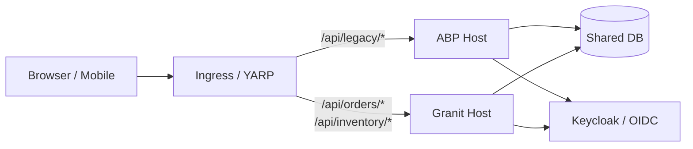

ABP Framework (`abp.io`) and Granit occupy adjacent niches in the .NET
ecosystem: both ship a module system, multi-tenancy, audit logging, permission
infrastructure, and a curated stack of opinionated defaults. Teams who already
run on ABP and are evaluating a move usually do so for one of four reasons:
fewer enforced layers, a smaller surface area to learn, native Wolverine
messaging, or simply a leaner runtime. This guide assumes you have made that
decision and shows you how to execute it without a big-bang rewrite.

## Before you commit

The two frameworks are not equivalent. Granit is **the right choice** when:

- Your team prefers vertical slices over enforced DDD layering (Domain /
  Application / Infrastructure as separate projects).
- You want Minimal API + endpoint filters rather than auto-generated REST
  controllers wrapped around `IApplicationService`.
- You are already on, or moving to, **Wolverine** for messaging — Granit
  integrates it as a first-class primitive instead of wrapping a generic
  `IDistributedEventBus`.
- You want **first-class CQRS**. ABP's `CrudAppService<TEntity, TDto>` bundles
  reads and writes behind a single service per aggregate, which makes splitting
  the read model from the write model awkward (you end up adding a second
  AppService and routing manually). Granit treats commands and queries as
  separate Wolverine messages with their own handlers, validators, and
  authorization policies — the split is the default shape, not a workaround.
- You want to stay close to the BCL and ASP.NET Core defaults (Minimal API,
  `IOptions`, `IServiceProvider`, EF Core's built-in interceptors) rather
  than learning a parallel set of abstractions.

Granit is **not** the right choice when:

- You rely on **ABP Suite** or **ABP Studio** for scaffolding entire CRUD
  modules from a UI. Granit ships no equivalent — module boilerplate is
  written by hand or via project templates.
- You need the **commercial ABP** modules (LeptonX theme, Chat, File
  Management commercial edition, identity server premium features). Most
  have an open-source equivalent in Granit, but the UI surface differs.
- Your frontend is a tightly coupled ABP Angular template. Granit's React
  companion (the `@granit/*` packages) is the canonical frontend; migrating an
  Angular ABP UI is a separate project.

If you got past those filters, read on.

### Licensing — the unstated decision driver

For many enterprise teams this is the determining factor and the one
nobody puts on the public slide:

| | License | Practical impact |
| --- | --- | --- |
| **ABP Framework** (open-source core, `abpframework/abp`) | **LGPL-3.0** | Linking from proprietary code is fine ("Lesser" GPL). But modifications to the framework itself must be published under LGPL. Many enterprise SCA tools (Black Duck, FOSSA, GitHub Advanced Security) flag LGPL as "requires legal review". |
| **ABP Commercial** (Suite, LeptonX, premium modules) | **Proprietary** (paid) | Per-developer seats; vendor-tied. |
| **Granit** (the entire OSS surface) | **Apache-2.0** | Permissive: use, modify, fork, redistribute — including in proprietary derivatives — with no copyleft obligation on either your app code or your framework patches. Explicit patent grant. Auto-approved by most enterprise SCA pipelines. |

If your legal team's SBOM pipeline flags LGPL as "needs review" while
waving Apache-2.0 through, the license alone can justify the migration
on procurement-friction grounds — independent of the technical
arguments above.

## Conceptual mapping

The table below maps every ABP primitive most teams touch on a daily basis
to its Granit equivalent.

| ABP primitive | Granit equivalent | Notes |
| --- | --- | --- |
| `AbpModule` + `[DependsOn(typeof(...))]` | `GranitModule` + `[DependsOn(typeof(...))]` | Near-identical API. Topological load order, conditional `IsEnabled`, lifecycle hooks. |
| `ConfigureServices(context)` | `ConfigureServices(ServiceConfigurationContext)` | Granit also exposes `ConfigureServicesAsync` for remote configuration. |
| `OnApplicationInitializationAsync` | `OnApplicationInitializationAsync` | Same shape. |
| `IApplicationService` / `CrudAppService<TEntity, TDto>` | A Minimal API endpoint class + handler method | Granit does **not** auto-generate REST controllers. Endpoints are explicit (see [Add an endpoint](/dotnet/guides/add-an-endpoint/)). |
| `IRepository<TEntity, TKey>` (generic, ~30 helpers) | `DbContext` directly, optionally a thin repository per aggregate | The full generic-repository surface (`InsertAsync`, `UpdateAsync`, `GetQueryableAsync`, …) is not reproduced. EF Core is used directly. |
| `ISpecification<T>` / `Specification<T>` (composable query criteria) | `Granit.Persistence.Specification<T>` (named, reusable) and `Spec.For<T>()` (inline, fluent) | Direct port. Granit's variant is persistence-agnostic (works on EF Core, MongoDB LINQ, in-memory), supports projection via `Specification<T, TResult>`, and is consumed by repositories through a `SpecificationEvaluator`. |
| `AuditedEntity<TKey>` / `FullAuditedEntity<TKey>` | `Granit.Domain.CreationAuditedEntity`, `AuditedEntity`, `FullAuditedEntity` (+ matching `*AggregateRoot` variants) | The audit columns are `CreatedAt` / `CreatedBy` (`Modified*`, `Deleted*` on the fuller variants). `FullAudited*` adds soft-delete via `ISoftDeletable`. Auto-populated by the `AuditedEntityInterceptor`. |
| `IMultiTenant` interface on entities | `Granit.MultiTenancy.IMultiTenant` (same shape, exposes `TenantId`) | Tenant resolution is contextual; the entity opts in via the `TenantId` property. |
| `ICurrentTenant.Change(...)` | `ICurrentTenant.Change(id, name?)` (`Granit.MultiTenancy`) | Same name, same scoping semantics. Read access is `currentTenant.Id` (not `.TenantId`). |
| `ISettingProvider` / `ISettingManagementStore` | `Granit.Settings.Services.ISettingProvider` + `ISettingWriter` (module: `GranitSettingsModule`) | Same name as ABP, same name-based API: `await settingProvider.GetOrNullAsync("Inventory.LowStockThreshold")`. DB-backed, tenant-aware. |
| `IPermissionChecker` + `PermissionDefinitionProvider` | ASP.NET Core authorization policies + Granit endpoint registry | Granit uses native `[Authorize(Policy = "...")]`. Permissions are declared per-endpoint. |
| `IDistributedEventBus` / `ILocalEventBus` | **Wolverine** (`IMessageBus`) | Local + transport (RabbitMQ, Kafka, Azure Service Bus). See [Wolverine messaging](/dotnet/infrastructure/wolverine-messaging/). |
| `IBackgroundJobManager` (Hangfire/Quartz wrapper) | Wolverine scheduled / durable messages | A single primitive for sync, async and scheduled work. |
| `IStringLocalizer<TResource>` (ABP variant) | `IStringLocalizer<T>` (vanilla ASP.NET) + Granit localization conventions | Granit uses the BCL interface and ships culture detection, fallback, and DB-backed override. |
| `AuditLog` table (auto-populated) | `Granit.Auditing.Domain.AuditEntry` (module: `GranitAuditingModule`) | DB-backed, ISO 27001-aware, opt-in per module. Records who / what / when / from where, plus per-entity change snapshots. |
| `IObjectMapper` (AutoMapper wrapper) | **Mapperly** (compile-time) or manual mapping | No runtime reflection-based mapper is shipped. |
| ABP CLI (`abp new`, `abp install-libs`) | `dotnet new granit-microservice` (project template) | No `install-libs` step — frontend assets are managed by the React companion. |
| ABP Suite (commercial codegen) | *Not replaced.* See "What Granit does not replace" below. | |

## The cutover model

A big-bang rewrite is rarely the right choice. The recommended path is the
**strangler fig**: run a Granit host alongside the existing ABP host, share
the same database and identity provider, then port modules one by one. A
reverse proxy (YARP, NGINX, or the ingress in front of both apps) routes
each URL prefix to the host that owns it. Once the last ABP module has been
ported, the ABP host is decommissioned.



The shared database is the linchpin. Both hosts read and write the same
schema, which means:

- **Schema ownership belongs to the host that wrote the table first.** EF Core
  migrations are generated by that host. The other side either uses a
  read-only `DbContext` or, if it needs to write, generates a migration in
  the same `__EFMigrationsHistory` table.
- **Audit and tenant columns must keep the same shape.** ABP entities expose
  `CreatorId` / `CreationTime` / `LastModifierId` / `LastModificationTime`;
  Granit's `CreationAuditedEntity` / `AuditedEntity` / `FullAuditedEntity`
  expose `CreatedBy` / `CreatedAt` / `ModifiedBy` / `ModifiedAt` (plus
  `DeletedBy` / `DeletedAt` on the `FullAudited*` variants). When sharing
  schema during the cutover, override the column names in the EF Core
  configuration (`builder.Property(e => e.CreatedAt).HasColumnName("CreationTime")`)
  so the Granit entity binds to ABP's physical columns. The rename only
  happens once the ABP host is fully decommissioned.

## Phase 0 — Inventory and decide

Before writing a line of Granit code, produce two artifacts:

1. **A module dependency graph of the existing ABP app.** Most ABP solutions
   already have one (`*.csproj` ProjectReference + `[DependsOn]` is enough).
   This becomes the porting order: leaves first, root last.
2. **A risk matrix.** For each module: which features does it use (multi-tenancy,
   permissions, domain events, background jobs, audited entities)? Modules
   that only use the basics port in a day; modules that lean on `IObjectMapper`,
   `IDistributedEventBus`, and `IPermissionDefinitionProvider` need a planning
   session.

A reasonable order: port a leaf "read-only catalog" module first (low risk,
proves the host setup), then a module with writes + audit, then a module with
events, then the tenant-aware modules, then the cross-cutting modules
(permissions, settings, localization). Authentication is usually last because
both hosts can keep talking to the same Keycloak/OIDC issuer in parallel.

### If your ABP app uses `int` / `long` keys

Granit's `Entity` base type fixes `Id` as `Guid`. If your ABP entities use
`AggregateRoot<int>` or `<long>`, you need a **one-shot key rewrite before
any module is ported** — both hosts must agree on the key type once they
read and write the same rows. Two strategies; pick one per aggregate:

- **Deterministic UUID v5.** Derive each new `Guid` from the existing
  `int`/`long` value (`uuid_v5(namespace, source_id::text)`). FK relations
  port without a lookup table because the same input always yields the
  same UUID. Best when the source IDs are stable and you cannot afford
  downtime.
- **Mapping table.** Generate a random `Guid` per row, store the
  `(old_id, new_id)` pair in a `_key_migration` table, then rewrite FKs
  via joins. Best when source IDs leak no business meaning and you can
  drop the legacy column afterwards.

The deterministic recipe in PostgreSQL:

```sql
-- Phase 0.a — add the new key column, backfilled with deterministic UUIDs.
ALTER TABLE inventory_items
  ADD COLUMN id_new uuid;

UPDATE inventory_items
  SET id_new = uuid_generate_v5('a0eebc99-9c0b-4ef8-bb6d-6bb9bd380a11', id::text);

-- Phase 0.b — rewrite every dependent FK the same way (one statement per FK).
ALTER TABLE inventory_movements
  ADD COLUMN inventory_item_id_new uuid;

UPDATE inventory_movements
  SET inventory_item_id_new =
    uuid_generate_v5('a0eebc99-9c0b-4ef8-bb6d-6bb9bd380a11', inventory_item_id::text);

-- Phase 0.c — swap the primary key and drop the legacy column.
ALTER TABLE inventory_items DROP CONSTRAINT inventory_items_pkey;
ALTER TABLE inventory_items DROP COLUMN id;
ALTER TABLE inventory_items RENAME COLUMN id_new TO id;
ALTER TABLE inventory_items ADD PRIMARY KEY (id);

-- Phase 0.d — re-create each FK constraint pointing at the new column.
ALTER TABLE inventory_movements DROP COLUMN inventory_item_id;
ALTER TABLE inventory_movements RENAME COLUMN inventory_item_id_new TO inventory_item_id;
ALTER TABLE inventory_movements
  ADD CONSTRAINT fk_inventory_movements_item
    FOREIGN KEY (inventory_item_id) REFERENCES inventory_items(id);
```

Run the four phases as a single transaction per aggregate, behind a
maintenance window. On the ABP side, regenerate the entity to use
`Guid`-typed `Id` *before* the rewrite and ship that change to production
first — that way the ABP host keeps working on the new keys while the
Granit host comes online to share the same schema.

:::caution[Don't skip the ABP-side regeneration]
If the ABP host stays on `int Id` after the rewrite, its EF Core model
will diverge from the physical schema and every read will throw. The
ABP-to-Guid commit must land **before** the SQL rewrite.
:::

## Phase 1 — Stand up a Granit host alongside ABP

Create a new `.NET 10` project that will become the eventual successor to the
ABP host. It runs on a different port and behind a different URL prefix in
the ingress.

```bash
dotnet new granit-microservice -n MyApp.GranitHost
cd MyApp.GranitHost
```

Wire the host module:

```csharp
using Granit.Extensions;
using MyApp.GranitHost;

var builder = WebApplication.CreateBuilder(args);

await builder.AddGranitAsync<MyAppHostModule>();

var app = builder.Build();

await app.UseGranitAsync();

app.Run();
```

```csharp
using Granit.Modularity;
using Granit.Persistence.EntityFrameworkCore;
using Granit.Authorization;

namespace MyApp.GranitHost;

[DependsOn(
    typeof(GranitPersistenceEntityFrameworkCoreModule),
    typeof(GranitAuthorizationModule))]
public sealed class MyAppHostModule : GranitModule
{
    public override void ConfigureServices(ServiceConfigurationContext context)
    {
        context.Services.AddHealthChecks();
    }
}
```

Point the new host at the **same** database as the ABP host. Point it at
the **same** Keycloak/OIDC issuer and use the same audience/client. The two
hosts now coexist; the ingress decides who handles each URL.

:::tip[Identity reuse]
Granit's authorization stack accepts a standard OIDC configuration. If
your ABP app authenticates against Keycloak, point Granit at the same
issuer. Tokens minted for the ABP host work as-is on the Granit host —
no parallel user store, no token exchange.
:::

## Phase 2 — Port your first module

This is the heart of the migration. We use **Inventory** (a CRUD module
with audit, validation, and a single permission) as the worked example.
The before/after below ports the full module, file by file.

### The ABP module — before

A typical ABP module spans four projects (`Domain`, `Application.Contracts`,
`Application`, `EntityFrameworkCore`). Condensed to the essentials:

```csharp
// MyApp.Domain/InventoryItem.cs
public class InventoryItem : FullAuditedAggregateRoot<Guid>, IMultiTenant
{
    public Guid? TenantId { get; private set; }
    public string Name { get; private set; } = default!;
    public string Sku { get; private set; } = default!;
    public int Quantity { get; private set; }
    public decimal UnitPrice { get; private set; }

    private InventoryItem() { }

    public InventoryItem(Guid id, Guid? tenantId, string name, string sku,
        int quantity, decimal unitPrice) : base(id)
    {
        TenantId = tenantId;
        Name = name; Sku = sku; Quantity = quantity; UnitPrice = unitPrice;
    }
}
```

```csharp
// MyApp.Application.Contracts/IInventoryAppService.cs
public interface IInventoryAppService
    : ICrudAppService<InventoryItemDto, Guid, PagedAndSortedResultRequestDto,
                     CreateInventoryItemDto>
{ }

public class CreateInventoryItemDto
{
    [Required, StringLength(200)] public string Name { get; set; } = default!;
    [Required, StringLength(50)]  public string Sku  { get; set; } = default!;
    [Range(0, int.MaxValue)]      public int    Quantity { get; set; }
    [Range(0.01, double.MaxValue)] public decimal UnitPrice { get; set; }
}

public class InventoryItemDto : FullAuditedEntityDto<Guid>
{
    public string Name { get; set; } = default!;
    public string Sku { get; set; } = default!;
    public int Quantity { get; set; }
    public decimal UnitPrice { get; set; }
}
```

```csharp
// MyApp.Application/InventoryAppService.cs
[Authorize(MyAppPermissions.Inventory.Default)]
public class InventoryAppService
    : CrudAppService<InventoryItem, InventoryItemDto, Guid,
                     PagedAndSortedResultRequestDto, CreateInventoryItemDto>,
      IInventoryAppService
{
    public InventoryAppService(IRepository<InventoryItem, Guid> repository)
        : base(repository)
    {
        GetPolicyName    = MyAppPermissions.Inventory.Default;
        GetListPolicyName = MyAppPermissions.Inventory.Default;
        CreatePolicyName = MyAppPermissions.Inventory.Create;
        UpdatePolicyName = MyAppPermissions.Inventory.Edit;
        DeletePolicyName = MyAppPermissions.Inventory.Delete;
    }
}
```

```csharp
// MyApp.Application/Permissions/MyAppPermissionDefinitionProvider.cs
public class MyAppPermissionDefinitionProvider : PermissionDefinitionProvider
{
    public override void Define(IPermissionDefinitionContext context)
    {
        var group = context.AddGroup("Inventory");
        var root  = group.AddPermission(MyAppPermissions.Inventory.Default);
        root.AddChild(MyAppPermissions.Inventory.Create);
        root.AddChild(MyAppPermissions.Inventory.Edit);
        root.AddChild(MyAppPermissions.Inventory.Delete);
    }
}
```

The auto-generated REST controller exposes:

- `GET    /api/app/inventory/{id}`
- `GET    /api/app/inventory`
- `POST   /api/app/inventory`
- `PUT    /api/app/inventory/{id}`
- `DELETE /api/app/inventory/{id}`

### The Granit module — after

The Granit equivalent fits in a single project and three files. Endpoints
are explicit, the entity is a plain record-class, and permissions are
ASP.NET Core policies declared on each endpoint.

```csharp
// Granit.Inventory/Domain/InventoryItem.cs
using Granit.Domain;
using Granit.MultiTenancy;

namespace Granit.Inventory.Domain;

public sealed class InventoryItem : AuditedAggregateRoot, IMultiTenant
{
    public Guid? TenantId { get; private set; }
    public string Name { get; private set; } = default!;
    public string Sku { get; private set; } = default!;
    public int Quantity { get; private set; }
    public decimal UnitPrice { get; private set; }

    // Parameterless ctor required by the EF Core materializer.
    private InventoryItem() { }

    public static InventoryItem Create(Guid id, Guid? tenantId, string name,
        string sku, int quantity, decimal unitPrice) =>
        new()
        {
            Id = id,
            TenantId = tenantId,
            Name = name, Sku = sku, Quantity = quantity, UnitPrice = unitPrice,
        };
}
```

:::note[Id is always `Guid` in Granit]
ABP's aggregate roots are generic on the key type (`AggregateRoot<TKey>`).
Granit's `Entity` base fixes `Id` as `Guid` — there is no `AuditedAggregateRoot<TKey>`.
Convention across the framework is `Guid` (v4 or v7 via `IGuidGenerator`) and
the aggregate sets `Id` directly via a static factory rather than passing it
to a `base(id)` constructor. If your ABP entities use `int` or `long` keys,
see [If your ABP app uses `int` / `long` keys](#if-your-abp-app-uses-int--long-keys)
in Phase 0 for the one-shot rewrite recipe.
:::

```csharp
// Granit.Inventory/Endpoints/InventoryEndpoints.cs
using Microsoft.AspNetCore.Http.HttpResults;
using Microsoft.AspNetCore.Routing;
using Granit.Inventory.Domain;
using Granit.MultiTenancy;

namespace Granit.Inventory.Endpoints;

public sealed record InventoryItemCreateRequest(
    string Name, string Sku, int Quantity, decimal UnitPrice);

public sealed record InventoryItemResponse(
    Guid Id, string Name, string Sku, int Quantity, decimal UnitPrice,
    DateTimeOffset CreatedAt);

public sealed record InventoryItemListResponse(
    IReadOnlyList<InventoryItemResponse> Items, int TotalCount);

public static class InventoryEndpoints
{
    public static IEndpointRouteBuilder MapGranitInventory(
        this IEndpointRouteBuilder app)
    {
        var group = app.MapGroup("/inventory")
            .WithTags("Inventory")
            .RequireAuthorization("inventory.read");

        group.MapGet("/{id:guid}",   GetById);
        group.MapGet("/",            List);
        group.MapPost("/",           Create).RequireAuthorization("inventory.create");
        group.MapPut("/{id:guid}",   Update).RequireAuthorization("inventory.edit");
        group.MapDelete("/{id:guid}", Delete).RequireAuthorization("inventory.delete");

        return app;
    }

    public static async Task<Results<Ok<InventoryItemResponse>, NotFound>>
        GetById(Guid id, IInventoryRepository repo, CancellationToken ct)
    {
        var item = await repo.FindAsync(id, ct);
        return item is null
            ? TypedResults.NotFound()
            : TypedResults.Ok(ToResponse(item));
    }

    public static async Task<Ok<InventoryItemListResponse>>
        List(int skip, int take, IInventoryRepository repo, CancellationToken ct)
    {
        var page  = await repo.ListAsync(skip, take, ct);
        var total = await repo.CountAsync(ct);
        return TypedResults.Ok(new InventoryItemListResponse(
            page.Select(ToResponse).ToList(), total));
    }

    public static async Task<Created<InventoryItemResponse>> Create(
        InventoryItemCreateRequest request,
        IInventoryRepository repo,
        ICurrentTenant currentTenant,
        CancellationToken ct)
    {
        var item = InventoryItem.Create(
            Guid.NewGuid(), currentTenant.Id,
            request.Name, request.Sku, request.Quantity, request.UnitPrice);

        await repo.AddAsync(item, ct);
        var response = ToResponse(item);
        return TypedResults.Created($"/inventory/{item.Id}", response);
    }

    // Update + Delete follow the same pattern (omitted for brevity).

    private static InventoryItemResponse ToResponse(InventoryItem i) =>
        new(i.Id, i.Name, i.Sku, i.Quantity, i.UnitPrice, i.CreatedAt);
}
```

:::note[Endpoints are mapped from `Program.cs`, not from the module]
Each module ships a `MapGranit<ModuleName>` extension method on
`IEndpointRouteBuilder`. The host's `Program.cs` calls them explicitly
(`api.MapGranitInventory();`) — the same convention used across every
shipped Granit module (`MapGranitAuditing`, `MapGranitBlobStorage`,
`MapGranitParties`, …). The module's `OnApplicationInitialization` is for
middleware-only concerns; `ApplicationInitializationContext` deliberately
exposes only `ServiceProvider`.
:::

```csharp
// Granit.Inventory/Endpoints/InventoryItemCreateRequestValidator.cs
using FluentValidation;

namespace Granit.Inventory.Endpoints;

public sealed class InventoryItemCreateRequestValidator
    : AbstractValidator<InventoryItemCreateRequest>
{
    public InventoryItemCreateRequestValidator()
    {
        RuleFor(x => x.Name).NotEmpty().MaximumLength(200);
        RuleFor(x => x.Sku).NotEmpty().MaximumLength(50);
        RuleFor(x => x.Quantity).GreaterThanOrEqualTo(0);
        RuleFor(x => x.UnitPrice).GreaterThan(0);
    }
}
```

```csharp
// Granit.Inventory/GranitInventoryModule.cs
using Granit.Modularity;
using Granit.Persistence.EntityFrameworkCore;
using Granit.Authorization;
using Granit.Validation.Extensions;
using Microsoft.AspNetCore.Authorization;

namespace Granit.Inventory;

[DependsOn(
    typeof(GranitPersistenceEntityFrameworkCoreModule),
    typeof(GranitAuthorizationModule))]
public sealed class GranitInventoryModule : GranitModule
{
    public override void ConfigureServices(ServiceConfigurationContext context)
    {
        context.Services
            .AddScoped<IInventoryRepository, InventoryRepository>()
            .AddGranitValidatorsFromAssemblyContaining<GranitInventoryModule>();

        context.Services
            .AddAuthorizationBuilder()
                .AddPolicy("inventory.read",   p => p.RequireClaim("permission", "Inventory.Default"))
                .AddPolicy("inventory.create", p => p.RequireClaim("permission", "Inventory.Create"))
                .AddPolicy("inventory.edit",   p => p.RequireClaim("permission", "Inventory.Edit"))
                .AddPolicy("inventory.delete", p => p.RequireClaim("permission", "Inventory.Delete"));
    }
}
```

The host adds `[DependsOn(typeof(GranitInventoryModule))]` to register the
module's services, then wires the routes in `Program.cs`:

```csharp
// MyApp.GranitHost/Program.cs
var app = builder.Build();
await app.UseGranitAsync();

var api = app.MapGroup("api/v{version:apiVersion}");
api.MapGranitInventory();

app.Run();
```

Once both steps are done, the URL prefix `/inventory/*` flips over in the
ingress.

### What the diff highlights

| Aspect | ABP | Granit |
| --- | --- | --- |
| **Number of projects** | 4 (Domain, Application.Contracts, Application, EFCore) | 1-2 (`Granit.Inventory`, optionally `Granit.Inventory.EntityFrameworkCore` if you split persistence) |
| **Endpoint surface** | Generated from `CrudAppService<...>` | Explicit `MapGet` / `MapPost` |
| **Validation** | Data annotations on DTO | FluentValidation class, auto-discovered |
| **Permissions** | `PermissionDefinitionProvider` + `[Authorize(name)]` | ASP.NET Core policies declared in module |
| **DTO ↔ Entity mapping** | `IObjectMapper` (AutoMapper) | Static `ToResponse` method (or Mapperly) |
| **Multi-tenancy** | `IMultiTenant` interface + `ICurrentTenant` | Same shape: `IMultiTenant` interface + `ICurrentTenant` |

The total line count drops by roughly 40% because the `Application.Contracts`
project disappears (the `Request` / `Response` records sit next to the
endpoint that uses them) and the auto-generated CRUD service is replaced
by five short handlers that you can read in one sitting. The trade-off is
that you write each endpoint signature yourself — there is no shortcut
equivalent to `CrudAppService`, which is the whole point of moving to
explicit Minimal API.

## Phase 3 — Cross-cutting features

### Multi-tenancy

ABP's `IMultiTenant` interface is preserved by Granit, but the resolution
pipeline is different.

| ABP | Granit |
| --- | --- |
| `ICurrentTenant.Id` | `ICurrentTenant.Id` (same name, same return type) |
| `using (CurrentTenant.Change(tenantId))` | `using (currentTenant.Change(tenantId))` (same shape) |
| `ITenantResolver` (cookie, header, route, host) | `ITenantResolver` (same strategies, configured in `appsettings.json`) |
| Tenant-aware EF Core query filter (automatic) | Tenant-aware EF Core query filter (opt-in per `DbContext`) |

The ABP → Granit port for multi-tenancy is essentially a namespace change
(`Volo.Abp.MultiTenancy` → `Granit.MultiTenancy`). On the HTTP path, Granit
stores the active tenant on `HttpContext.Features` (not `AsyncLocal`) to
prevent a class of cross-request leaks that surfaces under thread-pool
reuse — worth knowing if you have hand-rolled `AsyncLocal`-based code
that interacts with the tenant context.

The "host" vs "tenant" side configuration in ABP (controllers exposed only on
the host side) maps to Granit's authorization side filtering — see
[Authorization & multi-tenancy](/dotnet/security/authorization-multitenancy-side/).

### Settings

ABP and Granit ship a near-identical name-based setting API. The interface
is the same — `ISettingProvider` — and the cascading resolution (default →
global → tenant → user) matches.

```csharp
// ABP
var raw = await settingProvider.GetOrNullAsync("Inventory.LowStockThreshold");

// Granit (Granit.Settings.Services.ISettingProvider)
var raw = await settingProvider.GetOrNullAsync("Inventory.LowStockThreshold");
var threshold = int.Parse(raw ?? "0");
```

Both back-end stores are database-backed and tenant-aware. Writes go
through `ISettingWriter`. The migration is mostly a one-time DB write to
copy the rows. See
[Manage Application Settings](/dotnet/guides/manage-application-settings/).

### Permissions

ABP's `IPermissionChecker.IsGrantedAsync(...)` is replaced by ASP.NET Core
`IAuthorizationService` everywhere. The permission **names** can remain
identical (`Inventory.Default`, `Inventory.Create`, …) — Granit ships a
permission seeder that reads a JSON manifest and writes role ↔ permission
assignments to the same table layout the ABP identity module uses. This is
how the two hosts share a permission store during the cutover.

### Domain events

ABP's `ILocalEventBus.PublishAsync(new InventoryItemCreatedEto(...))`
becomes:

```csharp
// Granit + Wolverine
await bus.PublishAsync(new InventoryItemCreated(item.Id, item.Sku));
```

The handler signature is a free function:

```csharp
public static class InventoryItemCreatedHandler
{
    public static Task Handle(
        InventoryItemCreated msg, INotificationPublisher publisher, CancellationToken ct)
    {
        return publisher.PublishAsync(/* ... */, ct);
    }
}
```

Distributed events (ABP's `IDistributedEventBus`) collapse to the same
`bus.PublishAsync(...)` — Wolverine routes locally or over RabbitMQ /
Kafka / Azure Service Bus based on transport configuration.

### Background jobs

`IBackgroundJobManager.EnqueueAsync(new SendEmailArgs(...))` becomes:

```csharp
await bus.ScheduleAsync(new SendEmail(...), TimeSpan.FromMinutes(5));
```

Durable execution is handled by Wolverine's outbox. There is no separate
Hangfire / Quartz dashboard to deploy — the same in-process bus handles
immediate, scheduled, and durable work.

### Specifications

ABP's `ISpecification<T>` ports almost line-for-line to Granit's
`Specification<T>`. Reusable, named specs subclass the base type; one-off
inline specs use the `Spec.For<T>()` fluent helper.

```csharp
// ABP
public class ActiveItemsSpec : Specification<InventoryItem>
{
    public ActiveItemsSpec(Guid tenantId)
    {
        Query.Where(i => i.IsActive && i.TenantId == tenantId)
             .OrderBy(i => i.Sku);
    }
}

// Granit (Granit.Persistence.Specification<T>)
public sealed class ActiveItemsSpec : Specification<InventoryItem>
{
    public ActiveItemsSpec(Guid tenantId)
    {
        Where(i => i.IsActive && i.TenantId == tenantId);
        OrderBy(i => i.Sku);
    }
}
```

Inline, one-off variant:

```csharp
var items = await repo.ListAsync(
    Spec.For<InventoryItem>()
        .Where(i => i.IsActive && i.TenantId == tenantId)
        .OrderBy(i => i.Sku)
        .Limit(100),
    ct);
```

Two practical differences worth flagging:

- **Persistence-agnostic.** Granit's spec evaluator works against EF Core,
  MongoDB LINQ, and in-memory collections — the same spec can be reused
  across providers without a rewrite.
- **No `IgnoreFilter` API.** Bypassing query filters (tenant, soft-delete,
  GDPR) is deliberately not a spec concern. If a handler genuinely needs
  to escape a filter, it goes through an explicit `DbContext` accessor so
  the bypass is visible and auditable.

For server-side projection, subclass `Specification<TEntity, TResult>` and
call `Select(...)` — the projection is pushed down to SQL by the
evaluator, no in-memory materialization.

### Localization

ABP wraps `IStringLocalizer` with its own resource conventions. Granit uses
the BCL `IStringLocalizer<TResource>` directly. The resource files
(`*.resx` or `*.json`) port over with no changes; the constructor injection
swaps from `IStringLocalizer<MyAppResource>` (ABP) to
`IStringLocalizer<InventoryStrings>` (Granit). See
[Set Up Localization](/dotnet/guides/set-up-localization/).

### Audit logging

ABP populates an `AbpAuditLogs` table automatically. Granit's
[Audit Log module](/dotnet/compliance/audit-log/) (`GranitAuditingModule`)
persists `AuditEntry` rows on opt-in modules, with per-entity change
snapshots stored alongside. During the cutover, both audit stores
coexist; reports against legacy data still query `AbpAuditLogs`. A final
consolidation step (UNION view, or a one-shot copy) is the last item of
Phase 4.

## Phase 4 — Decommission the ABP host

Once every ABP module has a Granit counterpart and the ingress no longer
routes any URL to the ABP host:

1. **Freeze the ABP database migrations.** No new `Add-Migration` on the
   ABP side.
2. **Switch schema ownership** to the Granit hosts. If you used renamed
   columns (`CreationTime` ↔ `CreatedAt`), drop the legacy names with a
   final migration.
3. **Consolidate the audit log.** Either replay legacy `AbpAuditLogs` rows
   into the Granit table, or expose a read-only view.
4. **Remove the ABP packages.** `dotnet remove package Volo.Abp.*` across
   the legacy solution; delete the legacy projects.
5. **Update the ingress** to drop the legacy routing rules.

At this point the migration is complete. Keep the legacy solution archived
for one release cycle in case a forensic question comes up.

## What Granit does not replace

This list is the part of the migration with no shortcut. Plan for it
explicitly.

- **ABP Suite (codegen UI).** No equivalent. Module scaffolding is done
  via the `dotnet new granit-microservice` template or by hand.
- **ABP Studio (commercial).** No equivalent.
- **LeptonX Theme + Angular template.** The Granit React companion
  (the `@granit/*` packages) ships a different design system and component
  library. The Angular ABP UI does not port automatically.
- **Identity Server commercial features** (delegation, impersonation
  workflows shipped in ABP Commercial). Granit ships OpenIddict-based
  identity with the equivalent OAuth/OIDC primitives, but the admin UI for
  user impersonation is not part of the open-source bundle.
- **The full generic-repository surface.** `IRepository<T, TKey>` exposes
  ~30 methods (`FirstOrDefaultAsync(predicate)`,
  `GetPagedListAsync(skip, take, sorting)`, …). Granit prefers
  `DbContext.Set<T>().FirstOrDefaultAsync(predicate, ct)` directly. If your
  team relies on the generic-repository API as a contract, port the
  helpers you actually use as extension methods on `DbSet<T>` — do not try
  to recreate the full surface.

## FAQ

**Can the two hosts run on different .NET versions during the migration?**
Yes, as long as they share the same database schema and the same OIDC
issuer. Granit requires .NET 10; an older ABP app on .NET 8 can keep
running until its last module is ported.

**Do I need to migrate the database in one go?**
No. Granit reads and writes the same tables ABP writes to. The schema
diverges only when you drop legacy audit/tenant column names in Phase 4.

**How long does a typical migration take?**
A team of two engineers familiar with both stacks ports a leaf module in
1-2 days, a non-trivial module with events + permissions in 3-5 days,
and a full mid-sized solution (15-20 modules) in 2-3 months running in
parallel with feature work.

**What about ABP's pre-built modules (Identity, Tenant Management, Saas)?**
Granit ships equivalents for all three:

- Identity → `Granit.Identity` (local and federated against Keycloak /
  Entra ID / Cognito / Google Cloud).
- Tenant Management → `Granit.MultiTenancy` + companions
  (`Granit.MultiTenancy.Authorization`, `.EntityFrameworkCore`,
  `.Provisioning`).
- SaaS → the [SaaS & Commerce](/dotnet/saas/) section
  (`Granit.Subscriptions`, payment gateways, customer balance).

The schemas overlap by ~80% with their ABP counterparts; the remaining
20% is the ABP-specific extension table layout. Plan a one-time data
migration script for each.

## Next steps

- [Create a module](/dotnet/guides/create-a-module/) — the canonical
  Granit module structure
- [Add an endpoint](/dotnet/guides/add-an-endpoint/) — Minimal API
  conventions used in this guide
- [Configure multi-tenancy](/dotnet/guides/configure-multi-tenancy/) —
  tenant resolution details
- [Wolverine messaging](/dotnet/infrastructure/wolverine-messaging/) —
  the replacement for `IDistributedEventBus` / `IBackgroundJobManager`
- [Application Settings](/dotnet/guides/manage-application-settings/) —
  the replacement for `ISettingProvider`
