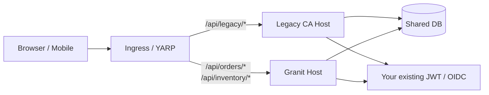

[Ardalis' Clean Architecture template](https://github.com/ardalis/CleanArchitecture)
(`ardalis/CleanArchitecture`) is the most influential .NET DDD starter
on GitHub. If your codebase descends from it, you have a clear
four-project layout (`Core`, `UseCases`, `Infrastructure`, `Web`),
explicit aggregate roots with domain events, MediatR-based CQRS, the
Result pattern via `Ardalis.Result`, and the Specification pattern via
`Ardalis.Specification`. What you almost certainly **do not** have
out-of-the-box: multi-tenancy, audit logging, identity, settings,
background-job orchestration, notification channels — the template
leaves those to you.

This makes the Ardalis → Granit migration a different exercise from
[ABP](/migrating-from/abp/) or
[FullStackHero](/migrating-from/fullstackhero/). The DDD primitives
port almost line-for-line. The CQRS dispatcher swaps from MediatR to
Wolverine. The Specification port is trivial. And every cross-cutting
concern you wrote yourself becomes a Granit module you consume — a
**net gain**, not a swap.

## Before you commit

Granit is **the right choice** when:

- You started from Ardalis CA, then spent six-to-twelve months
  building your own multi-tenancy, audit, identity, settings,
  notification, and background-job layers. **Granit ships those as
  versioned modules.** Most of your migration is *deletion* of code
  you wrote yourself.
- You want to keep the DDD discipline — aggregate roots, value
  objects, domain events, private setters, factory methods — that
  Ardalis taught you. **Granit enforces those exact conventions** via
  architecture tests and Roslyn analyzers (`Create` factory required,
  no public setters on aggregates, private collections, etc.).
- Your roadmap has hit features the template deliberately leaves out:
  **OIDC federation, BFF + DPoP, GDPR/CCPA compliance, multi-channel
  notifications, AI integration, MCP server**.
- You want Wolverine's transactional outbox and scheduled messages in
  place of MediatR + a hand-rolled background-job scheduler.

Granit is **not** the right choice when:

- Your team **loves the Result pattern** (`Result<T>` /
  `Result.Success` / `Result.NotFound`) for endpoint return types.
  Granit returns via `TypedResults` and HTTP status codes; there is
  no built-in `Result<T>`. You can keep `Ardalis.Result` as a NuGet
  reference, but the framework idioms don't use it.
- You **ship with FastEndpoints** and your team's mental model is
  endpoint-per-class with `Configure()` / `HandleAsync()`. Granit's
  endpoint convention is static handlers registered in a
  `MapGranitXxx()` extension method. The migration changes the
  endpoint *shape*, not just the wiring.
- Your application is **genuinely simple** — one bounded context, no
  multi-tenancy, no audit requirement, no identity, no events. The
  Ardalis template is enough; Granit's depth is overhead you will
  not amortize.

### Licensing

Both projects are permissive open-source — there is no SCA-friction
argument here:

| | License | What that means |
| --- | --- | --- |
| **Ardalis Clean Architecture** | **MIT** | Maximally permissive. Auto-approved by every SCA pipeline. |
| **Granit** | **Apache-2.0** | Permissive with an explicit patent grant — a slightly stronger legal posture for enterprise, but not a decisive factor. |

Sell the migration on **what Ardalis CA deliberately doesn't ship**
(everything cross-cutting) rather than on licensing. If your team
genuinely uses only the four template projects with no added
cross-cutting, the answer is probably to stay on the template until
that changes.

## Conceptual mapping

| Ardalis CA primitive | Granit equivalent | Notes |
| --- | --- | --- |
| Four projects (`Core`, `UseCases`, `Infrastructure`, `Web`) | One project per module (`Granit.Inventory`), optionally a sibling `.EntityFrameworkCore` package | Vertical-slice modules rather than horizontal layers. The `Core` / `UseCases` split disappears. |
| `BaseEntity<TId>` (generic) | `Entity` (fixed `Guid Id`) | Granit fixes `Id` as `Guid`. If your Ardalis entities use `int`, see the [key-rewrite recipe](/migrating-from/abp/#if-your-abp-app-uses-int--long-keys) in the ABP guide. |
| `EntityBase`, `HasDomainEventsBase` | `CreationAuditedAggregateRoot`, `AuditedAggregateRoot`, `FullAuditedAggregateRoot` — all implement `IDomainEventSource` | Domain-event support comes from the aggregate base, not a separate marker interface. |
| `IAggregateRoot` (marker) | `AggregateRoot` (base class) — or one of the `AuditedAggregateRoot` variants | Granit enforces "aggregate roots only" through architecture tests on writes. |
| Domain events via `RegisterDomainEvent(...)` | `AddDomainEvent(...)` on `IDomainEventSource`-implementing aggregates | Same model. Dispatched post-commit. |
| MediatR `IRequest<TResponse>` + `IRequestHandler<TReq, TRes>` | For reads: `IXxxReader` interface injected into endpoints. For writes: Wolverine handler invoked via `IMessageBus.InvokeAsync<TR>(command)` | Granit splits at the DI boundary instead of going through a mediator. |
| `INotificationHandler<TEvent>` (in-process domain event handler) | Wolverine handler (free function: `Handle(event, deps, ct)`) | Discovered via `[assembly: WolverineHandlerModule]`. |
| `Ardalis.Result<T>` (`Result.Success`, `Result.NotFound`, `Result.Invalid`) | `TypedResults` + HTTP status codes + RFC 7807 ProblemDetails | No direct equivalent. See "What Granit does not replace" below. |
| `Ardalis.Specification` (`Specification<T>`, `BaseSpecification<T>`) | `Granit.Persistence.Specification<T>` (named, reusable) and `Spec.For<T>()` (inline, fluent) | Direct port. Granit's variant is persistence-agnostic (EF Core / MongoDB LINQ / in-memory) and supports projection via `Specification<T, TResult>`. |
| `IRepository<T>` / `IReadRepository<T>` (Ardalis.Specification flavor) | Custom `IXxxReader` / `IXxxWriter` per aggregate **or** `DbSet<T>` directly | Granit has no generic repository contract. The Reader/Writer split is the convention across every shipped Granit module. |
| FluentValidation (manually wired or via MediatR behavior) | `AddGranitValidatorsFromAssemblyContaining<T>()` + `FluentValidationAutoEndpointFilter` (auto-applied to endpoint groups) | Validators discovered automatically; the filter runs before the handler and returns 422 on failure. |
| **FastEndpoints** endpoints (`Endpoint<TReq,TRes>` with `Configure()` / `HandleAsync()`) | Static methods registered via `MapGroup` + `MapGet`/`MapPost` + `RequireAuthorization` | Different endpoint *shape*. The `Request`/`Response` records port verbatim; the class wrapping changes. |
| **Multi-tenancy** | `Granit.MultiTenancy` (`ICurrentTenant`, `IMultiTenant`, three strategies: shared / schema / database) | **Net gain.** Ardalis CA ships none. |
| **Identity** | `Granit.Identity.Local` (OpenIddict OIDC server) or `Granit.Identity.Federated.{Keycloak,EntraId,Cognito,GoogleCloud}` | **Net gain.** Ardalis CA expects you to wire ASP.NET Identity or another IdP yourself. |
| **Audit logging** | `GranitAuditingModule` — `AuditEntry` rows + per-entity change snapshots, populated via interceptor | **Net gain.** Ardalis CA ships none. |
| **Settings** (DB-backed, tenant-aware) | `GranitSettingsModule` (`ISettingProvider`, `ISettingManager`) | **Net gain.** Ardalis CA uses `IOptions<T>` and `appsettings.json` only. |
| **Notifications** (email + multi-channel) | `Granit.Notifications` (9 channels: email, SMS, push, in-app, webhook, Slack, Teams, …) with preference filtering | **Net gain.** Ardalis CA ships none — you typically wire MailKit/SendGrid yourself. |
| **Background jobs** (Hangfire, Quartz, custom) | Wolverine scheduled / durable messages | **Net gain.** One primitive for immediate, scheduled, and durable work; no separate dashboard. |
| **Localization** | `Granit.Localization` (17 cultures, source-generated keys, runtime DB overrides) | **Net gain.** Ardalis CA uses `IStringLocalizer` vanilla. |
| **Webhooks** (sending, signing, retries) | `Granit.Webhooks` (dual-key signing, secret protection, durable delivery) | **Net gain.** Ardalis CA ships none. |
| Domain-event dispatch wired in `SaveChangesAsync` (manual) | `Granit.Persistence.EntityFrameworkCore` ships the interceptor — no wiring needed | One less piece of infrastructure code to maintain. |

The pattern: **about half the table is direct ports, the other half is
Ardalis CA leaving the door open and Granit walking through it**.

## The cutover model

Ardalis CA apps are typically smaller than ABP or FSH apps — often a
single web project, a single database, a handful of modules.
A **direct rewrite** within the same solution is realistic in many
cases. The strangler-fig pattern still applies for larger codebases
or when you want to ship continuously through the migration.



The shared-database rule from the other migration guides applies:
schema ownership belongs to the host that wrote the table first;
audit/tenant columns need to keep the same shape during cutover.
Because Ardalis CA has **no opinionated audit columns** (the template
ships none — you added them, or didn't), this is rarely a friction
point. Most Ardalis CA columns map to Granit's
`CreatedAt`/`CreatedBy`/`ModifiedAt`/`ModifiedBy` directly when the
fields exist; when they don't, Granit's interceptor starts populating
new rows and existing rows keep whatever they had.

## Phase 0 — Inventory and decide

Two artifacts before you start:

1. **A list of every NuGet you added on top of the template.** Hangfire,
   MailKit, Serilog, JWT libraries, Finbuckle, your tenancy/audit
   helpers, your identity glue — anything in `Infrastructure/*.csproj`
   that wasn't in the Ardalis upstream. **Each one is a candidate for
   removal** once the equivalent Granit module is in.
2. **A list of every `IRequestHandler` / `INotificationHandler` in
   `UseCases`.** This is the porting workload. Each handler becomes
   either (a) a method on an `IXxxReader` / `IXxxWriter`, or (b) a
   Wolverine handler. Most read handlers collapse straight to endpoint
   handlers with no MediatR indirection.

A reasonable porting order:

1. **A leaf read module** (one aggregate, GET-only, no events) — proves
   the host, the reader pattern, and the build pipeline.
2. **A module with writes + audit** — exercises
   `AuditedEntityInterceptor` and the Wolverine write-side handler.
3. **A module with domain events** — first Wolverine event dispatch.
4. **Cross-cutting consolidation** — delete your hand-rolled
   audit/settings/notification/jobs code, replace with the Granit
   modules. This is the part of the migration where the line count
   drops fastest.
5. **Identity** — usually the last cut, because your tokens keep
   working on both hosts in the meantime.

For entities using `int` / `long` keys (Ardalis CA's
`BaseEntity<TId>` is generic, but most users default to `Guid`), the
one-shot UUID v5 SQL recipe lives in the
[ABP guide's Phase 0](/migrating-from/abp/#if-your-abp-app-uses-int--long-keys).

## Phase 1 — Stand up a Granit host

If you choose the strangler-fig route, create a separate Granit host
project that targets the same database and the same JWT issuer:

```bash
dotnet new granit-microservice -n MyApp.GranitHost
```

```csharp
using Granit.Extensions;

var builder = WebApplication.CreateBuilder(args);
await builder.AddGranitAsync<MyAppHostModule>();
var app = builder.Build();
await app.UseGranitAsync();
app.Run();
```

```csharp
using Granit.Modularity;
using Granit.Persistence.EntityFrameworkCore;
using Granit.Authorization;

[DependsOn(
    typeof(GranitPersistenceEntityFrameworkCoreModule),
    typeof(GranitAuthorizationModule))]
public sealed class MyAppHostModule : GranitModule
{
    public override void ConfigureServices(ServiceConfigurationContext context)
    {
        context.Services.AddHealthChecks();
    }
}
```

If you choose the **in-place rewrite**, skip this phase. Drop the
Granit packages into your `Web` project, rename it to your eventual
host name, and start porting `UseCases` into a new top-level
`Modules/` folder one module at a time.

## Phase 2 — Port your first module

Same module as the other migration guides for symmetry — **Inventory**,
a CRUD aggregate with domain events, validation, and a Specification.

### The Ardalis CA module — before

```csharp
// Core/Inventory/InventoryItem.cs
public sealed class InventoryItem : EntityBase<Guid>, IAggregateRoot
{
    public string Name { get; private set; } = default!;
    public string Sku { get; private set; } = default!;
    public int Quantity { get; private set; }
    public decimal UnitPrice { get; private set; }

    private InventoryItem() { }

    public InventoryItem(string name, string sku, int quantity, decimal unitPrice)
    {
        Name = name; Sku = sku; Quantity = quantity; UnitPrice = unitPrice;
        RegisterDomainEvent(new InventoryItemCreated(Id, Sku));
    }
}
```

```csharp
// Core/Inventory/Specifications/ActiveInventoryItemsSpec.cs
public sealed class ActiveInventoryItemsSpec : Specification<InventoryItem>
{
    public ActiveInventoryItemsSpec()
    {
        Query.Where(i => i.Quantity > 0).OrderBy(i => i.Sku);
    }
}
```

```csharp
// UseCases/Inventory/Create/CreateInventoryItemCommand.cs
public sealed record CreateInventoryItemCommand(
    string Name, string Sku, int Quantity, decimal UnitPrice)
    : IRequest<Result<Guid>>;

public sealed class CreateInventoryItemValidator
    : AbstractValidator<CreateInventoryItemCommand>
{
    public CreateInventoryItemValidator()
    {
        RuleFor(x => x.Name).NotEmpty().MaximumLength(200);
        RuleFor(x => x.Sku).NotEmpty().MaximumLength(50);
        RuleFor(x => x.Quantity).GreaterThanOrEqualTo(0);
        RuleFor(x => x.UnitPrice).GreaterThan(0);
    }
}

public sealed class CreateInventoryItemHandler(IRepository<InventoryItem> repo)
    : IRequestHandler<CreateInventoryItemCommand, Result<Guid>>
{
    public async Task<Result<Guid>> Handle(
        CreateInventoryItemCommand cmd, CancellationToken ct)
    {
        var item = new InventoryItem(cmd.Name, cmd.Sku, cmd.Quantity, cmd.UnitPrice);
        await repo.AddAsync(item, ct);
        return Result.Success(item.Id);
    }
}
```

```csharp
// Web/Endpoints/Inventory/Create.cs (FastEndpoints flavor)
public sealed class Create : Endpoint<CreateInventoryItemCommand, Guid>
{
    private readonly IMediator _mediator;
    public Create(IMediator mediator) => _mediator = mediator;

    public override void Configure()
    {
        Post("/inventory");
        Permissions("Inventory.Create");
    }

    public override async Task HandleAsync(
        CreateInventoryItemCommand req, CancellationToken ct)
    {
        var result = await _mediator.Send(req, ct);
        if (!result.IsSuccess) await SendErrorsAsync(cancellation: ct);
        else await SendCreatedAtAsync<GetById>(new { id = result.Value }, result.Value, cancellation: ct);
    }
}
```

Plus a `NotificationHandler` for the domain event, plus the
`Infrastructure` wiring that hooks `RegisterDomainEvent` into
MediatR's `IPublisher` after `SaveChanges`.

### The Granit module — after

```csharp
// Granit.Inventory/Domain/InventoryItem.cs
using Granit.Domain;
using Granit.MultiTenancy;

namespace Granit.Inventory.Domain;

public sealed class InventoryItem : AuditedAggregateRoot, IMultiTenant
{
    public Guid? TenantId { get; private set; }
    public string Name { get; private set; } = default!;
    public string Sku { get; private set; } = default!;
    public int Quantity { get; private set; }
    public decimal UnitPrice { get; private set; }

    private InventoryItem() { }

    public static InventoryItem Create(Guid id, Guid? tenantId, string name,
        string sku, int quantity, decimal unitPrice)
    {
        var item = new InventoryItem
        {
            Id = id, TenantId = tenantId,
            Name = name, Sku = sku, Quantity = quantity, UnitPrice = unitPrice,
        };
        item.AddDomainEvent(new InventoryItemCreated(item.Id, item.Sku));
        return item;
    }
}
```

```csharp
// Granit.Inventory/Specifications/ActiveInventoryItemsSpec.cs
using Granit.Persistence;

namespace Granit.Inventory.Specifications;

public sealed class ActiveInventoryItemsSpec : Specification<InventoryItem>
{
    public ActiveInventoryItemsSpec()
    {
        Where(i => i.Quantity > 0);
        OrderBy(i => i.Sku);
    }
}
```

```csharp
// Granit.Inventory/Endpoints/InventoryEndpoints.cs
using Microsoft.AspNetCore.Http.HttpResults;
using Microsoft.AspNetCore.Routing;
using Granit.Inventory.Domain;
using Wolverine;

namespace Granit.Inventory.Endpoints;

public sealed record InventoryItemCreateRequest(
    string Name, string Sku, int Quantity, decimal UnitPrice);

public sealed record InventoryItemResponse(
    Guid Id, string Name, string Sku, int Quantity, decimal UnitPrice,
    DateTimeOffset CreatedAt);

public sealed record CreateInventoryItem(
    string Name, string Sku, int Quantity, decimal UnitPrice);

public static class InventoryEndpoints
{
    public static IEndpointRouteBuilder MapGranitInventory(
        this IEndpointRouteBuilder app)
    {
        var group = app.MapGroup("/inventory")
            .WithTags("Inventory")
            .RequireAuthorization("inventory.read");

        group.MapGet("/{id:guid}", GetById);
        group.MapPost("/",         Create).RequireAuthorization("inventory.create");
        // Update, Delete follow the same shape.
        return app;
    }

    public static async Task<Results<Ok<InventoryItemResponse>, NotFound>>
        GetById(Guid id, IInventoryItemReader reader, CancellationToken ct)
    {
        var item = await reader.FindAsync(id, ct);
        return item is null
            ? TypedResults.NotFound()
            : TypedResults.Ok(ToResponse(item));
    }

    public static async Task<Created<InventoryItemResponse>> Create(
        InventoryItemCreateRequest request,
        IMessageBus bus,
        CancellationToken ct)
    {
        var id = await bus.InvokeAsync<Guid>(
            new CreateInventoryItem(request.Name, request.Sku,
                request.Quantity, request.UnitPrice),
            ct);
        return TypedResults.Created($"/inventory/{id}",
            new InventoryItemResponse(id, request.Name, request.Sku,
                request.Quantity, request.UnitPrice, DateTimeOffset.UtcNow));
    }

    private static InventoryItemResponse ToResponse(InventoryItem i) =>
        new(i.Id, i.Name, i.Sku, i.Quantity, i.UnitPrice, i.CreatedAt);
}
```

```csharp
// Granit.Inventory/Handlers/CreateInventoryItemHandler.cs
using Granit.Inventory.Domain;
using Granit.MultiTenancy;
using Granit.Inventory.Endpoints;

namespace Granit.Inventory.Handlers;

public static class CreateInventoryItemHandler
{
    public static async Task<Guid> Handle(
        CreateInventoryItem cmd,
        IInventoryItemWriter writer,
        ICurrentTenant currentTenant,
        CancellationToken ct)
    {
        var item = InventoryItem.Create(
            Guid.NewGuid(), currentTenant.Id,
            cmd.Name, cmd.Sku, cmd.Quantity, cmd.UnitPrice);
        await writer.AddAsync(item, ct);
        return item.Id;
    }
}
```

```csharp
// Granit.Inventory/GranitInventoryModule.cs
using Granit.Modularity;
using Granit.Persistence.EntityFrameworkCore;
using Granit.Authorization;
using Granit.Validation.Extensions;

[assembly: Wolverine.Attributes.WolverineHandlerModule]

namespace Granit.Inventory;

[DependsOn(
    typeof(GranitPersistenceEntityFrameworkCoreModule),
    typeof(GranitAuthorizationModule))]
public sealed class GranitInventoryModule : GranitModule
{
    public override void ConfigureServices(ServiceConfigurationContext context)
    {
        context.Services
            .AddScoped<IInventoryItemReader, InventoryItemReader>()
            .AddScoped<IInventoryItemWriter, InventoryItemWriter>()
            .AddGranitValidatorsFromAssemblyContaining<GranitInventoryModule>();

        context.Services
            .AddAuthorizationBuilder()
                .AddPolicy("inventory.read",   p => p.RequireClaim("permission", "Inventory.View"))
                .AddPolicy("inventory.create", p => p.RequireClaim("permission", "Inventory.Create"));
    }
}
```

The validator is the same `InventoryItemCreateRequestValidator` shown
in the other migration guides — port the rules verbatim from the
Ardalis version.

### What the diff highlights

| Aspect | Ardalis CA | Granit |
| --- | --- | --- |
| **Number of projects** | 4 (`Core`, `UseCases`, `Infrastructure`, `Web`) | 1-2 per module (`Granit.Inventory`, optionally `.EntityFrameworkCore`) |
| **CQRS dispatcher** | MediatR (`IMediator.Send(...)`) | Interface-level for reads (`IInventoryItemReader`) + Wolverine for writes (`IMessageBus.InvokeAsync<TR>`) |
| **Endpoint convention** | FastEndpoints (`Endpoint<TReq,TRes>` + `Configure()`) or MediatR-via-controllers | Static handlers + `MapGroup` + `MapGet`/`MapPost` |
| **Return type** | `Result<T>` (`Result.Success`, `Result.NotFound`, …) | `Results<Ok<T>, NotFound>` + RFC 7807 ProblemDetails on errors |
| **Validation wiring** | FluentValidation + MediatR pipeline behavior | FluentValidation + `FluentValidationAutoEndpointFilter` (auto-applied) |
| **Specifications** | `Ardalis.Specification` | `Granit.Persistence.Specification<T>` + inline `Spec.For<T>()` |
| **Domain event dispatch** | Hand-wired in `SaveChangesAsync` → MediatR `IPublisher` | Wired by `Granit.Persistence.EntityFrameworkCore` interceptor; raised post-commit; consumed by Wolverine handlers |
| **Audit fields** | You wrote them yourself, or skipped | Inherited from `AuditedAggregateRoot` (and populated by interceptor) |
| **Multi-tenancy** | You wrote it yourself, or skipped | `IMultiTenant` interface + `Granit.MultiTenancy` module |
| **Identity / authorization** | You wired ASP.NET Identity or a JWT library yourself | `Granit.Identity.Local` or `Granit.Identity.Federated.*` + ASP.NET Core policies |

The total project count drops sharply (4 → 1-2 per module), but the
bigger win is that you stop maintaining the audit interceptor, the
domain-event dispatcher, the tenancy plumbing, the settings store,
the notification fan-out, and the background-job scheduler. Each was
a few hundred lines of glue code you wrote, owned, and had to keep
in sync with framework upgrades. They become framework code.

## Phase 3 — Cross-cutting features

For Ardalis CA migrations, this is mostly a **deletion exercise**:
your hand-rolled cross-cutting becomes a Granit module reference.

### Multi-tenancy

Ardalis CA does not ship multi-tenancy. If you bolted it on (either
via Finbuckle or a custom `ITenantContext`), replace with
`Granit.MultiTenancy`:

- Mark tenant-aware entities with `IMultiTenant` (interface name
  preserved if you used Finbuckle).
- Inject `ICurrentTenant` (`Id`, `Name`, `Change(id)` for scoped
  override) instead of your `ITenantContext` / `ITenantInfo`.
- Pick a strategy in `appsettings.json`: shared / schema / database.

See [Configure multi-tenancy](/dotnet/guides/configure-multi-tenancy/).

### Identity

Ardalis CA does not ship identity. Whatever you wired (ASP.NET
Identity, a JWT library, Auth0, Keycloak) becomes one of:

- `Granit.Identity.Local` — OpenIddict-backed OIDC server. Replaces
  ASP.NET Identity + a hand-rolled `TokenService`.
- `Granit.Identity.Federated.{Keycloak,EntraId,Cognito,GoogleCloud}` —
  if you already use one of these IdPs, swap your JWT bearer config
  for the matching Granit package.
- Keep your existing JWT setup unchanged and just point Granit at the
  same issuer. Granit consumes any standards-compliant JWT.

### Audit logging

Ardalis CA does not ship audit. Adding `GranitAuditingModule` writes
`AuditEntry` rows for every entity change on opted-in modules, with
per-property change snapshots, IP / user agent / correlation ID, and a
configurable audit category. Replaces any `IAuditWriter` /
`AuditableEntitySaveChangesInterceptor` you wrote.

### Settings

Replace `IOptions<MySettings>` + reload-on-change file watchers with
`ISettingProvider.GetOrNullAsync(name)` — DB-backed, tenant-aware,
cascading (default → global → tenant → user). Strongly-typed accessors
are written per setting:

```csharp
// Ardalis CA + IOptions
public sealed class InventorySettings
{
    public int LowStockThreshold { get; init; }
}
services.Configure<InventorySettings>(config.GetSection("Inventory"));

// Granit
var raw = await settingProvider.GetOrNullAsync("Inventory.LowStockThreshold");
var threshold = int.Parse(raw ?? "0");
```

`IOptions<T>` still works for boot-time configuration; the Granit
settings module is for **runtime-mutable, per-tenant overrides** —
things you want to change without a redeploy.

### Domain events and messaging

In Ardalis CA you typically:

1. Call `entity.RegisterDomainEvent(new Foo(...))`.
2. Override `SaveChangesAsync` (or use an interceptor) to publish via
   `IPublisher.Publish(@event)` after persistence succeeds.
3. Write `INotificationHandler<Foo>` classes for each event.

In Granit:

1. Call `entity.AddDomainEvent(new Foo(...))` on an
   `IDomainEventSource`-implementing aggregate (any of the audited
   aggregate roots).
2. The interceptor in `Granit.Persistence.EntityFrameworkCore`
   dispatches via Wolverine post-commit. You write zero wiring.
3. Handlers are free functions:

```csharp
public static class InventoryItemCreatedHandler
{
    public static Task Handle(
        InventoryItemCreated msg, INotificationSender sender, CancellationToken ct)
        => sender.NotifyAsync(/* ... */, ct);
}
```

For events that must cross a process boundary, use
`AddDistributedEvent(...)` with a `*Eto` payload — Wolverine persists
to the transactional outbox and ships over RabbitMQ / Kafka / Azure
Service Bus.

### Background jobs

Replace Hangfire (or whatever you wired) with Wolverine scheduled
messages:

```csharp
// Ardalis CA + Hangfire
BackgroundJob.Schedule<IEmailService>(s => s.SendAsync(args), TimeSpan.FromMinutes(5));

// Granit + Wolverine
await bus.ScheduleAsync(new SendEmail(args), TimeSpan.FromMinutes(5));
```

Same delivery guarantees (durable, retry, dead-letter), one fewer
dashboard to deploy.

### Specifications

Direct port. `Ardalis.Specification` reads almost identically to
`Granit.Persistence.Specification<T>`:

```csharp
// Ardalis
public sealed class ActiveItemsSpec : Specification<InventoryItem>
{
    public ActiveItemsSpec(Guid tenantId)
    {
        Query.Where(i => i.Quantity > 0 && i.TenantId == tenantId)
             .OrderBy(i => i.Sku);
    }
}

// Granit
public sealed class ActiveItemsSpec : Specification<InventoryItem>
{
    public ActiveItemsSpec(Guid tenantId)
    {
        Where(i => i.Quantity > 0 && i.TenantId == tenantId);
        OrderBy(i => i.Sku);
    }
}
```

Inline variant via `Spec.For<T>()`, projection via
`Specification<T, TResult>`, persistence-agnostic evaluator
(EF Core / MongoDB LINQ / in-memory).

## Phase 4 — Decommission the legacy host

When every Ardalis CA module has a Granit counterpart:

1. **Remove the NuGets you no longer need**: `MediatR`,
   `Ardalis.Specification` (replaced by `Granit.Persistence`),
   `FastEndpoints` (replaced by static handlers), `Hangfire`,
   `MailKit`/`SendGrid` (replaced by `Granit.Notifications`), your
   tenancy/audit helpers, your JWT library.
2. **Delete the `Core` / `UseCases` / `Infrastructure` / `Web` split**
   if you went the in-place rewrite route. Modules live as their own
   projects now.
3. **Drop your hand-rolled cross-cutting code** — the audit
   interceptor, the domain-event dispatcher, the tenant context,
   the settings store, the notification service, the background-job
   plumbing. Several thousand lines typically go.
4. **Update the ingress** to remove legacy routing rules (only
   applies to the strangler-fig route).

Archive the legacy solution for one release cycle.

## What Granit does not replace

Three things in the Ardalis CA toolkit have no equivalent in Granit:

- **`Ardalis.Result<T>`** (the Result pattern: `Result.Success`,
  `Result.NotFound`, `Result.Invalid`, `Result.Forbidden`). Granit
  uses `TypedResults` and HTTP status codes for endpoint returns, and
  exceptions for bounded "this can't happen here" cases. You can keep
  `Ardalis.Result` as a NuGet dependency and use it inside handlers
  for control flow, but the framework idioms don't compose with it.
- **FastEndpoints (the framework).** Granit's endpoint convention is
  static handlers + `MapGroup`. If your team's mental model is
  endpoint-per-class with `Configure()` / `HandleAsync()`, the
  ergonomic gap will be felt. You *can* run FastEndpoints alongside
  Granit endpoints in the same host (they coexist on the same
  `IEndpointRouteBuilder`), but the shipped Granit modules don't use
  them, so the inconsistency will accumulate.
- **The "one example app to learn DDD from" feel.** Ardalis CA is
  consciously a teaching template — well-commented, intentionally
  small, every choice defensible in a screencast. Granit is a
  production framework — every choice optimized for an enterprise
  team's third year of operation, not a developer's first reading.
  Learning Granit involves reading more code; the trade-off pays back
  once the application is in production.

## FAQ

**Do I have to abandon the four-project layout?**
No. Nothing in Granit prevents you from keeping `Core` / `UseCases` /
`Infrastructure` / `Web` as a *module-internal* organization — but the
convention across every shipped Granit module is to collapse them.
A typical Granit module has `Domain/`, `Endpoints/`, `Handlers/`,
optionally `Internal/` for persistence — flat folders inside one
project. The four-project ceremony was Ardalis enforcing layer
boundaries through assembly references; Granit enforces them through
architecture tests and Roslyn analyzers, so the assembly split is
optional.

**Can I keep MediatR during the cutover?**
Yes — `MediatR` is just a NuGet. You can use it inside a Granit
module for handlers that haven't been ported yet. The recommended
direction is to migrate to Wolverine over time (or simply to direct
method calls for the read side via `IXxxReader`), but there is no
forced cut.

**Can I keep `Ardalis.Specification`?**
Yes, technically, but `Granit.Persistence.Specification<T>` is so
close to a drop-in replacement that the only reason to keep
`Ardalis.Specification` is if you have a specification base class
with project-specific helpers that you don't want to port. The
Granit version adds persistence-agnostic evaluation and projection
that the Ardalis version doesn't, so most teams swap.

**How long does a typical migration take?**
A team of two engineers familiar with both stacks ports a leaf
module in 1-2 days, a non-trivial module with events and a
Specification in 2-3 days, and a typical mid-sized Ardalis CA
solution (5-10 modules + the cross-cutting deletion exercise) in
4-6 weeks running in parallel with feature work. **Faster than ABP
or FSH migrations** because Ardalis CA ships less for you to port.

## Next steps

- [Create a module](/dotnet/guides/create-a-module/) — the canonical
  Granit module structure
- [Add an endpoint](/dotnet/guides/add-an-endpoint/) — Minimal API
  conventions used in this guide
- [Configure multi-tenancy](/dotnet/guides/configure-multi-tenancy/) —
  for teams adding tenancy as part of the migration
- [Wolverine messaging](/dotnet/infrastructure/wolverine-messaging/) —
  the replacement for MediatR + your background-job library
- [Migrating from ABP Framework](/migrating-from/abp/) — sister guide;
  shares the `int`/`long` key rewrite recipe
- [Migrating from FullStackHero](/migrating-from/fullstackhero/) —
  sister guide; covers Finbuckle multi-tenancy and ASP.NET Identity
  paths in more depth
