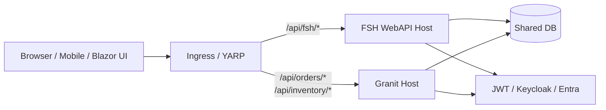

[FullStackHero](https://github.com/fullstackhero/dotnet-starter-kit) and
[Granit](https://granit-fx.dev) sit at the two ends of the .NET-modular
spectrum. FullStackHero is a **template you fork** — you clone the repo,
the 11 Building Blocks and 4 modules become *your* code, and you own
every line forever. Granit is a **package ecosystem** — you install
NuGets, declare dependencies via `[DependsOn]`, and framework updates
arrive via `dotnet outdated`.

The honest framing of this migration: you forked FullStackHero
N months ago, your fork has drifted from upstream, and you are
maintaining glue code that Granit ships as versioned packages. The
migration trades one set of trade-offs (template ownership, free
customization, slow upstream churn) for another (package discipline,
opinionated defaults, fast framework updates).

For an architectural side-by-side comparison without the migration
mechanics, see the
[FullStackHero vs Granit blog post](/blog/fullstackhero-vs-granit/) —
this guide assumes you have already read it (or already decided).

## Before you commit

The two are not equivalent. Granit is **the right choice** when:

- The 11 Building Blocks of your fork have started to **diverge from
  upstream** and you cannot easily pull bug fixes. The maintenance cost
  is silent until it isn't.
- Your team has grown past the point where everyone has the framework
  internals in their head. **Package boundaries and architecture tests
  enforce what reviewers used to enforce by reading the diff.**
- Your roadmap has hit a feature FullStackHero deliberately leaves out:
  **OIDC federation, BFF + DPoP, GDPR/CCPA compliance, schema-per-tenant
  multi-tenancy, AI integration, MCP server**.
- You want **Wolverine** rather than RabbitMQ-via-custom-outbox.
  Wolverine collapses local events, distributed events, and scheduled
  jobs into one primitive with built-in transactional outbox and
  policy-driven retries.

Granit is **not** the right choice when:

- You ship a **standalone product** with the FullStackHero Blazor +
  MudBlazor UI and that UI is what your users love. Granit's React
  companion is a different stack — migrating an FSH Blazor app is a
  separate project.
- You value **.NET Aspire's local dashboard** (`dotnet run` → Postgres,
  Redis, OTLP, your API, and your UI orchestrated automatically) and
  don't want to set up Docker Compose. Granit supports Aspire, but
  FSH's AppHost is genuinely best-in-class out of the box.
- You **like owning the framework code in your repo**. With Granit,
  framework internals live in NuGets — you can patch via package
  forks, but the default is to consume.
- Your compliance ceiling is **audit + soft delete**, you have one
  database per tenant, and your team is two people. The FSH defaults
  fit, and Granit's depth is overhead you will not amortize.

### Licensing — the inverse of the ABP argument

Unlike the [ABP migration](/migrating-from/abp/) where the LGPL → Apache-2.0
move is a procurement win, both frameworks here are equally permissive:

| | License | What that means |
| --- | --- | --- |
| **FullStackHero** | **MIT** | Maximally permissive. Use, fork, embed, sell — no obligations beyond preserving the copyright notice. Auto-approved by every SCA pipeline. |
| **Granit** | **Apache-2.0** | Permissive with an explicit patent grant. Also auto-approved by every SCA pipeline. The patent grant is a stronger legal posture for enterprise — relevant in regulated industries — but not a decisive factor for most teams. |

So the migration cannot be sold on license grounds. It has to be sold
on **maintenance cost** (you stop forking Building Blocks) and
**capability ceiling** (you unlock GDPR/OIDC/BFF/AI/MCP that FSH does
not aim to provide). Frame the project that way internally — anything
else and the team will reasonably ask "why are we doing this?".

## Conceptual mapping

| FullStackHero primitive | Granit equivalent | Notes |
| --- | --- | --- |
| `IModule` registered via `builder.AddModules(typeof(IdentityModule).Assembly, ...)` | `GranitModule` + `[DependsOn(typeof(...))]` + `builder.AddGranitAsync<HostModule>()` | Topological load order, conditional `IsEnabled`, lifecycle hooks. |
| **11 Building Blocks** projects (Core, Persistence, Eventing, …) inside your repo | Versioned NuGet packages (`Granit`, `Granit.Persistence`, `Granit.Wolverine`, …) | The Building Blocks are no longer your code — they ship as updates. |
| `Mediator` (Othamar source-gen): `IQuery<TR>` + `IQueryHandler<Q,TR>` | `IXxxReader` + `IXxxWriter` interfaces injected into endpoints | Granit's CQRS is **interface-level**, no dispatcher. The query side is a `Reader`; the write side a `Writer` or a Wolverine handler. |
| `ICommand<TR>` + `ICommandHandler<C,TR>` (write-side handlers) | Wolverine handler (free function) invoked via `IMessageBus.InvokeAsync<TR>(command)` | Wolverine replaces Mediator's dispatch for write-side and event-side handlers. |
| `IPublisher.Publish(@event)` (in-process events via Mediator) | Wolverine `bus.PublishAsync(@event)` — same shape, plus transport, retry, outbox | Granit's `IDomainEventSource.AddDomainEvent(...)` raises post-commit; integration events use `AddDistributedEvent(...)`. |
| `BaseEntity<TId>` / `AggregateRoot<TId>` (generic key) | `Entity` / `AggregateRoot` / `AuditedAggregateRoot` (fixed `Guid Id`) | Granit fixes `Id` as `Guid`. If your FSH entities use `int`/`long`, see the key-rewrite note below. |
| `IAuditableEntity` (CreatedBy/ModifiedBy on opt-in entities) | `CreationAuditedEntity` / `AuditedEntity` / `FullAuditedEntity` base classes | Same effect via inheritance instead of marker interface. Populated by `AuditedEntityInterceptor`. |
| `ISoftDeletable` | `ISoftDeletable` (interface name preserved) — usually via `FullAuditedEntity` | Same name. EF Core query filter applied automatically when the module opts in. |
| `Ardalis.Specification` (`ISpecification<T>`) | `Granit.Persistence.Specification<T>` + inline `Spec.For<T>()` | Near-identical fluent API (`Where`, `OrderBy`, `Limit`). Granit's variant is persistence-agnostic (EF Core, MongoDB LINQ, in-memory) and supports server-side projection via `Specification<T, TResult>`. |
| **`AppDbContext`** (shared base context hierarchy) | **One isolated `DbContext` per module** | The biggest structural change. Cross-module `JOIN` becomes impossible by design — communicate via events instead. |
| `Finbuckle.MultiTenant` (`ITenantInfo`, `AppTenantInfo`, database-per-tenant default) | `Granit.MultiTenancy` (`ICurrentTenant`, `Tenant` entity, three strategies: shared / schema / database) | Granit re-implements multi-tenancy rather than wrapping Finbuckle. The shared-database strategy adds a `TenantId` discriminator + automatic query filter. |
| ASP.NET Identity + custom `TokenService` (JWT issuance) | `Granit.Identity` (local, OpenIddict-backed) **or** `Granit.Identity.Federated.{Keycloak,EntraId,Cognito,GoogleCloud}` (delegate to an external IdP) | Granit's local variant is a full OIDC server. The federated variants offload identity to a managed IdP and consume tokens. |
| `SimpleBffAuth` (Blazor cookie sessions) | `Granit.Bff` (YARP-based BFF with DPoP and PAR support) | The conceptual pattern is the same; Granit's variant adds RFC 9449 (DPoP) and RFC 9126 (PAR) for FAPI 2.0 compliance. |
| Permissions: roles + permission claims, checked in handlers | ASP.NET Core authorization policies declared per-endpoint + `Granit.Authorization` (`[Group].[Resource].[Action]` permission grammar) | Same data shape, different enforcement point. |
| Mediator validation behavior (FluentValidation pipeline) | `AddGranitValidatorsFromAssemblyContaining<T>()` + `FluentValidationAutoEndpointFilter` (auto-applied to endpoint groups) | Validation moves from a Mediator pipeline step to an endpoint filter. |
| Hangfire / custom scheduler (background jobs) | Wolverine scheduled / durable messages | One primitive for immediate, scheduled, and durable work. No separate Hangfire dashboard to deploy. |
| `AuditWriter` + `AuditableEntitySaveChangesInterceptor` | `GranitAuditingModule` (`AuditEntry` rows + per-entity change snapshots, persisted via a Wolverine worker) | The audit pipeline is fully wired — you don't write the interceptor or the writer. |
| Domain events: raised on entities, dispatched in `DomainEventsInterceptor` after `SaveChanges` | Domain events on `IDomainEventSource`-implementing aggregates, dispatched post-commit | Same model. The Granit base classes (`CreationAuditedAggregateRoot`, `AuditedAggregateRoot`, `FullAuditedAggregateRoot`) implement `IDomainEventSource` for you. |
| RabbitMQ + custom EF Core outbox | Wolverine transactional outbox (works against PostgreSQL, SQL Server, Marten) | The outbox lives inside Wolverine — you don't maintain it. |
| `Auditing` module table | `Granit.Auditing.Domain.AuditEntry` | Different table layout (richer schema — change snapshots, IP, user-agent, correlation IDs, audit category). Plan a one-shot data copy in Phase 4. |
| `Webhooks` module | `Granit.Webhooks` (signing key rotation, secret protection, durable delivery) | Granit's module ships dual-key signing, retired-key grace period, and `IWebhookSecretProtector` for at-rest secret encryption. |
| .NET Aspire AppHost (orchestrates Postgres, Redis, OTLP, API, UI) | Docker Compose by default; .NET Aspire supported | FSH's Aspire integration is more polished out of the box; Granit's Docker Compose is more portable. |
| FSH CLI (`fsh new`) | `dotnet new granit-microservice` (project template) | Both are scaffolding tools. |

## The cutover model

The strangler-fig pattern works for FSH almost exactly the same as for
ABP: run the new Granit host alongside the FSH host, behind the same
ingress (YARP or NGINX), sharing the same database and identity
provider. Modules flip from FSH to Granit one URL prefix at a time.



Three things to know upfront, all of which are FSH-specific quirks:

- **Identity is the trickiest piece.** FSH issues JWTs from its own
  `TokenService` against ASP.NET Identity tables. If you want to keep
  issuing tokens from FSH during the cutover, configure Granit as a
  JWT consumer pointed at the FSH host's issuer. If you want to flip
  the OIDC server too, use `Granit.Identity.Local` (OpenIddict-backed)
  with the same signing key and the same `aud` — tokens minted by
  either host will validate on both.
- **Audit tables diverge in shape.** FSH's auditing module writes a
  simpler row than Granit's. Configure the Granit module to write to a
  parallel `granit_audit_entries` table during the cutover; the legacy
  `audit_logs` table stays read-only for compliance reports. Don't try
  to share the same table — you'll lose change snapshots, correlation
  IDs, and the per-property diff that Granit captures.
- **The shared `AppDbContext` is the elephant in the room.** FSH's
  modules read each other's tables via the shared context. Granit's
  per-module isolated `DbContext` makes that impossible. Plan to add
  read-side projection events (or thin read-only views) for every
  cross-module `JOIN` you currently have — and do it on the FSH side
  *first*, before any porting begins, so behavior parity is provable.

## Phase 0 — Inventory and decide

Produce two artifacts before writing any Granit code:

1. **A list of every cross-module `JOIN` in your FSH solution.** Each
   one becomes either (a) a domain event published by the owner module
   paired with a read-model projection in the consumer, or (b) an
   explicit read-only view, or (c) a denormalized field. This is the work that
   pays the largest part of the migration's complexity bill — do it
   early.
2. **A diff against upstream FSH.** Compare your fork's Building Blocks
   against `fullstackhero/dotnet-starter-kit` at the SHA you forked
   from. Every divergent file is a candidate for a Granit-shaped
   replacement (use the framework) *or* a custom module (port the
   divergence into a Granit module of your own). Files that match
   upstream port for free.

A reasonable porting order:

1. **A leaf read-only module first** (e.g., a catalog with no events
   raised, no scheduled jobs) — proves the host setup, Reader/Writer
   pattern, and the build pipeline.
2. **A module with writes + audit** — exercises the
   `AuditedEntityInterceptor` and validates that the audit schema
   parallel-writes correctly.
3. **A module with events** — Wolverine for the first time, plus the
   event-driven replacement for one cross-module `JOIN`.
4. **The tenant-aware modules.** Either keep Finbuckle in the FSH host
   and add Granit's tenant context as a shim, or flip both sides to
   `Granit.MultiTenancy` at once (this is the disruptive cut — plan a
   weekend for it).
5. **Cross-cutting modules** (permissions, settings, localization,
   webhooks) — these tend to ride on top of everything else.
6. **Identity is usually last.** Both hosts can issue or consume
   tokens against the same store for as long as you need.

### If your FSH entities use `int` / `long` keys

The FSH default is `Guid` (UUID v4), but `BaseEntity<TId>` is generic
and many forks have switched to `int` or `long` for hot tables. Granit
fixes `Id` as `Guid` — there is no escape hatch. You need a one-shot
key rewrite before the cutover.

The recipe (deterministic UUID v5, no downtime, no FK lookup table) is
the same as the ABP guide's — see
[If your ABP app uses `int` / `long` keys](/migrating-from/abp/#if-your-abp-app-uses-int--long-keys)
for the four-phase SQL. Critical reminder from that section: regenerate
the FSH-side entity to `Guid Id` *before* running the SQL, otherwise
the FSH host's EF Core model diverges from the physical schema and
every read throws.

## Phase 1 — Stand up a Granit host alongside FSH

Create a new `.NET 10` project that will eventually replace the FSH
WebAPI host. It runs on a different port and behind a different URL
prefix in the ingress.

```bash
dotnet new granit-microservice -n MyApp.GranitHost
cd MyApp.GranitHost
```

Wire the host module:

```csharp
using Granit.Extensions;
using MyApp.GranitHost;

var builder = WebApplication.CreateBuilder(args);

await builder.AddGranitAsync<MyAppHostModule>();

var app = builder.Build();

await app.UseGranitAsync();

app.Run();
```

```csharp
using Granit.Modularity;
using Granit.Persistence.EntityFrameworkCore;
using Granit.Authorization;

namespace MyApp.GranitHost;

[DependsOn(
    typeof(GranitPersistenceEntityFrameworkCoreModule),
    typeof(GranitAuthorizationModule))]
public sealed class MyAppHostModule : GranitModule
{
    public override void ConfigureServices(ServiceConfigurationContext context)
    {
        context.Services.AddHealthChecks();
    }
}
```

Point the new host at the **same** database as the FSH host. Point it
at the **same** JWT issuer (whether that is FSH itself, Keycloak,
Entra, or any other IdP). The two hosts now coexist; the ingress
decides who handles each URL.

:::tip[Local dev parity]
If your team relies on the FSH `.NET Aspire` AppHost for local
development, add the Granit host as another service in the same
`AppHost.cs`. Both hosts share the Postgres + Redis + OTLP collector
that Aspire spins up. You don't lose the dashboard — you just have one
more box in it.
:::

## Phase 2 — Port your first module

Same module as the ABP guide for symmetry — **Inventory**, a CRUD
aggregate with audit, validation, and four permissions. The before
shows FSH's Mediator-based CQRS; the after shows Granit's
interface-level CQRS plus a Wolverine handler for the write side.

### The FSH module — before

```csharp
// Modules/Inventory/Inventory.Domain/InventoryItem.cs
public sealed class InventoryItem : AuditableEntity<Guid>, ISoftDeletable
{
    public string Name { get; private set; } = default!;
    public string Sku { get; private set; } = default!;
    public int Quantity { get; private set; }
    public decimal UnitPrice { get; private set; }
    public bool IsDeleted { get; set; }
    public DateTimeOffset? DeletedOn { get; set; }
    public string? DeletedBy { get; set; }

    private InventoryItem() { }

    public InventoryItem(Guid id, string name, string sku,
        int quantity, decimal unitPrice)
    {
        Id = id;
        Name = name; Sku = sku; Quantity = quantity; UnitPrice = unitPrice;
    }
}
```

```csharp
// Modules/Inventory/Inventory.Application/Items/Queries/GetInventoryItem.cs
public sealed record GetInventoryItemQuery(Guid Id)
    : IQuery<InventoryItemResponse>;

public sealed class GetInventoryItemHandler(AppDbContext db)
    : IQueryHandler<GetInventoryItemQuery, InventoryItemResponse>
{
    public async ValueTask<InventoryItemResponse> Handle(
        GetInventoryItemQuery query, CancellationToken ct)
        => await db.InventoryItems
            .Where(i => i.Id == query.Id)
            .Select(i => new InventoryItemResponse(i.Id, i.Name, i.Sku,
                i.Quantity, i.UnitPrice, i.CreatedOn))
            .FirstOrDefaultAsync(ct)
            ?? throw new NotFoundException(nameof(InventoryItem), query.Id);
}
```

```csharp
// Modules/Inventory/Inventory.Application/Items/Commands/CreateInventoryItem.cs
public sealed record CreateInventoryItemCommand(
    string Name, string Sku, int Quantity, decimal UnitPrice)
    : ICommand<Guid>;

public sealed class CreateInventoryItemValidator
    : AbstractValidator<CreateInventoryItemCommand>
{
    public CreateInventoryItemValidator()
    {
        RuleFor(x => x.Name).NotEmpty().MaximumLength(200);
        RuleFor(x => x.Sku).NotEmpty().MaximumLength(50);
        RuleFor(x => x.Quantity).GreaterThanOrEqualTo(0);
        RuleFor(x => x.UnitPrice).GreaterThan(0);
    }
}

public sealed class CreateInventoryItemHandler(AppDbContext db)
    : ICommandHandler<CreateInventoryItemCommand, Guid>
{
    public async ValueTask<Guid> Handle(
        CreateInventoryItemCommand cmd, CancellationToken ct)
    {
        var item = new InventoryItem(
            Guid.NewGuid(), cmd.Name, cmd.Sku, cmd.Quantity, cmd.UnitPrice);
        db.InventoryItems.Add(item);
        await db.SaveChangesAsync(ct);
        return item.Id;
    }
}
```

```csharp
// Modules/Inventory/Inventory.Endpoints/InventoryEndpoints.cs
public static class InventoryEndpoints
{
    public static RouteGroupBuilder MapInventoryEndpoints(this RouteGroupBuilder group)
    {
        group.MapGet("/{id:guid}", async (Guid id, IMediator mediator, CancellationToken ct)
            => Results.Ok(await mediator.Send(new GetInventoryItemQuery(id), ct)))
            .RequirePermission("Permissions.Inventory.View");

        group.MapPost("/", async (CreateInventoryItemCommand cmd, IMediator mediator, CancellationToken ct)
            => Results.Created($"/inventory/{await mediator.Send(cmd, ct)}", null))
            .RequirePermission("Permissions.Inventory.Create");

        // Update, Delete follow the same shape (omitted).
        return group;
    }
}
```

Add the permission definitions in the FSH `Auditing` module's role
seeder, register the module via `builder.AddModules(...)`, and the
endpoints are live.

### The Granit module — after

The Granit equivalent uses interface-level CQRS for the read side
(`IInventoryItemReader`) and a Wolverine handler for the write side.
The DTOs sit next to the endpoint that consumes them.

```csharp
// Granit.Inventory/Domain/InventoryItem.cs
using Granit.Domain;
using Granit.MultiTenancy;

namespace Granit.Inventory.Domain;

public sealed class InventoryItem : FullAuditedAggregateRoot, IMultiTenant
{
    public Guid? TenantId { get; private set; }
    public string Name { get; private set; } = default!;
    public string Sku { get; private set; } = default!;
    public int Quantity { get; private set; }
    public decimal UnitPrice { get; private set; }

    // Parameterless ctor required by the EF Core materializer.
    private InventoryItem() { }

    public static InventoryItem Create(Guid id, Guid? tenantId, string name,
        string sku, int quantity, decimal unitPrice) =>
        new()
        {
            Id = id,
            TenantId = tenantId,
            Name = name, Sku = sku, Quantity = quantity, UnitPrice = unitPrice,
        };
}
```

`FullAuditedAggregateRoot` implements `ISoftDeletable` — the `IsDeleted`,
`DeletedAt`, and `DeletedBy` properties + the EF Core query filter come
for free. No marker interface to add.

```csharp
// Granit.Inventory/IInventoryItemReader.cs
namespace Granit.Inventory;

public interface IInventoryItemReader
{
    Task<InventoryItem?> FindAsync(Guid id, CancellationToken ct);
    Task<IReadOnlyList<InventoryItem>> ListAsync(int skip, int take, CancellationToken ct);
    Task<int> CountAsync(CancellationToken ct);
}
```

```csharp
// Granit.Inventory/Endpoints/InventoryEndpoints.cs
using Microsoft.AspNetCore.Http.HttpResults;
using Microsoft.AspNetCore.Routing;
using Granit.Inventory.Domain;
using Wolverine;

namespace Granit.Inventory.Endpoints;

public sealed record InventoryItemCreateRequest(
    string Name, string Sku, int Quantity, decimal UnitPrice);

public sealed record InventoryItemResponse(
    Guid Id, string Name, string Sku, int Quantity, decimal UnitPrice,
    DateTimeOffset CreatedAt);

public sealed record CreateInventoryItem(
    string Name, string Sku, int Quantity, decimal UnitPrice);  // Wolverine message

public static class InventoryEndpoints
{
    public static IEndpointRouteBuilder MapGranitInventory(
        this IEndpointRouteBuilder app)
    {
        var group = app.MapGroup("/inventory")
            .WithTags("Inventory")
            .RequireAuthorization("inventory.read");

        group.MapGet("/{id:guid}", GetById);
        group.MapGet("/",          List);
        group.MapPost("/",         Create).RequireAuthorization("inventory.create");
        // Update, Delete follow the same shape.

        return app;
    }

    public static async Task<Results<Ok<InventoryItemResponse>, NotFound>>
        GetById(Guid id, IInventoryItemReader reader, CancellationToken ct)
    {
        var item = await reader.FindAsync(id, ct);
        return item is null
            ? TypedResults.NotFound()
            : TypedResults.Ok(ToResponse(item));
    }

    public static async Task<Created<InventoryItemResponse>> Create(
        InventoryItemCreateRequest request,
        IMessageBus bus,
        CancellationToken ct)
    {
        var id = await bus.InvokeAsync<Guid>(
            new CreateInventoryItem(request.Name, request.Sku,
                request.Quantity, request.UnitPrice),
            ct);

        // For a true CQRS read-after-write, fetch via the reader.
        return TypedResults.Created($"/inventory/{id}",
            new InventoryItemResponse(id, request.Name, request.Sku,
                request.Quantity, request.UnitPrice, DateTimeOffset.UtcNow));
    }

    private static InventoryItemResponse ToResponse(InventoryItem i) =>
        new(i.Id, i.Name, i.Sku, i.Quantity, i.UnitPrice, i.CreatedAt);
}
```

```csharp
// Granit.Inventory/Handlers/CreateInventoryItemHandler.cs
using Granit.Inventory.Domain;
using Granit.MultiTenancy;
using Granit.Inventory.Endpoints;

namespace Granit.Inventory.Handlers;

public static class CreateInventoryItemHandler
{
    public static async Task<Guid> Handle(
        CreateInventoryItem cmd,
        IInventoryItemWriter writer,
        ICurrentTenant currentTenant,
        CancellationToken ct)
    {
        var item = InventoryItem.Create(
            Guid.NewGuid(), currentTenant.Id,
            cmd.Name, cmd.Sku, cmd.Quantity, cmd.UnitPrice);

        await writer.AddAsync(item, ct);
        return item.Id;
    }
}
```

```csharp
// Granit.Inventory/Endpoints/InventoryItemCreateRequestValidator.cs
using FluentValidation;

namespace Granit.Inventory.Endpoints;

public sealed class InventoryItemCreateRequestValidator
    : AbstractValidator<InventoryItemCreateRequest>
{
    public InventoryItemCreateRequestValidator()
    {
        RuleFor(x => x.Name).NotEmpty().MaximumLength(200);
        RuleFor(x => x.Sku).NotEmpty().MaximumLength(50);
        RuleFor(x => x.Quantity).GreaterThanOrEqualTo(0);
        RuleFor(x => x.UnitPrice).GreaterThan(0);
    }
}
```

```csharp
// Granit.Inventory/GranitInventoryModule.cs
using Granit.Modularity;
using Granit.Persistence.EntityFrameworkCore;
using Granit.Authorization;
using Granit.Validation.Extensions;

[assembly: Wolverine.Attributes.WolverineHandlerModule]

namespace Granit.Inventory;

[DependsOn(
    typeof(GranitPersistenceEntityFrameworkCoreModule),
    typeof(GranitAuthorizationModule))]
public sealed class GranitInventoryModule : GranitModule
{
    public override void ConfigureServices(ServiceConfigurationContext context)
    {
        context.Services
            .AddScoped<IInventoryItemReader, InventoryItemReader>()
            .AddScoped<IInventoryItemWriter, InventoryItemWriter>()
            .AddGranitValidatorsFromAssemblyContaining<GranitInventoryModule>();

        context.Services
            .AddAuthorizationBuilder()
                .AddPolicy("inventory.read",   p => p.RequireClaim("permission", "Inventory.View"))
                .AddPolicy("inventory.create", p => p.RequireClaim("permission", "Inventory.Create"))
                .AddPolicy("inventory.edit",   p => p.RequireClaim("permission", "Inventory.Edit"))
                .AddPolicy("inventory.delete", p => p.RequireClaim("permission", "Inventory.Delete"));
    }
}
```

The `[assembly: WolverineHandlerModule]` attribute marks the assembly
for Wolverine handler discovery — the `CreateInventoryItemHandler.Handle`
method is found automatically. Validators are discovered at the same
time.

The host calls `api.MapGranitInventory()` in `Program.cs`:

```csharp
var app = builder.Build();
await app.UseGranitAsync();

var api = app.MapGroup("api/v{version:apiVersion}");
api.MapGranitInventory();

app.Run();
```

### What the diff highlights

| Aspect | FullStackHero | Granit |
| --- | --- | --- |
| **CQRS dispatch** | Mediator (source-generated `IMediator.Send`) | Interface-level for reads (`IInventoryItemReader`) + Wolverine for writes (`IMessageBus.InvokeAsync<TR>`) |
| **Number of projects per module** | 4-5 (`Domain`, `Application`, `Infrastructure`, `Endpoints`, sometimes `Contracts`) | 1-2 (`Granit.Inventory`, optionally `Granit.Inventory.EntityFrameworkCore`) |
| **Validation** | FluentValidation in a Mediator pipeline behavior | FluentValidation, auto-discovered, applied via endpoint filter |
| **Permissions** | `RequirePermission(name)` extension method | ASP.NET Core policies declared in the module |
| **Soft delete** | `ISoftDeletable` marker interface + manual query filter | `FullAuditedAggregateRoot` base class — interface + filter included |
| **Audit** | `IAuditableEntity` + `AuditableEntitySaveChangesInterceptor` | `AuditedAggregateRoot` base class — interceptor wired by the module |
| **DbContext** | Shared `AppDbContext` (cross-module JOIN possible) | Isolated `DbContext` per module (cross-module JOIN impossible by design) |
| **Background work / event dispatch** | Custom RabbitMQ outbox + Hangfire (or equivalent) | Wolverine (one primitive for events, scheduled work, durable messages) |

The line count drops a bit — but the bigger win is that you stop
maintaining the Mediator pipeline behaviors, the
`AuditableEntitySaveChangesInterceptor`, the `DomainEventsInterceptor`,
and the RabbitMQ outbox wiring. They become framework code you consume,
not application code you debug.

## Phase 3 — Cross-cutting features

### Multi-tenancy

This is the most disruptive cross-cutting change. FSH uses
[Finbuckle.MultiTenant](https://www.finbuckle.com/MultiTenant) v10 with
**database-per-tenant** as the default. Granit re-implements
multi-tenancy with three configurable strategies (shared / schema /
database).

| Finbuckle (FSH) | Granit |
| --- | --- |
| `ITenantInfo.Id` | `ICurrentTenant.Id` |
| `IMultiTenantStore.TryGetByIdentifierAsync(...)` | `ITenantResolver` chain (cookie, header, route, host strategies) |
| `AppTenantInfo` (DB row with connection string) | `Granit.MultiTenancy.Domain.Tenant` (same shape, plus `IMultiTenant`-tagged child entities) |
| Per-tenant DB context configured in `Program.cs` | `GranitMultiTenancyEntityFrameworkCoreModule` resolves the strategy at runtime |
| `using (currentTenant.WithTenant(id))` | `using (currentTenant.Change(id))` |

If your existing FSH app is database-per-tenant and you want to keep
that, configure Granit's database strategy: connection strings come
from your existing tenant table (you can keep `AppTenantInfo`'s shape
under a new EF Core configuration). The tenant context propagates
through `ICurrentTenant` everywhere Granit's interceptors need it.

If you want to flip to shared-database (smaller cost per tenant,
faster onboarding), Granit adds a `TenantId` discriminator + an
automatic EF Core query filter to every `IMultiTenant`-tagged entity.
The change is a one-time data migration script per module.

### Identity

This is the most options-heavy cross-cutting change. FSH is its own
identity provider — ASP.NET Identity tables, custom `TokenService`,
JWT signing key in config. You have three migration paths:

- **Path A — Keep FSH issuing tokens.** Configure Granit as a JWT
  consumer pointed at the FSH host (`https://fsh-host/.well-known/openid-configuration`
  if you expose the metadata, or hard-code the signing key + issuer +
  audience). Granit endpoints validate FSH tokens unchanged. This is
  the least invasive path — recommended during cutover.
- **Path B — Move issuance to `Granit.Identity.Local`.** OpenIddict-backed,
  full OIDC server (authorization code + PKCE, refresh tokens, client
  credentials, introspection, revocation). Migrate the ASP.NET Identity
  tables to Granit's user store via a one-shot script. The token shape
  remains JWT; consumers don't notice the swap.
- **Path C — Federate to an external IdP.** Pick
  `Granit.Identity.Federated.Keycloak`, `.EntraId`, `.Cognito`, or
  `.GoogleCloud` and offload identity entirely. This is the strongest
  long-term posture (no user store to maintain) but the biggest
  migration cost — users have to be re-provisioned in the IdP.

Most teams pick A for the cutover, then B or C later as a separate
project. The Granit BFF (`Granit.Bff`) is independent of which path
you choose and can wrap any of the three.

### Permissions

FSH uses ASP.NET Identity claims with permission strings of the form
`Permissions.Inventory.View`. The `RequirePermission(name)` extension
checks via the current `ClaimsPrincipal`.

Granit uses ASP.NET Core authorization policies with the same data
shape. The migration is a search-and-replace at the endpoint and a
policy registration in the module:

```csharp
// FSH
.RequirePermission("Permissions.Inventory.View")

// Granit
.RequireAuthorization("inventory.read")  // policy declared in ConfigureServices
```

`Granit.Authorization` reads permission claims from the same JWT
shape, so no token rework is needed. The permission grammar is
three-segment (`[Group].[Resource].[Action]`) and you can keep your
existing strings verbatim — only the *enforcement* point moves from
the handler/endpoint extension to the authorization middleware.

### Domain events and messaging

FSH raises domain events via `entity.AddDomainEvent(...)` on aggregate
roots. After `SaveChanges`, the `DomainEventsInterceptor` calls
`IPublisher.Publish(@event)` (Mediator's broadcast). For distributed
events, FSH ships a RabbitMQ event bus with a custom EF Core outbox.

Granit collapses both into Wolverine:

```csharp
// FSH local event
inventoryItem.AddDomainEvent(new InventoryItemCreated(item.Id, item.Sku));
// → Mediator IPublisher.Publish(...) after SaveChanges via the interceptor

// Granit local event (post-commit)
inventoryItem.AddDomainEvent(new InventoryItemCreated(item.Id, item.Sku));
// → ILocalEventBus.Publish(...) after commit, dispatched by Wolverine

// Granit distributed event (transactional outbox, pre-commit)
inventoryItem.AddDistributedEvent(new InventoryItemCreatedEto(item.Id, item.Sku));
// → outbox row written in the same transaction as SaveChanges
// → Wolverine ships it over RabbitMQ / Kafka / Azure SB after commit succeeds
```

The naming distinction (`*Event` local, `*Eto` distributed) is
enforced by an architecture test in Granit — you cannot accidentally
send a local event over the wire. Handlers are free functions:

```csharp
public static class InventoryItemCreatedHandler
{
    public static Task Handle(
        InventoryItemCreated msg,
        INotificationSender sender,
        CancellationToken ct)
    {
        return sender.NotifyAsync(/* ... */, ct);
    }
}
```

The RabbitMQ outbox you maintain in your FSH fork goes away — Wolverine
provides the same guarantees against PostgreSQL / SQL Server / Marten
as built-in primitives.

### Background jobs

FSH typically ships Hangfire or a custom `IBackgroundJobService`. The
Granit replacement is a Wolverine scheduled message:

```csharp
// FSH (Hangfire-style)
BackgroundJob.Schedule<IEmailService>(s => s.SendAsync(args), TimeSpan.FromMinutes(5));

// Granit
await bus.ScheduleAsync(new SendEmail(args), TimeSpan.FromMinutes(5));
```

Durable execution, retry policies, dead-letter handling, and tenant
context propagation all come from Wolverine. There is no separate
Hangfire dashboard to deploy and no separate background job table to
keep clean.

### Audit log

Both modules persist who-did-what-when. Granit's `AuditEntry` schema
is richer (per-property change snapshots, IP address, user agent,
correlation ID, audit category) than FSH's audit log row. During the
cutover, run both side-by-side:

- FSH continues writing to its `audit_logs` table.
- Granit writes to its own `granit_audit_entries` table (via the
  `GranitAuditingModule`'s Wolverine worker).
- Reports against legacy data still query `audit_logs`; new modules
  expose richer data via `granit_audit_entries`.

In Phase 4, either consolidate the two via a UNION view (read-only)
or do a one-shot copy of legacy rows into the Granit schema with
synthesized values for the columns Granit captures but FSH doesn't.

### Specifications

If your FSH solution uses `Ardalis.Specification`, port to
`Granit.Persistence.Specification<T>`. The shape is near-identical:

```csharp
// Ardalis (FSH)
public sealed class ActiveItemsSpec : Specification<InventoryItem>
{
    public ActiveItemsSpec(Guid tenantId)
    {
        Query.Where(i => !i.IsDeleted && i.TenantId == tenantId)
             .OrderBy(i => i.Sku);
    }
}

// Granit
public sealed class ActiveItemsSpec : Specification<InventoryItem>
{
    public ActiveItemsSpec(Guid tenantId)
    {
        Where(i => !i.IsDeleted && i.TenantId == tenantId);
        OrderBy(i => i.Sku);
    }
}
```

One-off inline variant uses `Spec.For<T>()`:

```csharp
var items = await reader.ListAsync(
    Spec.For<InventoryItem>()
        .Where(i => !i.IsDeleted && i.TenantId == tenantId)
        .OrderBy(i => i.Sku)
        .Limit(100),
    ct);
```

Granit's evaluator is persistence-agnostic (EF Core, MongoDB LINQ,
in-memory). Server-side projection uses `Specification<T, TResult>`.

### Observability

Both frameworks use OpenTelemetry + Serilog. The main differences are
conventions: Granit enforces naming
(`granit.{module}.{entity}.{action}`), mandates `IMeterFactory`
injection (not static `Meter`), and ships Roslyn analyzers (`GRSEC010`
/ `GRSEC011`) that flag PII in metrics and logs at build time.

If you wired your FSH observability via .NET Aspire, you can keep
Aspire for local dev and use the same OTLP collector for the Granit
host. Production routing (Grafana LGTM, Datadog, Honeycomb, …) is
unchanged.

## Phase 4 — Decommission the FSH solution

Once every FSH module has a Granit counterpart and the ingress no
longer routes any URL to the FSH host:

1. **Freeze the FSH database migrations.** No new EF Core
   `Add-Migration` on the FSH side.
2. **Switch schema ownership** to the Granit modules. If you used the
   column-name overrides during cutover (`CreatedOn` → `CreatedAt`),
   drop the legacy names with a final migration.
3. **Consolidate the audit log.** Either replay legacy `audit_logs`
   rows into `granit_audit_entries` (synthesizing the columns Granit
   captures but FSH didn't) or expose a UNION view.
4. **Remove the FSH packages and projects.** Delete the
   `BuildingBlocks/` and `Modules/` directories from the legacy
   solution; the corresponding NuGets (Mediator, Finbuckle,
   Ardalis.Specification, the custom outbox) come out at the same
   time.
5. **Drop the FSH BFF (`SimpleBffAuth`)** in favor of `Granit.Bff` —
   or keep your existing BFF if you have heavily customized it.
   `Granit.Bff` is the right path long-term if you want DPoP / PAR /
   FAPI 2.0 compliance.
6. **Update the ingress** to drop the legacy routing rules.

Keep the legacy solution archived for one release cycle in case a
forensic question comes up.

## What Granit does not replace

This list is the part of the migration with no shortcut. Plan for it
explicitly.

- **The Blazor + MudBlazor UI shipped with FSH.** Granit's
  [React companion](https://github.com/granit-fx/granit-front)
  (`@granit-fx/front`) is a different stack — a different design
  system, a different state management approach, a different bundler.
  If your users love the existing Blazor UI, keep it (it can keep
  talking to either host). A migration to React is a separate project.
- **The `.NET Aspire AppHost` orchestration.** Granit supports Aspire
  but FSH's AppHost is more polished out of the box (one `dotnet run`
  spins up Postgres + Redis + OTLP + the API + the UI). You can
  replicate it with Granit, but it is not the default — Docker Compose
  is.
- **The "starter-kit" feel.** FSH ships with seeded data, demo
  modules, and a UI you can show stakeholders five minutes after
  `git clone`. Granit ships as packages — you assemble the app, write
  the seed data, and pick a UI. The first three days are slower; the
  next eighteen months are faster.
- **The freedom to fork framework code directly.** With Granit, you
  consume framework internals through NuGets. You can patch via
  package forks, but the default model is to consume. If your team
  values the ability to hack on a `BuildingBlocks/Eventing/...` file
  in your own repo to fix a bug locally, that workflow is gone.

## FAQ

**Do I have to keep CQRS via Mediator?**
No — and you probably shouldn't. Granit's interface-level CQRS
(`IXxxReader` / `IXxxWriter`) plus Wolverine for write-side handlers
gives you the same separation without the dispatcher indirection. If
you genuinely love Mediator's pipeline behavior model, you can keep
`Martin.Othamar/Mediator` as a dependency inside a Granit module —
Granit doesn't fight you. But every shipped Granit module is built
without it, and that is the recommended path.

**Can I migrate while keeping `AppDbContext`?**
Not cleanly. Granit's per-module `DbContext` is structural — the
framework's interceptors, query filters, and architecture tests assume
isolation. You can run the Granit modules against an `AppDbContext`
that exposes all `DbSet<T>` instances, but you lose the isolation
guarantees that justify the framework. The pragmatic path: keep
`AppDbContext` in the FSH host, give each Granit module its own
`DbContext` pointing at the same physical database, and let EF Core
own the duplicated configuration during the cutover window.

**What about the FSH CLI (`fsh new`)?**
Replaced by `dotnet new granit-microservice` (a standard `dotnet new`
template). Module scaffolding is hand-written or copied from existing
Granit modules — there is no per-module codegen tool equivalent to
`fsh add module Foo`.

**How long does a typical migration take?**
A team of two engineers familiar with both stacks ports a leaf module
in 1-2 days, a non-trivial module with events + permissions in 3-5
days, and a full mid-sized FSH-based solution (10-15 modules) in 2-3
months running in parallel with feature work. The hardest part is
usually the `AppDbContext` → isolated `DbContext` refactor (the
cross-module `JOIN` audit from Phase 0). Plan a dedicated week for it.

**Can I keep using .NET Aspire after the migration?**
Yes. Add the Granit host as a project reference in your `AppHost.cs`
(`builder.AddProject<Projects.MyApp_GranitHost>("granit-host")`) and
it shares the Postgres + Redis + OTLP collector with the rest of
Aspire's orchestration. The dashboard works for both hosts.

## Next steps

- [Create a module](/dotnet/guides/create-a-module/) — the canonical
  Granit module structure
- [Add an endpoint](/dotnet/guides/add-an-endpoint/) — Minimal API
  conventions used in this guide
- [Configure multi-tenancy](/dotnet/guides/configure-multi-tenancy/) —
  for teams moving off Finbuckle
- [Wolverine messaging](/dotnet/infrastructure/wolverine-messaging/) —
  the replacement for Mediator + RabbitMQ outbox + Hangfire
- [FullStackHero vs Granit](/blog/fullstackhero-vs-granit/) — the
  architectural side-by-side comparison
- [Migrating from ABP Framework](/migrating-from/abp/) — the sister
  guide; covers the `int`/`long` key rewrite recipe and other
  cross-cutting patterns shared with this guide
