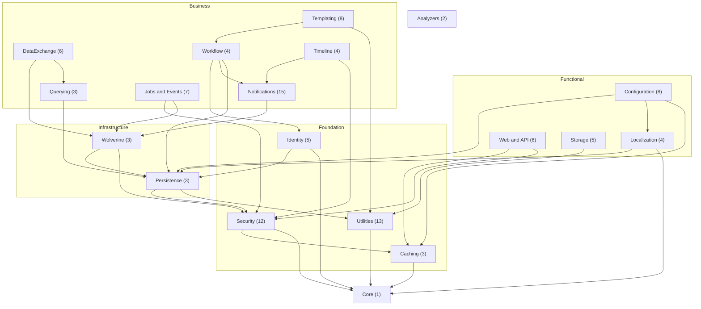
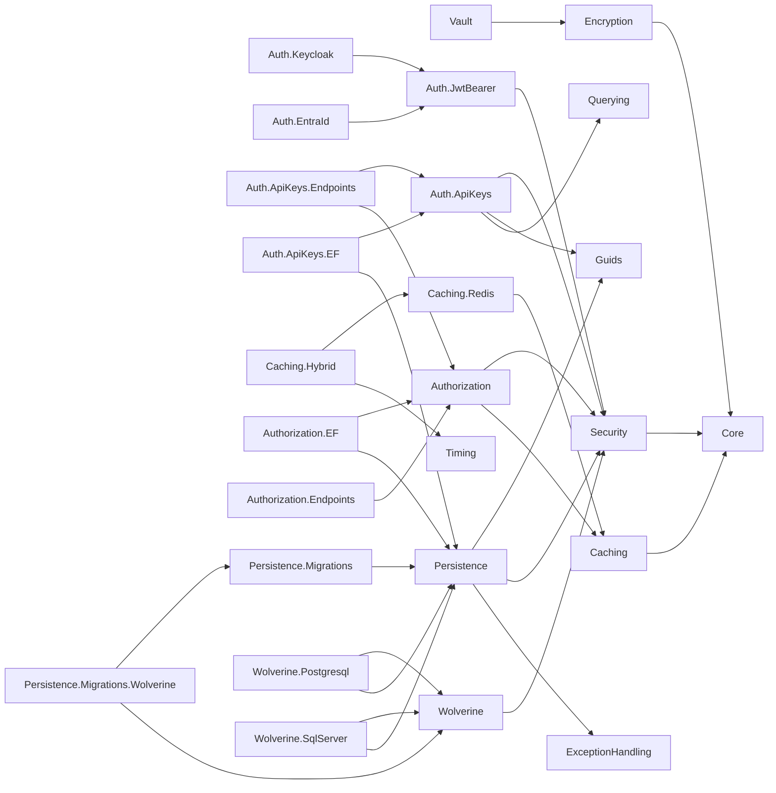
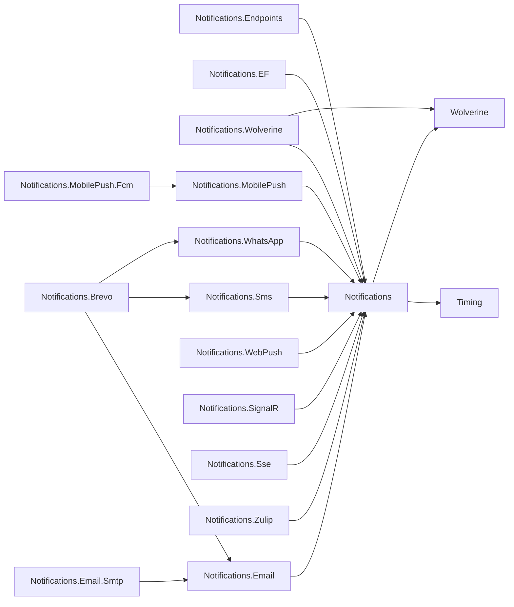

This page documents the dependency graph across all %%PACKAGE_COUNT%% Granit source packages. Arrows
indicate the direction of dependency: `A --> B` means "A depends on B". `Granit.Core`
is the root and has zero dependencies.

Conventions used throughout this page:

- Transitive dependencies on `Granit.Core` are omitted when a package already depends
  on another module that depends on Core.
- The systematic pattern `*.Endpoints --> Authorization` is omitted from the overview
  diagram (documented in the coupling rules section).
- `*.EntityFrameworkCore` packages are leaf nodes unless stated otherwise.

## High-level overview

Each node represents a functional domain with the package count in parentheses.

### Domain composition

| Domain | Packages |
|--------|----------|
| Utilities | Timing, Guids, Diagnostics, Validation, Validation.Europe, ExceptionHandling, Observability, MultiTenancy, Privacy, Cors, Bulkhead, RateLimiting, Querying |
| Identity | Identity, Identity.Keycloak, Identity.EntraId, Identity.EntityFrameworkCore, Identity.Endpoints |
| Security | Security, Encryption, Vault, Auth.JwtBearer, Auth.Keycloak, Auth.EntraId, Auth.ApiKeys (3), Authorization, Authorization.EF, Authorization.Endpoints |
| Configuration | Settings (3), Features (2), ReferenceData (3) |
| Web and API | ApiVersioning, ApiDocumentation, Cookies, Cookies.Klaro, Cookies.Endpoints, Idempotency |
| Storage | BlobStorage (3), Imaging (2) |
| Jobs and Events | BackgroundJobs (4), Webhooks (3) |
| Localization | Localization, Localization.EntityFrameworkCore, Localization.Endpoints, Localization.SourceGenerator |
| Templating | Templating, Templating.Scriban, Templating.EF, Templating.Endpoints, Templating.Workflow, DocumentGeneration, DocumentGeneration.Pdf, DocumentGeneration.Excel |
| Notifications | Notifications, Notifications.EF, Notifications.Endpoints, Notifications.Wolverine, Email, Email.Smtp, Sms, WhatsApp, WebPush, SignalR, Sse, Zulip, Brevo, MobilePush, MobilePush.Fcm |
| Workflow | Workflow, Workflow.EF, Workflow.Endpoints, Workflow.Notifications |
| Timeline | Timeline, Timeline.EF, Timeline.Endpoints, Timeline.Notifications |
| DataExchange | DataExchange, DataExchange.Csv, DataExchange.Excel, DataExchange.EF, DataExchange.Endpoints, DataExchange.Wolverine |

## Core layer dependencies

The backbone of the framework: security, distributed cache, and data persistence.

### Utilities (flat dependencies)

| Package | Depends on |
|---------|------------|
| `Granit.Timing` | `Core` |
| `Granit.Security` | `Core` |
| `Granit.ExceptionHandling` | `Core` |
| `Granit.Observability` | `Core` |
| `Granit.MultiTenancy` | `Core` |
| `Granit.Privacy` | `Core` |
| `Granit.Cors` | `Core` |
| `Granit.Guids` | `Timing` |
| `Granit.Diagnostics` | `Timing` |
| `Granit.Validation` | `ExceptionHandling`, `Localization` |
| `Granit.Validation.Europe` | `Validation`, `Localization` |
| `Granit.Bulkhead` | `Core`, `ExceptionHandling`, `Features`, `Security` |
| `Granit.RateLimiting` | `Core`, `ExceptionHandling`, `Features`, `Security` |

### Identity

| Package | Depends on |
|---------|------------|
| `Granit.Identity` | `Querying` |
| `Granit.Identity.Keycloak` | `Identity` |
| `Granit.Identity.EntraId` | `Identity`, `Timing` |
| `Granit.Identity.EntityFrameworkCore` | `Identity`, `Persistence`, `Security` |
| `Granit.Identity.Endpoints` | `Identity`, `Authorization` |

### Localization

| Package | Depends on |
|---------|------------|
| `Granit.Localization` | `Core` |
| `Granit.Localization.EntityFrameworkCore` | `Localization`, `Persistence` |
| `Granit.Localization.Endpoints` | `Localization`, `Authorization` |
| `Granit.Localization.SourceGenerator` | none (source generator) |

### Configuration (Settings, Features, ReferenceData)

| Package | Depends on |
|---------|------------|
| `Granit.Settings` | `Caching`, `Encryption`, `Security` |
| `Granit.Settings.EntityFrameworkCore` | `Settings`, `Persistence` |
| `Granit.Settings.Endpoints` | `Settings`, `Authorization`, `Timing`, `Validation` |
| `Granit.Features` | `Caching`, `Localization` |
| `Granit.Features.EntityFrameworkCore` | `Features`, `Persistence` |
| `Granit.ReferenceData` | `Querying` |
| `Granit.ReferenceData.Endpoints` | `ReferenceData` |
| `Granit.ReferenceData.EntityFrameworkCore` | `ReferenceData`, `Persistence` |

### Web and API

| Package | Depends on |
|---------|------------|
| `Granit.ApiVersioning` | `Core` |
| `Granit.ApiDocumentation` | `ApiVersioning`, `Security` |
| `Granit.Cookies` | `Timing` |
| `Granit.Cookies.Klaro` | `Cookies` |
| `Granit.Cookies.Endpoints` | `Cookies`, `Core` |
| `Granit.Idempotency` | `Caching`, `Security` |

### Storage and Imaging

| Package | Depends on |
|---------|------------|
| `Granit.BlobStorage` | `Guids` |
| `Granit.BlobStorage.EntityFrameworkCore` | `BlobStorage` |
| `Granit.BlobStorage.S3` | `BlobStorage` |
| `Granit.Imaging` | `Core` |
| `Granit.Imaging.MagickNet` | `Imaging` |

## Messaging and notification layer

### Notifications

Fan-out multi-channel engine with Brevo as a unified aggregator across Email, SMS,
and WhatsApp.

### Templating, Workflow, and Timeline

These three domains have cross-module dependencies that form the richest part of the
graph.

| Package | Depends on |
|---------|------------|
| `Granit.Templating` | `Timing` |
| `Granit.Templating.Scriban` | `Templating` |
| `Granit.Templating.EntityFrameworkCore` | `Templating` |
| `Granit.Templating.Endpoints` | `Templating`, `Authorization` |
| `Granit.Templating.Workflow` | `Templating`, `Workflow` |
| `Granit.DocumentGeneration` | `Templating` |
| `Granit.DocumentGeneration.Pdf` | `DocumentGeneration` |
| `Granit.DocumentGeneration.Excel` | `Templating` |
| `Granit.Workflow` | `Timing` |
| `Granit.Workflow.EntityFrameworkCore` | `Workflow`, `Persistence` |
| `Granit.Workflow.Endpoints` | `Workflow`, `Authorization` |
| `Granit.Workflow.Notifications` | `Workflow`, `Authorization`, `Identity`, `Notifications` |
| `Granit.Timeline` | `Guids`, `Security` |
| `Granit.Timeline.EntityFrameworkCore` | `Timeline`, `Persistence` |
| `Granit.Timeline.Endpoints` | `Timeline`, `Authorization` |
| `Granit.Timeline.Notifications` | `Timeline`, `Notifications` |

### Jobs and Events

| Package | Depends on |
|---------|------------|
| `Granit.BackgroundJobs` | `Timing`, `Wolverine` |
| `Granit.BackgroundJobs.EntityFrameworkCore` | `BackgroundJobs` |
| `Granit.BackgroundJobs.Endpoints` | `BackgroundJobs`, `Authorization` |
| `Granit.BackgroundJobs.Wolverine` | `BackgroundJobs`, `Wolverine` |
| `Granit.Webhooks` | `Timing`, `Wolverine` |
| `Granit.Webhooks.EntityFrameworkCore` | `Webhooks`, `Persistence` |
| `Granit.Webhooks.Wolverine` | `Webhooks`, `Wolverine` |

### Querying and DataExchange

| Package | Depends on |
|---------|------------|
| `Granit.Querying` | `Core` |
| `Granit.Querying.Endpoints` | `Querying`, `Authorization` |
| `Granit.Querying.EntityFrameworkCore` | `Querying`, `Persistence` |
| `Granit.DataExchange` | `Querying`, `Timing`, `Validation` |
| `Granit.DataExchange.Csv` | `DataExchange` |
| `Granit.DataExchange.Excel` | `DataExchange` |
| `Granit.DataExchange.EntityFrameworkCore` | `DataExchange`, `Persistence` |
| `Granit.DataExchange.Endpoints` | `DataExchange`, `Authorization` |
| `Granit.DataExchange.Wolverine` | `DataExchange`, `Wolverine` |

### Analyzers

| Package | Depends on |
|---------|------------|
| `Granit.Analyzers` | none (Roslyn analyzer) |
| `Granit.Analyzers.CodeFixes` | `Analyzers` |

## Cross-module dependencies

The `[DependsOn(typeof(...))]` attribute declares hard module dependencies resolved at
startup. The following table lists every cross-domain dependency (within the same domain
is omitted):

| Source module | Target module | Reason |
|---------------|---------------|--------|
| `Validation` | `Localization` | Localized validation error messages |
| `Features` | `Localization` | Feature flag display names |
| `Features` | `Caching` | Cached feature state lookups |
| `Settings` | `Caching` | Cached settings values |
| `Settings` | `Encryption` | Encrypted settings at rest |
| `Settings` | `Security` | Per-user setting scoping |
| `Idempotency` | `Caching` | Distributed idempotency key store |
| `Authorization` | `Caching` | Per-role permission grant cache |
| `Templating.Workflow` | `Workflow` | Template publication lifecycle |
| `Workflow.Notifications` | `Notifications` | Transition notification dispatch |
| `Workflow.Notifications` | `Identity` | Assignee user lookup |
| `Timeline.Notifications` | `Notifications` | Activity event notifications |
| `Notifications.Brevo` | `Email`, `Sms`, `WhatsApp` | Unified multi-channel aggregator |
| `DataExchange` | `Querying` | Export column metadata from QueryDefinition |
| `Auth.ApiKeys` | `Querying` | Paginated API key listings |
| `DocumentGeneration.Excel` | `Templating` | Scriban cell rendering in XLSX |

## Soft dependencies

Several core interfaces live in `Granit.Core` rather than in their dedicated module.
This allows any package to consume them without taking a hard reference to the
implementing module. The implementing module registers the real service; without it, a
null-object default is used.

| Interface | Declared in | Implemented by | Default behavior |
|-----------|-------------|----------------|------------------|
| `ICurrentTenant` | `Granit.Core.MultiTenancy` | `Granit.MultiTenancy` | `NullTenantContext` (`IsAvailable = false`) |
| `IClock` | `Granit.Core.Timing` | `Granit.Timing` | System clock |
| `IDataFilter` | `Granit.Core.DataFiltering` | `Granit.Persistence` | No-op (all data visible) |

Modules that access `ICurrentTenant` use `using Granit.Core.MultiTenancy;` and check
`IsAvailable` before reading `Id`. They do NOT declare `[DependsOn(typeof(GranitMultiTenancyModule))]`
or add a `ProjectReference` to `Granit.MultiTenancy`. The only exception is modules that
must enforce strict tenant isolation (e.g., BlobStorage for GDPR compliance).

## Bundle composition

Five meta-packages provide curated sets of modules for common application profiles.
Bundles contain no code -- they are `ProjectReference`-only `.csproj` files.

### Granit.Bundle.Essentials

Minimal API foundation.

| Included package |
|------------------|
| `Granit.Core` |
| `Granit.Timing` |
| `Granit.Guids` |
| `Granit.Security` |
| `Granit.Validation` |
| `Granit.Persistence` |
| `Granit.Observability` |
| `Granit.ExceptionHandling` |
| `Granit.Diagnostics` |

### Granit.Bundle.Api

Complete REST API. Includes everything in `Bundle.Essentials` plus:

| Included package |
|------------------|
| `Granit.ApiVersioning` |
| `Granit.ApiDocumentation` |
| `Granit.Cors` |
| `Granit.Idempotency` |
| `Granit.Localization` |
| `Granit.Localization.EntityFrameworkCore` |
| `Granit.Caching` |

### Granit.Bundle.Documents

Templating and document generation pipeline.

| Included package |
|------------------|
| `Granit.Templating` |
| `Granit.Templating.Scriban` |
| `Granit.Templating.EntityFrameworkCore` |
| `Granit.DocumentGeneration` |
| `Granit.DocumentGeneration.Pdf` |
| `Granit.DocumentGeneration.Excel` |

### Granit.Bundle.Notifications

Multi-channel notification engine with default channels.

| Included package |
|------------------|
| `Granit.Notifications` |
| `Granit.Notifications.EntityFrameworkCore` |
| `Granit.Notifications.Endpoints` |
| `Granit.Notifications.Email` |
| `Granit.Notifications.Email.Smtp` |
| `Granit.Notifications.SignalR` |

### Granit.Bundle.SaaS

Multi-tenant SaaS extensions.

| Included package |
|------------------|
| `Granit.MultiTenancy` |
| `Granit.Features` |
| `Granit.Features.EntityFrameworkCore` |
| `Granit.RateLimiting` |
| `Granit.Bulkhead` |

## Dependency rules

These invariants are enforced by `Granit.ArchitectureTests` and apply to every package
in the repository.

1. **Core depends on nothing.** It is the root of the entire graph.

2. **Zero circular references.** The graph is a strict DAG (directed acyclic graph).
   The build will fail if a cycle is introduced.

3. **One project = one NuGet package.** The namespace matches the project name. No
   assembly contains types from another package's namespace.

4. **Functional packages never reference `*.EntityFrameworkCore` packages.** Abstractions
   live in the base package; EF Core implementations live in the `*.EntityFrameworkCore`
   companion. This keeps the base package ORM-agnostic.

5. **`*.Endpoints` packages depend on `Granit.Authorization`.** Every endpoint package
   uses `RequireAuthorization()` or policy-based authorization. This is a systematic
   pattern omitted from the diagrams for readability.

6. **Wolverine is the sole message bus.** All asynchronous processing flows through
   Wolverine: Notifications, Webhooks, BackgroundJobs, DataExchange.Wolverine,
   Persistence.Migrations.Wolverine.

7. **`Persistence.Migrations` is decoupled from Wolverine.** Batch dispatch is abstracted
   via `IMigrationBatchDispatcher` (Channel-based by default, Wolverine optional via
   `Granit.Persistence.Migrations.Wolverine`).

8. **Multi-tenancy is a soft dependency.** Modules use `ICurrentTenant` from
   `Granit.Core.MultiTenancy` without referencing `Granit.MultiTenancy`. Hard dependency
   is reserved for strict tenant isolation (BlobStorage, GDPR).

## Graph properties

- **%%PACKAGE_COUNT%% source packages**, zero circular dependencies
- **Maximum depth**: 5 levels (e.g., Core to Security to Wolverine to Notifications to
  Email to Smtp, or Core to Timing to Notifications to MobilePush to MobilePush.Fcm)
- **Leaf packages**: `*.EntityFrameworkCore` and `*.S3` packages are almost always leaves
- **Root packages with no dependencies**: `Granit.Core`, `Granit.Analyzers`,
  `Granit.Localization.SourceGenerator`
- **5 bundle meta-packages**: Essentials, Api, Documents, Notifications, SaaS

## Intentional design decisions

Several patterns in the dependency graph may look like anomalies during an audit but
are deliberate choices.

### Isolated DbContext packages

Seven `*.EntityFrameworkCore` packages use an autonomous `DbContext` via
`IDbContextFactory` instead of the application `DbContext` managed by
`Granit.Persistence`: Authorization, BackgroundJobs, Localization, Features, Settings,
Webhooks, BlobStorage.

These modules manage infrastructure data (not business entities), use `IDbContextFactory`
for thread safety with parallel Wolverine handlers, and do not need
`AuditedEntityInterceptor` or `SoftDeleteInterceptor`.

### Caching.Hybrid depends on StackExchangeRedis

`HybridCache` (.NET 9+) requires a distributed L2 backend. Redis is the only backend
supported by the Granit stack, making this a structural dependency.

### DataExchange depends on Querying

The coupling is export-only: `DataExchange` reads `QueryDefinition` metadata to generate
tabular exports (columns, filters, sort). The import pipeline uses no Querying types.

### DocumentGeneration.Excel depends on Templating

The XLSX package (ClosedXML) bypasses the HTML-to-render pipeline because XLSX is a
binary format. It references `Templating` for `ITextTemplateRenderer` (Scriban cell
rendering) and the polymorphic `RenderedContent` types.

### Notifications.Endpoints without RBAC

All notification endpoints are per-user self-service operations (inbox, preferences,
subscriptions). Each endpoint filters by `GetUserId(user)` and cannot access another
user's data. `.RequireAuthorization()` without a RBAC policy is sufficient.
