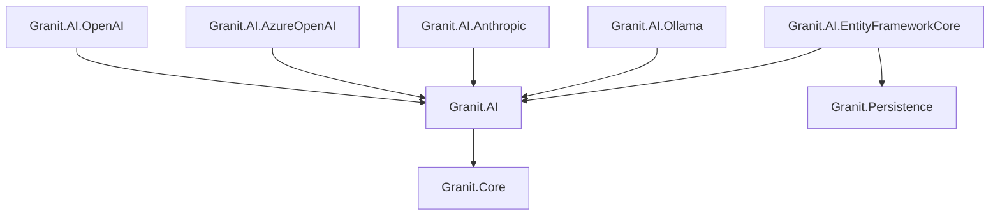
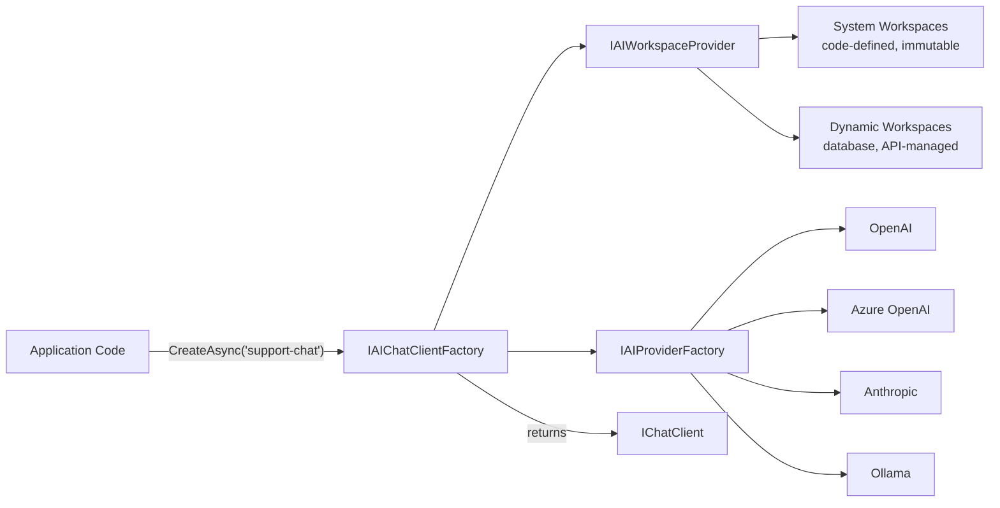

import { Tabs, TabItem, FileTree, Badge } from "@astrojs/starlight/components";

Granit.AI brings Large Language Model (LLM) capabilities to your application through a
provider-agnostic abstraction layer built on **Microsoft.Extensions.AI** (`IChatClient`,
`IEmbeddingGenerator`). AI providers are interchangeable per environment — Ollama for
development, Azure OpenAI for production — without changing application code.

The module introduces **workspaces**: named AI configurations that bind a provider, model,
system prompt, and parameters. Workspaces are multi-tenant, permission-scoped, and can be
declared in code (immutable) or managed via API (dynamic). Every AI interaction is tracked
for cost monitoring and ISO 27001 compliance.

## Why Microsoft.Extensions.AI?

| Approach | Pros | Cons |
|----------|------|------|
| **Direct SDK usage** (OpenAI, Anthropic) | Full API access | Vendor lock-in, no middleware pipeline, each module reimplements integration |
| **Custom abstractions** (`ITextGenerationService`) | Full control | Isolated from .NET ecosystem, reinvents the wheel |
| **Microsoft.Extensions.AI** ✓ | Standard .NET 10, ~100 compatible packages, middleware pipeline (logging, caching, OTel) | Newer API surface |

Granit.AI uses the .NET standard. Your application code depends on `IChatClient`, not on
OpenAI or Anthropic. Swapping providers is a one-line configuration change.

## Package structure

<FileTree>

- Granit.AI/ Core abstractions, workspace management, factory pattern
  - Granit.AI.OpenAI OpenAI provider (GPT-4o, o3/o4-mini, embeddings)
  - Granit.AI.AzureOpenAI Azure OpenAI with Managed Identity support
  - Granit.AI.Anthropic Anthropic Claude (Opus, Sonnet, Haiku)
  - Granit.AI.Ollama Local models via OllamaSharp (dev, on-premise, GDPR)
  - Granit.AI.EntityFrameworkCore Isolated DbContext for workspaces and usage tracking

</FileTree>

| Package | Role | Depends on |
|---------|------|------------|
| `Granit.AI` | `IAIChatClientFactory`, `IAIProviderFactory`, workspace CQRS, usage tracking | `Granit.Core` |
| `Granit.AI.OpenAI` | OpenAI provider via `Microsoft.Extensions.AI.OpenAI` | `Granit.AI` |
| `Granit.AI.AzureOpenAI` | Azure OpenAI with API key + `DefaultAzureCredential` | `Granit.AI` |
| `Granit.AI.Anthropic` | Claude models via official Anthropic SDK | `Granit.AI` |
| `Granit.AI.Ollama` | Local models, health check, zero API key | `Granit.AI` |
| `Granit.AI.EntityFrameworkCore` | `AIDbContext`, `EfAIWorkspaceStore`, `EfAIUsageStore` | `Granit.AI`, `Granit.Persistence` |

## Provider comparison

| Provider | Models | Embeddings | Auth | Best for |
|----------|--------|-----------|------|----------|
| **OpenAI** | GPT-4o, o3, o4-mini | text-embedding-3 | API key | General-purpose, global deployments |
| **Azure OpenAI** | Same as OpenAI | Same | API key / Managed Identity | EU data sovereignty, HDS, enterprise |
| **Anthropic** | Claude Opus, Sonnet, Haiku | Not supported | API key | Long document analysis, reasoning |
| **Ollama** | Llama 3.1, Mistral, Phi, Gemma | nomic-embed-text | None | Development, on-premise, GDPR-strict |

## Dependency graph



## Setup

<Tabs>
<TabItem label="Ollama (dev)">

```csharp
[DependsOn(typeof(GranitAIOllamaModule))]
public class AppModule : GranitModule { }
```

```csharp
builder.AddGranitAI();
builder.AddGranitAIOllama();
```

No configuration needed — connects to `http://localhost:11434` with `llama3.1` by default.

```bash
# Start Ollama and pull the default model
ollama pull llama3.1
ollama serve
```

</TabItem>
<TabItem label="OpenAI">

```csharp
[DependsOn(typeof(GranitAIOpenAIModule))]
public class AppModule : GranitModule { }
```

```csharp
builder.AddGranitAI();
builder.AddGranitAIOpenAI();
```

```json
{
  "AI": {
    "OpenAI": {
      "ApiKey": "<from-vault>",
      "DefaultModel": "gpt-4o",
      "DefaultEmbeddingModel": "text-embedding-3-small"
    }
  }
}
```

</TabItem>
<TabItem label="Azure OpenAI">

```csharp
[DependsOn(typeof(GranitAIAzureOpenAIModule))]
public class AppModule : GranitModule { }
```

```csharp
builder.AddGranitAI();
builder.AddGranitAIAzureOpenAI();
```

```json
{
  "AI": {
    "AzureOpenAI": {
      "Endpoint": "https://my-resource.openai.azure.com",
      "DefaultDeployment": "gpt-4o",
      "DefaultEmbeddingDeployment": "text-embedding-3-small"
    }
  }
}
```

For Managed Identity (recommended in production), omit `ApiKey` — `DefaultAzureCredential`
is used automatically.

</TabItem>
<TabItem label="Anthropic">

```csharp
[DependsOn(typeof(GranitAIAnthropicModule))]
public class AppModule : GranitModule { }
```

```csharp
builder.AddGranitAI();
builder.AddGranitAIAnthropic();
```

```json
{
  "AI": {
    "Anthropic": {
      "ApiKey": "<from-vault>",
      "DefaultModel": "claude-sonnet-4-6"
    }
  }
}
```

:::note
Anthropic does not support embedding generation. Use a separate workspace with OpenAI or
Ollama for embeddings.
:::

</TabItem>
</Tabs>

### Adding persistence

For production, add `Granit.AI.EntityFrameworkCore` to persist workspaces and track usage:

```csharp
[DependsOn(
    typeof(GranitAIOllamaModule),  // or any provider
    typeof(GranitAIEntityFrameworkCoreModule))]
public class AppModule : GranitModule { }
```

```csharp
builder.AddGranitAI();
builder.AddGranitAIOllama();
builder.AddGranitAIEntityFrameworkCore(options =>
    options.UseNpgsql(builder.Configuration.GetConnectionString("AI")));
```

:::caution
Never store API keys in `appsettings.json` for production. Inject credentials from
[Granit.Vault](/reference/modules/vault-encryption/) with dynamic rotation.
:::

## Workspace architecture

A workspace is a named AI configuration: which provider, which model, what parameters.



### System workspaces (code-defined)

Declare workspaces in code for configurations that should not change at runtime:

```csharp
public class AppWorkspaceDefinitionProvider : IAIWorkspaceDefinitionProvider
{
    public void Define(IAIWorkspaceDefinitionContext context)
    {
        context.Add(new AIWorkspace
        {
            Name = "document-extraction",
            Provider = "AzureOpenAI",
            Model = "gpt-4o",
            SystemPrompt = "Extract structured data from documents. Return valid JSON only.",
            Temperature = 0.0f,
            MaxOutputTokens = 4096,
        });

        context.Add(new AIWorkspace
        {
            Name = "support-chat",
            Provider = "Anthropic",
            Model = "claude-sonnet-4-6",
            SystemPrompt = "You are a helpful customer support assistant.",
            Temperature = 0.7f,
        });
    }
}
```

System workspaces take precedence over dynamic workspaces with the same name and cannot be
modified or deleted via the API.

### Dynamic workspaces (database-managed)

Dynamic workspaces are created and managed through `IAIWorkspaceManager` (CQRS writer)
and stored by `Granit.AI.EntityFrameworkCore`. Use these when workspace configuration
should be editable at runtime (e.g., per-tenant customization).

## Using AI in your modules

### Chat completion

```csharp
public class InvoiceSummaryService(IAIChatClientFactory chatClientFactory)
{
    public async Task<string> SummarizeAsync(
        Invoice invoice,
        CancellationToken cancellationToken)
    {
        IChatClient client = await chatClientFactory
            .CreateAsync("document-extraction", cancellationToken)
            .ConfigureAwait(false);

        ChatResponse response = await client.GetResponseAsync(
            $"Summarize this invoice in 3 bullet points: {invoice.Description}",
            cancellationToken: cancellationToken)
            .ConfigureAwait(false);

        return response.Text;
    }
}
```

### Embedding generation

```csharp
public class PatientSearchService(IAIEmbeddingGeneratorFactory embeddingFactory)
{
    public async Task<Embedding<float>> EmbedAsync(
        string searchQuery,
        CancellationToken cancellationToken)
    {
        IEmbeddingGenerator<string, Embedding<float>> generator =
            await embeddingFactory
                .CreateAsync("embeddings", cancellationToken)
                .ConfigureAwait(false);

        Embedding<float> embedding = await generator
            .GenerateEmbeddingAsync(searchQuery, cancellationToken: cancellationToken)
            .ConfigureAwait(false);

        return embedding;
    }
}
```

### Graceful degradation

When no provider is registered, `IAIChatClientFactory.CreateAsync()` throws
`AIProviderNotRegisteredException` with a clear message indicating which package to install.
When no persistence adapter is configured, null implementations are used — workspaces work
from code definitions only, and usage records are discarded.

## Usage tracking and cost monitoring

Every `IChatClient` call is automatically tracked when `GranitAIOptions.EnableUsageTracking`
is `true` (default). The `AIUsageRecord` captures:

| Field | Description |
|-------|-------------|
| `TenantId` | Tenant that made the request |
| `UserId` | User who triggered the AI call |
| `WorkspaceName` | Workspace used |
| `Provider` / `Model` | Provider and model identifier |
| `InputTokens` / `OutputTokens` | Token consumption |
| `EstimatedCostUsd` | Cost estimate based on configured pricing |
| `Duration` | Response time |
| `Timestamp` | When the interaction occurred (UTC) |

Records are persisted by `Granit.AI.EntityFrameworkCore` and can be queried for billing
dashboards, cost alerts, and rate limiting.

## Configuration reference

### `GranitAIOptions` (section: `AI`)

| Property | Type | Default | Description |
|----------|------|---------|-------------|
| `DefaultWorkspace` | `string` | `"default"` | Workspace used when none is specified |
| `EnableUsageTracking` | `bool` | `true` | Track token consumption and cost |
| `EnableAuditTrail` | `bool` | `true` | Log every AI interaction (ISO 27001) |

### `OpenAIProviderOptions` (section: `AI:OpenAI`)

| Property | Type | Default | Description |
|----------|------|---------|-------------|
| `ApiKey` | `string` | — | OpenAI API key (inject from Vault) |
| `Endpoint` | `string?` | `null` | Custom base URL (for proxies) |
| `DefaultModel` | `string` | `"gpt-4o"` | Fallback model |
| `DefaultEmbeddingModel` | `string` | `"text-embedding-3-small"` | Fallback embedding model |

### `AzureOpenAIProviderOptions` (section: `AI:AzureOpenAI`)

| Property | Type | Default | Description |
|----------|------|---------|-------------|
| `Endpoint` | `string` | — | Azure resource endpoint (HTTPS) |
| `ApiKey` | `string?` | `null` | API key; empty = Managed Identity |
| `DefaultDeployment` | `string` | `"gpt-4o"` | Fallback deployment name |
| `DefaultEmbeddingDeployment` | `string` | `"text-embedding-3-small"` | Fallback embedding deployment |

### `AnthropicProviderOptions` (section: `AI:Anthropic`)

| Property | Type | Default | Description |
|----------|------|---------|-------------|
| `ApiKey` | `string` | — | Anthropic API key (inject from Vault) |
| `DefaultModel` | `string` | `"claude-sonnet-4-6"` | Fallback model |

### `OllamaOptions` (section: `AI:Ollama`)

| Property | Type | Default | Description |
|----------|------|---------|-------------|
| `Endpoint` | `string` | `"http://localhost:11434"` | Ollama server URL |
| `DefaultModel` | `string` | `"llama3.1"` | Fallback model (8B server variant) |

## Compliance

### GDPR

- **Data minimization**: workspaces control what data reaches the LLM via system prompts
- **Right to erasure**: workspace and usage records support soft delete
- **Data residency**: Azure OpenAI supports EU-only deployments; Ollama keeps data on-premise
- **PII protection**: usage records store tenant/user IDs, not conversation content

### ISO 27001

- **Audit trail**: every AI interaction is recorded with tenant, user, workspace, model, timestamp
- **Usage records are immutable**: `CreationAuditedEntity` base class, no update/delete operations
- **Workspace changes are audited**: `AuditedEntity` with CreatedAt/By, ModifiedAt/By

## Database schema

When using `Granit.AI.EntityFrameworkCore`, two tables are created:

| Table | Entity | Purpose |
|-------|--------|---------|
| `ai_workspaces` | `AIWorkspaceEntity` | Dynamic workspace configurations (soft-deletable, audited) |
| `ai_usage_records` | `AIUsageRecordEntity` | Token consumption and cost tracking (immutable) |

Key indexes:

- `uq_ai_workspaces_tenant_name` — unique workspace name per tenant
- `ix_ai_usage_records_tenant_workspace_date` — billing queries by workspace and period
- `ix_ai_usage_records_tenant_provider_model` — cost aggregation by provider/model

## See also

- [Persistence](/reference/modules/persistence/) — isolated DbContext pattern, `ApplyGranitConventions`
- [Vault & Encryption](/reference/modules/vault-encryption/) — secure API key storage with rotation
- [Observability](/reference/modules/observability/) — OpenTelemetry integration for AI call tracing
- [Multi-tenancy](/reference/modules/multi-tenancy/) — tenant-scoped workspace isolation
