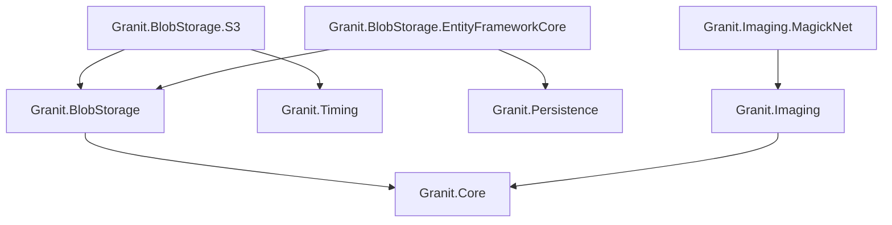
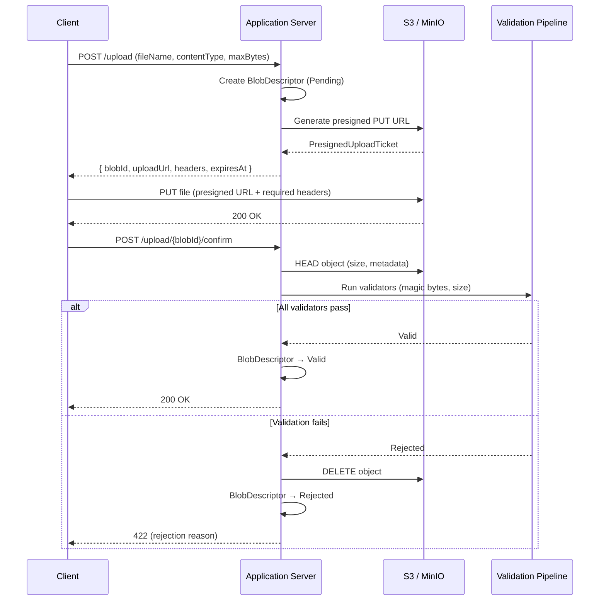
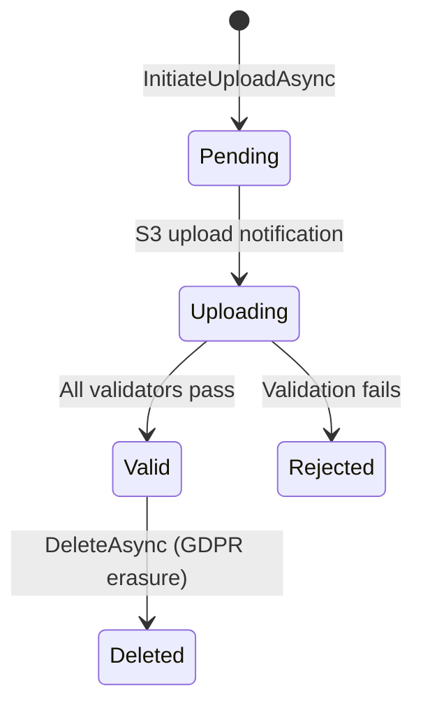

import { Tabs, TabItem, FileTree, Badge } from "@astrojs/starlight/components";

Granit.BlobStorage provides a Direct-to-Cloud blob storage layer where the application
server never streams file bytes. Clients upload and download directly to/from S3 via
presigned URLs. A post-upload validation pipeline (magic bytes, size) ensures integrity
before marking blobs as valid. Granit.Imaging adds a fluent image processing pipeline
(resize, crop, compress, format conversion, EXIF stripping) powered by Magick.NET.

## Package structure

<FileTree>
- Granit.BlobStorage Core abstractions, validation pipeline, domain model
  - Granit.BlobStorage.S3 S3 client, presigned URLs, key strategy
  - Granit.BlobStorage.EntityFrameworkCore Isolated DbContext, EF persistence
- Granit.Imaging Image processing abstractions, fluent pipeline API
  - Granit.Imaging.MagickNet Magick.NET implementation (JPEG/PNG/WebP/AVIF/GIF/BMP/TIFF)
</FileTree>

| Package | Role | Depends on |
|---------|------|------------|
| `Granit.BlobStorage` | `IBlobStorage`, `IBlobValidator`, `BlobDescriptor` domain | `Granit.Core` |
| `Granit.BlobStorage.S3` | S3 presigned URLs, `PrefixBlobKeyStrategy` | `Granit.BlobStorage`, `Granit.Timing` |
| `Granit.BlobStorage.EntityFrameworkCore` | `BlobStorageDbContext`, `EfBlobDescriptorStore` | `Granit.BlobStorage`, `Granit.Persistence` |
| `Granit.Imaging` | `IImageProcessor`, `IImagePipeline` fluent API | `Granit.Core` |
| `Granit.Imaging.MagickNet` | `MagickNetImageProcessor` (singleton) | `Granit.Imaging` |

## Dependency graph



## Setup

<Tabs>
<TabItem label="Production (S3 + EF Core)">

```csharp
[DependsOn(
    typeof(GranitBlobStorageEntityFrameworkCoreModule),
    typeof(GranitImagingMagickNetModule))]
public class AppModule : GranitModule { }
```

```csharp
builder.AddGranitBlobStorageS3();
builder.AddGranitBlobStorageEntityFrameworkCore(options =>
    options.UseNpgsql(builder.Configuration.GetConnectionString("BlobStorage")));
```

```json
{
  "BlobStorage": {
    "ServiceUrl": "https://s3.eu-west-1.amazonaws.com",
    "AccessKey": "<from-vault>",
    "SecretKey": "<from-vault>",
    "Region": "eu-west-1",
    "DefaultBucket": "myapp-blobs",
    "ForcePathStyle": false,
    "TenantIsolation": "Prefix",
    "UploadUrlExpiry": "00:15:00",
    "DownloadUrlExpiry": "00:05:00"
  }
}
```

</TabItem>
<TabItem label="Development (MinIO)">

```csharp
[DependsOn(
    typeof(GranitBlobStorageEntityFrameworkCoreModule),
    typeof(GranitImagingMagickNetModule))]
public class AppModule : GranitModule { }
```

```csharp
builder.AddGranitBlobStorageS3();
builder.AddGranitBlobStorageEntityFrameworkCore(options =>
    options.UseNpgsql(builder.Configuration.GetConnectionString("BlobStorage")));
```

```json
{
  "BlobStorage": {
    "ServiceUrl": "http://localhost:9000",
    "AccessKey": "minioadmin",
    "SecretKey": "minioadmin",
    "Region": "us-east-1",
    "DefaultBucket": "dev-blobs",
    "ForcePathStyle": true
  }
}
```

</TabItem>
</Tabs>

:::caution
Never store `AccessKey` or `SecretKey` in `appsettings.json` for production.
Inject credentials from `Granit.Vault` with dynamic rotation.
:::

## Presigned upload flow

The application server never touches file bytes. The client uploads directly to S3
via a presigned URL, then the server validates the file post-upload:



## IBlobStorage

The primary entry point for blob operations. All operations are scoped to the current
tenant resolved via `ICurrentTenant`.

```csharp
public interface IBlobStorage
{
    Task<PresignedUploadTicket> InitiateUploadAsync(
        string containerName,
        BlobUploadRequest request,
        CancellationToken cancellationToken = default);

    Task<PresignedDownloadUrl> CreateDownloadUrlAsync(
        string containerName,
        Guid blobId,
        DownloadUrlOptions? options = null,
        CancellationToken cancellationToken = default);

    Task<BlobDescriptor?> GetDescriptorAsync(
        string containerName,
        Guid blobId,
        CancellationToken cancellationToken = default);

    Task DeleteAsync(
        string containerName,
        Guid blobId,
        string? deletionReason = null,
        CancellationToken cancellationToken = default);
}
```

### Upload example

```csharp
public class PatientPhotoService(IBlobStorage blobStorage)
{
    public async Task<PresignedUploadTicket> InitiatePhotoUploadAsync(
        string fileName,
        CancellationToken cancellationToken)
    {
        var request = new BlobUploadRequest(
            FileName: fileName,
            ContentType: "image/jpeg",
            MaxAllowedBytes: 10 * 1024 * 1024); // 10 MB

        return await blobStorage.InitiateUploadAsync(
            "patient-photos", request, cancellationToken)
            .ConfigureAwait(false);
    }
}
```

The returned `PresignedUploadTicket` contains everything the frontend needs:

| Property | Description |
|----------|-------------|
| `BlobId` | Stable identifier for polling status and requesting downloads |
| `UploadUrl` | Presigned S3 PUT URL |
| `HttpMethod` | Always `"PUT"` |
| `ExpiresAt` | UTC expiry of the presigned URL |
| `RequiredHeaders` | Headers the client must include verbatim (e.g. `Content-Type`) |

### Download example

```csharp
public async Task<PresignedDownloadUrl> GetPhotoDownloadUrlAsync(
    Guid blobId,
    CancellationToken cancellationToken)
{
    return await blobStorage.CreateDownloadUrlAsync(
        "patient-photos",
        blobId,
        new DownloadUrlOptions(DownloadFileName: "patient-photo.jpg"),
        cancellationToken)
        .ConfigureAwait(false);
}
```

Setting `DownloadFileName` injects a `Content-Disposition: attachment; filename="..."` header
into the presigned URL, forcing the browser to download rather than preview.

### GDPR deletion

```csharp
await blobStorage.DeleteAsync(
    "patient-photos",
    blobId,
    deletionReason: "GDPR Art. 17 erasure request",
    cancellationToken);
```

The S3 object is physically deleted (crypto-shredding). The `BlobDescriptor` record is
**retained** in the database for the ISO 27001 3-year audit trail.

## BlobDescriptor lifecycle



| Status | S3 object | DB record | Description |
|--------|-----------|-----------|-------------|
| `Pending` | Not yet uploaded | Exists | Upload ticket issued, waiting for client |
| `Uploading` | Uploaded | Exists | Validation pipeline running |
| `Valid` | Present | Exists | Ready for download |
| `Rejected` | Deleted | Retained | Magic bytes or size check failed |
| `Deleted` | Deleted | Retained (3 years) | GDPR Art. 17 crypto-shredding |

## CQRS persistence

Blob descriptor persistence follows the CQRS pattern with separate reader and writer
interfaces. Always inject the specific interface matching your intent:

```csharp
// Read-only: querying blob metadata
public class BlobQueryHandler(IBlobDescriptorReader reader) { }

// Write-only: updating blob state
public class BlobCommandHandler(IBlobDescriptorWriter writer) { }
```

`IBlobDescriptorReader` also provides specialized queries for background jobs:

| Method | Purpose |
|--------|---------|
| `FindAsync(blobId)` | Single descriptor by ID |
| `FindOrphanedAsync(cutoff, batchSize)` | Uploads stuck in `Pending`/`Uploading` (orphan cleanup) |
| `FindByContainerBeforeAsync(container, cutoff, batchSize)` | GDPR retention cleanup |

## Validation pipeline

Validators run **after** the file lands on S3. The `BlobValidationContext` provides
partial S3 access (range GET for magic bytes, HEAD for metadata) without buffering the
full file in the application server.

### Built-in validators

| Validator | Order | Check |
|-----------|-------|-------|
| `MagicBytesValidator` | 10 | Reads first 261 bytes via range GET; compares magic-byte signature against declared `Content-Type`. Detects PDF, JPEG, PNG, GIF, TIFF, DICOM, ZIP. |
| `MaxSizeValidator` | 20 | Compares S3 HEAD size against `MaxAllowedBytes` declared at upload time. |

The pipeline is **fail-fast**: processing stops at the first failing validator.

### Custom validator

Register application-specific validators (e.g. antivirus scanning) via DI:

```csharp
public sealed class AntivirusValidator(IAntivirusClient av) : IBlobValidator
{
    public int Order => 30;

    public async Task<BlobValidationResult> ValidateAsync(
        BlobValidationContext context,
        CancellationToken cancellationToken = default)
    {
        bool isSafe = await av.ScanAsync(
            context.Descriptor.ObjectKey, cancellationToken)
            .ConfigureAwait(false);

        return isSafe
            ? BlobValidationResult.Success()
            : BlobValidationResult.Failure("Malware detected by antivirus scan.");
    }
}
```

```csharp
builder.Services.AddSingleton<IBlobValidator, AntivirusValidator>();
```

## Tenant isolation

The `PrefixBlobKeyStrategy` (default) builds S3 object keys with a tenant prefix:

```
{tenantId}/{containerName}/{yyyy}/{MM}/{blobId}
```

The date components distribute keys across a wider key-space prefix, reducing S3
hot-spot partitions on large buckets.

| Strategy | Key format | Isolation level | Bucket limits |
|----------|-----------|-----------------|---------------|
| `Prefix` (default) | `{tenantId}/{container}/{yyyy}/{MM}/{blobId}` | Key-prefix | None |
| `Bucket` | `{container}/{yyyy}/{MM}/{blobId}` | IAM-level (one bucket per tenant) | Subject to cloud provider limits |

Single-tenant deployments (no `ICurrentTenant`) omit the tenant prefix:
`{containerName}/{yyyy}/{MM}/{blobId}`.

## Domain events

`BlobDescriptor` publishes domain events on state transitions:

| Event | Trigger |
|-------|---------|
| `BlobValidated(BlobId, ContainerName, VerifiedContentType, SizeBytes)` | Blob passes all validators |
| `BlobRejected(BlobId, ContainerName, RejectionReason)` | Validation fails |
| `BlobDeleted(BlobId, ContainerName, DeletionReason)` | GDPR crypto-shredding |

Subscribe via Wolverine handlers to react to blob lifecycle changes (e.g. trigger
image processing after validation, notify the user on rejection).

## Image processing (Granit.Imaging)

`IImageProcessor` provides a fluent pipeline for image transformations. The pipeline
holds native resources and must be disposed after use.

```csharp
public class PatientPhotoProcessor(IImageProcessor imageProcessor)
{
    public async Task<ImageResult> CreateThumbnailAsync(
        Stream sourceImage,
        CancellationToken cancellationToken)
    {
        await using IImagePipeline pipeline = imageProcessor.Load(sourceImage);

        return await pipeline
            .Resize(200, 200, ResizeMode.Crop)
            .StripMetadata()
            .Compress(quality: 80)
            .ConvertTo(ImageFormat.WebP)
            .ToResultAsync(cancellationToken);
    }
}
```

### Pipeline operations

| Method | Description |
|--------|-------------|
| `Resize(width, height, mode)` | Resize with configurable strategy |
| `Crop(rectangle)` | Crop to rectangular region |
| `Compress(quality)` | Set output quality (0-100) |
| `ConvertTo(format)` | Change output format |
| `Watermark(data, position, opacity)` | Composite watermark overlay |
| `StripMetadata()` | Remove EXIF, IPTC, XMP metadata (GDPR) |
| `ToResultAsync()` | Terminal: encode and return `ImageResult` |
| `SaveToStreamAsync(stream)` | Terminal: encode and write to stream |

### Resize modes

| Mode | Behavior |
|------|----------|
| `Max` | Fit within bounds, preserving aspect ratio (may be smaller than target) |
| `Pad` | Fit within bounds with transparent padding to exact dimensions |
| `Crop` | Fill exact dimensions by resizing and center-cropping overflow |
| `Stretch` | Stretch to exact dimensions (distorts aspect ratio) |
| `Min` | Resize to minimum bounds covering target dimensions entirely |

### Convenience methods

```csharp
await pipeline.SaveAsWebPAsync(cancellationToken);  // ConvertTo(WebP) + ToResultAsync
await pipeline.SaveAsAvifAsync(cancellationToken);   // ConvertTo(AVIF) + ToResultAsync
await pipeline.SaveAsJpegAsync(cancellationToken);   // ConvertTo(JPEG) + ToResultAsync
await pipeline.SaveAsPngAsync(cancellationToken);    // ConvertTo(PNG) + ToResultAsync
```

### Supported formats

| Format | Read | Write | Notes |
|--------|------|-------|-------|
| JPEG | Yes | Yes | Lossy, no transparency |
| PNG | Yes | Yes | Lossless, transparency |
| WebP | Yes | Yes | Modern lossy/lossless, smaller than JPEG |
| AVIF | Yes | Yes | Next-gen, best compression ratio |
| GIF | Yes | Yes | 256 colors, animation support |
| BMP | Yes | Yes | Uncompressed bitmap |
| TIFF | Yes | Yes | Lossless, medical imaging |

### GDPR: metadata stripping

`StripMetadata()` removes all EXIF, IPTC, and XMP metadata from images. This is
critical for GDPR compliance: uploaded photos often contain GPS coordinates, camera
serial numbers, timestamps, and other personally identifiable information.

```csharp
await using IImagePipeline pipeline = imageProcessor.Load(uploadedPhoto);
ImageResult sanitized = await pipeline
    .StripMetadata()
    .SaveAsWebPAsync(cancellationToken);
```

### Combining with blob storage

A typical pattern: subscribe to `BlobValidated` events to post-process images
after upload validation:

```csharp
public static class BlobValidatedHandler
{
    public static async Task HandleAsync(
        BlobValidated @event,
        IBlobStorage blobStorage,
        IImageProcessor imageProcessor,
        CancellationToken cancellationToken)
    {
        if (@event.ContainerName != "patient-photos")
            return;

        // Download, process, re-upload as thumbnail
        PresignedDownloadUrl download = await blobStorage
            .CreateDownloadUrlAsync("patient-photos", @event.BlobId,
                cancellationToken: cancellationToken)
            .ConfigureAwait(false);

        // ... fetch image from download.Url, process with imageProcessor
    }
}
```

## Configuration reference

```json
{
  "BlobStorage": {
    "ServiceUrl": "https://s3.eu-west-1.amazonaws.com",
    "AccessKey": "<from-vault>",
    "SecretKey": "<from-vault>",
    "Region": "eu-west-1",
    "DefaultBucket": "myapp-blobs",
    "ForcePathStyle": false,
    "TenantIsolation": "Prefix",
    "UploadUrlExpiry": "00:15:00",
    "DownloadUrlExpiry": "00:05:00"
  }
}
```

| Property | Default | Description |
|----------|---------|-------------|
| `ServiceUrl` | — | S3-compatible endpoint URL (required) |
| `AccessKey` | — | S3 access key (required, inject from Vault) |
| `SecretKey` | — | S3 secret key (required, inject from Vault) |
| `Region` | `"us-east-1"` | S3 region for request signing |
| `DefaultBucket` | — | S3 bucket name (required) |
| `ForcePathStyle` | `true` | Path-style URLs (`host/bucket/key`); required for MinIO |
| `TenantIsolation` | `Prefix` | `Prefix` (shared bucket) or `Bucket` (one per tenant) |
| `UploadUrlExpiry` | `00:15:00` | Presigned upload URL TTL |
| `DownloadUrlExpiry` | `00:05:00` | Presigned download URL TTL |

## Public API summary

| Category | Key types | Package |
|----------|-----------|---------|
| Module | `GranitBlobStorageModule`, `GranitBlobStorageEntityFrameworkCoreModule`, `GranitImagingModule`, `GranitImagingMagickNetModule` | — |
| Storage | `IBlobStorage`, `IBlobKeyStrategy` | `Granit.BlobStorage` |
| Persistence (CQRS) | `IBlobDescriptorReader`, `IBlobDescriptorWriter`, `IBlobDescriptorStore` | `Granit.BlobStorage` |
| Domain | `BlobDescriptor`, `BlobStatus`, `BlobUploadRequest` | `Granit.BlobStorage` |
| Presigned URLs | `PresignedUploadTicket`, `PresignedDownloadUrl`, `DownloadUrlOptions` | `Granit.BlobStorage` |
| Validation | `IBlobValidator`, `BlobValidationResult`, `BlobValidationContext`, `MagicBytesValidator`, `MaxSizeValidator` | `Granit.BlobStorage` |
| Events | `BlobValidated`, `BlobRejected`, `BlobDeleted` | `Granit.BlobStorage` |
| S3 options | `S3BlobOptions`, `BlobTenantIsolation` | `Granit.BlobStorage.S3` |
| Imaging | `IImageProcessor`, `IImagePipeline`, `ImageResult`, `ImageFormat`, `ImageSize` | `Granit.Imaging` |
| Imaging types | `ResizeMode`, `CropRectangle`, `WatermarkPosition` | `Granit.Imaging` |
| Extensions | `AddGranitBlobStorageS3()`, `AddGranitBlobStorageEntityFrameworkCore()`, `AddGranitImagingMagickNet()` | — |

## See also

- [Persistence module](./persistence/) — EF Core interceptors, query filters
- [Security module](./security/) — Authorization, tenant isolation
- [Privacy module](./privacy/) — GDPR compliance patterns
- [Background Jobs module](./background-jobs/) — Orphan cleanup, retention jobs
