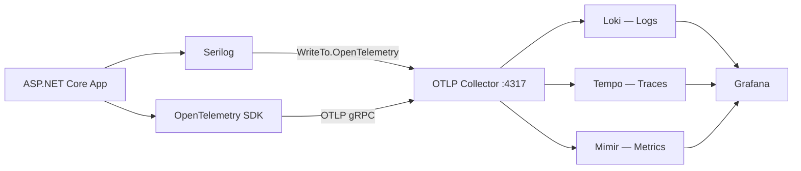
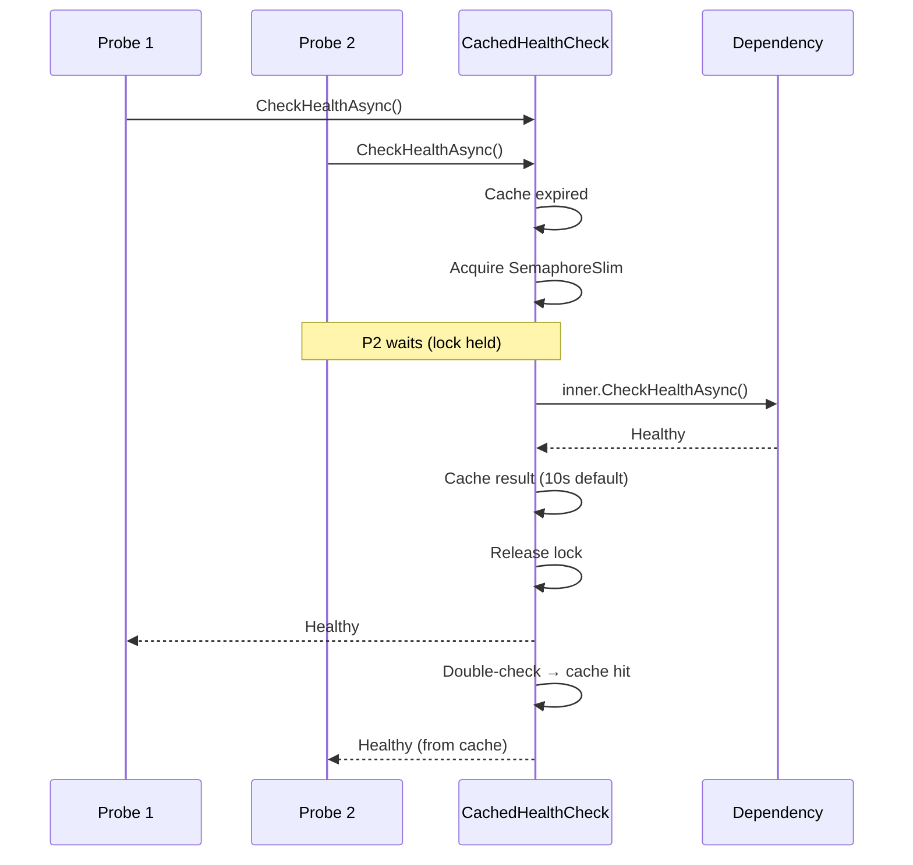

import { Tabs, TabItem, FileTree, Badge } from "@astrojs/starlight/components";

Granit.Observability wires Serilog structured logging and OpenTelemetry (traces + metrics)
into a single `AddGranitObservability()` call. Granit.Diagnostics adds Kubernetes-native
health check endpoints with stampede-protected caching and a JSON response writer for
Grafana dashboards.

## Package structure

<FileTree>
- Granit.Observability Serilog + OpenTelemetry OTLP export
- Granit.Diagnostics Kubernetes health probes (liveness, readiness, startup)
</FileTree>

| Package | Role | Depends on |
|---------|------|------------|
| `Granit.Observability` | Serilog + OpenTelemetry (traces, metrics, logs) | `Granit.Core` |
| `Granit.Diagnostics` | Health check endpoints, response writer, caching | `Granit.Timing` |

## OTLP pipeline



## Setup

<Tabs>
<TabItem label="Observability">

```csharp
[DependsOn(typeof(GranitObservabilityModule))]
public class AppModule : GranitModule { }
```

```json
{
  "Observability": {
    "ServiceName": "my-backend",
    "ServiceVersion": "1.2.0",
    "OtlpEndpoint": "http://otel-collector:4317",
    "ServiceNamespace": "my-company",
    "Environment": "production"
  }
}
```

</TabItem>
<TabItem label="Diagnostics">

```csharp
[DependsOn(typeof(GranitDiagnosticsModule))]
public class AppModule : GranitModule { }
```

In `Program.cs`, after `app.Build()`:

```csharp
app.MapGranitHealthChecks();
```

</TabItem>
<TabItem label="Both (typical)">

```csharp
[DependsOn(
    typeof(GranitObservabilityModule),
    typeof(GranitDiagnosticsModule))]
public class AppModule : GranitModule { }
```

```csharp
var app = builder.Build();
app.MapGranitHealthChecks();
app.Run();
```

</TabItem>
</Tabs>

## Serilog configuration

`AddGranitObservability()` configures two Serilog sinks:

| Sink | Purpose |
|------|---------|
| `Console` | Local development, `[HH:mm:ss LEV] SourceContext Message` |
| `OpenTelemetry` | OTLP export to Loki via the collector |

Every log entry is enriched with `ServiceName`, `ServiceVersion`, and `Environment`
properties, matching the OpenTelemetry resource attributes for correlation.

Additional Serilog settings (minimum level, overrides, extra sinks) can be added via
standard `Serilog` configuration in `appsettings.json` — `ReadFrom.Configuration` is
called before the Granit enrichers.

## OpenTelemetry instrumentation

Three built-in instrumentations are registered automatically:

| Instrumentation | What it captures |
|-----------------|------------------|
| ASP.NET Core | Inbound HTTP requests (method, route, status code) |
| HttpClient | Outbound HTTP calls (dependency tracking) |
| EF Core | Database queries (command text, duration) |

Health check endpoints (`/health/*`) are filtered out of traces to avoid noise.

### Activity source auto-registration

Granit modules register their own `ActivitySource` names via `GranitActivitySourceRegistry.Register()`
during host configuration. `AddGranitObservability()` reads the registry and calls
`AddSource()` for each — no manual wiring needed.

```csharp
// Inside a module's AddGranit*() extension method
GranitActivitySourceRegistry.Register("Granit.Workflow");
```

## Kubernetes health probes

`MapGranitHealthChecks()` registers three endpoints, all `AllowAnonymous` (the kubelet
cannot authenticate):

| Probe | Path | Behavior | Failure effect |
|-------|------|----------|----------------|
| Liveness | `/health/live` | Always returns `200` — no dependency checks | Pod restart |
| Readiness | `/health/ready` | Checks tagged `"readiness"` | Pod removed from load balancer |
| Startup | `/health/startup` | Checks tagged `"startup"` | Liveness/readiness disabled until healthy |

### Status code mapping (readiness and startup)

| HealthStatus | HTTP | Effect |
|--------------|------|--------|
| `Healthy` | `200` | Pod receives traffic |
| `Degraded` | `200` | Pod stays in load balancer (non-critical degradation) |
| `Unhealthy` | `503` | Pod removed from load balancer |

### Registering a health check

Tag your health checks with `"readiness"` and/or `"startup"` so they are picked up by
the correct probe:

```csharp
builder.Services.AddHealthChecks()
    .AddCheck<DatabaseHealthCheck>("database", tags: ["readiness", "startup"])
    .AddCheck<RedisHealthCheck>("redis", tags: ["readiness"]);
```

### JSON response format

`GranitHealthCheckWriter` produces a structured JSON payload for Grafana/Loki dashboards.
Kubernetes only reads the HTTP status code; the body is for operations teams.

```json
{
  "status": "Healthy",
  "duration": 12.3,
  "checks": [
    {
      "name": "database",
      "status": "Healthy",
      "duration": 8.1,
      "tags": ["readiness", "startup"]
    }
  ]
}
```

:::caution
The response never contains stack traces, connection strings, tokens, or PII
(ISO 27001 / GDPR compliance).
:::

## Health check caching

`CachedHealthCheck` wraps any `IHealthCheck` with a SemaphoreSlim double-check locking
pattern to prevent stampede when many pods are probed simultaneously.



With 50 pods probed every 3 seconds, an uncached database check generates ~16 req/s.
The cache reduces that to 1 request per `DefaultCacheDuration` per pod.

## Configuration reference

### ObservabilityOptions <Badge text="section: Observability" variant="note" />

| Property | Type | Default | Description |
|----------|------|---------|-------------|
| `ServiceName` | `string` | `"unknown-service"` | Service name for OTEL resource |
| `ServiceVersion` | `string` | `"0.0.0"` | Service version |
| `OtlpEndpoint` | `string` | `"http://localhost:4317"` | OTLP gRPC endpoint |
| `ServiceNamespace` | `string` | `"my-company"` | Service namespace |
| `Environment` | `string` | `"development"` | Deployment environment |
| `EnableTracing` | `bool` | `true` | Enable trace export via OTLP |
| `EnableMetrics` | `bool` | `true` | Enable metrics export via OTLP |

### DiagnosticsOptions <Badge text="section: DiagnosticsOptions" variant="note" />

| Property | Type | Default | Description |
|----------|------|---------|-------------|
| `LivenessPath` | `string` | `"/health/live"` | Liveness probe endpoint path |
| `ReadinessPath` | `string` | `"/health/ready"` | Readiness probe endpoint path |
| `StartupPath` | `string` | `"/health/startup"` | Startup probe endpoint path |
| `DefaultCacheDuration` | `TimeSpan` | `00:00:10` | Cache TTL for `CachedHealthCheck` |

## Public API summary

| Category | Key types | Package |
|----------|-----------|---------|
| Modules | `GranitObservabilityModule`, `GranitDiagnosticsModule` | -- |
| Options | `ObservabilityOptions`, `DiagnosticsOptions` | -- |
| Health checks | `CachedHealthCheck`, `GranitHealthCheckWriter` | `Granit.Diagnostics` |
| Activity sources | `GranitActivitySourceRegistry` | `Granit.Core` |
| Extensions | `AddGranitObservability()`, `AddGranitDiagnostics()`, `MapGranitHealthChecks()` | -- |

## See also

- [Caching module](./caching.mdx) -- Redis health check tagged `"readiness"`
- [Core module](./core.mdx) -- `GranitActivitySourceRegistry` lives in `Granit.Core.Diagnostics`
