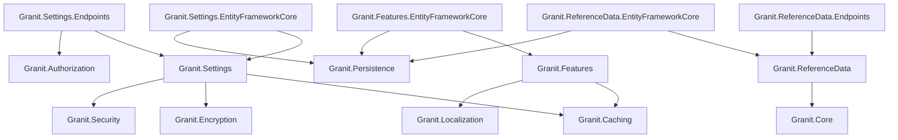

import { Tabs, TabItem, FileTree, Badge } from "@astrojs/starlight/components";

Three complementary modules for runtime application configuration: **Settings** for
user/tenant/global key-value pairs with cascading resolution, **Features** for SaaS
feature flags with plan-based activation, and **Reference Data** for i18n lookup tables
(countries, currencies, statuses).

## Package structure

<FileTree>
- Granit.Settings/ Cascading settings engine (User, Tenant, Global, Configuration, Default)
  - Granit.Settings.EntityFrameworkCore Isolated SettingsDbContext
  - Granit.Settings.Endpoints User, Global, and Tenant setting HTTP endpoints
- Granit.Features/ SaaS feature management (Toggle/Numeric/Selection)
  - Granit.Features.EntityFrameworkCore Isolated FeaturesDbContext
- Granit.ReferenceData/ i18n reference data entity and store abstractions
  - Granit.ReferenceData.EntityFrameworkCore EF Core store + seeding
  - Granit.ReferenceData.Endpoints Generic CRUD endpoints
</FileTree>

| Package | Role | Depends on |
|---------|------|------------|
| `Granit.Settings` | `ISettingProvider`, `ISettingManager`, cascading resolution | `Granit.Caching`, `Granit.Encryption`, `Granit.Security` |
| `Granit.Settings.EntityFrameworkCore` | `SettingsDbContext` (isolated, multi-tenant + soft-delete) | `Granit.Settings`, `Granit.Persistence` |
| `Granit.Settings.Endpoints` | User/Global/Tenant HTTP endpoints, `SettingsCultureMiddleware` | `Granit.Settings`, `Granit.Authorization` |
| `Granit.Features` | `IFeatureChecker`, `IFeatureLimitGuard`, plan-based cascade | `Granit.Caching`, `Granit.Localization` |
| `Granit.Features.EntityFrameworkCore` | `FeaturesDbContext` (isolated) | `Granit.Features`, `Granit.Persistence` |
| `Granit.ReferenceData` | `IReferenceDataStoreReader/Writer<T>`, `ReferenceDataEntity` | `Granit.Core` |
| `Granit.ReferenceData.EntityFrameworkCore` + `Endpoints` | EF Core store, seeding, generic CRUD endpoints | `Granit.ReferenceData`, `Granit.Persistence` |

## Dependency graph



---

## Settings

### Setup

<Tabs>
<TabItem label="Core + EF Core">

```csharp
[DependsOn(
    typeof(GranitSettingsModule),
    typeof(GranitSettingsEntityFrameworkCoreModule))]
public class AppModule : GranitModule { }
```

```csharp
// Program.cs
builder.AddGranitSettingsEntityFrameworkCore(opt =>
    opt.UseNpgsql(connectionString));
```

</TabItem>
<TabItem label="With endpoints">

```csharp
[DependsOn(
    typeof(GranitSettingsModule),
    typeof(GranitSettingsEntityFrameworkCoreModule),
    typeof(GranitSettingsEndpointsModule))]
public class AppModule : GranitModule { }
```

```csharp
// Program.cs — map endpoints
app.MapGranitUserSettings();    // GET/PUT/DELETE /settings/user/{name}
app.MapGranitGlobalSettings();  // GET/PUT /settings/global/{name}
app.MapGranitTenantSettings();  // GET/PUT /settings/tenant/{name}
```

</TabItem>
</Tabs>

### Defining settings

Implement `ISettingDefinitionProvider` in any module. Providers are auto-discovered at startup.

```csharp
public sealed class AcmeSettingDefinitionProvider : ISettingDefinitionProvider
{
    public void Define(ISettingDefinitionContext context)
    {
        context.Add(new SettingDefinition("Acme.DefaultPageSize")
        {
            DefaultValue = "25",
            IsVisibleToClients = true,
            IsInherited = true,
            Description = "Default number of items per page"
        });

        context.Add(new SettingDefinition("Acme.SmtpPassword")
        {
            DefaultValue = null,
            IsEncrypted = true,
            IsVisibleToClients = false,
            Providers = { "G" }  // Global scope only
        });
    }
}
```

#### SettingDefinition properties

| Property | Default | Description |
|----------|---------|-------------|
| `Name` | _(required)_ | Unique setting key |
| `DefaultValue` | `null` | Fallback when no provider supplies a value |
| `IsEncrypted` | `false` | Encrypt at rest via `IStringEncryptionService` |
| `IsVisibleToClients` | `false` | Expose via user-scoped API endpoints |
| `IsInherited` | `true` | Lower-priority scopes inherit from higher-priority ones |
| `Providers` | `[]` (all) | Allow-list of provider names (`"U"`, `"T"`, `"G"`) |

### Value cascade

Settings are resolved through a provider chain. The first provider that returns a
non-null value wins:

```
User (U) → Tenant (T) → Global (G) → Configuration (appsettings.json) → Default (code)
```

When `IsInherited = false`, each scope is independent and does not fall through.


### Reading settings

```csharp
public class ReportService(ISettingProvider settings)
{
    public async Task<int> GetPageSizeAsync(CancellationToken ct)
    {
        string? value = await settings
            .GetOrNullAsync("Acme.DefaultPageSize", ct)
            .ConfigureAwait(false);

        return int.TryParse(value, out int size) ? size : 25;
    }
}
```

### Writing settings

```csharp
public class AdminService(ISettingManager settingManager)
{
    public async Task SetGlobalPageSizeAsync(int size, CancellationToken ct)
    {
        await settingManager
            .SetGlobalAsync("Acme.DefaultPageSize", size.ToString(), ct)
            .ConfigureAwait(false);
    }

    public async Task SetTenantThemeAsync(Guid tenantId, string theme, CancellationToken ct)
    {
        await settingManager
            .SetForTenantAsync(tenantId, "Acme.Theme", theme, ct)
            .ConfigureAwait(false);
    }

    public async Task SetUserLocaleAsync(string userId, string locale, CancellationToken ct)
    {
        await settingManager
            .SetForUserAsync(userId, "Granit.PreferredCulture", locale, ct)
            .ConfigureAwait(false);
    }
}
```

### Endpoints

| Scope | Method | Route | Permission |
|-------|--------|-------|------------|
| User | `GET` | `/settings/user` | Authenticated |
| User | `GET` | `/settings/user/{name}` | Authenticated |
| User | `PUT` | `/settings/user/{name}` | Authenticated |
| User | `DELETE` | `/settings/user/{name}` | Authenticated |
| Global | `GET` | `/settings/global` | `Settings.Global.Read` |
| Global | `PUT` | `/settings/global/{name}` | `Settings.Global.Manage` |
| Tenant | `GET` | `/settings/tenant` | `Settings.Tenant.Read` |
| Tenant | `PUT` | `/settings/tenant/{name}` | `Settings.Tenant.Manage` |

### SettingsCultureMiddleware

Hydrates `CultureInfo.CurrentUICulture` and `ICurrentTimezoneProvider` from the
authenticated user's `Granit.PreferredCulture` and `Granit.PreferredTimezone` settings.
Runs after authentication, before endpoint handlers. No-op for anonymous requests.

```csharp
// Program.cs
app.UseAuthentication();
app.UseMiddleware<SettingsCultureMiddleware>();
app.UseAuthorization();
```

### Configuration

```json
{
  "Settings": {
    "CacheExpiration": "00:30:00"
  }
}
```

| Property | Default | Description |
|----------|---------|-------------|
| `CacheExpiration` | `00:30:00` | Cache entry TTL for resolved setting values |

---

## Features

### Setup

<Tabs>
<TabItem label="Core only">

```csharp
[DependsOn(typeof(GranitFeaturesModule))]
public class AppModule : GranitModule { }
```

Uses `InMemoryFeatureStore` by default (no persistence).

</TabItem>
<TabItem label="With EF Core">

```csharp
[DependsOn(
    typeof(GranitFeaturesModule),
    typeof(GranitFeaturesEntityFrameworkCoreModule))]
public class AppModule : GranitModule { }
```

```csharp
builder.AddGranitFeaturesEntityFrameworkCore(opt =>
    opt.UseNpgsql(connectionString));
```

</TabItem>
</Tabs>

### Defining features

Implement `IFeatureDefinitionProvider` to declare features. Features are grouped for
admin UI organization.

```csharp
public sealed class AcmeFeatureDefinitionProvider : FeatureDefinitionProvider
{
    public override void Define(IFeatureDefinitionContext context)
    {
        FeatureGroupDefinition group = context.AddGroup("Acme", "Acme Application");

        group.AddToggle("Acme.VideoConsultation",
            defaultValue: "false",
            displayName: "Video Consultation");

        group.AddNumeric("Acme.MaxUsersCount",
            defaultValue: "50",
            displayName: "Maximum Users",
            numericConstraint: new NumericConstraint(Min: 1, Max: 10_000));

        group.AddSelection("Acme.StorageTier",
            defaultValue: "standard",
            displayName: "Storage Tier",
            selectionValues: new SelectionValues("standard", "premium", "enterprise"));
    }
}
```

#### FeatureDefinition properties

| Property | Description |
|----------|-------------|
| `Name` | Unique feature name (convention: `Module.FeatureName`) |
| `DefaultValue` | Fallback string value |
| `ValueType` | `Toggle`, `Numeric`, or `Selection` |
| `NumericConstraint` | Min/Max bounds for `Numeric` features |
| `SelectionValues` | Allowed values for `Selection` features |

### Value cascade

Features are resolved through a Tenant → Plan → Default cascade:

```
Tenant override → Plan value → Default (code)
```

The application must implement `IPlanIdProvider` and `IPlanFeatureStore` to activate
plan-level resolution. Without these, features fall back to their default values.

### IFeatureChecker

The main abstraction for querying feature state at runtime:

```csharp
public class ConsultationService(IFeatureChecker features)
{
    public async Task StartAsync(CancellationToken ct)
    {
        // Gate: throws FeatureNotEnabledException (HTTP 403) if disabled
        await features
            .RequireEnabledAsync("Acme.VideoConsultation", ct)
            .ConfigureAwait(false);

        // Conditional logic
        bool isEnabled = await features
            .IsEnabledAsync("Acme.VideoConsultation", ct)
            .ConfigureAwait(false);

        // Numeric value
        long maxUsers = await features
            .GetNumericAsync("Acme.MaxUsersCount", ct)
            .ConfigureAwait(false);
    }
}
```

### IFeatureLimitGuard

Enforces numeric feature limits before mutating operations. Throws
`FeatureLimitExceededException` (HTTP 403) when the limit is reached.

```csharp
public sealed class CreatePatientHandler(
    IFeatureLimitGuard limitGuard,
    IPatientRepository patients)
{
    public async Task HandleAsync(CreatePatientCommand cmd, CancellationToken ct)
    {
        long current = await patients.CountAsync(ct).ConfigureAwait(false);
        await limitGuard
            .CheckAsync("Acme.MaxUsersCount", current, ct)
            .ConfigureAwait(false);

        // ... proceed with creation
    }
}
```

### Feature gating

<Tabs>
<TabItem label="Minimal API">

```csharp
app.MapPost("/consultations", handler)
    .RequiresFeature("Acme.VideoConsultation");
```

</TabItem>
<TabItem label="Controllers">

```csharp
[RequiresFeature("Acme.VideoConsultation")]
public IActionResult StartConsultation() => Ok();
```

</TabItem>
<TabItem label="Wolverine">

```csharp
// Decorate the message class
[RequiresFeature("Acme.ExportPdf")]
public sealed class GenerateExportCommand { }
```

Register `RequiresFeatureMiddleware` in your Wolverine setup.

</TabItem>
</Tabs>

When the feature is disabled, `FeatureNotEnabledException` is thrown and mapped to
HTTP 403 with `errorCode: "Features:NotEnabled"`.

### Feature store abstractions

```csharp
public interface IFeatureStoreReader
{
    Task<string?> GetOrNullAsync(
        string featureName, string? tenantId,
        CancellationToken cancellationToken = default);
}

public interface IFeatureStoreWriter
{
    Task SetAsync(
        string featureName, string? tenantId, string value,
        CancellationToken cancellationToken = default);

    Task DeleteAsync(
        string featureName, string? tenantId,
        CancellationToken cancellationToken = default);
}
```

---

## Reference Data

### Overview

`ReferenceDataEntity` is an abstract base class for i18n lookup tables (countries,
currencies, document types). Each entity has a unique `Code`, 14 language labels, and
automatic label resolution based on `CurrentUICulture`.

### Entity structure

```csharp
public abstract class ReferenceDataEntity : AuditedEntity, IActive
{
    public string Code { get; set; }

    // 14 language labels
    public string LabelEn { get; set; }
    public string LabelFr { get; set; }
    public string LabelNl { get; set; }
    public string LabelDe { get; set; }
    public string LabelEs { get; set; }
    public string LabelIt { get; set; }
    public string LabelPt { get; set; }
    public string LabelZh { get; set; }
    public string LabelJa { get; set; }
    public string LabelPl { get; set; }
    public string LabelTr { get; set; }
    public string LabelKo { get; set; }
    public string LabelSv { get; set; }
    public string LabelCs { get; set; }

    // Resolved at runtime via CurrentUICulture (not mapped to DB)
    public virtual string Label { get; }

    public bool IsActive { get; set; }
    public int SortOrder { get; set; }
    public DateTimeOffset? ValidFrom { get; set; }
    public DateTimeOffset? ValidTo { get; set; }
}
```

The `Label` property resolves the appropriate label based on
`CultureInfo.CurrentUICulture.TwoLetterISOLanguageName`, falling back to `LabelEn` when
the translation is empty. Regional variants use the base language fallback
(fr-CA uses `LabelFr`, en-GB uses `LabelEn`, pt-BR uses `LabelPt`).

### Defining a reference data entity

```csharp
public sealed class Country : ReferenceDataEntity { }
```

### Store abstractions

```csharp
public interface IReferenceDataStoreReader<TEntity>
    where TEntity : ReferenceDataEntity
{
    Task<PagedResult<TEntity>> GetAllAsync(
        ReferenceDataQuery? query = null,
        CancellationToken cancellationToken = default);

    Task<TEntity?> GetByCodeAsync(
        string code,
        CancellationToken cancellationToken = default);
}

public interface IReferenceDataStoreWriter<in TEntity>
    where TEntity : ReferenceDataEntity
{
    Task CreateAsync(TEntity entity, CancellationToken cancellationToken = default);
    Task UpdateAsync(TEntity entity, CancellationToken cancellationToken = default);
    Task SetActiveAsync(string code, bool isActive, CancellationToken cancellationToken = default);
}
```

### Registration

Reference data stores use **manual registration** per entity type, binding to the host
application's `DbContext`:

```csharp
// Program.cs or module ConfigureServices
services.AddReferenceDataStore<Country, AppDbContext>();
services.AddReferenceDataStore<Currency, AppDbContext>();
```

This registers `IReferenceDataStoreReader<Country>`, `IReferenceDataStoreWriter<Country>`,
and a `IDataSeedContributor` bridge for seeding.

### Mapping endpoints

```csharp
// Program.cs
app.MapReferenceDataEndpoints<Country>();
app.MapReferenceDataEndpoints<Currency>(opts =>
    opts.AdminPolicyName = "Custom.Policy");
```

The entity type name is converted to a kebab-case route segment:

| Method | Route | Access |
|--------|-------|--------|
| `GET` | `/reference-data/country` | Authenticated |
| `GET` | `/reference-data/country/{code}` | Authenticated |
| `POST` | `/reference-data/country` | Admin policy |
| `PUT` | `/reference-data/country/{code}` | Admin policy |
| `DELETE` | `/reference-data/country/{code}` | Admin policy |

### Seeding reference data

Implement `IReferenceDataSeeder<TEntity>` and register it. The `IDataSeedContributor`
bridge invokes seeders during application startup.

```csharp
public sealed class CountrySeeder : IReferenceDataSeeder<Country>
{
    public IEnumerable<Country> GetSeedData()
    {
        yield return new Country
        {
            Code = "BE",
            LabelEn = "Belgium",
            LabelFr = "Belgique",
            LabelNl = "Belgie",
            LabelDe = "Belgien",
            SortOrder = 1
        };

        yield return new Country
        {
            Code = "FR",
            LabelEn = "France",
            LabelFr = "France",
            LabelNl = "Frankrijk",
            LabelDe = "Frankreich",
            SortOrder = 2
        };
    }
}
```

---

## Public API summary

| Category | Key types | Package |
|----------|-----------|---------|
| Settings modules | `GranitSettingsModule`, `GranitSettingsEntityFrameworkCoreModule`, `GranitSettingsEndpointsModule` | -- |
| Settings abstractions | `ISettingProvider` (`GetOrNullAsync`, `GetAllAsync`), `ISettingManager` (`SetGlobalAsync`, `SetForTenantAsync`, `SetForUserAsync`) | `Granit.Settings` |
| Settings definitions | `SettingDefinition`, `ISettingDefinitionProvider`, `SettingDefinitionManager` | `Granit.Settings` |
| Settings options | `SettingsOptions` (section `"Settings"`, `CacheExpiration`) | `Granit.Settings` |
| Settings endpoints | `MapGranitUserSettings()`, `MapGranitGlobalSettings()`, `MapGranitTenantSettings()`, `SettingsCultureMiddleware` | `Granit.Settings.Endpoints` |
| Features modules | `GranitFeaturesModule`, `GranitFeaturesEntityFrameworkCoreModule` | -- |
| Features abstractions | `IFeatureChecker`, `IFeatureLimitGuard`, `IFeatureStoreReader`, `IFeatureStoreWriter` | `Granit.Features` |
| Features definitions | `FeatureDefinition`, `FeatureDefinitionProvider`, `FeatureValueType`, `NumericConstraint`, `SelectionValues` | `Granit.Features` |
| Features gating | `[RequiresFeature]`, `.RequiresFeature()`, `RequiresFeatureMiddleware` | `Granit.Features` |
| Reference data | `ReferenceDataEntity`, `IReferenceDataStoreReader<T>`, `IReferenceDataStoreWriter<T>` | `Granit.ReferenceData` |
| Reference data registration | `AddReferenceDataStore<TEntity, TDbContext>()`, `MapReferenceDataEndpoints<TEntity>()` | `Granit.ReferenceData.EntityFrameworkCore`, `Granit.ReferenceData.Endpoints` |

## See also

- [Localization module](./localization/) -- i18n for UI strings and error messages
- [Caching module](./caching/) -- used by Settings and Features for value caching
- [Persistence module](./persistence/) -- isolated DbContext pattern for all EF Core stores
- [Security module](./security/) -- permission-based access for admin endpoints
