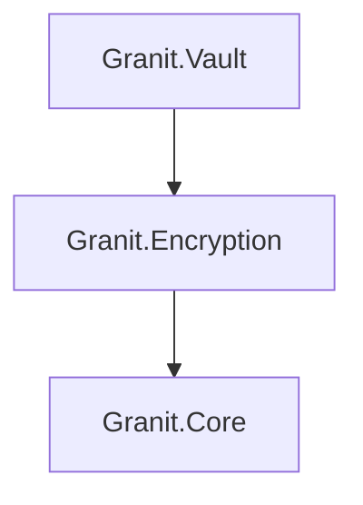

import { Tabs, TabItem, FileTree, Badge } from "@astrojs/starlight/components";

Granit.Encryption provides a pluggable string encryption service with AES-256-CBC as the
default provider. Granit.Vault extends it with HashiCorp Vault Transit encryption,
dynamic database credentials, and automatic lease renewal — disabled in Development
environments so no Vault server is required locally.

## Package structure

<FileTree>
- Granit.Encryption/ AES-256-CBC default, IStringEncryptionService
  - Granit.Vault Vault Transit provider, dynamic credentials, health check
</FileTree>

| Package | Role | Depends on |
|---------|------|------------|
| `Granit.Encryption` | `IStringEncryptionService`, AES-256-CBC provider | `Granit.Core` |
| `Granit.Vault` | Vault Transit encryption, dynamic credentials, lease management | `Granit.Encryption` |

## Dependency graph



## Granit.Encryption

### Setup

```csharp
[DependsOn(typeof(GranitEncryptionModule))]
public class AppModule : GranitModule { }
```

Registers `IStringEncryptionService` with the AES provider by default. No external
dependencies required.

### IStringEncryptionService

The main abstraction for encrypting and decrypting strings:

```csharp
public interface IStringEncryptionService
{
    string Encrypt(string plainText);
    string? Decrypt(string cipherText);
}
```

`Encrypt` returns a Base64-encoded ciphertext. `Decrypt` returns the original string,
or `null` if decryption fails (wrong key, corrupted data).

### Usage

```csharp
public class PatientNoteService(IStringEncryptionService encryption)
{
    public string ProtectNote(string note) =>
        encryption.Encrypt(note);

    public string? RevealNote(string encryptedNote) =>
        encryption.Decrypt(encryptedNote);
}
```

### AES-256-CBC provider

The default provider derives the encryption key from a passphrase using PBKDF2 and
encrypts with AES-256-CBC. Each encryption operation generates a random 16-byte IV.

```json
{
  "Encryption": {
    "PassPhrase": "<from-vault-config-provider>",
    "KeySize": 256,
    "ProviderName": "Aes"
  }
}
```

:::caution
The `PassPhrase` must be supplied via Vault configuration provider or a secrets manager.
Never hardcode or commit passphrases.
:::

### Provider switching

The `ProviderName` option selects the active encryption provider at runtime:

| Provider | Value | Backend |
|----------|-------|---------|
| AES (default) | `"Aes"` | Local AES-256-CBC with PBKDF2 key derivation |
| Vault Transit | `"Vault"` | HashiCorp Vault Transit engine (requires `Granit.Vault`) |

When `ProviderName` is `"Vault"`, `IStringEncryptionService` delegates to
`VaultStringEncryptionProvider`, which calls Vault Transit under the hood.

---

## Granit.Vault

### Setup

```csharp
[DependsOn(typeof(GranitVaultModule))]
public class AppModule : GranitModule { }
```

:::note
`GranitVaultModule` is **automatically disabled** in `Development` environments
(`IHostEnvironment.IsDevelopment()`). Applications fall back to the local AES provider
when Vault is not available — no configuration needed for local development.
:::

### ITransitEncryptionService

Direct access to the Vault Transit engine for encrypt/decrypt operations:

```csharp
public interface ITransitEncryptionService
{
    Task<string> EncryptAsync(
        string keyName, string plaintext,
        CancellationToken cancellationToken = default);

    Task<string> DecryptAsync(
        string keyName, string ciphertext,
        CancellationToken cancellationToken = default);
}
```

Ciphertext follows the Vault format: `vault:v1:base64encodeddata...`

### Usage

```csharp
public class SensitiveDataService(ITransitEncryptionService transit)
{
    public async Task<string> ProtectSsnAsync(
        string ssn, CancellationToken cancellationToken)
    {
        return await transit.EncryptAsync(
            "pii-data", ssn, cancellationToken).ConfigureAwait(false);
        // Returns: "vault:v1:AbCdEf..."
    }

    public async Task<string> RevealSsnAsync(
        string encryptedSsn, CancellationToken cancellationToken)
    {
        return await transit.DecryptAsync(
            "pii-data", encryptedSsn, cancellationToken).ConfigureAwait(false);
    }
}
```

### Dynamic database credentials

`VaultCredentialLeaseManager` obtains short-lived database credentials from the Vault
Database engine and handles automatic lease renewal at a configurable threshold
(default: 75% of TTL). The connection string is updated transparently — no application
restart required.

### Authentication

<Tabs>
<TabItem label="Kubernetes (production)">

```json
{
  "Vault": {
    "Address": "https://vault.example.com",
    "AuthMethod": "Kubernetes",
    "KubernetesRole": "my-backend"
  }
}
```

Uses the Kubernetes service account token mounted at
`/var/run/secrets/kubernetes.io/serviceaccount/token`.

</TabItem>
<TabItem label="Token (development)">

```json
{
  "Vault": {
    "Address": "http://localhost:8200",
    "AuthMethod": "Token",
    "Token": "hvs.dev-only-token"
  }
}
```

Token auth is intended for local Vault dev servers only.

</TabItem>
</Tabs>

### Configuration reference

```json
{
  "Vault": {
    "Address": "https://vault.example.com",
    "AuthMethod": "Kubernetes",
    "KubernetesRole": "my-backend",
    "KubernetesTokenPath": "/var/run/secrets/kubernetes.io/serviceaccount/token",
    "DatabaseMountPoint": "database",
    "DatabaseRoleName": "readwrite",
    "TransitMountPoint": "transit",
    "LeaseRenewalThreshold": 0.75
  },
  "Encryption": {
    "PassPhrase": "<from-vault>",
    "KeySize": 256,
    "ProviderName": "Aes",
    "VaultKeyName": "string-encryption"
  }
}
```

| Property | Default | Description |
|----------|---------|-------------|
| `Vault.Address` | — | Vault server URL |
| `Vault.AuthMethod` | `"Kubernetes"` | `"Kubernetes"` or `"Token"` |
| `Vault.KubernetesRole` | `"my-backend"` | Vault Kubernetes auth role |
| `Vault.DatabaseMountPoint` | `"database"` | Database secrets engine mount point |
| `Vault.DatabaseRoleName` | `"readwrite"` | Database role for dynamic credentials |
| `Vault.TransitMountPoint` | `"transit"` | Transit secrets engine mount point |
| `Vault.LeaseRenewalThreshold` | `0.75` | Renew lease at this fraction of TTL |
| `Encryption.PassPhrase` | — | AES passphrase (via secrets manager) |
| `Encryption.KeySize` | `256` | AES key size in bits |
| `Encryption.ProviderName` | `"Aes"` | Active provider: `"Aes"` or `"Vault"` |
| `Encryption.VaultKeyName` | `"string-encryption"` | Transit key name for `IStringEncryptionService` |

### Health check

Granit.Vault registers a Vault health check that verifies connectivity and
authentication status, tagged `["readiness"]` for Kubernetes probe integration.

## Public API summary

| Category | Key types | Package |
|----------|-----------|---------|
| Modules | `GranitEncryptionModule`, `GranitVaultModule` | — |
| Encryption | `IStringEncryptionService` (`Encrypt` / `Decrypt`) | `Granit.Encryption` |
| Provider | `IStringEncryptionProvider`, `AesStringEncryptionProvider`, `VaultStringEncryptionProvider` | `Granit.Encryption`, `Granit.Vault` |
| Transit | `ITransitEncryptionService` (`EncryptAsync` / `DecryptAsync`) | `Granit.Vault` |
| Credentials | `VaultCredentialLeaseManager` | `Granit.Vault` |
| Options | `StringEncryptionOptions`, `VaultOptions` | `Granit.Encryption`, `Granit.Vault` |
| Extensions | `AddGranitEncryption()`, `AddGranitVault()` | — |

## See also

- [Caching module](./caching/) — AES-256 encryption for cached GDPR-sensitive data
- [Security module](./security/) — Authorization and current user abstractions
- [Persistence module](./persistence/) — EF Core interceptors, dynamic credentials integration
