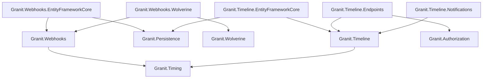
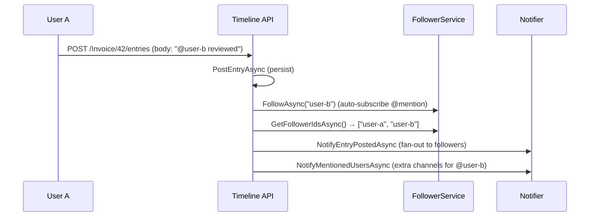

import { Tabs, TabItem, FileTree, Badge } from "@astrojs/starlight/components";

Granit.Webhooks provides outbound webhook dispatch with HMAC-SHA256 signed deliveries,
retry policies, and ISO 27001-compliant audit trails. Granit.Timeline adds a unified
activity stream (Odoo-style chatter) to any entity — comments, internal notes, system
logs, threaded replies, file attachments, and a follow/notify pattern.

## Package structure

<FileTree>
- Granit.Webhooks/ Core publisher, HMAC signatures, in-memory default
  - Granit.Webhooks.EntityFrameworkCore Durable subscriptions + delivery audit
  - Granit.Webhooks.Wolverine Durable outbox dispatch via Wolverine
- Granit.Timeline/ Core stream engine, in-memory default
  - Granit.Timeline.EntityFrameworkCore Durable persistence (PostgreSQL)
  - Granit.Timeline.Endpoints Minimal API routes, permissions
  - Granit.Timeline.Notifications Follow/notify via Granit.Notifications
</FileTree>

| Package | Role | Depends on |
|---------|------|------------|
| `Granit.Webhooks` | `IWebhookPublisher`, HMAC delivery, domain events | `Granit.Timing` |
| `Granit.Webhooks.EntityFrameworkCore` | Isolated DbContext for subscriptions + deliveries | `Granit.Webhooks`, `Granit.Persistence` |
| `Granit.Webhooks.Wolverine` | Durable outbox dispatch, retry policies | `Granit.Webhooks`, `Granit.Wolverine` |
| `Granit.Timeline` | `ITimelined`, `ITimelineReader/Writer`, stream DTOs | `Granit.Timing` |
| `Granit.Timeline.EntityFrameworkCore` | Durable persistence for entries + attachments | `Granit.Timeline`, `Granit.Persistence` |
| `Granit.Timeline.Endpoints` | REST API, permission policies | `Granit.Timeline`, `Granit.Authorization` |
| `Granit.Timeline.Notifications` | Notification-backed follower/notifier bridge | `Granit.Timeline` |

## Dependency graph



---

## Webhooks

### Setup

<Tabs>
<TabItem label="Development (in-memory)">

```csharp
[DependsOn(typeof(GranitWebhooksModule))]
public class AppModule : GranitModule { }
```

Uses in-memory subscription store and Channel-based in-process dispatch.
Suitable for development and integration tests.

</TabItem>
<TabItem label="Production (Wolverine + EF Core)">

```csharp
[DependsOn(
    typeof(GranitWebhooksWolverineModule),
    typeof(GranitWebhooksEntityFrameworkCoreModule))]
public class AppModule : GranitModule { }
```

```csharp
builder.AddGranitWebhooksEntityFrameworkCore(
    opts => opts.UseNpgsql(connectionString));
```

Wolverine provides durable outbox dispatch with exponential backoff retries.
EF Core persists subscriptions and delivery attempts for ISO 27001 audit.

</TabItem>
</Tabs>

### Publishing a webhook

Inject `IWebhookPublisher` and call `PublishAsync` with a logical event type and payload:

```csharp
public class DocumentUploadedHandler(IWebhookPublisher webhookPublisher)
{
    public async Task HandleAsync(
        DocumentUploaded evt, CancellationToken cancellationToken)
    {
        await webhookPublisher.PublishAsync(
            "document.uploaded",
            new { evt.DocumentId, evt.FileName, evt.UploadedBy },
            cancellationToken).ConfigureAwait(false);
    }
}
```

The publisher serializes the payload into a `WebhookEnvelope`, captures the ambient
tenant context, and dispatches a `WebhookTrigger` to the outbox. The fanout handler
resolves matching subscriptions and enqueues one `SendWebhookCommand` per subscriber.

### Webhook envelope

Every HTTP POST to a subscriber endpoint carries a standardized JSON envelope:

```json
{
  "eventId": "a1b2c3d4-...",
  "eventType": "document.uploaded",
  "tenantId": "d4e5f6a7-...",
  "timestamp": "2026-03-13T10:30:00Z",
  "apiVersion": "1.0",
  "data": {
    "documentId": "f8e9d0c1-...",
    "fileName": "report.pdf",
    "uploadedBy": "user-42"
  }
}
```

The `eventId` is stable across retry attempts, allowing subscribers to deduplicate.

### HMAC signature

Each delivery is signed with the subscription's secret using HMAC-SHA256 in Stripe format:

```
x-granit-signature: t=1710323400,v1=5d3b2a1c...
```

The signed payload is `{unix_timestamp}.{body_json}`. Subscribers should:

1. Extract the timestamp and signature from the header
2. Recompute the HMAC using the shared secret
3. Constant-time compare the signatures
4. Reject requests older than 5 minutes (replay protection)

### Retry and suspension

<Tabs>
<TabItem label="Wolverine (production)">

Exponential backoff: 30s, 2m, 10m, 30m, 2h, 12h. After 6 retries (~14h30 total),
the message moves to the Dead-Letter Queue and the subscription is suspended.

</TabItem>
<TabItem label="Channel (development)">

Channel-based dispatch retries 3 times with linear backoff. No persistence —
failed deliveries are lost on restart.

</TabItem>
</Tabs>

When consecutive failures exceed the threshold, the subscription transitions:

| Failures | Status | Domain event |
|----------|--------|-------------|
| 0 | `Active` | — |
| Threshold reached | `Suspended` | `WebhookSubscriptionSuspended` |
| Non-retriable (4xx) | `Deactivated` | `WebhookSubscriptionDeactivated` |

Suspension records `SuspendedAt` and `SuspendedBy` for ISO 27001 audit compliance.

### Delivery audit trail

`WebhookDeliveryAttempt` is an INSERT-only entity (no soft-delete) that records every
delivery attempt: HTTP status, duration, payload hash (SHA-256), and optional full
payload when `StorePayload` is enabled.

:::caution
Enabling `StorePayload` persists the full JSON body in clear text. Ensure encryption
at rest is configured on the database and that your DPO has validated this setting
against GDPR data-minimization requirements.
:::

### Configuration reference

```json
{
  "Webhooks": {
    "HttpTimeoutSeconds": 10,
    "MaxParallelDeliveries": 20,
    "StorePayload": false
  }
}
```

| Property | Default | Description |
|----------|---------|-------------|
| `HttpTimeoutSeconds` | `10` | HTTP request timeout (5–120 seconds) |
| `MaxParallelDeliveries` | `20` | Max parallel `SendWebhookCommand` on the delivery queue (1–100) |
| `StorePayload` | `false` | Persist full JSON body alongside delivery attempts |

---

## Timeline

### Setup

<Tabs>
<TabItem label="Development (in-memory)">

```csharp
[DependsOn(typeof(GranitTimelineModule))]
public class AppModule : GranitModule { }
```

In-memory stores for entries and followers. No database required.

</TabItem>
<TabItem label="Production (EF Core + Endpoints + Notifications)">

```csharp
[DependsOn(
    typeof(GranitTimelineEntityFrameworkCoreModule),
    typeof(GranitTimelineEndpointsModule),
    typeof(GranitTimelineNotificationsModule))]
public class AppModule : GranitModule { }
```

```csharp
builder.AddGranitTimelineEntityFrameworkCore(
    opts => opts.UseNpgsql(connectionString));

// Map endpoints in the app pipeline
app.MapTimelineEndpoints();
```

</TabItem>
</Tabs>

### Marking entities as timelined

Add the `ITimelined` marker interface to any entity that should have an activity stream:

```csharp
public class Invoice : FullAuditedEntity, ITimelined
{
    public string InvoiceNumber { get; set; } = string.Empty;
    public decimal Amount { get; set; }
    public InvoiceStatus Status { get; set; }
}
```

The entity type name is derived from the CLR type name by convention (`"Invoice"`),
or can be overridden with `[Timelined("custom-name")]`.

### Posting entries

```csharp
public class InvoiceApprovalHandler(ITimelineWriter timeline)
{
    public async Task HandleAsync(
        InvoiceApproved evt, CancellationToken cancellationToken)
    {
        // System log — immutable, cannot be deleted (ISO 27001)
        await timeline.PostEntryAsync(
            "Invoice",
            evt.InvoiceId.ToString(),
            TimelineEntryType.SystemLog,
            $"Invoice approved by **{evt.ApprovedBy}** for amount {evt.Amount:C}.",
            cancellationToken: cancellationToken).ConfigureAwait(false);
    }
}
```

Entry bodies support Markdown formatting. The `@mention` syntax (`@userId`) triggers
automatic follower subscription and mention notifications when the Endpoints module
processes the entry.

### TimelineStreamEntry (DTO)

```csharp
public sealed record TimelineStreamEntry
{
    public required Guid Id { get; init; }
    public required DateTimeOffset OccurredAt { get; init; }
    public required TimelineStreamEntryType EntryType { get; init; }
    public string? AuthorId { get; init; }
    public string? AuthorName { get; init; }
    public string Body { get; init; } = string.Empty;
    public IReadOnlyList<TimelineAttachmentInfo> Attachments { get; init; } = [];
    public Guid? ParentEntryId { get; init; }
}
```

| Entry type | Description | Deletable |
|-----------|-------------|-----------|
| `Comment` | Human-authored comment visible to all users | Yes (soft-delete, GDPR) |
| `InternalNote` | Staff-only internal note | Yes (soft-delete, GDPR) |
| `SystemLog` | Auto-generated audit entry | No (immutable, ISO 27001) |

### REST API endpoints

All endpoints are prefixed with `/api/granit/timeline`.

| Method | Path | Description | Permission |
|--------|------|-------------|------------|
| `GET` | `/{entityType}/{entityId}` | Paginated activity stream (newest first) | `Timeline.Entries.Read` |
| `POST` | `/{entityType}/{entityId}/entries` | Post a comment, note, or system log | `Timeline.Entries.Create` |
| `DELETE` | `/{entityType}/{entityId}/entries/{entryId}` | Soft-delete an entry (GDPR) | `Timeline.Entries.Create` |
| `POST` | `/{entityType}/{entityId}/follow` | Subscribe current user as follower | `Timeline.Entries.Create` |
| `DELETE` | `/{entityType}/{entityId}/follow` | Unsubscribe current user | `Timeline.Entries.Create` |
| `GET` | `/{entityType}/{entityId}/followers` | List follower user IDs | `Timeline.Entries.Read` |

### Follow/notify pattern



Without `Granit.Timeline.Notifications`, the follower service uses an in-memory store
and the notifier is a no-op (`NullTimelineNotifier`). Installing the Notifications
package replaces both with notification-backed implementations that leverage
`Granit.Notifications` for multi-channel delivery (email, push, SignalR).

### Attachments

Timeline entries support file attachments via `ITimelineWriter.AddAttachmentAsync()`,
referencing blob IDs managed by `Granit.BlobStorage`:

```csharp
await timeline.AddAttachmentAsync(
    entryId,
    blobId: uploadResult.BlobId,
    fileName: "scan.pdf",
    contentType: "application/pdf",
    sizeBytes: 245_000,
    cancellationToken).ConfigureAwait(false);
```

## Public API summary

| Category | Key types | Package |
|----------|-----------|---------|
| Modules | `GranitWebhooksModule`, `GranitWebhooksEntityFrameworkCoreModule`, `GranitWebhooksWolverineModule` | Webhooks |
| Modules | `GranitTimelineModule`, `GranitTimelineEntityFrameworkCoreModule`, `GranitTimelineEndpointsModule`, `GranitTimelineNotificationsModule` | Timeline |
| Publisher | `IWebhookPublisher` (`PublishAsync<TPayload>`) | `Granit.Webhooks` |
| Subscriptions | `IWebhookSubscriptionReader`, `IWebhookSubscriptionWriter`, `WebhookSubscription` | `Granit.Webhooks` |
| Delivery | `WebhookDeliveryAttempt`, `WebhookEnvelope`, `IWebhookDeliveryReader`, `IWebhookDeliveryWriter` | `Granit.Webhooks` |
| Events | `WebhookSubscriptionSuspended`, `WebhookSubscriptionDeactivated` | `Granit.Webhooks` |
| Timeline core | `ITimelined`, `ITimelineReader`, `ITimelineWriter`, `ITimelineFollowerService`, `ITimelineNotifier` | `Granit.Timeline` |
| DTOs | `TimelineStreamEntry`, `TimelineStreamEntryType`, `TimelineAttachmentInfo`, `PostTimelineEntryRequest` | `Granit.Timeline` |
| Permissions | `TimelinePermissions.Entries.Read`, `TimelinePermissions.Entries.Create` | `Granit.Timeline.Endpoints` |
| Options | `WebhooksOptions` | `Granit.Webhooks` |
| Extensions | `AddGranitWebhooks()`, `AddGranitWebhooksEntityFrameworkCore()`, `AddGranitTimeline()`, `AddGranitTimelineEntityFrameworkCore()`, `MapTimelineEndpoints()` | — |

## See also

- [Notifications module](./notifications/) — Multi-channel notification engine used by Timeline.Notifications
- [Persistence module](./persistence/) — EF Core interceptors, query filters
- [Wolverine module](./wolverine/) — Messaging, transactional outbox
